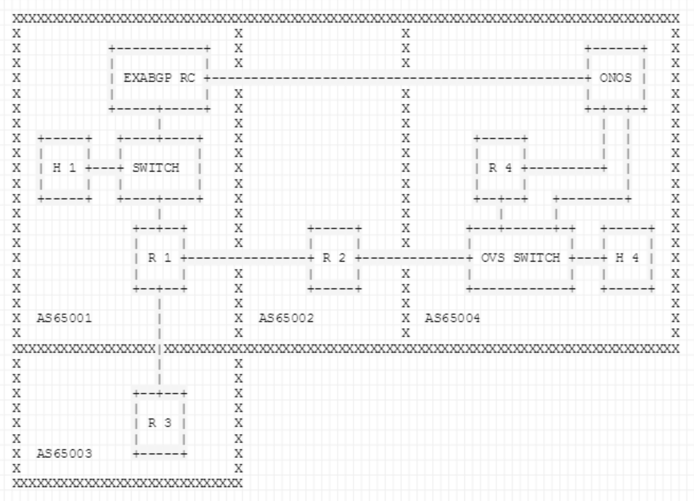
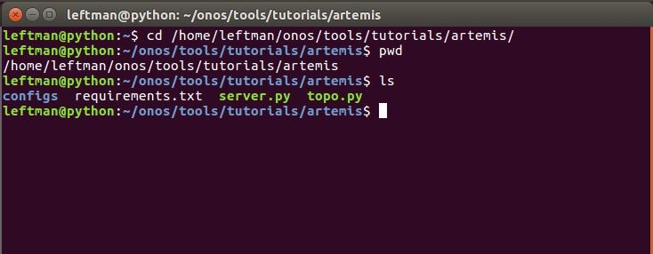
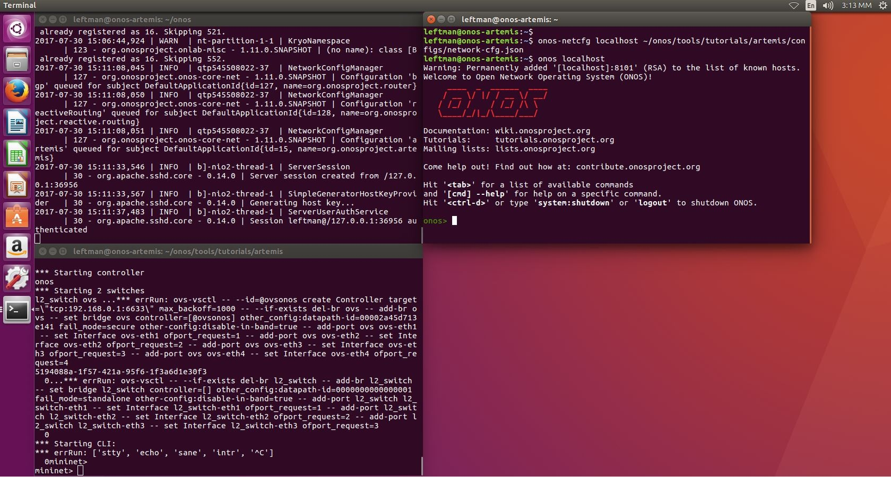
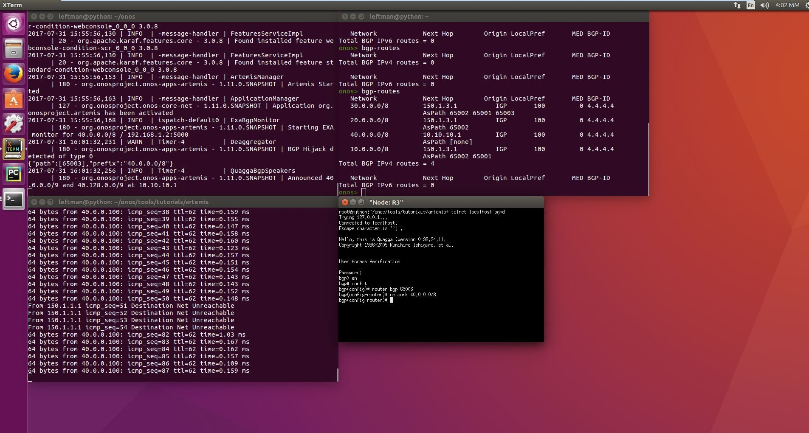
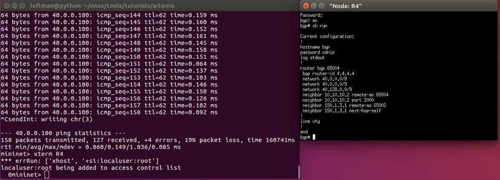
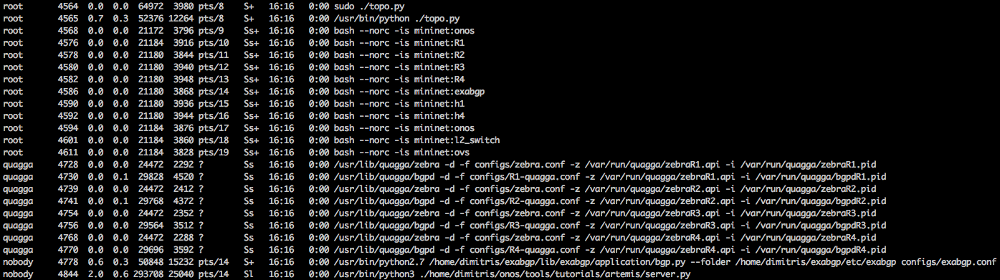
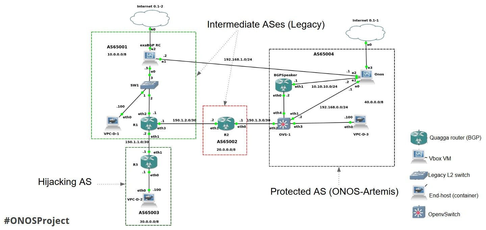

# ARTEMIS: an Automated System against BGP Prefix Hijacking

ONGOING PROJECT

# Team

| Name | Organization | Role | Email |
| --- | --- | --- | --- |
| Dimitris Mavrommatis | ONF /  Foundation for Research and Technology - Hellas (FORTH),  Institute of Computer Science, INSPIRE group | Lead Developer | [dimitris@](mailto:dimitris@onlab.us)[opennetworking.org](http://opennetworking.org) |
| Lefteris Manassakis | Foundation for Research and Technology - Hellas (FORTH),  Institute of Computer Science, INSPIRE group | Engineering Supervisor /  Secondary Developer | [leftman@ics.forth.gr](mailto:leftman@ics.forth.gr) |
| Vasileios Kotronis | Foundation for Research and Technology - Hellas (FORTH),  Institute of Computer Science, INSPIRE group | Research Supervisor / Secondary Developer | [vkotronis@ics.forth.gr](mailto:vkotronis@ics.forth.gr) |

# Overview & goals

Prefix hijacking is a common phenomenon in the Internet that often causes routing problems and economic losses [13]. ARTEMIS [1,10] is a tool for network administrators, that allows them to detect in real-time and automatically mitigate prefix hijacking incidents against prefixes under their administrative control, by employing self-monitoring on the AS level. ARTEMIS employs real-time monitoring of BGP data (e.g., BGP updates exported by route collectors) and can: (a) detect a prefix hijacking attack within a few seconds, and (b) completely mitigate the hijack within a few minutes (e.g., 2-5 minutes in the initial experiments on the real Internet with the PEERING testbed [2]). This fast response time enables legitimate ASes to quickly counter the hijack based on data they observe themselves on the control plane.  
  
The goal of this project is to implement ARTEMIS as a multi-module application running on top of ONOS [9], using the prior work and code-base of the SDN-IP project [3,8], as well as testing the application over a real BGP testbed such as PEERING [2]. The final objective is to have an open-source implementation of ARTEMIS running on top of a popular production-grade Network Operating System. This implementation will then enable researchers and operators to test miscellaneous BGP prefix mitigation strategies over real-world testbeds and production networks, and extract results that are relevant to today’s ISP operations; such results would be otherwise not possible to produce.

# What's in a name?

The name of the application (ARTEMIS), is inspired from the initials **A**utomatic and **R**eal-**T**ime d**E**tection and **MI**tigation **S**ystem. Moreover, it is the name of the Greek goddess Artemis, who according to ancient Greek mythology, is the goddess of hunting.

# Prerequisites

Basic knowledge of the BGP protocol and its [best path selection algorithm](https://www.cisco.com/c/en/us/support/docs/ip/border-gateway-protocol-bgp/13753-25.html) is required in order to fully grasp the concepts behind ARTEMIS. However, everyone with basic ONOS[15] and mininet[11] skills can follow the demo without this prior knowledge.

# Architecture & functionality

ARTEMIS consists of three components: a monitoring (1), a detection (2) and a mitigation (3) service as shown in Figure 1:


Fig. 1: The ARTEMIS architecture.

1) The monitoring service runs continuously and provides control plane information from the AS itself, the streaming services of RIPE RIS [4] and BGPstream [6] (from RIPE RIS and RouteViews), as well as BGPmon [5] and Periscope [7], which return almost real-time BGP updates for a given list of prefixes and ASNs.

2) The detection service combines the information from these sources; the minimum delay of the detection service is the delay for the first suspicious BGP update to arrive (from any source). ARTEMIS can be parameterized (e.g., selecting BGP monitors based on location and/or connectivity) to achieve trade-offs between monitoring overhead and detection efficiency/speed.

3) When a prefix hijacking is detected, ARTEMIS automatically launches its mitigation service. Since in Internet routing the most specific prefix is always preferred, ARTEMIS modifies the BGP configuration of the routers so that they announce deaggregated sub-prefixes of the hijacked prefix (that are most preferred from any AS). After BGP converges, the hijacking attack is mitigated and traffic flows normally back to the ARTEMIS-protected AS (the one that runs ARTEMIS). Therefore, ARTEMIS assumes write permissions to the routers of the network, in order to be able to modify their BGP configuration and mitigate the attack. This can be effectively accomplished by running ARTEMIS as a set of application-level modules, over a network controller that supports BGP, like ONOS [9].

**Note**: Prefix deaggregation is effective for hijacks of IP prefixes less specific than /24, but it might not work for /24 prefixes or more specifics. This is because BGP advertisements of more specific than /24 prefixes are typically filtered by many ISPs, since it is considered as best practice to avoid the exponential increase of the size of the BGP routing table. We plan to address this problem through future extensions of ARTEMIS (e.g., collaborative mitigation).

# Demo topology

 Figure 2 depicts the topology that is setup via the topo.py file inside the tutorial folder (/onos/tools/tutorials/artemis/topo.py). The BGP speakers are Quagga routers and the route collector is an ExaBGP router running a custom script to replicate the behavior of a RIPE RIS route collector.



Fig. 2: The conceptual demo topology.

* **AS65001**

  **Intermediate** **AS** that consists of a BGP speaker (R1), a L2 switch, a host (H1) and an ExaBGP Route Collector (RC).

+ **R1:** Announces via BGP the 10.0.0.0/8 prefix to it's neighbors, AS65003 and AS65002. Also, it has an iBGP session established with the exaBGP RC so that it propagates BGP update messages to it, in order for exaBGP to act as a BGP monitoring service.
+ **ExaBGP RC**: RC connected to R1 via iBGP but also to the ONOS controller on the protected AS (in the real world the latter connection can be established through the existing network, e.g., via a tunnel; the only limitation is that the network interface of ONOS that interconnects with the RC must have a non-hijacked IP address assigned, so that it can be reached by the monitoring service during the hijack).
+ **H1 / 10.0.0.100:** Host which communicates with the host inside the protected AS. It is used to provide us a visualization of the data-plane behavior when the BGP hijack occurs.

* **AS65002**  
  **Intermediate****AS** that consists of a BGP speaker (R2) that announces via BGP the prefix 20.0.0.0/8 to it's neighbors (R1, R4), and its purpose is to add an additional hop to the AS-PATH so that the protected AS can be hijacked. Although in the demo the attacker announces the exact prefix that belongs to the protected AS and not a more specific one, due to the shortest path attribute of the BGP best path selection algorithm, the hijacker is able to steal the traffic stemming from AS65001 towards IP addresses of the the hijacked prefix.

* **AS65003**  
  **Hijacker** **AS** that consists of a BGP speaker (R3).

+ **R3:** By announcing the prefix of the protected AS (40.0.0.0/8) from this BGP speaker, we trigger a BGP hijack, and all traffic generated from AS65001 and directed towards AS65004, will be redirected to the network of AS65003.

* **AS65004****Protected** **AS** that is employing ONOS. It consists of a BGP speaker (R4), an OVS switch, a host (H4) and the ONOS instance.

+ **R4:** BGP speaker announcing 40.0.0.0/8. It is connected with his neighbor (R2) through the OVS switch via the SDN-IP application.
+ **OVS:** Communicates with ONOS on a management interface via 192.168.0.0/24.
+ **ONOS:** Is connected with R4 to retrieve the BGP routing table. Also, it receives the BGP update messages from the ExaBGP RC, when routing changes occur. Finally, it is connected with the OVS switch in order to interact with the data plane.
+ **H4 / 40.0.0.100:** Host that receives traffic with the help of the reactive-routing application from the host in AS65001 (H1).

# JSON configuration file

The JSON configuration file (network-cfg.json) contains the required configuration entries to monitor prefixes and check the validity of neighbors and paths. The following code block shows an example of the JSON configuration format for ARTEMIS which is used in the Demo Topology.

**network-cfg.json**

```
"org.onosproject.artemis" : {
	"artemis": {
		"prefixes": [
            {
                "moas": [ ],
                "paths": [
                    {
                        "neighbor": [
                            {
                                "asn": 65002,
                                "neighbor": [
                                    65001
                                ]
                            }
                        ],
                        "origin": 65004
                    }
                ],
                "prefix": "40.0.0.0/8"
            }
        ]
        },
        "moas": { },
        "monitors": {
            "exabgp": [
                "192.168.1.2:5000"
            ],
            "ripe": []
        }          
	}
}
```

## Explanation of fields

* **prefixes:**List consisting of prefixes with their AS-PATH information and (optionally) legitimate MOAS ASes.

+ **prefix:** a CIDR representation of the prefix that is monitored/protected.
+ **paths:** a list of dictionaries that contain the ASN of the protected AS (origin), along with a list of dictionaries for the neighbors.

- **neighbor:** list of dictionaries that contain each neighbor's ASN and a list of ASNs for the neighbor's neighbor.  
  For example, in the demo topology the protected (origin) AS65004 sees the AS65002 as a first-hop neighbor, and AS65001 as a second-hop neighbor (resulting in the legitimate announced path AS65004 - AS65002 - AS65001).  
  **Note**: While the operator can supply the origin and first-hop neighbor ASNs as ground-truth in the configuration, the N-hop (N > 1) neighbor information is planned to be generated automatically by ARTEMIS in future versions of the tool, based on the received BGP updates.

+ **moas:** \*in-progress\*

* **moas:** \*in-progress\*

* **monitors**: List of the route collectors that ARTEMIS is using for monitoring. Currently it supports RIPE and ExaBGP route collectors through the socket-io interface, and is extendable to include more monitoring services/APIs.

+ RIPE Route Collectors have specific identifiers ("rrc18", "rrc19", "rrc20", "rrc21"). You can configure them following this example: "ripe" : ["rrc18", "rrc19"]
+ An ExaBGP Route Collector (RC) is implemented inside the tutorial folder (/onos/tools/tutorials/artemis/). You can host such an RC locally by running an ExaBGP instance with the exabgp.conf and server.py files provided (will require modifications in directory paths). In the demo topology we have an ExaBGP speaker running on 192.168.1.2:5000, monitoring the BGP control plane from the perspective of AS65001.

**Note:** The demo configuration also includes entries for the SDN-IP and the Reactive-Routing application (separate step, pre-configured and not presented in this demo for simplicity). It specifies where the BGP speaker is located and which are the local prefixes.

# Running the demo

As a first step, start from a clean setup of an Ubuntu 16.04 virtual machine, with at least 12 GB HD space, 2 processors, 3 GB of RAM and a single NATted interface.

Having this VM setup with Internet connectivity as a starting point, launch a terminal and install the ExaBGP Python library: 

```
$ cd ~
$ sudo apt-get install git
$ git clone -b 3.4 https://github.com/Exa-Networks/exabgp
$ echo 'export PATH=$PATH:~/exabgp/sbin' >> ~/.bashrc
$ source ~/.bashrc
```

Install the Quagga software routing suite:

```
$ cd ~
$ sudo apt-get install quagga -y
```

Download and install mininet:

```
$ git clone https://github.com/mininet/mininet
$ cd mininet; git checkout 2.2.2
$ ./util/install.sh -fnv
```

Install java 8 (required by ONOS):

```
$ cd ~
$ sudo apt-get install software-properties-common -y && \
sudo add-apt-repository ppa:webupd8team/java -y && \
sudo apt-get update && \
echo "oracle-java8-installer shared/accepted-oracle-license-v1-1 select true" | sudo debconf-set-selections && \
sudo apt-get install oracle-java8-installer oracle-java8-set-default -y
```

Download ONOS from GitHub and configure the corresponding bash profile:

```
$ git clone https://github.com/opennetworkinglab/onos.git
$ echo '. ~/onos/tools/dev/bash_profile' >> ~/.bashrc
$ source ~/.bashrc
```

Install pip3, Python packages and set the configuration used by ExaBGP: 

```
$ sudo apt-get install python3-pip -y
$ sudo -H pip3 install -r ~/onos/tools/tutorials/artemis/requirements.txt
$ cd ~/onos/tools/tutorials/artemis/
$ sed -i 's?/absolute/path/to/onos/tools/tutorials/artemis?'`pwd`'?' configs/exabgp.conf
```

You must verify that the run command in config file now has the absolute path, e.g., /home/user/onos/tools/tutorials/artemis/server.py.

Verify the path that is specific to your setup, using cd and/or pwd/ls, as shown in Figure 3:



Fig. 3: Verifying the absolute path for the exaBGP configuration file (exabgp.conf).

Install curl and run ONOS (the first run will require some time):

```
$ sudo apt-get install curl
$ cd onos
$ buck run onos-local -- clean
```

After the ONOS instance has started, open a new terminal and load the mininet topology:

```
$ cd onos/tools/tutorials/artemis
$ sudo ./artemis-topo.py
```

While having the two terminals open (ONOS instance and mininet), open a new terminal and load the network configuration with onos-netcfg. From this terminal, login to the ONOS CLI:

```
$ onos-netcfg localhost ~/onos/tools/tutorials/artemis/configs/network-cfg.json
$ onos localhost
```

On your monitor, you should see a view similar to Figure 4:



Fig. 4: ONOS instance, mininet and ONOS CLI.

Activate ARTEMIS using the ONOS CLI (reactive-routing must be activated first):

```
onos> app activate org.onosproject.reactive-routing
onos> app activate org.onosproject.artemis
```

Check if bgp-routes are visible by ONOS, indicating that BGP has converged (must include the 10.0.0.0/8, 20.0.0.0/8, 30.0.0.0/8 and 40.0.0.0/8 prefixes; if not, you should restart the mininet topology). It requires time (~1-2 minutes) for the BGP protocol to converge, so this step requires patience:

```
ONOS> bgp-routes
```

Now that the topology is running, through the mininet CLI you can connect to the hosts to check connectivity and also to the BGP speakers to modify the BGP control plane. To hijack the prefix of the protected AS:

1. Connect to the BGP speaker named R3, and also check connectivity between hosts H1 and H4:

```
mininet> xterm R3 (opens a new terminal on R3)
mininet> pingall (to make the hosts visible)
mininet> h1 ping h4 (to see the data plane interactions)
```

2. On the terminal of R3, announce the prefix:

```
R3> telnet localhost bgpd
Password: sdnip (this is the password)
bgp> en (enable)
bgp# conf t (configure terminal)
bgp(config)# router bgp 65003
bgp(config-router)# network 40.0.0.0/8
```

Now the hijacker (AS65003) will attract all the traffic from AS65001 (destined to 40.0.0.0/8) away from AS65004; at the same time, the ExaBGP speaker in AS65001 will send the BGP update of the hijack (among other updates seen by AS65004) to the ONOS instance (running ARTEMIS) and the hijack will be detected. Observing the ONOS logs, you will see that the attack is actually detected and the deaggregation mechanism has successfully mitigated the attack (by announcing the more specific prefixes 40.0.0.0/9 and 40.128.0.0/9 from the BGP speaker of the protected AS). After BGP converges and the control and data planes are consistent, the traffic of AS65001, destined to 40.0.0.0/8, returns to the protected AS, as shown in Figure 5:



Fig. 5: Successful mitigation of the BGP prefix hijacking attack, with a data loss of only 4 packets.

3. Also, by checking the current configuration of R4:

```
mininet> xterm R4 (opens a new terminal on R4)
R4> telnet localhost bgpd
Password: sdnip (this is the password)
bgp> en (enable)
bgp# sh run (show running configuration)
```

We observe that ARTEMIS has automatically configured R4 to announce the more specific prefixes 40.0.0.0/9 and 40.128.0.0/9, thus mitigating the attack, as shown in Figure 6:



Fig. 6: Current configuration of R4.

# Frequently asked questions (FAQ)

**Q: Why **is the CLI output empty** when I write bgp-routes in the ONOS CLI?  
A**: There might be multiple different problems that might cause this issue (e.g., Quagga not running or ExaBGP not running). To verify that everything is running correctly please run **ps aux**; the result should look as follows:



Also, there is a file inside the *onos/tools/tutorials/artemis* folder called *exabgp.log*. For ExaBGP to run successfully, the file should contain a line stating:

**\* Running on <http://0.0.0.0:5000/> (Press CTRL+C to quit)**

**Q: Why am I getting an error when running the topology file?  
A**: You should check if the *python3* requirements are installed correctly. Sometimes, the python deployment may consider the *python3* package installed; it is though the *python2* package instead. You could try installing again the dependency separately using **pip3 install .**

**Q: All the processes run correctly but I still don't get the BGP routes to show; why?****A**: This situation tends to happen if you have the networking manager enabled because sometimes it messes up the interfaces of the mininet topology. Please stop the network manager and restart the demo from scratch.

# Future plans & extensions

Despite the fact that ARTEMIS was first tested in a non-SDN environment with the basic mitigation strategy of automatic prefix deaggregation in mind, it can support several extensions related to its monitoring, detection and mitigation mechanisms due to its modular design. These extensions, e.g., employing MOAS (Multi-Origin AS Announcements) and tunneling in order to steer the hijacked traffic back to its legitimate owner during the mitigation phase, will also be researched as extra modules built over the ONOS platform. In parallel to the mitigation, an additional monitoring service is envisioned to provide real-time information about the mitigation process. This service can also use data from Periscope, RIPE RIS, BGPstream and BGPmon to monitor/visualize the mitigation.

As future work, another extension of ARTEMIS is the support of multiple vendor routers, beyond Quagga, by employing protocols such as NETCONF and YANG. You can learn more about our future plans by watching the TST presentation video that follows after the demo video.

# Demo video using GNS3 as emulation platform



Fig. 7: The fully emulated GNS3 demo topology.

# ONOS technical steering team presentation

**Presentation Slides:** <https://goo.gl/UZREBe>

# References

[1] G. Chaviaras, P. Gigis, P. Sermpezis, and X. Dimitropoulos, “ARTEMIS: Real-Time Detection and Automatic Mitigation for BGP Prefix Hijacking (demo)”, in ACM SIGCOMM, 2016 (url: <http://www.inspire.edu.gr/wp-content/pdfs/PavlosSIGCOMM2016.pdf>)

[2] “About PEERING - The BGP Testbed”, <https://peering.usc.edu/> 

[3] “SDN-IP”, [https://wiki.onosproject.org/display/ONOS/SDN-IP](sdn-ip.md)

[4] “RIPE RIS - Streaming Service”, <https://labs.ripe.net/Members/colin_petrie/updates-to-the-ripe-ncc-routing-information-service> 

[5] “BGPmon”,  <http://www.bgpmon.io> 

[6] “BGPstream”, <https://bgpstream.caida.org/>  

[7] V. Giotsas, A. Dhamdhere, and K. Claffy, “Periscope: Unifying looking glass querying”, in Proc. PAM, 2016

[8] Lin, Pingping, et al., "Seamless interworking of SDN and IP", in ACM SIGCOMM Computer Communication Review. Vol. 43. No. 4. ACM, 2013.

[9] Berde, Gerola, et al. "ONOS: towards an open, distributed SDN OS", Proceedings of the third workshop on Hot topics in software defined networking, ACM, 2014.

[10] “ARTEMIS demo”, <http://inspire.edu.gr/artemis>

[11] “Mininet: An Instant Virtual Network on your Laptop (or other PC)“, <http://mininet.org/> 

[12] “GNS3: The software that empowers network professionals”, <https://www.gns3.com/> 

[13] “Hacker Redirects Traffic From 19 Internet Providers to Steal Bitcoins”, <https://www.wired.com/2014/08/isp-bitcoin-theft/> 

[14] “Internet Security Privacy and Intelligence Research Group”, <http://www.inspire.edu.gr/> 

[15] "ONOS - A new carrier-grade SDN network operating system designed for high availability, performance, scale-out", <http://onosproject.org/>
