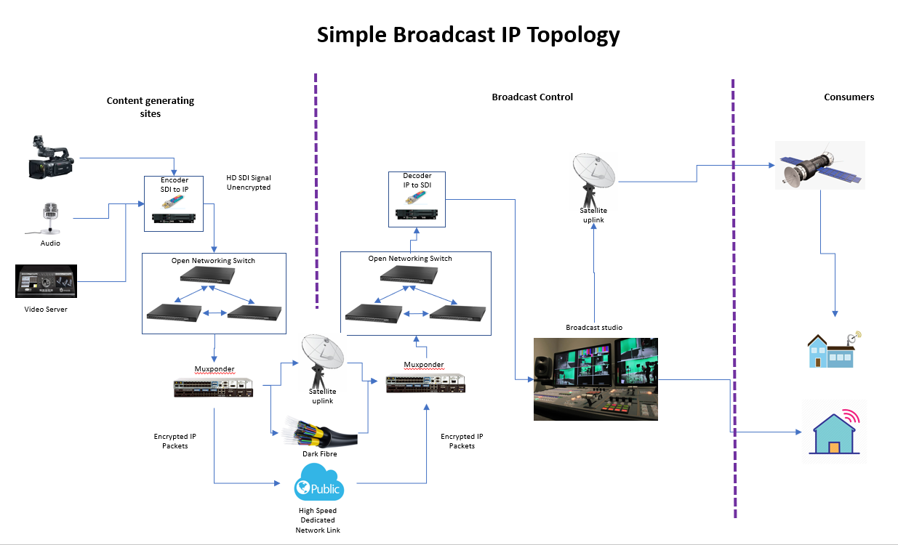
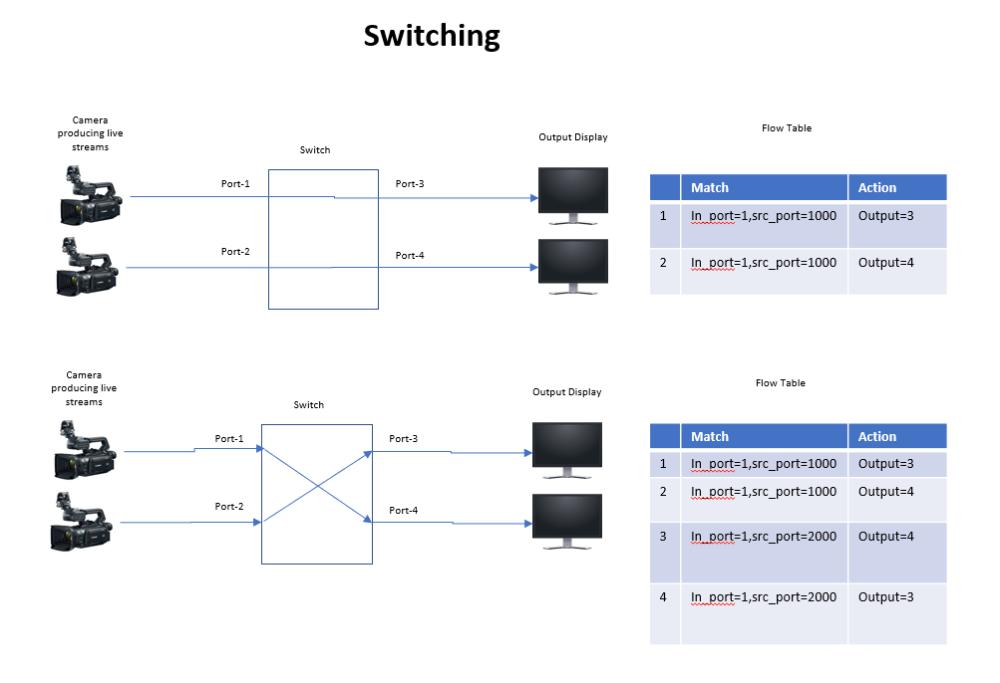
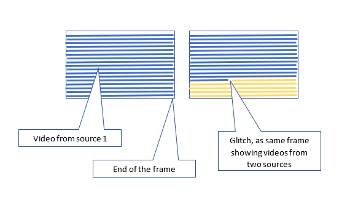
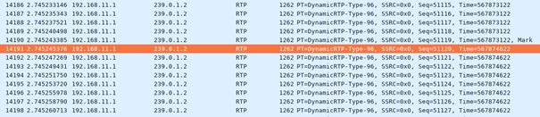

# BroadCtrl

# Team

| Name | Organisation | E-Mail |
| --- | --- | --- |
| Kamal Krishna Bhatt | [Stordis GmbH](http://www.stordis.com/) | [kamal.bhatt@stordis.com](mailto:kamal.bhatt@stordis.com) |

# Overview

Presentation

## SDI over IP

Traditional broadcast Infrastructure built with SDI Base-band Routers, coaxial cables and BNC connectors is transitioning to Ethernet using off-the-shelf network switches and SDN control. The increasing speeds supported by Ethernet Switches and the corresponding improvement in aggregate non-blocking switch and network throughput has paved the way for the use of IP/Ethernet to transport critical broadcast applications in a cost-effective manner, while delivering the same robustness and stability of legacy SDI and MADI router operations – all with greatly increased agility and flexibility to meet ever evolving media formats.

## Broadcast Topology

Following is a simple topology of broadcast using IP NW.

# Features

## Fault tolerance & Robustness

One of the most important feature to have in controller, should have following capabilities:

1. Multiple Fail-over Paths/Redundant Streams.
2. Auto switching among Streams in case of failure.
3. Controller itself should support HA.
4. LAG Support.

### Solution

ONOS does support the finding and switching of alternative paths in case of failure via its intent framework but it is done passively, our requirement here is to configure multiple intents beforehand so that there is no time spent on creating new flows on the switch in case of failure or desired switch of path.

But even if we modify ONOS to create multiple paths for a pair of source and destination traffic will always be flowing which will be a waste of BW.

To over-come that, backup flows with arbitrary but unique matching criteria will be created which will not be matched to any traffic in network while a flow is a backup path not the active path but as soon as there is a failure in active path or user want to switch the path intentionally then packet header will be updated with arbitrary match criteria to match new active path, this packet processing will be done either in P4 or using OF experimenters in switch.

This procedure of generating arbitrary match criteria and modifying packet header is also used in switching of RTP streams section below. This mechanism can evolve as an generic framework for packet processing.

ONOS also supports clustering so requirement for HA is met.

Support for LAG is not present in the ONOS at the moment, it is to be implemented. NOS like Pica8 support it we need to interface with it.

## Traffic Engineering

Controller should have a mechanism by which it is able to choose and setup best available intents according to specific traffic type. To achieve this controller should be able to determine:

* Latency and Bandwidth of intents– With the known latency and bandwidth properties, controller should be able to determine which intents (more than one) to deploy for a specific traffic types(traffic types like live audio, video, logging are identified by vlan in most cases) with their priorities (in case of failure priority helps to choose for next intent) i.e. For a real time audio stream, latency of path is a priority than its bandwidth (for sure there should be minimum bandwidth available to carry voice stream), for a normal video file play latency may not a priority and it can take longer path, for an HD video file transfer high bandwidth can be a priority rather than latency.

### Solution

To calculate latency :

1. Controller need to discover possible links(more than one intents) between two hosts comprise of flows which have a unique matching criteria so that it is impossible to match this criterion with real network traffic.
2. Then send a packet (e.g. UDP packet, which matches the unique matching criteria) from controller to the port connecting source host and redirect to controller as soon as it reaches the destination port i.e. the port where destination host is connected. Time difference between sending and receiving the packet can be considered as latency. This latency also contains the time between controller and switches to be more accurate, a P4 program or experimenters implementation in OF can be used to notify controller about the time when this special packet entered source port and got out from destination port.

Real time bandwidth usage is available in ONOS which can be used in combination with port capacity can be used to know the actual available BW.

## Switching of RTP streams

This is another important requirement to have in Broad-cast controller. Switching of RTP streams can occur in various scenarios like:

1. Switching among backup flows from a single source based on quality for example.
2. Switching among streams from different sources.

Switching among streams using flows from different sources is shown in figure below:

Each kind of switching should follow following constraints:

### Seamless switching

Switching should be done in such a way that there is no glitch. To achieve this, it is necessary to identify end of frame in RTP packets (identified by marker bit in RTP packet [3], is equivalent to Vertical blanking interval [2] in raster graphic display).

Not switching it at the end of the frame will cause glitches on the screen and packet loss.

Marker bit in RTP packet can be identified by processing each RTP packet, On Tofino switch it can be achieved using P4 and in OpenFlow it will be achievable using OpenFlow Experimenters.

### Switching the flows with zero packet loss

As shown in capture below the packet with “*Mark*” denotes the end of the RTP frame after that packets from next frame are being received and switching of flows at the end of the frame down not help much as far as zero packet loss is concerned because the time interval between the packet with marker bit and the next packet from new frame is almost same as the interval between packets from the same frame.

In analog display “Vertical Blanking Interval” actually is a time interval before starting a new frame but as mentioned above there is no significant interval observed in IP so after identifying the end of the frame the new flow has to be deployed before the packet from next frame comes i.e. within 0.000001991 sec. (Time delta between end of the frame and new packet from next frame in the below case). Also, the time taken to deploy a flow will vary device to device.

### Switch flows in < 5 ms

Actually, it is to be switched within 0.000001991 sec. to ensure 0 packet loss, otherwise buffering of incoming packets will be required until the flow is deployed. And at high scale buffering is not efficient as switching devices have really small buffers another is, a delay is always added to a stream on each switch.

### Solution

[1] RTP packet must be processed and marker bit should be identified and only then the new flow should be active independent of when they were created how much time did it take to be deployed in data plane.

Idea here is to separate indeterministic process of deploying a flow and actually activating it at the right time i.e. at the end of the frame.

As shown in the figure above for switching, Install the new flows with some arbitrary src\_port values, get it confirmed and then modify the incoming packet with the src\_port=2000 at precise time (after the marker bit) so as to match them with already installed flows the old flows can be deleted afterwards.

The actual processing of the RTP packets is to be done in HW, Controller should be able to deploy this packet processing logic on switch i.e. this packet processing can be done using P4 and experimenters in switch, in either case ONOS can deploy the logic on switch using P4Runtime or Extension framework.

## QOS & Metering Support

Apply QOS and Metering on Ports.

Controller should be able to allocate bandwidth on Ingress and egress packets on the basis of traffic type i.e. logging, live video, file saving, most of the times these traffics are identified individually on the basis of VLan.

### Solution

In ONOS the requirement can be achieved using Metering and QOS. Metering is already exposed via REST but For QOS and Queues only java APIs are present which can be exposed at rest:

Some java files are as follows:

* OVSDB behaviour for querying/creating queues:
  + QueueConfigBehaviour.java → OVSDBQueueConfig.java
  + QOSConfigBehaviour.java → OvsdbQosConfig.java
* REST model class
  + QueueDescription.java → DefaultQueueDescription.java
  + QosDescription.java → DefaultQosDescription.java
* OVSDB model class
  + OvsdbQueue.java
  + OvsdbQos.java

We have implemented the REST endpoints for QOS and Queues already, currently under test, will be pushed to ONOS codebase once done.

## Forwarding Traffic to a Multicast group

A plug & play feature where a host device (SDI to IP converters or vice-versa) when plugged in, starts receiving traffic automatically if it is already in a specific multicast group.

Controller should be able to identify the multicast group of new plugged in hosts and create flow rules accordingly so that they automatically receive the traffic.

### Solution

An example of the flow can be like:

Match Criteria - MAC & IN\_PORT

Action - Multicast forwarding based on Multicast MAC.

There is no such instruction in OpenFlow available it can only output to a port only NATi ng can be done for Multicast MAC, A mechanism needs to be implemented which translates example flow above to the actual flows with outputs to the port by keeping mapping of port at which host is connected to its Multicast MAC group.

## Some more requirements

There are few more requirements which are worth mentioning:

* Port configuration like port speed, VLan, trunk, bridge etc.
* Handling of SDI and IP NW together.
* Interact with AMWA NMOS database.
* Security - access security i.e. prevent unwanted devices and packet security i.e. packet encryption.
* NAT (Network Address Translation) - it is already supported in OpenFlow rule instructions in ONOS.

# Discussion

# References

[1] <http://citeseerx.ist.psu.edu/viewdoc/download?doi=10.1.1.673.7881&rep=rep1&type=pdf>

[2] <https://en.wikipedia.org/wiki/Vertical_blanking_interval>

[3] <https://tools.ietf.org/html/rfc3550>

[[4] https://www.thebroadcastbridge.com/content/entry/7722/transition-strategies-sdi-to-ip](https://www.thebroadcastbridge.com/content/entry/7722/transition-strategies-sdi-to-ip)

[5] <https://www.thebroadcastbridge.com/content/entry/7646/the-changing-face-of-broadcast-from-virtualization-to-the-cloud>
