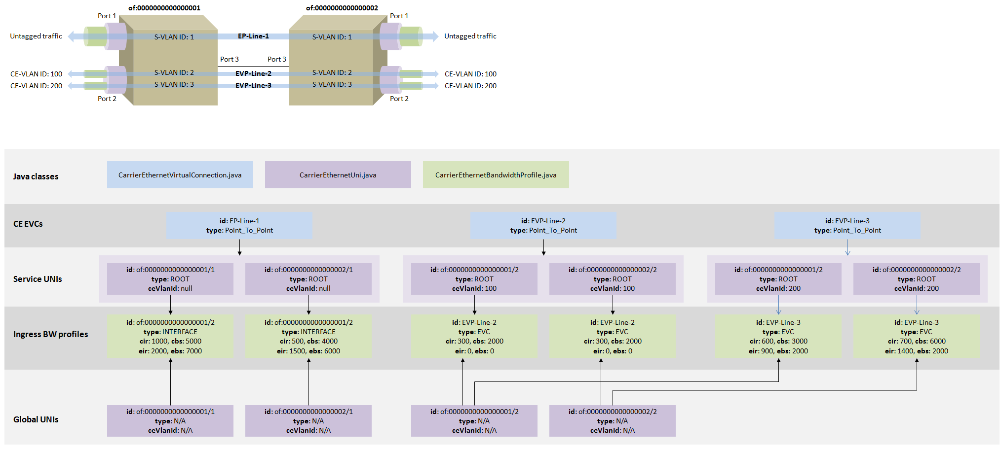

# Carrier Ethernet Application

## Table of Contents

## Contributors

| Name | Organization | Role | Email |
| --- | --- | --- | --- |
| Konstantinos Kanonakis | Huawei Technologies | Developer | [konstantinos.kanonakis@huawei.com](mailto:konstantinos.kanonakis@huawei.com) |
| Francesco Lucrezia | Politecnico di Torino / CREATE-NET | Developer | [francesco.lucrezia@gmail.com](mailto:francesco.lucrezia@gmail.com) |

## Overview

This page provides a brief description of the Carrier Ethernet application (CE app). The CE app can be used to install and manage MEF-defined Carrier Ethernet services, along with relevant components like UNIs and Bandwidth Profiles (BW profiles). It is noted that the application is still under active development.

## Prerequisites

The application is included in the ONOS applications for CORD repository (please follow the instructions from [here](https://wiki.opencord.org/display/CORD/Getting+the+Source+Code) to clone and build it) and can be activated from the ONOS CLI as follows:

```
onos> app activate org.onosproject.ecord.carrierethernet
```

Note that the `fwd` app and/or any other apps which involve switch forwarding should be deactivated, since they may interfere with the operation of the CE app.

## Classes

**CarrierEthernetManager.java**: Performs CE service validation, installation (if possible) and removal. The validation part checks whether there are enough resources to accommodate the UNIs (i.e. their associated BW profiles) comprising the CE service request. The UNIs that cannot be accommodated are omitted from the service request. Then, depending on the CE service type, the service may or may not be validated. For example the validation will fail if the *ROOT* UNI of a *ROOT\_MULTIPOINT* service is omitted. Service installation involves iterating through the service UNIs and establishing packet and optical connectivity via appropriate method calls.

**CarrierEthernetVirtualConnection.java**: Represents a CE Ethernet Virtual Connection (EVC) including the associated set of UNIs (and BW profiles) and the service type. There are three types of CE EVCs: *POINT\_TO\_POINT*, *MULTIPOINT\_TO\_MULTIPOINT* and *ROOT\_MULTIPOINT*. Currently VLAN-based connectivity across the Carrier Ethernet Network (CEN) is supported, hence each EVC is associated with a globally unique VLAN ID which is automatically generated by the CE app. A unique EVC id is also generated by the application upon service creation using a format which indicates the EVC type, whether is it virtual, as well as the VLAN ID used by it.

**CarrierEthernetBandwidthProfile.java**: Represents an ingress UNI BW profile and includes relevant attributes like Committed Information Rate (CIR), Committed Burst Size (CBS), Excess Information Rate (EIR) and Excess Burst Size (EBS). There are three possible types of BW profiles: *INTERFACE*, *EVC*, *COS*.

A BW profile is always associated with a UNI and it is noted that the BW profile id needs to be unique only in the context of a single UNI. For example, the EVC BW profiles at each UNI of an Ethernet Virtual Private Line (EVPL) both use the EVPL’s id as an identifier for themselves, although they may have different attributes.

**CarrierEthernetUni.java**: Represents a UNI and includes relevant attributes like the associated BW profiles and CE-VLAN IDs.

It should be noted that currently the class can be used to denote either a UNI from the EVC point of view (in which case only a single BW profile may be present) or a so-called "global" UNI. For the first type of UNIs (which will be referred to as “EVC" UNIs), a type attribute (*ROOT* or *LEAF*) is used to indicate the role of the UNI within the EVC. On the other hand, global UNIs exist independently of service UNIs and may include one or more BW profiles of the same type (with the exception of the *INTERFACE* type, of which they can have only one). There is an 1-1 mapping between EVC and global UNIs and the association is achieved by using the UNI id attribute which is globally unique and corresponds to the relevant connect point (“<DeviceId>/<Port>”).

Note that in the current CE app implementation, global UNIs also include information regarding their available and used BW capacity – the latter updated with each BW profile addition or removal.

**CarrierEthernetProvisioner:** Manages connectivity across the packet network domain, including the selection of link paths and appropriate method calls from CarrierEthernetPacketNodeManager.java to establish forwarding and apply bandwidth profiles on network nodes.

**CarrierEthernetPacketNodeManager.java**: Abstract class used to control packet nodes across the CEN according to their control protocol and the type of CEN connectivity. In the current implementation it is extended by the CarrierEthernetOpenFlowPacketNodeManager.java class which assumes OpenFlow switch nodes and VLAN-based forwarding.

## CE EVC Examples

The figure below provides an example to clarify the usage of the aforementioned classes:



It is assumed that three CE EVCs have been established between devices *of:0000000000000001* and *of:0000000000000002*. There is one Ethernet Private Line (EPL) EVC (EP-Line-1) between UNI *of:0000000000000001/1* (i.e. port 1 of device *of:0000000000000001*) and UNI *of:0000000000000002/1* and two EVPL EVCs (EVP-Line-2 and EVP-Line-3) between between UNI *of:0000000000000001/2* and UNI *of:0000000000000002/2.*

VLAN IDs 1, 2 and 3 respectively are used to accomplish forwarding between *of:0000000000000001* and *of:0000000000000002* for the three EVCs across the CEN. In the case of EP-Line-1, untagged frames arriving at *of:0000000000000001/1* would have VLAN tag 1 pushed to them and subsequently popped upon their arrival at *of:0000000000000002/3.* For EVP-Line-2 and EVP-Line-3, tags 2 and 3 respectively would be pushed on top of the existing CE-VLAN tags 100 and 200 included in the customer traffic arriving at *of:0000000000000001/2.*

As shown in the figure, the EVCs maintain their own set of EVC UNIs, each EVC UNI being associated with exactly one BW profile. However, each of the four global UNIs aggregates information from all individual EVC UNIs, i.e. points to all BW profiles associated with the relevant connect point. It can also be seen that it is possible for different UNIs belonging to the same EVC to have different CIR/CBS and EIR/EBS values.

## Using the CLI

A simple Command Line Interface has been implemented to facilitate CE management. Some of the commands currently supported are the following:

**ce-evc-create**: Used to either install a new CE EVC or update an already installed one. The user needs to provide a configuration id, however the actual (unique) EVC id is automatically generated by the application as mentioned above and can be obtained using the *ce-evc-list* command. The type of the EVC also needs to be provided, along with a set of two or more UNIs. For simplicity the command can only receive one bandwidth profile which is subsequently applied to all EVC UNIs. The *–v* option, if used, indicates the CE-VLAN ID also to be applied to all EVC UNIs. If a CE-VLAN ID is present, the EVC is considered to be a “virtual” one (e.g. EVPL).  If the *–id* option is used with the id of an already installed EVC, the application will keep the existing EVC id, but will re-install the EVC using the newly provided parameters.

Using the example above, EVP-Line-2 could be installed using the CLI as follows:

```
 ce-evc-create -v 100 -c 300 -cbs 2000 evpl1 POINT_TO_POINT of:0000000000000001/2 of:0000000000000002/2
```

**ce-evc-remove**: Used to remove an installed EVC and all the associated resources.

**ce-evc-remove-all**: Used to remove all installed EVCs.

**ce-evc-list**: Provides a list of all installed CE EVCs along with detailed information about each of them (i.e. EVC UNIs and BW profiles).

**ce-uni-list**: Provides a list of all potential global UNIs in the network. Any connect point (i.e. combination of device and port) is a potential global UNI if (1) it is not used by a device-device link and (2) the associated port is currently active.

It is noted that the *–-help* option can be used with any of the aforementioned commands in order to obtain more information regarding their usage.

## Contact

For further information, clarifications or comments please feel free to contact the developer.
