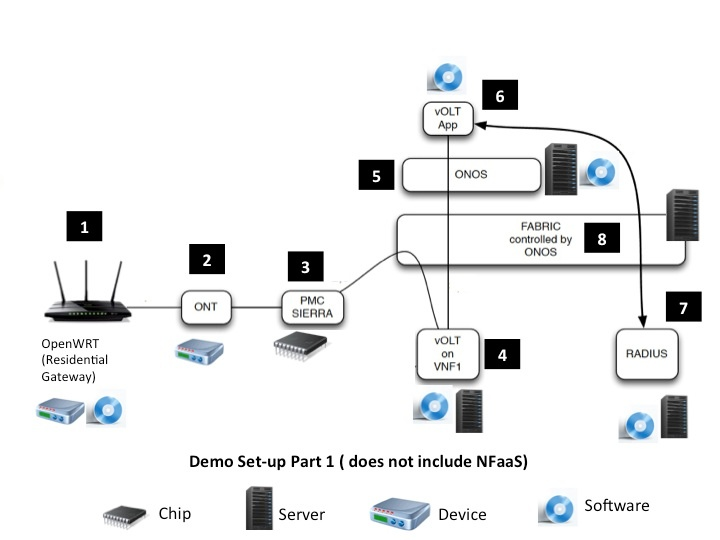

# CORD set-up

## Set-up Part 1 (does not include details about NFaaS):

* Note - multiple VNFs can be instantiated on one server so each server icon in the picture above does not imply one separate server.

## Demo Set-ups:

Two set-ups will be created:

1. ON.Lab Set-up
2. AT&T Foundry, Atlanta set-up

| Number | Description | Comments | ON.Lab Set-up  Status | AT&T Foundry, Atlanta set-up  Status |
| --- | --- | --- | --- | --- |
| 1 | Residential gateway (OpenWRT) | Ali will procure devices, load software and  provide these for ON.Lab and AT&T set-up |  |  |
| 2 | ONT | Can AT&T provide this for ON.Lab and AT&T set-up? |  |  |
| 3 | PMC Sierra chip | AT&T will need to provide for ON.Lab and AT&T set-up |  |  |
| 4 | vOLT software | AT&T Foundry, Atlanta has a vOLT software that could be used for ON.Lab and AT&T |  |  |
| 5 | ONOS | ON.Lab and AT&T will set-up their own ONOS instances. Ali/ON.Lab will help AT&T as needed. |  |  |
| 6 | vOLT app ( for interfacing with RADIUS etc) | A similar app exists at AT&T Foundry, Palo ( written for RYU controller). Needs to be evaluated to see if it can be ported and used for this demo. |  |  |
| 7 | Radius software + schema | AT&T will provide details of what RADIUS schema they use as well as details on RADIUS software used. |  |  |
| 8 | Fabric (simplistic version) - controlled by a separate ONOS instance (not shown in the diagram) | Simple version of fabric demo. Will have its separate ONOS for control. Details to be hashed out. |  |  |
