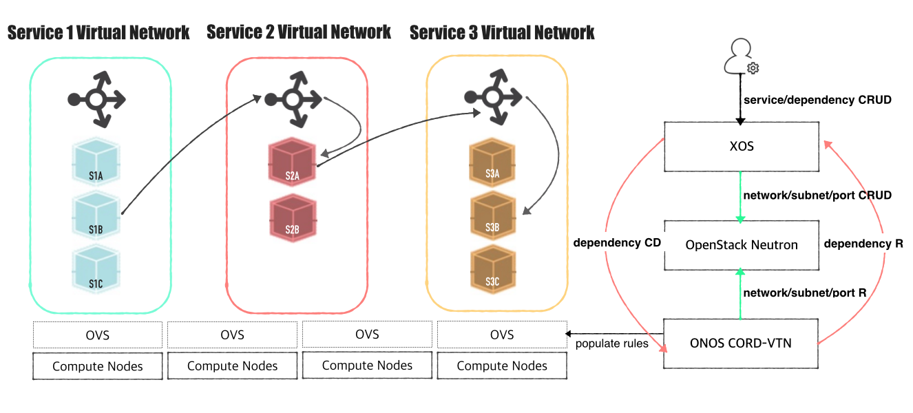
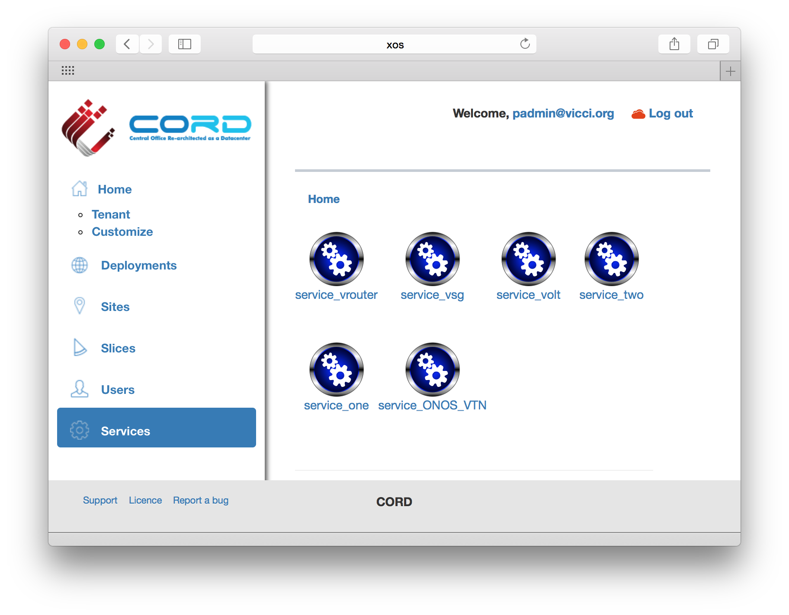
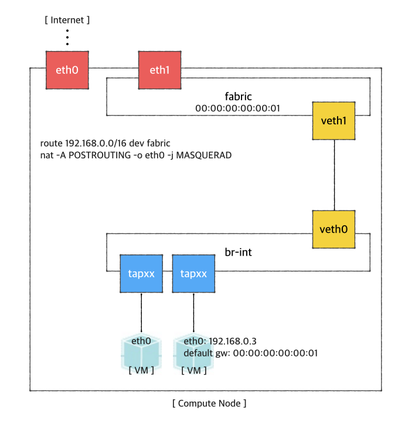
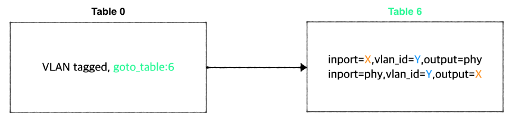

# CORD VTN

Deprecated

This page is obsolete and will be removed soon, please see <https://wiki.opencord.org/display/CORD/VTN+Developer+Information> instead.

You will need:

* An **ONOS** cluster installed and running
* An **OpenStack**service installed and running (**"stable/mitaka"** version is used here)
* An **XOS** installed and running (optional if you need to test CORD VTN functionalities only, not the other CORD services)

# Architecture

The high level architecture of the system is shown in the following figure.



Here's some assumptions to help understand this page.

* Each network service has its own Neutron network
* Multiple redundant VMs with the same functionalities can exist in a network service

**CORD-VTN provides the following features.**

* Bootstraps OVS and "br-int" interface in a compute node to be controlled by ONOS and CORD-VTN properly
* Provides a basic connectivity among all VMs in the same service(i.e. same Neutron network).
* Provides an external connectivity to a VM with *public type* of service network.
* Provides a local management connectivity, which is a limited connection between a VM and compute node.
* Provides a service dependency between two services. It guarantees forwarding all traffics from 'service A', which is *tenant service*, to one of the VM of 'service B', which is *provider service*.
* Provides WAN and LAN connectivities for vSG container.
* Provides ARP and DHCP proxy for the virtual networks.

[TODO: adds pipeline diagram]

# OpenStack Setup

You can find various setups and ways to build OpenStack from the Internet. Note that instructions described here include important configurations only to use CORD VTN service. All the other settings are completely up to your environment.

You will need,

* **Controller cluster**: at least one 4G RAM machine, runs DB, message queue server, OpenStack services including **Nova, Neutron, Glance and Keystone**.
* **Compute nodes**: at least one 2G RAM machine, runs **nova-compute** agent **only. (Please don't run Neutron ovs-agent in compute node)**

## Controller Node

Let's install networking-onos (**Neutron ML2 plugin for ONOS**) first.

```
$ mkdir -p /opt/stack && cd /opt/stack
$ git clone https://github.com/openstack/networking-onos.git
$ cd networking-onos
$ sudo python setup.py install
```

Specify ONOS access information.

**networking-onos/etc/conf\_onos.ini**

```
# Configuration options for ONOS ML2 Mechanism driver
[onos]
# (StrOpt) ONOS ReST interface URL. This is a mandatory field.
url_path = http://onos.instance.ip.addr:8181/onos/cordvtn
# (StrOpt) Username for authentication. This is a mandatory field.
username = onos
# (StrOpt) Password for authentication. This is a mandatory field.
password = rocks
```

Next step is to install and run OpenStack services.

For **DevStack** users, use this sample DevStack local.conf to build OpenStack controller node. Make sure your DevStack branch is consistent with the OpenStack branches, "stable/mitaka" in this example.

**local.conf of Controller Node**

```
[[local|localrc]]
HOST_IP=10.134.231.28
SERVICE_HOST=10.134.231.28
RABBIT_HOST=10.134.231.28
DATABASE_HOST=10.134.231.28
Q_HOST=10.134.231.28

ADMIN_PASSWORD=nova
DATABASE_PASSWORD=$ADMIN_PASSWORD
RABBIT_PASSWORD=$ADMIN_PASSWORD
SERVICE_PASSWORD=$ADMIN_PASSWORD
SERVICE_TOKEN=$ADMIN_PASSWORD

DATABASE_TYPE=mysql

# Log
SCREEN_LOGDIR=/opt/stack/logs/screen

# Images
IMAGE_URLS="http://cloud-images.ubuntu.com/releases/14.04/release/ubuntu-14.04-server-cloudimg-amd64.tar.gz,http://www.planet-lab.org/cord/trusty-server-multi-nic.img"
FORCE_CONFIG_DRIVE=True

# Networks
Q_ML2_TENANT_NETWORK_TYPE=vxlan
Q_ML2_PLUGIN_MECHANISM_DRIVERS=onos_ml2
Q_PLUGIN_EXTRA_CONF_PATH=/opt/stack/networking-onos/etc
Q_PLUGIN_EXTRA_CONF_FILES=(conf_onos.ini)
NEUTRON_CREATE_INITIAL_NETWORKS=False

# Services
enable_service q-svc
disable_service n-net
disable_service n-cpu
disable_service tempest
disable_service c-sch
disable_service c-api
disable_service c-vol
 
# Branches
GLANCE_BRANCH=stable/mitaka
HORIZON_BRANCH=stable/mitaka
KEYSTONE_BRANCH=stable/mitaka
NEUTRON_BRANCH=stable/mitaka
NOVA_BRANCH=stable/mitaka
```

If you use other deploy tools or build the controller node manually, please set the following configurations to Nova and Neutron configuration files.

**1. Set Neutron** to use ONOS ML2 plugin.

**/etc/neutron/neutron.conf**

```
core_plugin = neutron.plugins.ml2.plugin.Ml2Plugin
dhcp_agent_notification = False
```

**/etc/neutron/plugins/ml2/ml2\_conf.ini**

```
[ml2]
tenant_network_types = vxlan
type_drivers = vxlan
mechanism_drivers = onos_ml2

[securitygroup]
enable_security_group = True
```

**2. Set Nova** to use config drive for metadata service, so that we don't need to launch Neutron metadata-agent.

And of course, set to use Neutron for network service.

**/etc/nova/nova.conf**

```
[DEFAULT]
force_config_drive = True
network_api_class = nova.network.neutronv2.api.API
security_group_api = neutron
 
[neutron]
url = http://[controller_ip]:9696
auth_strategy = keystone
admin_auth_url = http://[controller_ip]:35357/v2.0
admin_tenant_name = service
admin_username = neutron
admin_password = [admin passwd]
```

3. Don't forget to specify **conf\_onos.ini** when you start Neutron service.

```
/usr/bin/python /usr/local/bin/neutron-server --config-file /etc/neutron/neutron.conf --config-file /etc/neutron/plugins/ml2/ml2_conf.ini --config-file /opt/stack/networking-onos/etc/conf_onos.ini
```

## Compute Node

No special configurations are required for compute node other than setting network api to Neutron.

For **DevStack** users, here's sample DevStack local.conf.

**local.conf for Compute Node**

```
[[local|localrc]]
HOST_IP=10.134.231.30  <-- local IP
SERVICE_HOST=162.243.x.x  <-- controller IP, must be reachable from your test browser for console access from Horizon
RABBIT_HOST=10.134.231.28
DATABASE_HOST=10.134.231.28

ADMIN_PASSWORD=nova
DATABASE_PASSWORD=$ADMIN_PASSWORD
RABBIT_PASSWORD=$ADMIN_PASSWORD
SERVICE_PASSWORD=$ADMIN_PASSWORD
SERVICE_TOKEN=$ADMIN_PASSWORD

DATABASE_TYPE=mysql

NOVA_VNC_ENABLED=True
VNCSERVER_PROXYCLIENT_ADDRESS=$HOST_IP
VNCSERVER_LISTEN=$HOST_IP

LIBVIRT_TYPE=kvm
# Log
SCREEN_LOGDIR=/opt/stack/logs/screen

# Services
ENABLED_SERVICES=n-cpu,neutron
 
# Branches
NOVA_BRANCH=stable/mitaka
KEYSTONE_BRANCH=stable/mitaka
NEUTRON_BRANCH=stable/mitaka
```

If your compute node is a VM, try <http://docs.openstack.org/developer/devstack/guides/devstack-with-nested-kvm.html> this first or set `LIBVIRT_TYPE=qemu`. Nested KVM is much faster than `qemu`, if possible.

**For manual set ups, set Nova** to use Neutron as a network API.

**/etc/nova/nova.conf**

```
[DEFAULT]
force_config_drive = always
network_api_class = nova.network.neutronv2.api.API
security_group_api = neutron
 
[neutron]
url = http://[controller_ip]:9696
auth_strategy = keystone
admin_auth_url = http://[controller_ip]:35357/v2.0
admin_tenant_name = service
admin_username = neutron
admin_password = [admin passwd]
```

# Additional compute node setup

**1. Make sure your OVS version is 2.3.0 or later.**

**2.****Set OVSDB listening mode in your compute nodes.** There are two ways.

```
$ ovs-appctl -t ovsdb-server ovsdb-server/add-remote ptcp:6640:host_ip
```

Or you can make the setting permanent by adding the following line to **/usr/share/openvswitch/scripts/ovs-ctl**, right after **"set ovsdb-****server "$DB\_FILE"** line. You need to restart the openvswitch-switch service.

```
set "$@" --remote=ptcp:6640
```

In either way, you should be able to see port "6640" is in listening state.

```
$ netstat -ntl
Active Internet connections (only servers)
Proto Recv-Q Send-Q Local Address           Foreign Address         State
tcp        0      0 0.0.0.0:22              0.0.0.0:*               LISTEN
tcp        0      0 0.0.0.0:6640            0.0.0.0:*               LISTEN
tcp6       0      0 :::22
```

**2. Check your OVSDB. It is okay If there's a bridge with name "br-int", but note that CORD-VTN will add or update its controller, DPID, and fail mode.**

```
$ sudo ovs-vsctl show
cedbbc0a-f9a4-4d30-a3ff-ef9afa813efb
    ovs_version: "2.3.0"
```

**3. Should be able to SSH from ONOS instance to compute nodes with key.**

## ONOS Setup

Add the following configurations to your ONOS network-cfg.json. If you don't have fabric controller and vRouter setups, you may want to read **"Internet Access from VM"** part also before creating network-cfg.json file. One assumption here is that all compute nodes have the same configurations for OVSDB port, SSH port, and account for SSH.

| Config Name | Descriptions |
| --- | --- |
| privateGatewayMac | MAC address of virtual private network gateway, it can be any MAC address |
| publicGateways | List of public network gateway and MAC address |
| publicGateway:gatewayIp | Public gateway IP |
| publicGateway:gatewayMac | MAC address mapped to the public gateway IP |
| localManagementIp | Management IP for a compute node and VM connection, must be CIDR notation |
| ovsdbPort | Port number for OVSDB connection (OVSDB uses 6640 by default) |
| ssh | SSH configurations |
| ssh: sshPort | Port number for SSH connection |
| ssh: sshUser | SSH user name |
| ssh: sshKeyFile | Private key file for SSH |
| openstack | OpenStack configurations |
| openstack: endpoint | OpenStack Keystone endpoint |
| openstack: tenant | Tenant name, this tenant must have admin authorization able to see all the network resources |
| openstack: user | User name, this user must have admin authorization able to see all the network resources |
| openstack: password | Password for the tenant and admin above |
| nodes | list of compute node information |
| nodes: hostname | hostname of the compute node, should be unique throughout the service |
| nodes: hostManagementIp | Management IP for a head node and compute node, it is used for OpenFlow, OVSDB, and SSH session. Must be CIDR notation. |
| nodes: dataPlaneIp | Data plane IP address, this IP is used for VXLAN tunneling |
| nodes: dataPlaneIntf | Name of physical interface used for tunneling |
| nodes: bridgeId | Device ID of the integration bridge (br-int) |

localManagementIp, dataPlaneIp and hostManagementIp must not be overlapped

**network-cfg.json**

```
{
    "apps" : {
        "org.onosproject.cordvtn" : {
            "cordvtn" : {
                "privateGatewayMac" : "00:00:00:00:00:01",
                "publicGateways" : [
                    {
                        "gatewayIp" : "10.141.192.158",
                        "gatewayMac" : "a4:23:05:34:56:78"
                    }
                ],
                "localManagementIp" : "172.27.0.1/24",
                "ovsdbPort" : "6640",
                "ssh" : {
                    "sshPort" : "22",
                    "sshUser" : "root",
                    "sshKeyFile" : "~/.ssh/id_rsa"
                },
                "openstack" : {
                    "endpoint" : "http://10.243.139.46:5000/v2.0/",
                    "tenant" : "admin",
                    "user" : "admin",
                    "password" : "nova"
                },
                "xos" : {
                    "endpoint" : "http://10.55.30.16:80",
                    "user" : "padmin@vicci.org",
                    "password" : "letmein"
                },
                "nodes" : [
                    {
                        "hostname" : "compute-01",
                        "hostManagementIp" : "10.55.25.244/24",
                        "dataPlaneIp" : "10.134.34.222/16",
                        "dataPlaneIntf" : "veth0",
                        "bridgeId" : "of:0000000000000001"
                     },
                     {
                        "hostname" : "compute-02",
                        "hostManagementIp" : "10.241.229.42/24",
                        "dataPlaneIp" : "10.134.34.223/16",
                        "dataPlaneIntf" : "veth0",
                        "bridgeId" : "of:0000000000000002"
                     }
                ]
            }
        }
    }
}
```

Set your ONOS to activate the following applications.

```
ONOS_APPS=drivers,drivers.ovsdb,openflow-base,lldpprovider,cordvtn
```

# XOS Setup

You can skip this part if you want to test CORD VTN features only and manually by creating network and VM via OpenStack CLI or dashboard. Make sure your OpenStack has "trusty-server-multi-nic" image(<http://www.planet-lab.org/cord/trusty-server-multi-nic.img)> before you start.

**1. Install Docker, httpie, and OpenStack CLIs**

```
root@xos # curl -s https://get.docker.io/ubuntu/ | sudo sh
 
root@xos # apt-get install -y httpie
root@xos # pip install --upgrade httpie
 
root@xos # apt-get install -y python-keystoneclient python-novaclient python-glanceclient python-neutronclient
```

  

**2. Download XOS**

```
root@xos # git clone https://github.com/open-cloud/xos.git
```

**3. Set correct OpenStack information to****xos/xos/configurations/cord-pod/admin-openrc.sh.** Note that you should set all OpenStack controller IP not hostname since inside the XOS container, the hostname is not configured.

**admin-openrc.sh**

```
export OS_TENANT_NAME=admin
export OS_USERNAME=admin
export OS_PASSWORD=nova
export OS_AUTH_URL=http://10.243.139.46:35357/v2.0 
```

**4. Change "onos-cord" in xos/xos/configurations/cord-pod/vtn-external.yaml to ONOS instance IP address for the same reason in step 3.**

**vtn-external.yaml**

```
    service_ONOS_VTN:
      type: tosca.nodes.ONOSService
      requirements:
      properties:
          kind: onos
          view_url: /admin/onos/onosservice/$id$/
          no_container: true
          rest_hostname: 10.203.255.221 --> change this line
```

**5. Copy the SSH keys under xos/xos/configurations/cord-pod/**

* *id\_rsa[.pub]*: A keypair that will be used by the various services
* *node\_key*: A private key that allows root login to the compute nodes

**6. Run make**

Second make command will re-configure ONOS and you have to post network-cfg.json again. You should be able to see ONOS is reconfigured by XOS when it's done with the second make command.

```
root@xos ~/xos/xos/configurations/cord-pod # make
root@xos ~/xos/xos/configurations/cord-pod # make vtn
root@xos ~/xos/xos/configurations/cord-pod # make cord
```

If you log-in to XOS GUI(<http://xos,> login with "[padmin@vicci.org](mailto:padmin@vicci.org)" and "letmein"), you can see some services.



You should also be able to see new networks are created in Neutron.

```
hyunsun@openstack-controller master ~/devstack
$ neutron net-list
+--------------------------------------+-------------------+----------------------------------------------------+
| id                                   | name              | subnets                                            |
+--------------------------------------+-------------------+----------------------------------------------------+
| 6ce70c87-7b9f-4866-9bba-2f7646781576 | mysite_vsg-access | f362b166-c382-4c5e-94c7-e5f8b4822ac3 10.0.2.0/24   |
| 9ababe18-d0b3-41a7-9f81-e56b58aa0182 | management        | 141ce1a6-6407-4385-83ec-1b490bd6be0d 172.27.0.0/24 |
+--------------------------------------+-------------------+----------------------------------------------------+
```

Internet Access from VM (only for test)

 If you want to access a VM through SSH or access the Internet from VM without fabric controller and vRouter, you need to do setup the followings in your compute node. Basically, this settings mimics fabric switch and vRouter inside a compute node, that is, "fabric" bridge corresponds to fabric switch and Linux routing tables corresponds to vRouter. You'll need at least two physical interface for this test setup.



 First, you'd create a bridge named "fabric" (it doesn't have to be fabric). 

```
$ sudo brctl addbr fabric
```

 

Create a veth pair and set veth0 as a "**dataPlaneIntf**" in network-cfg.json 

```
$ ip link add veth0 type veth peer name veth1
```

 

Now, add veth1 and the actual physical interface, eth1 here in example, to the fabric bridge. 

```
$ sudo brctl addif fabric veth1
$ sudo brctl addif fabric eth1
$ sudo brctl show
bridge name bridge id       STP enabled interfaces
fabric      8000.000000000001   no      eth1
                                        veth1
```

 

Set fabric bridge MAC address to the virtual gateway MAC address, which is "**privateGatewayMac**" in network-cfg.json.  

```
$ sudo ip link set address 00:00:00:00:00:01 dev fabric
```

 

Now, add routes of your virtual network IP ranges and NAT rules. 

```
$ sudo route add -net 192.168.0.0/16 dev fabric
$ sudo netstat -rn
Kernel IP routing table
Destination     Gateway         Genmask         Flags   MSS Window  irtt Iface
0.0.0.0         45.55.0.1       0.0.0.0         UG        0 0          0 eth0
45.55.0.0       0.0.0.0         255.255.224.0   U         0 0          0 eth0
192.168.0.0     0.0.0.0         255.255.0.0     U         0 0          0 fabric
 
$ sudo iptables -A FORWARD -d 192.168.0.0/16 -j ACCEPT
$ sudo iptables -A FORWARD -s 192.168.0.0/16 -j ACCEPT
$ sudo iptables -t nat -A POSTROUTING -o eth0 -j MASQUERADE
```

 

You should enable ip\_forward, of course. 

```
$ sudo sysctl net.ipv4.ip_forward=1
```

 

It's ready. Make sure all interfaces are activated and able to ping to the other compute nodes with "**hostManagementIp**". 

```
$ sudo ip link set br-int up
$ sudo ip link set veth0 up
$ sudo ip link set veth1 up
$ sudo ip link set fabric up
```

 

# How To Test: Basic Service Composition

## Before you start

Once OpenStack and ONOS with CORD VTN app are started successfully, you'd better check the compute nodes are ready.

**1. Check your ONOS instance IPs are correctly set to the management IP. It should be accessible from compute nodes.**

```
onos> nodes
id=10.203.255.221, address=159.203.255.221:9876, state=ACTIVE, updated=21h ago *
id=10.243.151.127, address=162.243.151.127:9876, state=ACTIVE, updated=21h ago
id=10.199.96.13, address=198.199.96.13:9876, state=ACTIVE, updated=21h ago
```

**2. Check your compute nodes are registered to CordVtn service and in init **COMPLETE**state.**

**cordvtn-nodes**

```
onos> cordvtn-nodes
hostname=compute-01, hostMgmtIp=10.55.25.244/24, dpIp=10.134.34.222/16, br-int=of:0000000000000001, dpIntf=veth1, init=COMPLETE
hostname=compute-02, hostMgmtIp=10.241.229.42/24, dpIp=10.134.34.223/16, br-int=of:0000000000000002, dpIntf=veth1, init=INCOMPLETE
Total 2 nodes
```

If the nodes listed in your network-cfgf.json do not show in the result, try to push network-cfg.json to ONOS with REST API.

```
curl --user onos:rocks -X POST -H "Content-Type: application/json" http://onos-01:8181/onos/v1/network/configuration/ -d @network-cfg.json
```

If all the nodes are listed but some of them are in **"INCOMPLETE"** state, check what is the problem with it and fix it.

Once you fix the problem, push the network-cfg.json again to trigger init for all nodes(it is no harm to init COMPLETE state nodes again) or use **"cordvtn-node-init"** command.

**cordvtn-node-check**

```
onos> cordvtn-node-check compute-01
Integration bridge created/connected : OK (br-int)
VXLAN interface created : OK
Data plane interface added : OK (veth1)
IP flushed from veth1 : OK
Data plane IP added to br-int : NO (10.134.34.222/16)
Local management IP added to br-int : NO (172.27.0.1/24)
 
(fix the problem if there's any)
 
onos> cordvtn-node-init compute-01
 
onos> cordvtn-node-check compute-01
Integration bridge created/connected : OK (br-int)
VXLAN interface created : OK
Data plane interface added : OK (veth1)
IP flushed from veth1 : OK
Data plane IP added to br-int : OK (10.134.34.222/16)
Local management IP added to br-int : OK (172.27.0.1/24)
```

**3. Make sure all virtual switches on compute nodes are added and available in ONOS.**

```
onos> devices
id=of:0000000000000001, available=true, role=MASTER, type=SWITCH, mfr=Nicira, Inc., hw=Open vSwitch, sw=2.3.2, serial=None, managementAddress=compute.01.ip.addr, protocol=OF_13, channelId=compute.01.ip.addr:39031
id=of:0000000000000002, available=true, role=STANDBY, type=SWITCH, mfr=Nicira, Inc., hw=Open vSwitch, sw=2.3.2, serial=None, managementAddress=compute.02.ip.addr, protocol=OF_13, channelId=compute.02.ip.addr:44920
```

During the initialization process, OVSDB devices can be shown, for example ovsdb:10.241.229.42, when you list devices in your ONOS. Once it's done with node initialization, these OVSDB devices are removed and only OpenFlow devices are shown.

Now, it's ready.

## Without XOS

You can test creating service networks and service chaining manually, that is, without XOS.

**1. Test VMs in a same network can talk to each other**

First, create a network through OpenStack Horizon or OpenStack CLI. Network name should include one of the following five network types.

* **private** : network for VM to VM communication
* **public** : network for VM to external network communication, note that the gateway IP and MAC address of this network should be specified in "***publicGateways***" field in network-cfg.json
* **management** : network for VM to compute node communication, where the VM is running. Note that subnet for this network should be the same specified in "***localManagementIp***" field in network-cfg.json

**neutron net-create**

```
$ neutron net-create net-A-private
$ neutron subnet-create net-A-private 10.0.0.0/24
```

To access VM through SSH, you may want to create SSH key first and pass the **--key-name** when you create a VM, or the following script as a **--user-data**, which sets password of "ubuntu" account to "ubuntu" so that you can login to VM through console. Anyway, creating and accessing a VM is the same with usual OpenStack usage.

```
#cloud-config
password: ubuntu
chpasswd: { expire: False }
ssh_pwauth: True
```

Now **create VMs** with the network you created. (don't forget to add --key-name or --user-data if you want to login to VM)

**nova boot**

```
$ nova boot --image f04ed5f1-3784-4f80-aee0-6bf83912c4d0 --flavor 1 --nic net-id=aaaf70a4-f2b2-488e-bffe-63654f7b8a82 net-A-vm-01
```

You can access VM through Horizon Web Console, *virsh console* with some tricks(<https://github.com/hyunsun/documentations/wiki/Access-OpenStack-VM-through-virsh-console>) or if you setup **"Local Management Network"** part, you can SSH to VM from a compute node where the VM is running.

Now, test VMs can ping to each other.

**2. Test VMs in a different network cannot talk to each other**

Create another network, for example net-B-private, and create another VM with the network. Now, test the VM cannot ping to the network net-A-private.

**3. Test service chaining**

Enable ip\_forward in your VMs.

```
$ sudo sysctl net.ipv4.ip_forward=1
```

Create service dependency with the following REST API.

```
$ curl -X POST -u onos:rocks http://[onos_ip]:8181/onos/cordvtn/service-dependency/[net-A-UUID]/[net-B-UUID]/b
```

Now, ping from net-A-private VM to gateway IP address of net-B. There will not be a reply but if you tcpdump in net-B-private VMs, you can see one of the VMs in net-B-private gets the packets from net-A-private VM. To remove the service dependency, send another REST call with DELETE.

```
$ curl -X DELETE -u onos:rocks http://[onos_ip]:8181/onos/cordvtn/service-dependency/[net-A-UUID]/[net-B-UUID]
```

Check the following video how service chaining works (service chaining demo starts from 42:00)

## With XOS

Running the following command on XOS machine will create VTN services and service dependency.

```
root@xos master ~/xos/xos/configurations/cord-pod
# docker-compose run xos python /opt/xos/tosca/run.py padmin@vicci.org /opt/xos/tosca/samples/vtn-service-chain.yaml
```

# How To Test: Additional Features

## Local Management Network

If you need to SSH to VM directly from compute node, just create and attach the management network to a VM. Management network name should include "management".

**1. Create a management network and subnet which you specified as the "localManagementIp" in your network-cfg.json and make sure that the gateway IP of the subnet should be the same with **"localManagementIp".****

**neutron net-create**

```
$ neutron net-create management
$ neutron subnet-create management 172.27.0.0/24 --gateway 172.27.0.1
```

**2. Create a VM with management network.** I added the management network as a second interface in the following example but it is not necessarily to be a second NIC.

**nova boot**

```
$ nova boot --image f04ed5f1-3784-4f80-aee0-6bf83912c4d0 --flavor 1 --nic net-id=aaaf70a4-f2b2-488e-bffe-63654f7b8a82 --nic net-id=0cd5a64f-99a3-45a3-9a78-7656e9f4873a net-A-vm-01
```

All done. Now you can access the VM from the host machine. If the management network is not the primary interface, there's a possibility that the VM does not bring up the interface automatically. In that case, log in to the VM and bring up the interface manually.

**inside a VM**

```
$ sudo dhclient eth1
```

## VLAN for connectivity between VM and underlay network

You can use VLAN for the connectivity between a VM and a server in the underlay network. It's *very limited* but can be useful if you need a connectivity between a VM and a physical machine or any other virtual machine which is not controlled by CORD-VTN and OpenStack. R-CORD uses this feature for vSG LAN connectivity.

The figure below is the part of the CORD-VTN pipeline, which shows how VLAN tagged packet is handled.



Basically, VLAN tagged packet from a VM is forwarded to the data plane without any modifications and any VLAN tagged packet from data plane is forwarded to a VM based on its VLAN ID. So, assigning the same VLAN ID to multiple VMs in the same virtual switch can break the logic. Anyway, if you want this limited VLAN feature, try the following steps.

1. Create Neutron port with port name "stag-*[vid]*"

```
$ neutron port-create net-A-private --name stag-100
```

2. Create a VM with the port

```
$ nova boot --image 6ba954df-063f-4379-9e2a-920050879918 --flavor 2 --nic port-id=2c7a397f-949e-4502-aa61-2c9cefe96c74 --user-data passwd.data vsg-01
```

3. Once the VM is up, create a VLAN interface inside the VM with the VID and assign any IP address you want to use with the VLAN. And do the same thing on the server in the underlay.

```
$ sudo vconfig add eth0 100
$ sudo ifconfig eth0.100 10.0.0.2/24
```

## Floating IP with VLAN ID 500

CORD-VTN handles VID 500 a little differently. It strips the VLAN before forwarding the packet to the data plane.

[TO DO]

## REST APIs

Here's the list of REST APIs that CORD-VTN provides.

| Method | Path | Description |
| --- | --- | --- |
| POST | onos/cordvtn/service-dependency/{tenant service network UUID}/*{provider service netework UUID}* | Creates a service dependency with unidirectional access from a tenant service to a provider service |
| POST | onos/cordvtn/service-dependency/{tenant service network UUID}/*{provider service netework UUID}/[u/b]* | Creates a service dependency with access type extension. "u" is implied to a unidirectional access from a tenant service to a provider service and "b" for bidirectional access between two services. |
| DELETE | onos/cordvtn/service-dependency/{tenant service network UUID}/*{provider service netework UUID}* | Removes services dependency from a tenant service to a provider service. |

# CLI Commands

| Command | Usage | Description |
| --- | --- | --- |
| cordvtn-nodes | cordvtn-nodes | Shows the list of compute nodes that registered to COR-VTN service |
| cordvtn-node-check | cordvtn-node-check *[hosthame]* | Shows the state of each node bootstrap steps |
| cordvtn-node-init | cordvtn-node-init *[hostname]* | Initializes the node including creating "br-int" bridge and setting the controller to ONOS cluster, creating "vxlan" port, adding "dataPlaneIntf", assigning "localMgmtIp" and "dataPlaneIp" to "br-int" interface, and populating flows for the VMs connected to the "br-int". It is no harm to repeat this command multiple times. |
| cordvtn-node-delete | cordvtn-node-delete *[hostname]* | Removes the node from the CORD-VTN service |
| cordvtn-flush-rules | cordvtn-flush-rules | Flushes all the rules installed by CORD-VTN in the data plane. This command might be useful when the data plane is messed up. You can flush the data plane with this command and re-initialize the nodes by running "cordvtn-node-init" command or pushing the network-cfg.json again. It would refresh the data plane. |
