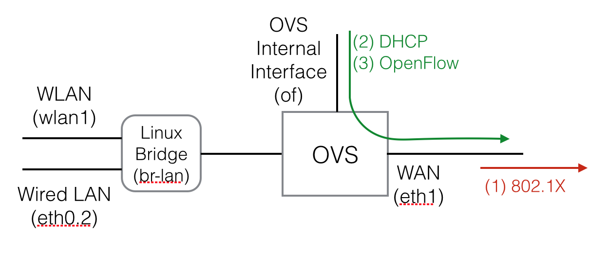
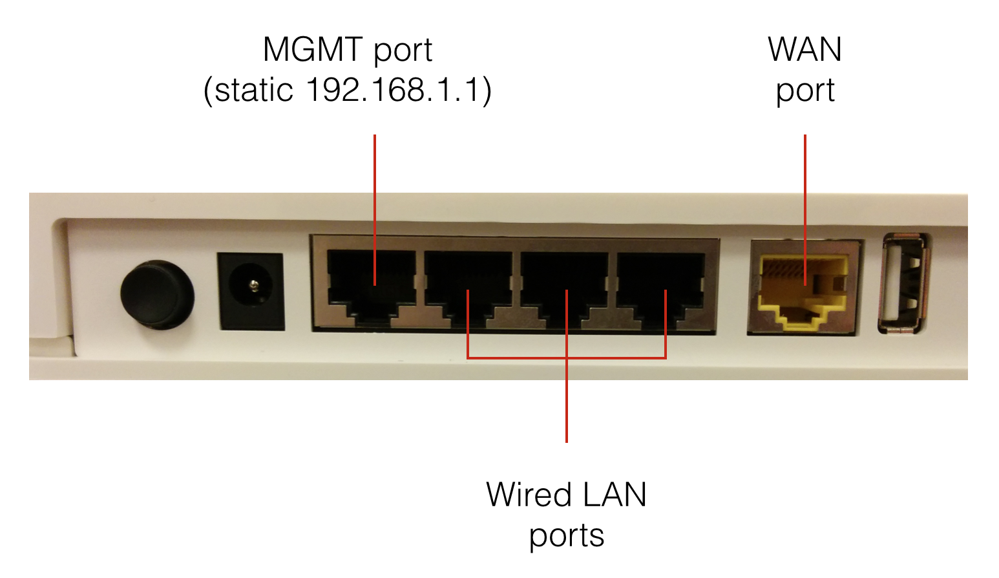

# Residential gateway setup

The residential gateway is a regular home wireless router running OpenWRT. The hardware we are using is NETGEAR WNDRMACv2 (also known as WNDR3700v2). I've provisioned these with OpenWRT Barrier Breaker 14.07.

# Setup

The RG has an OVS OpenFlow switch sitting between the LAN side (wired ethernet ports and wireless network) and the WAN side (yellow ethernet port that connects to ONU). The OVS switch is using in-band control to connect to an OpenFlow controller in the network. It uses wpa\_supplicant to authenticate with the the network using EAPOL.



When the RG boots up and is connected to the network, the workflow is as follows:

1. wpa\_supplicant does 802.1X and authenticates the box
2. OVS internal port uses DHCP to receive an IP address for the switch
3. OVS initiates an in-band OpenFlow connection to the controller using the IP address it just received.

Once these steps are complete, the OpenFlow controller can set up flows to allow the LAN-side devices to access the vCPE.

# Usage

There are a few things that need to be configured on the box before it will work in a new environment.

## Accessing the box

When the device is plugged in, it will try and get an address via DHCP on the WAN port, however there's no way to know what address it got. So that we can configure the router, there's a static IP set up on ethernet port 0 (closest port to the power port). This port is configured with the address 192.168.1.1, so you can SSH in through this address.

Username: root  
Password: cord



## Configure the box

The OVS switch has to be configured with an appropriate controller IP for the environment.

```
root@gateway1:~# ovs-vsctl set-controller of tcp:<controller_ip>:6633
```

Also, wpa\_supplicant needs to be set up with the correct certificates and identity in order to authenticate.

Certificates can be copied into `/etc/cert`.

Then edit `/etc/config/wpa_supplicant.conf` with the correct identity and certificate paths.

Reboot wpa\_supplicant:

```
root@gateway1:~# /etc/init.d/wpa_supplicant restart
```

Now the box should be able to authenticate, get an address via DHCP and connect to its OpenFlow controller.
