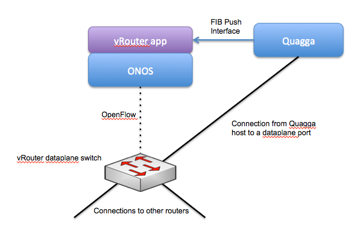

# vRouter

This page explains how to set up and use the vRouter service of CORD.

You will need:

* A switch that will be the dataplane of the vRouter
* An ONOS cluster installed and running - see ONOS documentation to get to this point
* A Quagga instance that is communicating with other routers. Setting up Quagga to talk to other routers is outside the scope of this document - I assume you have Quagga already configured and have received some routes from somewhere. vRouter currently supports a Quagga speaking OSPF and BGP only.

# Architecture

The high level architecture of the system is shown in the following figure.



The important thing here is that the host where you're running Quagga needs to have a connection to a dataplane port on the switch. This is the port that the incoming routing traffic will be directed to. Also the interface on the Quagga host that connects to the vRouter switch needs to be configured with the IP/MAC/VLAN parameters of the router interfaces.

Quagga can run on the same host as one of the ONOS instances.

# ONOS vRouter application

## Configuration

There are three parts to the configuration of the vRouter application. vRouter is effectively turning an OpenFlow switch into a router. This means we need to configure 'interfaces' on the switch, just as you'd do for a regular router. Of course, seeing as it is an OpenFlow switch, the switch itself has no knowledge of this interface configuration, but rather it is a logical configuration the the vRouter application uses to do its job of controlling the switch as though it was a router.

Check out the [Network Configuration Service](../../../guides/administrator-guide/configuring-onos/the-network-configuration-service.md) for information on how to upload configuration to ONOS.

Depending on which switch you are using, you may need to configure which driver ONOS will use for it. If you are using OVS, we need to configure ONOS to use the softrouter driver, because the default ovs driver doesn't support multi-table pipelines.

```
{
	"devices" : {
        "of:00000000000000b1" : {
            "basic" : {
                "driver" : "softrouter"
            }
        }
    }
}
```

The interface configuration in ONOS looks like this:

```
{
    "ports" : {
        "of:00000000000000b1/1" : {
            "interfaces" : [
                {
					"name" : "b1-1",
                    "ips"  : [ "10.0.1.2/24" ],
                    "mac"  : "00:00:00:00:00:01"
                }
            ]
        },
        "of:00000000000000b1/2" : {
            "interfaces" : [
                {
					"name" : "b1-2",
                    "ips"  : [ "10.0.2.2/24" ],
                    "mac"  : "00:00:00:00:00:01"
                }
            ]
        },
        "of:00000000000000b1/3" : {
            "interfaces" : [
                {
					"name" : "b1-3",
                    "ips"  : [ "10.0.3.2/24" ],
                    "mac"  : "00:00:00:00:00:01"
                }
            ]
        },
        "of:00000000000000b1/4" : {
            "interfaces" : [
                {
					"name" : "b1-4",
                    "ips"  : [ "10.0.4.2/24" ],
                    "mac"  : "00:00:00:00:00:02"
                    "vlan" : 100
                }
            ]
        }
    }
}
```

Note that you do not have to configure an interface on the port that is connected to Quagga - this configuration is only for ports that are connected to other routers.

The other piece of configuration is for the vRouter to identify the switch that will be used for the dataplane, as well as the connection point of the Quagga instance. That looks like this:

```
{
    "apps" : {
        "org.onosproject.router" : {
            "router" : {
                "controlPlaneConnectPoint" : "of:00000000000000b1/5",
                "ospfEnabled" : "true",
				"interfaces" : [ "b1-1", "b1-2", "b1-2", "b1-4" ]
            }
        }
    }
}
```

Once these two configuration sections have been uploaded to ONOS, the vRouter application should be ready to run.

The **interfaces**field contains a list of names of interfaces that should be used by the vRouter. It is an optional field, and if it is omitted then all interfaces on the device will be used.

## Running the application

Log in to your ONOS cluster and start the vRouter application.

```
onos> app activate org.onosproject.vrouter
```

This will start the vRouter application and open the port listening for incoming FPI connections from Quagga. Quagga should be configured to connect to ONOS at the correct ip:port.

If Quagga has sent routes to ONOS, they should be visible using the routes command in ONOS:

```
onos> routes
```

# Mininet-based development environment

Coming soon.
