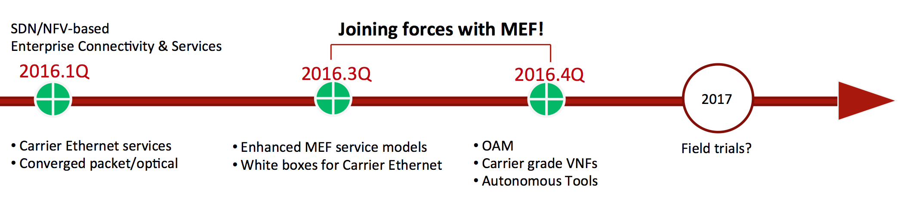

# E-CORD: Enterprise CORD

This page is for an older demo. For the latest info on E-CORD see the opencord wiki: [Enterprise CORD](https://wiki.opencord.org/display/CORD/Enterprise+CORD).

## **Overview**

**Partners** AT&T, China Unicom, NTT Communications, Huawei, NEC

**Description** Enterprise CORD (E-CORD) is a first­ of ­its ­kind initiative to offer enterprise connectivity services over metro and wide area networks, using only open source software and commodity hardware.

CORD (Central Office Re­architected as a Datacenter) combines NFV, SDN, and the elasticity of commodity clouds to bring datacenter economics and cloud agility to the Telco Central Office. An open reference implementation of CORD uses commodity servers and white­box switches, coupled with open source software that includes OpenStack, Docker, ONOS, and XOS. This reference implementation is a general and extensible platform that supports a variety of domains and business units (e.g., residential, enterprise, mobile), but it is also sufficiently complete to support field trials, with an initial trial planned at AT&T.

E-CORD builds on that same CORD infrastructure to support enterprise customers, alongside residential and mobile customers. In particular, service providers can continue to offer enterprise connectivity services (L2 and L3VPN), but can go far beyond simple connectivity services, as it allows them to include virtual network functions and service composition to support disruptive cloud­based enterprise services.

In turn, enterprise customers can use E-CORD to rapidly create on-­demand networks between any number of endpoints or company branches. These networks are dynamically configurable, implying connection attributes and SLAs can be specified and provisioned on the fly. Furthermore, enterprise customers may choose to run network functions such as firewalls, WAN accelerators, traffic analytic tools, virtual routers, etc. as on­demand services that are provisioned and maintained inside the service provider network.

The project is a collaborative effort between leading service providers (AT&T, China Unicom, and NTT Communications) and some of the most prominent vendors in the networking space (NEC, Huawei, Lumentum, Ciena, Fujitsu, Oplink, Cavium). It also has joint activities with the Metro Ethernet Forum, the leading industry consortium for carrier­grade Ethernet solutions.

We will demonstrate a proof of concept implementation of E-CORD, which consists of a packet/optical metro network with three Central Offices as CORD sites. The showcase will have user portals and GUIs to configure enterprise services, interact with operational parameters, and visualize the provisioning. Finally, we demonstrate the world's first disaggregated ROADM, moving away from a closed, chassis­based, proprietary, and vertically integrated ROADM and towards a white box model controlled using open interfaces and protocols.

**What key business or technical challenge is addressed by this solution?** The technical challenges are threefold. First, software­ defined control of a converged packet/optical wide area network requires innovative multi-­layer and delegated control primitives. Second, carrier ­grade connectivity services have elaborate service model specifications, and deploying these on white box infrastructure introduces hardware support issues. Third, control and configuration of a disaggregated ROADM platform needs careful design of abstract interfaces. Finally, an open challenge is maintaining high performance levels for transmission and signal integrity in the optical white box model.

**Describe the “open” component(s) that the solution incorporates**: Our work leverages and builds further on a fully open source stack.

● Openstack provides a base IaaS capability, and is responsible for creating and provisioning virtual machines (VMs) and virtual networks (VNs). CORD uses OpenStack's Nova, Neutron, Keystone, Ceilometer and Glance subsystems.

● ONOS is the network operating system that manages the white­box switches and software switches (OvS) in each server. It hosts control programs that implement services and it is responsible for embedding virtual networks in the underlying network.

● XOS is a framework for assembling and composing services. It unifies data plane services supported by OpenStack and Docker, and the control plane services running on ONOS.

● Atrium is the software stack that runs on each white­box switch. It includes Open Network Linux, the Indigo OpenFlow Agent (OF 1.3), and the OpenFlow Data Plane Abstraction (OF­DPA), layered on top of Broadcom merchant silicon. We also present a fully open sourced implementation of MEF Forum (MEF ­ LSO Presto interface) services running on top of commodity hardware using open protocols (OpenFlow etc.). Finally, we demonstrate the world’s first disaggregated, whitebox ROADM, built using commodity hardware components and controlled using open interfaces

## Further Resources

* [E-CORD Developer Environment](e-cord-enterprise-cord/e-cord-developer-environment.md)
* [E-CORD Resources](e-cord-enterprise-cord/e-cord-resources.md)

## Roadmap

E-CORD demonstrated its first PoC at ONS 2016 (March) with an E-line application over hardware, including three [Disaggregated ROADMs](../packet-optical-convergence/open-and-disaggregated-roadm.md). Work is in progress to develop Carrier Ethernet services and service models, and formally integrate the E-CORD related functions in ONOS with XOS to enhance NFV functionality.

The timeline below summarizes the goals. We also have a recent [design notes deck](../../../assets/e-cord-design-notes.pptx.pdf).

