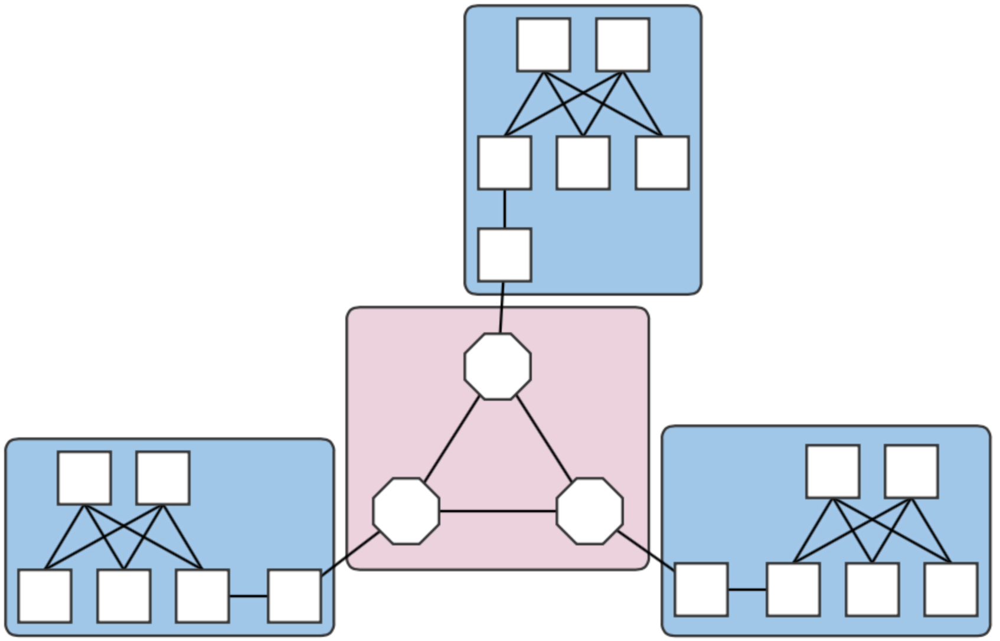
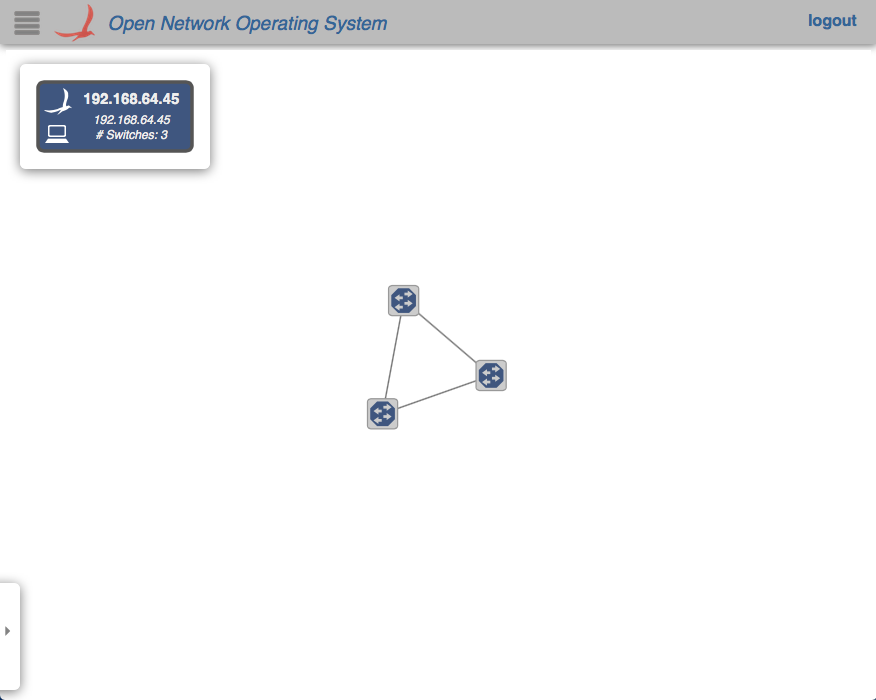
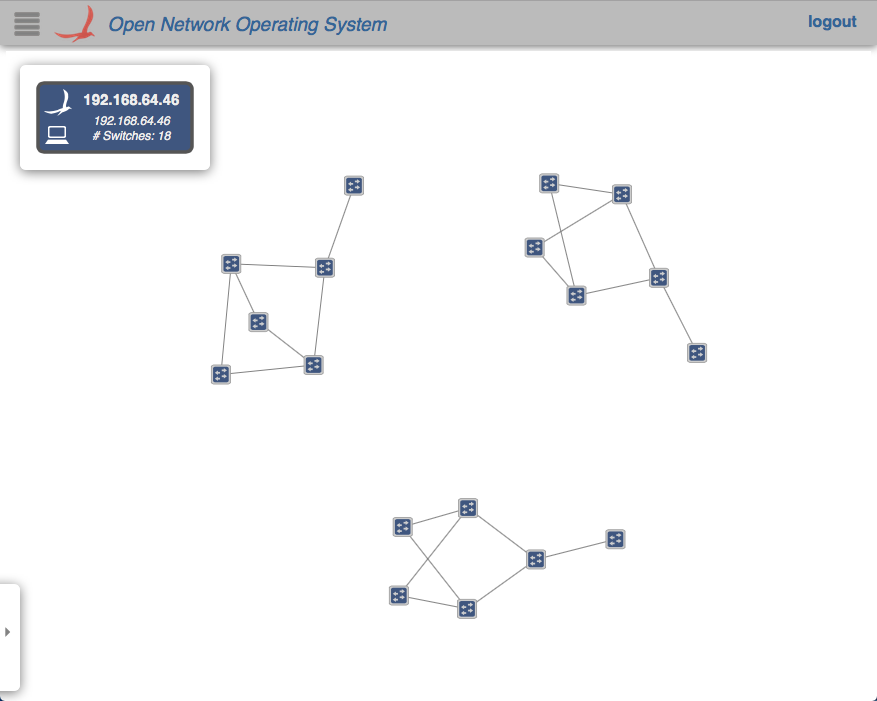

# E-CORD Developer Environment

This page describes how to set up a Mininet environment for emulating metro (multi-domain) networks. It also details the steps involved in testing various ONOS features related to the Packet/Optical and E-CORD use cases.

It is advisable to work through [The Packet Optical Dev Environment](../../packet-optical-convergence/getting-started-with-packet-optical/the-packet-optical-dev-environment.md) before continuing, since this page builds on the conventions and information there.

## Overview

We model a metro network with multiple "central office fabrics" (anything ranging from a single OVS to a set of CPqD soft switches in a clos topology) joined together by a "metro core" of Linc-OE soft ROADMs. The figure below shows an example with three central offices (blue squares) connected to an optical core of three ROADMs (pink square).



Fig. 1. A four-domain metro network topology.

Each central office and the core are different domains, i.e. regions controlled by different (sets of) controllers. The example above therefore contains four domains. Note that the white squares attaching the clos topologies to the Linc nodes are OVS instances. They are required in the emulation due to shortcomings in the way Linc switches are handled by the emulator, and does not reflect a realistic (albeit sufficient for testing) topology.

## Environment Setup

### Mininet VM

Follow the installation instructions in [The Packet Optical Dev Environment - Mininet](../../packet-optical-convergence/getting-started-with-packet-optical/the-packet-optical-dev-environment.md). Note that in this scenario, the OC variables in the cell file are interpreted differently. Each OC variable will refer to an ONOS instance that may or may not be in the same cluster.

### Control plane(s)

### Deployment host

For ease of deployment, it is best to have a terminal per cell open on the build machine. While not necessary, this cuts back on extra typing to switch among cells and potential mistakes from working in the wrong cell environment.

1. Follow steps 1. and 2. in [The Packet Optical Dev Environment - ONOS](../../packet-optical-convergence/getting-started-with-packet-optical/the-packet-optical-dev-environment.md).
2. Set up cells. Each domain should have a different controller cluster controlling it, and therefore, have separate cell configurations. For example, for two instances at addresses 192.168.64.45 and 192.168.64.46 (the metro core and CO #1), the cell files are:  
   optical layer - core domain:

   ```
   # cell for core domain (optical network)
   export ONOS_NIC=192.168.64.*
   export OC1="192.168.64.45"
   export OCI=$OC1
   export OCN="192.168.64.43"
   export ONOS_APPS="drivers,drivers.optical,openflow,proxyarp,optical"
   ```

   packet layer - central office 1:

   ```
   # cell for central office domains (packet networks)
   export ONOS_NIC=192.168.64.*
   export OC1="192.168.64.46"
   export OCI=$OC1
   export OCN="192.168.64.43"
   export ONOS_APPS="drivers,openflow,segmentrouting"
   ```

   The remaining COs would have cell files similar to that of CO 1 above, but with `OC1` set to their own deploy target host address.
3. Apply the cells to each terminal.
4. Prepare component configurations for each CO's virtual big switch application. The file for CO 1 contains the following:

   ```
   {
       "org.onosproject.ecord.co.BigSwitchDeviceProvider": {
           "providerScheme": "bigswitch1",
           "providerId": "org.onosproject.bigswitch",
           "remoteUri": "grpc://192.168.64.45:11984",
           "metroIp": "192.168.64.45"
       }
   }
   ```

   Note that the value for "providerScheme" should be different for each CO (here, the convention is bigswitchN for CO N). This scheme will be used as part of the virtual switch's device URI/ID. Set the files aside in a known location. `${CFG_LOC}` refers to this location in the remainder of this page.

### ONOS hosts

This is currently a order-sensitive procedure. The following steps refer to the terminal loaded with the cell, and the CLI for the cluster controlling a domain by its domain. For example, the terminal with the metro cell definitions will be called the 'metro cell', and the CLI of the ONOS instance in that cell, the 'metro CLI'.

1. Deploy the metro cluster as described in [step 1 here](../../packet-optical-convergence/getting-started-with-packet-optical/the-packet-optical-dev-environment.md). Once booted, activate the gRPC agent. At the metro CLI:

   ```
   onos> app activate org.onosproject.incubator.rpc.grpc
   onos> # now, confirm that the app is loaded:
   onos> apps -s | grep '\*.*grpc'
   *  20 org.onosproject.incubator.rpc.grpc   1.5.0.SNAPSHOT ONOS inter-cluster RPC based on gRPC
   ```
2. Deploy CO clusters. On the deployment host, in each CO's cell:

   ```
   cd ${ONOS_ROOT}
   ln ${CFG_LOC}/<CO's configuration file> tools/package/config/component-cfg.json
   onos-install -f
   ```

   Once booted, activate both the gRPC and E-CORD applications at the CO's CLI:

   ```
   onos> app activate org.onosproject.incubator.rpc.grpc
   onos> app activate org.onosproject.ecord.co
   onos> # now, confirm that the apps are loaded:
   onos> apps -s | grep '\*.*[eg][cr][cp]'
   *  20 org.onosproject.incubator.rpc.grpc   1.5.0.SNAPSHOT ONOS inter-cluster RPC based on gRPC
   *  67 org.onosproject.ecord.co             1.5.0.SNAPSHOT Enterprise CORD for Central Office
   ```

   `cfg` can be used to check if the configurations have been successfully applied to the E-CORD application:

   ```
   onos> cfg get org.onosproject.ecord.co.BigSwitchDeviceProvider 
   org.onosproject.ecord.co.BigSwitchDeviceProvider
       name=providerScheme, type=string, value=bigswitch1, defaultValue=bigswitch, description=Provider scheme used to register a big switch device
       name=remoteUri, type=string, value=grpc://192.168.64.45:11984, defaultValue=local://localhost, description=URI of remote host to connect via RPC service
       name=providerId, type=string, value=org.onosproject.bigswitch, defaultValue=org.onosproject.bigswitch, description=Provider ID used to register a big switch device
       name=metroIp, type=string, value=192.168.64.45, defaultValue=localhost, description=IP address or hostname of metro ONOS instance to make REST calls
   ```

   At the metro CLI, `devices` should show a device with an ID containing the providerScheme value set int he configuration file.

   ```
   onos> devices | grep bigswitch1
   id=bigswitch1:192.168.64.100, available=true, role=MASTER, type=VIRTUAL, mfr=ON.Lab, hw=CORD BigSwitch, sw=v1, serial=v1
   ```

## Running the emulation

### metro.py

Once the ONOS instances are deployed as described in the sections above, the script `metro.py` found in *${ONOS\_ROOT}/tools/test/topos* can be used to emulate an n-domain metro network similar to the topology in the figure at the top of the page.

`metro.py` expects comma-separated lists of IP addresses, one per domain. The script is run as follows from the Mininet VM:

```
cd ${ONOS_ROOT}/tools/test/topo/
sudo -E ./metro.py $OC1 $OC2 $OC3 $OC4
```

The first list of IPs is assigned to the metro core (Domain 0), and the rest, to the central offices (Domains 1,2, and 3) in Domain ID order. The Domain IDs are defined internally within the script. At this point, the assigned domains should appear in the GUIs of the controllers.

For an example where the CO domains are all controlled by the same controller (i.e., where the argument is $OC1, $OC2, $OC2, $OC2), the GUIs will show something similar to below:

  

In any case, note how the devices and links that connect to a domain outside of the jurisdiction of a controller do not appear in its GUI's topology view.

### Command snippets

* `$ sudo pkill run_erl; sudo mn -c;`
  + Terminates all switch and hosts started by mininet, including LINC-OE switch.

### Additional multi-domain topologies

Several additional multi-domain topologies can be found in [the ecord-topos repo](https://github.com/akoshibe/ecord-topos). The topologies that use Linc will need access to `opticalUtils.py`.

The `Domain` class can be used to emulate more general, non-packet/optical multi-domain networks in which subsections of networks are controlled by different controller clusters. The easiest way to do this is to either import, or copy the class into a script. A simple, two-domain example of this mode of use can be found [attached](../../../../assets/domain-example.py).

## Inter-domain path discovery

The E-CORD application implements a specialized form of link discovery that allows clusters to identify paths to and from other domains, or those that extend outside of the cluster's domain. These paths are advertised to the metro cluster via the gRPC agent so that it can map out these inter-domain paths (virtual links) that pass through the optical core.

The following steps demonstrate this feature on a three-domain network whose COs are single OVS instances, which is very similar to [this topology](https://github.com/akoshibe/ecord-topos/blob/master/ectest.py).

### Enabling path discovery

1. Restart the E-CORD applications on the COs. This step is necessary due to some stability issues and should be unnecessary in the future.
2. Install a point-to-point intent between the virtual switches that should participate in discovery. At the metro CLI:

   ```
   onos> add-point-intent bigswitch1:192.168.64.45/37 bigswitch2:192.168.64.46/37
   ```

   This will result in two intents (a PointToPointIntent and an OpticalConnectivityIntent installed as a result of the failure of the former), verifiable with `intents`:

   ```
   onos> intents
   id=0x0, state=INSTALLING, key=0x0, type=PointToPointIntent,
   appId=org.onosproject.cli
       treatment=[NOACTION{}]
       constraints=[LinkTypeConstraint{inclusive=false, types=[OPTICAL]}]
       ingress=ConnectPoint{elementId=bigswitch1:192.168.64.100, portNumber=37},
   egress=ConnectPoint{elementId=bigswitch2:192.168.64.102, portNumber=37}
   id=0x1, state=INSTALLED, key=0x1, type=OpticalConnectivityIntent,
   appId=org.onosproject.optical
   ```

   The intents will allow the link probes between the COs implementing the big switches to pass through the metro core. At the metro GUI, a link should appear directly between the two joined big virtual switches.
3. Install host (or point) intents. These intents will set a path to/from hosts that should be able to send and receive traffic to/from its resident CO. For a case where the host is attached directly to the OVS, at the CO CLIs:

   ```
   onos> add-host-intent 00:00:00:00:00:03/-1 00:00:00:00:00:04/-1
   ```

   This is possible since host ARPs are also transmitted across the metro due to the intents installed in the last step, and therefore, hosts are visible outside of its domain (note that this may not be a suitable behavior and might be changed in the future). For cases where this is not the case (i.e., the host is attached to the CPqD switches in the clos), a point-intent from the host to the metro-facing OVS port may be used instead.

## CO Emulation

We model the CO as a 2x2 leaf-spine fabric. The topology can be emulated by running this [script](https://github.com/akoshibe/ecord-topos/blob/master/co.py) from *${ONOS\_ROOT}/tools/test/topo*. The [Domain implementation](https://github.com/akoshibe/ecord-topos/blob/master/domains.py) has also been moved to a separate file, and should be moved into the same directory as the script.

### Verification - UNI Cross-connect

1. Launch the topology. The script takes a list of controllers and a list of outside-facing interfaces as an argument, but the latter has not been tested, so we pass it an empty argument:

   ```
   $ sudo -E python co.py $OC1 ""
   ```

   The topology can be verified through the net command from the Mininet CLI:

   ```
   mininet> net
   h111 h111-eth0.100:leaf101-eth2
   leaf102 lo:  leaf102-eth1:spine12-eth2 leaf102-eth2:spine11-eth2
   ovs1000 lo:  ovs1000-eth1:leaf101-eth4
   leaf101 lo:  leaf101-eth1:spine12-eth1 leaf101-eth2:h111-eth0.100 leaf101-eth3:spine11-eth1 leaf101-eth4:ovs1000-eth1
   spine11 lo:  spine11-eth1:leaf101-eth3 spine11-eth2:leaf102-eth2
   spine12 lo:  spine12-eth1:leaf101-eth1 spine12-eth2:leaf102-eth1
   ```

   For now, we disable the controller after this step so that it won't interfere with the next step.
2. Configure the cross-connect leaf switch to pass traffic between the VLAN-aware host and the OVS.

   ```
   # dpctl unix:/tmp/leaf101 flow-mod table=0,cmd=add in_port=2 apply:output=4
   # dpctl unix:/tmp/leaf101 flow-mod table=0,cmd=add in_port=4 apply:output=2
   ```

   The ports for i`n_port` and `output` can be found by cross comparing the port names in the Mininet CLI and the output of `dpctl`:

   ```
   # dpctl unix:/tmp/leaf101 port-desc
   ...
   stat_repl{type="port-desc", flags="0x0"{no="1", hw_addr="52:98:2d:94:5c:08", name="leaf101-eth1", config="0x0", state="0x4", curr="0x840", adv="0x0", supp="0x0", peer="0x0", curr_spd="10485760kbps", max_spd="0kbps"},
   {no="2", hw_addr="82:0e:78:ce:5d:3c", name="leaf101-eth2", config="0x0", state="0x4", curr="0x840", adv="0x0", supp="0x0", peer="0x0", curr_spd="10485760kbps", max_spd="0kbps"},
   {no="3", hw_addr="3a:71:ab:e9:e7:f0", name="leaf101-eth3", config="0x0", state="0x4", curr="0x840", adv="0x0", supp="0x0", peer="0x0", curr_spd="10485760kbps", max_spd="0kbps"},
   {no="4", hw_addr="2e:a8:1e:b0:51:30", name="leaf101-eth4", config="0x0", state="0x4", curr="0x840", adv="0x0", supp="0x0", peer="0x0", curr_spd="10485760kbps", max_spd="0kbps"}}}
   ```

   where */tmp/leaf101* is the socket named after the cross-connect switch's name in the Mininet script.
3. Configure the mirror port on the OVS. We create a virtual Ethernet (veth) link and attach one end to the OVS (veth0 below), and mirror the traffic received from its fabric facing port (ovs1000-eth1) to it.

   ```
   # ip link add veth0 type veth peer name veth1
   # ovs-vsctl add-port ovs1000 veth0
   # sudo ovs-vsctl -- set bridge ovs1000 mirrors=@m -- --id=@ovs1000-eth1 get Port ovs1000-eth1 -- --id=@veth0 get Port veth0 -- --id=@m create Mirror name=mirror_test select-dst-port=@ovs1000-eth1 select-src-port=@ovs1000-eth1 output-port=@veth0
   ```

   Again, we can see that `ovs1000-eth1` is the fabric-facing port by verifying that it connects to `leaf101` in the Mininet CLI. We can verify the mirror:

   ```
   # ovs-vsctl list Mirror
   _uuid               : 1b83c86a-f529-43b1-a685-affe3db7a985
   external_ids        : {}
   name                : mirror_test
   output_port         : 501e88e9-04b3-4a16-b038-62d2bc5a0a79
   output_vlan         : []
   select_all          : false
   select_dst_port     : [5e254159-1b05-40e1-b742-ab191a13dd22]
   select_src_port     : [5e254159-1b05-40e1-b742-ab191a13dd22]
   select_vlan         : []
   statistics          : {}
   ```
4. We can then peer into the other end of the `veth` pair to see the traffic being mirrored, and see the tagged traffic from the VLAN-aware host. Launch a ping from the host to any bogus address:

   ```
   mininet> h111 ping 10.0.0.2
   ```

   And `tcpdump` on the other end of the mirror:

   ```
   # tcpdump -e -i veth1 -XXX...20:04:49.877167 2a:82:23:97:09:45 (oui Unknown) > Broadcast, ethertype 802.1Q (0x8100), length 60: vlan 100, p 0, ethertype ARP, Request who-has 10.0.0.2 tell 10.0.0.1, length 42
    0x0000: ffff ffff ffff 2a82 2397 0945 8100 0064 ......*.#..E...d
    0x0010: 0806 0001 0800 0604 0001 2a82 2397 0945 ..........*.#..E
    0x0020: 0a00 0001 0000 0000 0000 0a00 0002 0000 ................
    0x0030: 0000 0000 0000 0000 0000 0000 ............
   20:04:50.877229 2a:82:23:97:09:45 (oui Unknown) > Broadcast, ethertype 802.1Q (0x8100), length 60: vlan 100, p 0, ethertype ARP, Request who-has 10.0.0.2 tell 10.0.0.1, length 42
    0x0000: ffff ffff ffff 2a82 2397 0945 8100 0064 ......*.#..E...d
    0x0010: 0806 0001 0800 0604 0001 2a82 2397 0945 ..........*.#..E
    0x0020: 0a00 0001 0000 0000 0000 0a00 0002 0000 ................
    0x0030: 0000 0000 0000 0000 0000 0000...
   ```
