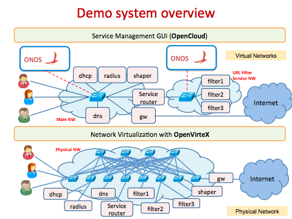
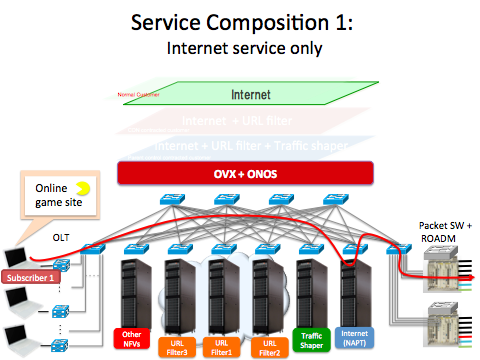
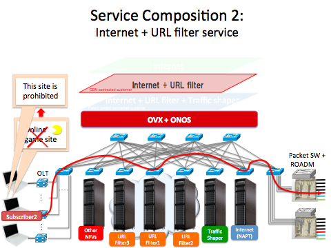
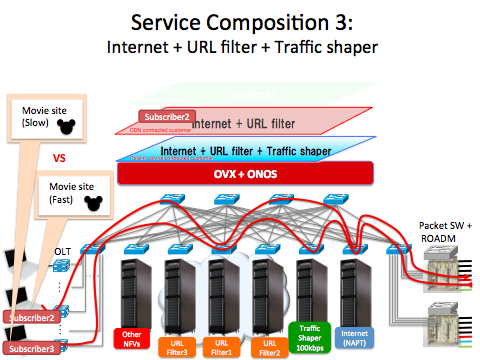
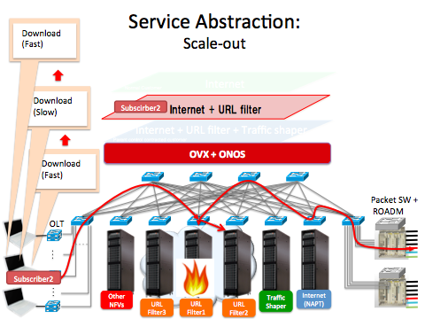

# Demo scenario

The above shows the system architecture overview for this demo. On the bottom, we have the physical topology. This topology is emulated using Mininet on a bare metal server, and virtualized using OpenVirteX (OVX). OVX virtualizes the physical network to makes 2 virtual networks, the main network (left) and the URL Filter service network (right). Each virtual network is managed by its own ONOS cluster. We deploy a management GUI, a part of OpenCloud, on top of the virtual networks to manage subscribers and services.

We will first show a minimal service composition example. This composition contains the Internet connectivity service by itself. At first, subscriber1, who is not subscribed to this service, cannot access any sites from its browser. The management GUI can be used to assign subscriber1 to the Internet connectivity service. This operation causes ONOS to push flows into the network using the Intent framework, enabling subscriber1 to access the Internet.

As a second example, we will show the service composition of Internet + URL filter service. From GUI, we will assign Internet + URL filter service to subscriber2. At first, subscriber2 has no connectivity because of the lack of service composition. From the management GUI, we will add the internet and URL filter services to subscriber2's subscription. This causes the proper service composition flows to be pushed to allow subscriber2 to access the Internet via the URL filter service. Now when subscriber2 tries to access some online game site, the URL filter will redirect his access to an error page due to the filter service detecting the URL found in its blacklist, and redirecting the request to an error page.

Next, we will show a third, more complex service composition case of Internet + URL fitler + traffice shaper. Now we assign this service composition to subscriber3, allowing subscriber3 to access to the Internet, but at a slower speed. Meanwhile, subscriber2 is able to access the Internet at full speed, as their composition does not include the traffic shaper service. For example, subscriber2 will be able to access YouTube and watch some video smoothly. When accessing the exact same video,  subscriber3 will find that the video loads slowly on their browser due to the traffic shaper service limiting their bandwidth.

Finally, we will show an example of service abstraction. Specifically, we want to show you the scale out of the URL filter service. This example begins with subscriber2, still subscribed to the service composition from the second example, downloading some big file from the Internet. The initial download speed is pretty fast. Introducing a heavy load on the filter server causes throughput degradations, slowing down the download speed. From the management GUI, we push the scale out button, which spawns a VM and push flows to incorporate it into the service network. This action results in the recovery of download speeds to the same level as before.
