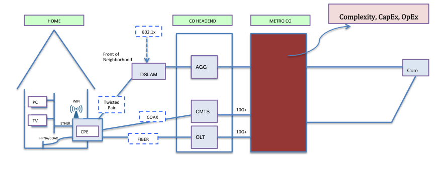
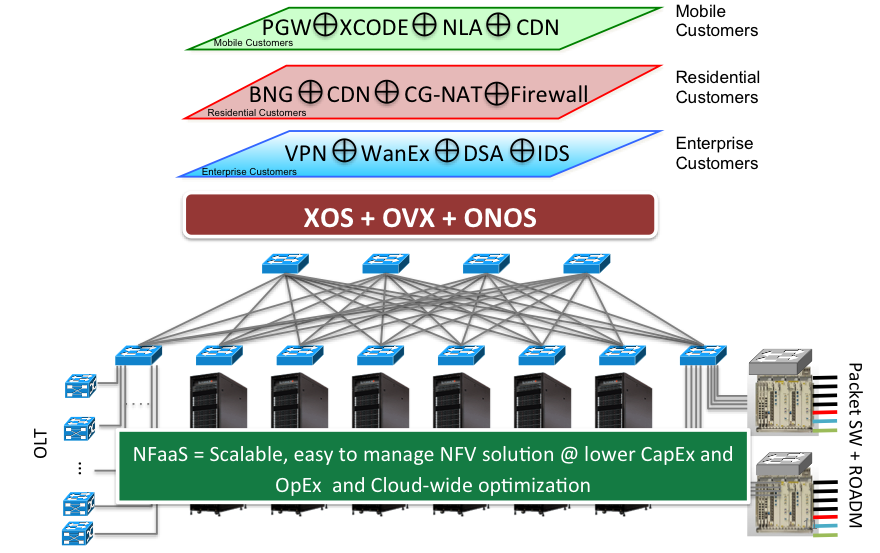

# NFaaS central office application

This section describes NFaaS example application for a central office (CO).

## Overview

This demo attempts to answer the following question: *What will happen if NFaaS is brought into a service provider's network?*

A hypothetical legacy CO is shown in the following figure:

Today’s service provider’s central office is typically comprised of multiple networks and a variety of specialized hardware, each with their own management methods that aggravates OpEx. Having large numbers of specialized equipment is also a major source of CapEx. Worse yet,  these networks' features are coupled to the types of hardware present, making the implementation and deployment of new services a slow process.

Employing NFaaS brings about several benefits to this central office:

* **Simplified architecture -** specialized middleboxes are replaced with commodity hardware i.e. uniform infrastructure.
* **Reduced CapEx** - the number of expensive, specialized components are replaced by commodity hardware and open source software.
* **Decreased OpEx -** through automation
* **Flexibility -** through infrastructure virtualization and the ability to manage functions at the service level

The following diagram shows an example implementation of a CO employing NFaaS:

**

This CO provides three service composed of various service primitives, each customized for different classes of customer. The service provider of this CO can easily assign these services to various subscribers, or scale them out based on demand through the XOS Service Management GUI.

---

[Return To : NFV (NFaaS)](../nfv-nfaas.md)  
[Home : ONOS Use Cases](../../../apps-and-use-cases.md)

---
