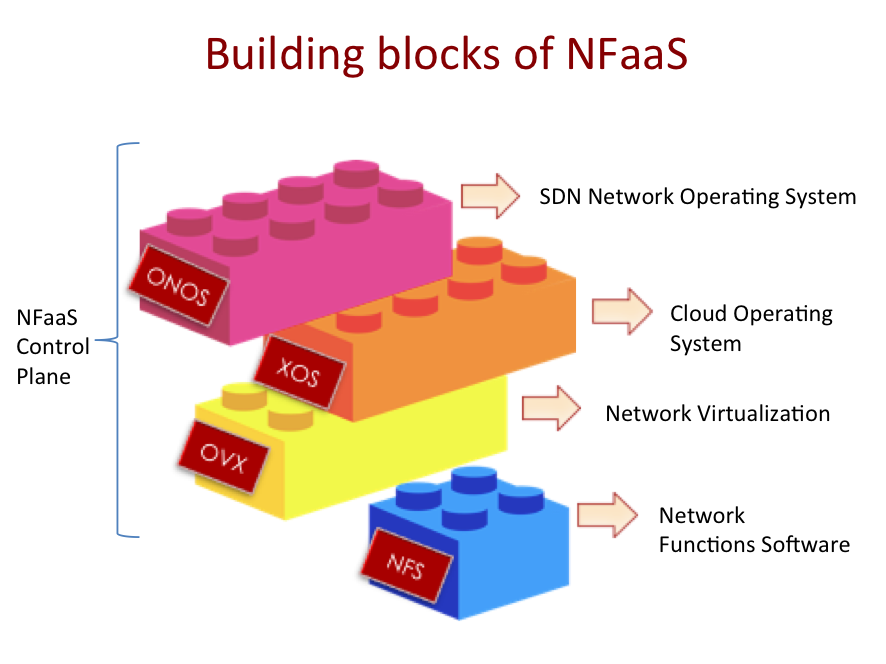
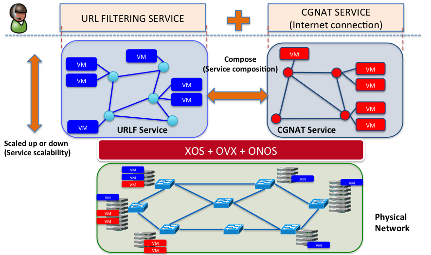

# NFV Architecture

This section describes the architecture of NFaaS.

## Service components

Functionally, a NFaaS service has two main components:

* **service controller -** The service controller is responsible for management and orchestration of a service network. It instantiates VMs and pushes network flows to interconnect them. It also watches for events and change the state of its virtual network based on its observations.
* **service network -** Each NFaaS service is a dedicated network of multiple VMs. The networks may be physical or virtual. Each service network is controlled by a service controller.

The NFaaS architecture can be spoken in terms of building blocks that cooperate to produce these two functions per service.

## NFaaS components

NFaaS is composed of 4 major blocks, each a providing the various functionalities required to provide and manage services. The figure below serves as a summary:

The four components, and their functions are:

* **ONOS**  
  ONOS provides the SDN network controller functionality of installing network flows to logically interconnect VMs across the network. Specifically, ONOS programs the traffic forwarding behavior of a service network. While any SDN controller may be used for this purpose, ONOS’s high availability, performance, and scale-out properties are suited for the central office environment, making it the choice for this use case.
* **OpenCloud/XaaS OS(XOS)**  
  [OpenCloud](http://opencloud.us) is a cloud platform that leverages various open source components, with emphasis on OpenStack for VM manipulation. XOS is the means to orchestrate the components within OpenCloud. OpenCloud provides the VM/function instantiation aspects of a service controller, as well as a GUI from which NFaaS services are manipulated.
* **OpenVirteX (OVX)**[OVX](http://ovx.onlab.us/) is a network hypervisor capable of virtualizing a physical network into multiple, fully-programmable, self-contained virtual networks that can be dynamically reconfigured on the fly. OVX provides network virtualization functionality needed for the instantiation of service networks.
* **Network Function Software (NFS)**  
  This is a general term for the various network functions and software running in the VMs manipulated as services in NFaaS.

Factoring in these platforms and the physical infrastructure that they run on produces the following schematic (showing two NFaaS services composed together):

---

[Return To : NFV (NFaaS)](../nfv-nfaas.md)  
[Home : ONOS Use Cases](../../../apps-and-use-cases.md)

---
