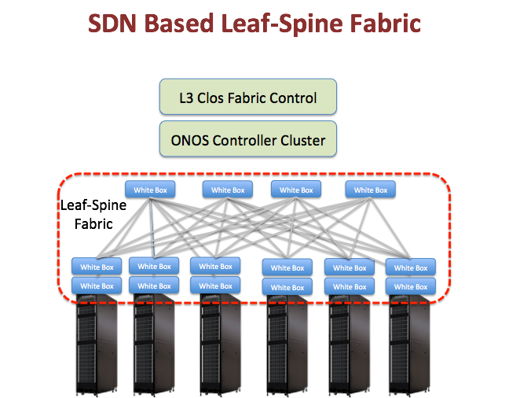

# CORD: Leaf-Spine Fabric with Segment Routing

If you are interested in the use of the fabric in CORD, visit the latest CORD documentation here: <https://wiki.opencord.org/display/CORD/Underlay+Fabric>

If you are interested in generic use of the fabric, visit the Atrium documentation here: <https://github.com/onfsdn/atrium-docs/wiki/ONOS-Based-Atrium-Leaf-Spine-Fabric-16A>

# Overview

This is the project page for the demonstration of a CORD leaf-spine fabric at ONS 2015. CORD stands for Central Office Reimagined as a Datacenter. This page includes information about one of the three use cases under the CORD umbrella. The other two use cases are called [vCPE-vOLT and NFaaS](cord-central-office-re-architected-as-a-datacenter/cord-central-offices-re-architected-as-datacenters-vcpe-volt-nfaas.md)

# Project Management

Issues for this project can be tracked on [Jira](https://jira.onosproject.org/secure/RapidBoard.jspa?rapidView=1&view=planning&selectedIssue=ONOS-1506&versions=visible&epics=visible) under the Epics - 'AT&T Central Office Fabric - ONS Demo' and 'Segment Routing Porting'. The former tracks the specific demo we are doing for ONS, which includes the leaf-spine topology on Dell switches with automated TE of elephant flows. The latter tracks the generic Segment Routing application which will be used for the fabric, but can also work for other networks with different topologies.

---

[Return To : ONOS Use Cases](../apps-and-use-cases.md)

---

The following demo happened at ONS 2015.

 

Project Members 

| Name | Organization | Role | Email |
| --- | --- | --- | --- |
| Tom Anschutz | AT&T | Project Lead | [ta2269@att.com](mailto:ta2269@att.com) |
| Saurav Das | ONF | Technical Lead | [saurav.das@opennetworking.org](mailto:saurav.das@opennetworking.org) |
| Simon Hunt | ON.Lab | Technical Team | [simon@onlab.us](mailto:simon@onlab.us) |
| Sangho Shin | ON.Lab | Technical Team | [sangho@onlab.us](mailto:sangho@onlab.us) |
| Bill Rembert | AT&T | Technical Team | [br6509@att.com](mailto:br6509@att.com) |
| Srikanth Vavilapalli | Ericsson (ON.Lab partner) | Technical Team | [srikanthvavila@gmail.com](mailto:srikanthvavila@gmail.com) |
| Charles Min-Cheng Chan | ON.Lab | Technical Team | [charles@onlab.us](mailto:charles@onlab.us) |
| Flavio Castro | ON.Lab | Technical Team | flavio@onlab.us |
