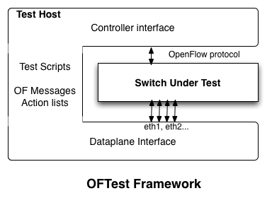

# [Archived] Hardware Conformance OpenFlow Test

Deprecated

This page is deprecated and may be removed in a near future.  
The new entry point of Trellis underlay fabric installation guide can be found at [Fabric Test Guide](https://wiki.opencord.org/display/CORD/Fabric+Test+Guide).

# OpenFlow Conformance Test

In order to guarantee conformance of the switches we created few test cases using the OFTEST framework.

The OFTEST code can be fetched by

```
git clone https://gerrit.opencord.org/fabric-oftest
```

In this document we describe how you can setup your own testbed as well as describe the test cases implemented.

## OFTEST Overview

The oftest framework consists of a test server connected to a target switch through an OpenFlow channel and directly to the dataplane ports of the OFswitch. After programming the switch, oftest inserts packets in the dataplane and verifies if the output is as expected.



We recommend using a server connected to a management network, a switch connected to the same management network, and then a minimum of 2 ports directly connected between the server and the switch. A few tests will fail if you have less than 3 ports.

## OFTEST Installation guide

To install OFTEST on ubuntu, type the following:

```
$ sudo apt-get install python python-pip python-dev python-lxml libffi-dev libssl-dev -y
$ sudo pip install cryptography
$ sudo pip install ncclient
$ sudo pip install scapy pycrypto
$ sudo apt-get install python-ecdsa git
$ git clone https://gerrit.opencord.org/fabric-oftest
```

Now let's configure the switch and point it to the testserver. Notice that we are pointing to port 6653 rather than 6633.

```
# cd /usr/bin/ofdpa-i.12.1.1/examples/
# ./client_cfg_purge
# brcm-indigo-ofdpa-ofagent -t 10.128.0.210:6653
```

Now, assuming that you plugged the ports 12 and 24 of the switch to interfaces eth1 and eth2 of the server, respectively, then the following command can tell you if everything is working.

```
$ cd oftest
$ sudo ./oft -V1.3 --test-dir=ofdpa flows.PacketInArp -i 12@eth1 -i 24@eth2
WARNING: No route found for IPv6 destination :: (no default route?)
flows.PacketInArp ... ok
----------------------------------------------------------------------
Ran 1 test in 4.044s
OK
```

## Segment Routing Tests

 The command below should give you the following result:

```
$ sudo ./oft -V1.3 --test-dir=ofdpa flows -i 12@eth1 -i 24@eth2
flows.ArpNL2 ... FAIL
flows.L2FloodQinQ ... ok
flows.L2FloodTagged ... ok
flows.L2FloodTaggedUnknownSrc ... ok
flows.L2UnicastTagged ... ok
flows.L3McastToL2 ... FAIL
flows.L3McastToL3 ... FAIL
flows.L3McastToVPN ... FAIL
flows.L3UcastTagged ... ok
flows.L3VPNMPLS ... ok
flows.L3VPN_32 ... FAIL
flows.MPLSBUG ... ok
flows.MplsTermination ... FAIL
flows.Mtu1500 ... ok
flows.Mtu4000 ... ERROR
flows.PacketInArp ... ok
flows.PacketInSrcMacMiss ... FAIL
flows.PacketInUDP ... ok
```

For example, in this case, all the multicast failed because we don't have three ports, the test L3VPN failed as well, and that is a bug of the current build. The PacketInSrcMac Miss failed because Mac learning is not enabled.

Oftest can't successfully delete all groups using an OF message, because of that some tests interfere with others. If the results seem suspicious, erase the flowtables and group tables and run the test alone.

### Baseline results from OFTEST

New releases of the ofdpa software come out reasonably fast, in order to be able to test multiple software versions we use different branches for each version.   
The version used by the cord project is i12\_1.7 and it's the most stable one up to date.

Full test results can be found in the README file in the [repository](https://github.com/opencord/fabric-oftest).

# How to test a new switch

* Install OFTEST
* Run PacketIn test to make sure ports are properly connected.
* Run baseline test and create a new branch
* Update the OFDPA software
* Run/fix  OF test until it's stable
* Document changes and at the wikipage or JIRA
