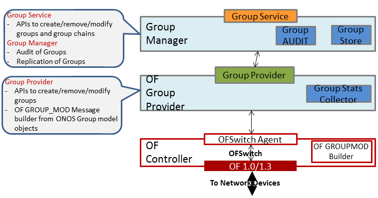
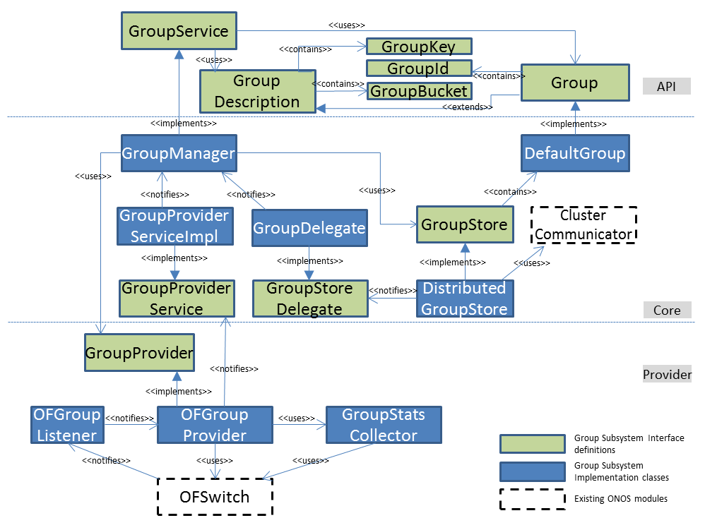
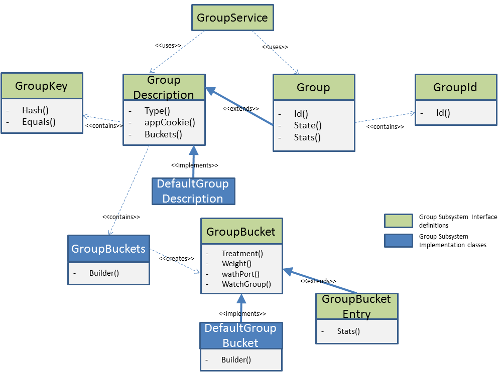
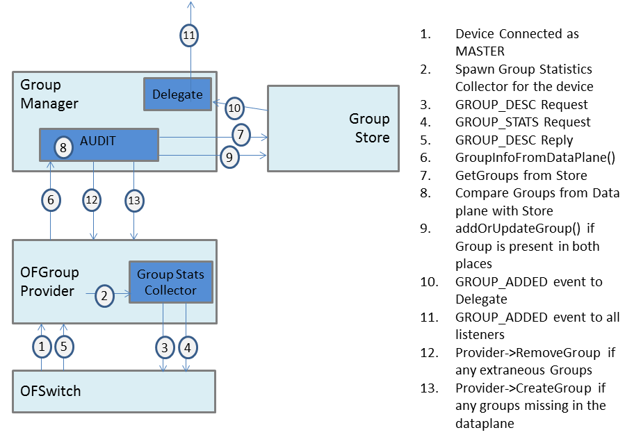
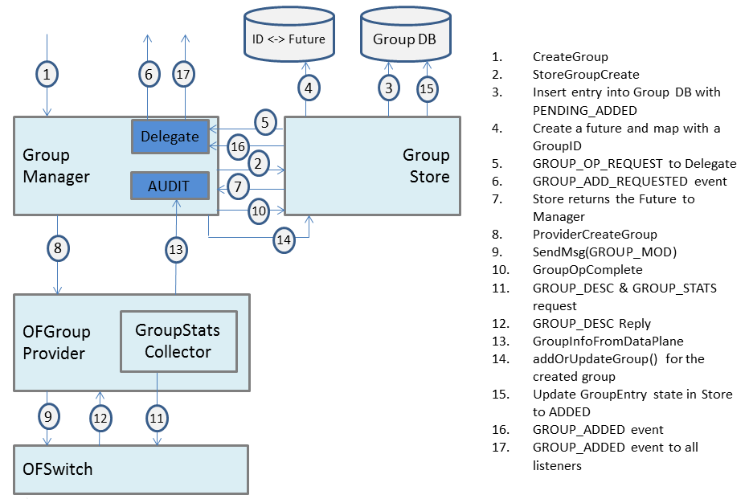
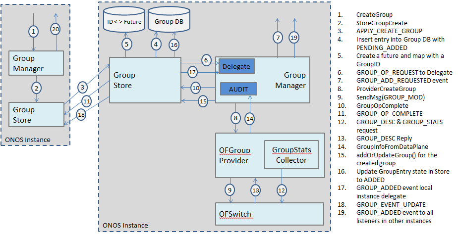
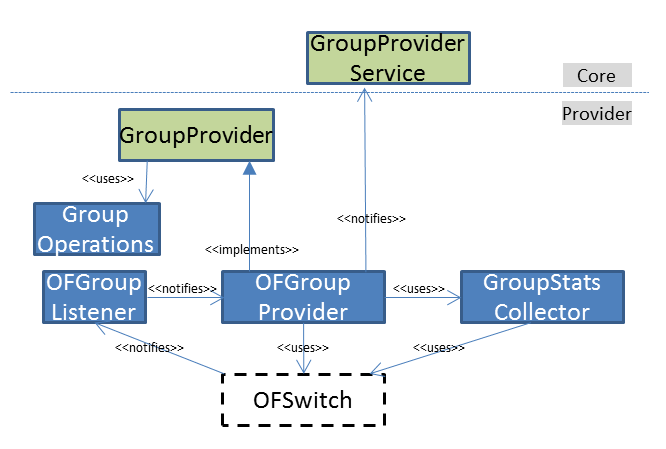

# Group Subsystem

## Design Decisions:

* Group Identifier will be represented as a simple Integer. Will be revisited at a later point of time to see if it needs to be aligned with PortNumber representation
* Group objects for a device will only be created/updated/removed by current Master controller instance.
* So as, the Group Identifier allocation/management also will only be done by current Master controller instance.
* Replication:
  + Alternative1: Groups for a device are only replicated in the Master controller instance and another potential candidate instance.
  + Alternative2: Since typically the number Groups per device will not be huge, Groups are replicated in all the instances of the cluster
  + Resolution: Though the Groups are created only by Master controller instance, they may typically be required/used by all controller instances in the cluster. So it is recommended to replicate the Group database in all the instances of the cluster.
* Consistency & Durability:
  + Eventual consistency or Strong consistency for Group Objects?
  + Do we need durability?
  + Resolution: Eventual consistency seems to be sufficient for Group store. Durability is not needed.
* Group creation/update/removal/query request can be submitted in any controller instance and that instance will take care of routing the request to current Master controller instance.
* Group creation API does not return any Group object as in some scenarios the request needs to be routed to Master controller instance where the Group object gets created. Application should use Group Query API to retrieve the Group object after creation.
* Group query API blocks the caller thread until it retrieves from the remote Master controller instance if the instance where request is submitted is not having the control over that device
* Group query API returns the Group object even if the Group object is in PENDING\_ADD state
* Group subsystem generates GROUP\_ADDED event only after it receives confirmation from Data plane through Barrier Reply or Group Description Reply (In the first phase, it will be based on Group Description Reply)
* Authoritativeness:
  + Group store has full authority of groups in the device.
  + Group store will wipe off any extraneous groups in a device if found during AUDIT. That means creation of groups bypassing the Group store or any default groups existing in a device can not be supported
* Group Key
  + As part of the Group operations, Group subsystem accepts a cookie from the applications in the form of a GroupKey. This is to facilitate applications to query the Group sub system based on cookie instead of Group Identifier.

## Group Subsystem Design:

High level layout of Group subsystem components is depicted below.



### Class Diagram



### Group Service

* Provides the following API to applications

  + **Group Service APIs**

    ```
    /**
     * Service for create/update/delete "group" in the devices.
     * Flow entries can point to a "group" defined in the devices that enables
     * to represent additional methods of forwarding like load-balancing or
     * failover among different group of ports or multicast to all ports
     * specified in a group.
     * "group" can also be used for grouping common actions of different flows,
     * so that in some scenarios only one group entry required to be modified
     * for all the referencing flow entries instead of modifying all of them
     *
     * This implements semantics of a distributed authoritative group store
     * where the master copy of the groups lies with the controller and
     * the devices hold only the 'cached' copy.
     */
    public interface GroupService {
        /**
         * Create a group in the specified device with the provided buckets.
         * This API provides an option for application to associate a cookie
         * while creating a group, so that applications can look-up the
         * groups based on the cookies. These Groups will be retained by
         * the core system and re-applied if any groups found missing in the
         * device when it reconnects. This API would immediately return after
         * submitting the request locally or to a remote Master controller
         * instance. As a response to this API invocation, GROUP_ADDED or
         * GROUP_ADD_FAILED notifications would be provided along with cookie
         * depending on the result of the operation on the device in the
         * data plane. The caller may also use "getGroup" API to get the
         * Group object created as part of this request.
         *
         * @param groupDesc group creation parameters
         *
         */
        void addGroup(GroupDescription groupDesc);
        /**
         * Return a group object associated to an application cookie.
         *
         * NOTE1: The presence of group object in the system does not
         * guarantee that the "group" is actually created in device.
         * GROUP_ADDED notification would confirm the creation of
         * this group in data plane
         *
         * @param deviceId device identifier
         * @param appCookie application cookie to be used for lookup
         *
         * @return group associated with the application cookie or
         *               NULL if Group is not found for the provided cookie
         */
        Group getGroup(DeviceId deviceId, GroupKey appCookie);
        /**
         * Append buckets to existing group. The caller can optionally
         * associate a new cookie during this updation. GROUP_UPDATED or
         * GROUP_UPDATE_FAILED notifications would be provided along with
         * cookie depending on the result of the operation on the device
         *
         * @param deviceId device identifier
         * @param oldCookie cookie to be used to retrieve the existing group
         * @param buckets immutable list of group bucket to be added
         * @param newCookie immutable cookie to be used post update operation
         * @param appId Application Id
         */
        void addBucketsToGroup(DeviceId deviceId,
                               GroupKey oldCookie,
                               GroupBuckets buckets,
                               GroupKey newCookie,
                               ApplicationId appId);
        /**
         * Remove buckets from existing group. The caller can optionally
         * associate a new cookie during this updation. GROUP_UPDATED or
         * GROUP_UPDATE_FAILED notifications would be provided along with
         * cookie depending on the result of the operation on the device
         *
         * @param deviceId device identifier
         * @param oldCookie cookie to be used to retrieve the existing group
         * @param buckets immutable list of group bucket to be removed
         * @param newCookie immutable cookie to be used post update operation
         * @param appId Application Id
         */
        void removeBucketsFromGroup(Device deviceId,
                                    GroupKey oldCookie,
                                    GroupBuckets buckets,
                                    GroupKey newCookie,
                                    ApplicationId appId);
        /**
         * Delete a group associated to an application cookie.
         * GROUP_DELETED or GROUP_DELETE_FAILED notifications would be
         * provided along with cookie depending on the result of the
         * operation on the device
         *
         * @param deviceId device identifier
         * @param appCookie application cookie to be used for lookup
         * @param appId Application Id
         */
        void removeGroup(Device deviceId, GroupKey appCookie, ApplicationId appId);
        /**
         * Retrieve all groups created by an application in the specified device
         * as seen by current controller instance.
         *
         * @param deviceId device identifier
         * @param appId application id
         *
         * @return collection of immutable group objects created by the application
         */
        Iterable<Group> getGroups(Device deviceId, ApplicationId appId);
        /**
         * Adds the specified group listener.
         *
         * @param listener group listener
         */
        void addListener(GroupListener listener);
        /**
         * Removes the specified group listener.
         *
         * @param listener group listener
         */
        void removeListener(GroupListener listener);
    }
    ```
* DataModel

  

  + Group Types to be supported

    - Select
    - Indirect
    - All
    - Failover
  + Key

    - An application specific cookie that supports Hash and Equals method
  + Id

    - Integer
  + Bucket

    - One or more collection of Traffic Instructions

**How to create and use Group** Expand source

```
{
    List<GroupBucket> buckets = new ArrayList<GroupBucket>();
	List<PortNumber> outPorts = getPortsToDevice(srcDevice, neighborDevice);

    for (PortNumber portNumber: outPorts) {
        TrafficTreatment.Builder tBuilder = DefaultTrafficTreatment.builder();
        tBuilder.setOutput(portNumber)
                .setEthDst(getRouterMacAddress(neighborDevice))
                .setEthSrc(getRouterMacAddress(srcDevice))
                .pushMpls()
                .setMpls(getMplsId(finalDstDevice));
        buckets.add(GroupBucket.createSelectGroupBucket(tBuilder.build()));
    }
    GroupBuckets groupBuckets = new GroupBuckets(buckets);
	GroupKey groupKey = SegmentRoutingGroupKey.build(srcDevice, Collection<NeighborDevice>, dstDevice);
 
	GroupDescription groupDesc = new DefaultGroupDescription(srcDevice, Group.Type.SELECT,
            groupBuckets, groupKey, getAppId())
    groupService.addGroup(groupDesc);
}
 
public void SetIpRule() {
....
	GroupKey gorupKey = SegmentRoutingGroupKey.build(srcDevice, Collection<NeighborDevice>, dstDevice);
	Group group = groupService.getGroup(srcDevice, groupKey);
	tbuilder.setGroup(group.id().id());
....
 
}
```

### Group Manager

This component implements the Group Service interface by defining Group create/modify/remove/query operations on devices.

If the Master for the device is local instance, then the operations are performed locally. If the device is not under the current controller instance, this component send GROUP\_ADD\_REQUEST to the master controller instance of that device.

Maintains monotonically increasing Group ID number space for each device that will be incremented every time a new group is created.

Creates the groups only if the device doesn’t have those groups populated. If group already exists, the create APIs doesn't perform any operation.

#### Group AUDIT

As shown in the below figure, Group Manager perform a AUDIT whenever a device connects to current controller instance as Master. During the Group AUDIT, no group operations can be supported.



#### Group Store

Group Store handles the distribution functionality of Group subsystem. Based on the design decision, the Group Store replicates the Groups to either all instances or to a subset of instances. Similarly based on the consistency and durability needs, the type of the data store to be used for Group store would be determined.

Group Store will have authoritative role. i.e. When a Device is connected to the controller as a Master, Group Store will wipe off all extraneous groups in the device and inserts if any groups are missing.

High level flow of events in the Group subsystem is depicted below when an operation like CreateGroup is submitted by the application.



High level flow of events in the Group subsystem is depicted below when an operation like CreateGroup is submitted by the application to non-Master controller instance in a multi-instance environment.



### Group Provider

* Provides SB APIs towards core

  + **Group Provider SB API**

    ```
    /**
     * Abstraction of group provider.
     */
    public interface GroupProvider extends Provider {
        /**
         * Perform a group operation in the specified device with the
         * specified parameters.
         *
         * @param deviceId device identifier on which the batch of group
         * operations to be executed
         * @param groupOps immutable list of group operation
         */
        void performGroupOperation(DeviceId deviceId,
                                   GroupOperations groupOps);
    }
    ```
  + **Group Provider Notifications to Northbound**

    ```
    /**
     * Service through which Group providers can inject information into
     * the core.
     */
    public interface GroupProviderService extends ProviderService<GroupProvider> {
        /**
         * Notifies core if any failure from data plane during group operations.
         *
         * @param operation offended group operation
         */
        void groupOperationFailed(GroupOperation operation);


        /**
         * Pushes the collection of group detected in the data plane along
         * with statistics.
         *
         * @param deviceId device identifier
         * @param groupEntries collection of group entries as seen in data plane
         */
        void pushGroupMetrics(DeviceId deviceId,
                           Collection<Group> groupEntries);
    }
    ```

### OF Group Provider

* Implements Group Providers interface
* Add listeners to OpenFlowController for any events
* On DeviceConnected event, spawn a Group statistics collector per device that retrieves the Group descriptions and Group statistics
* On receiving GROUP\_DESC or STATS\_REPLY for GROUPS, pass them to GroupStatsCollector module to combine them into a single notification event to be notified to core
* Builds Open Flow GROUP\_MOD (ADD/MOD/DELETE) Message depending on the group operation invocation and writes the message to switch driver
* On GROUP\_MOD failures, notifies the core with the correction Group operation information. To achieve this, OF Group Provider maintain a map of Open flow transaction Id and associated GroupOperation that was submitted from core. On receiving GROUP\_DESC with the corresponding GroupId or receiving GROUP\_MOD failed with the transaction Id, OF Group Provider should clear the map and notifies the core accordingly.

#### Class Diagram



### OF Switch Driver

* No changes

##
