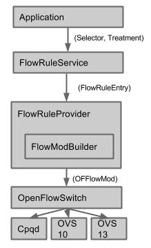
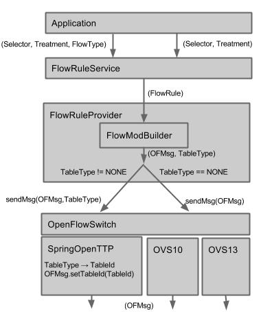
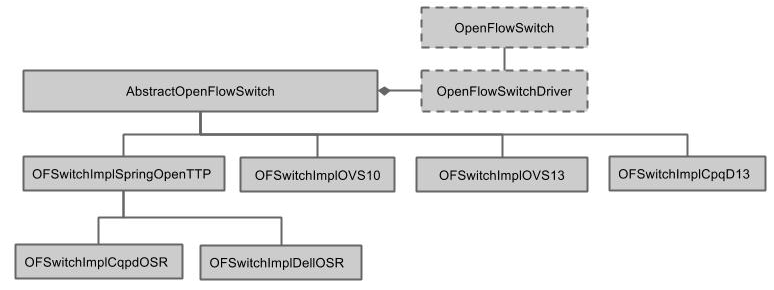

# Multi-Table aware FlowRuleService subsystem

## Multiple Table aware FlowRuleService subsystem:

* ### Limitations

+ Table pipeline is different among different vendors
+ Different table Ids are used in different vendors

* ### Requirements

+ GoToTable action needs to set by the driver (protocol provider)
+ Table Id needs to specified by the driver (protocol provider)



                [ Current architecture ]

* ### Issues of curent FlowRuleService

+ FlowRuleProvider does not know in which table it needs to put rules.

- For example, Acl rules need to be put in ACL table and IP rules need to be put in the IP table, but Selector does not have have such information.

+ FlowRuleProvider creates the OF message using FlowModBuilder, but it is not aware of pipeline system of the corresponding switches.

- It cannot specify the correct table Id or GoToTable instruction.



                             [ Modified architecture ]

* ### FlowRuleService subsystem

+ A new type field (DEFAULT, IP, MPLS, ACL) is introduced in FlowRule interface and used to determine in which table the flow rule needs to be set
+ The flow rule type filed is converted to TableType (NONE, IP, MPLS, ACL) of OpenFlowSwitch in the FlowRuleProvider. NONE corresponds to DEFAULT flow rule type and is used for single table switch.
+ sendMsg(OFMsg, TableType) function is newly introduced for multi-table aware switch and needs to be override by the switch driver if multi-table feature needs to be supported.
+ The TableType is converted to the switch vendor specific TableId and set it to the OFMsg in the switch driver.
+ The figure in below is the more detailed version of the OpenFlowSwitch subsystem



                       [ Class Hierarchy of OpenFlowSwitch  and FlowModBuilder classes]

* ### Interfaces

+ new classes

- ```
  OFSwitchImplSpringOpenTTP extends AbstractOpenFlowSwitch
  ```

* + new methods

    - ```
      FlowRuleType type() in FlowRule interface
      ```
    - ```
      void sendMsg(OFMessage, TableType) in interface OpenFlowSwitch 
      ```

* ```
  class TrafficTreatment.Builder
  ```

  + ```
    Builder decNwTtl()
    ```
  + ```
    Builder decMplsTtl()
    ```
  + ```
    Builder copyTtlOut()
    ```
  + ```
    Builder copyTtlIn()
    ```
  + ```
    Builder popMpls(ProtocolType)
    ```
  + ```
    Builder setGroup(GroupId)
    ```
