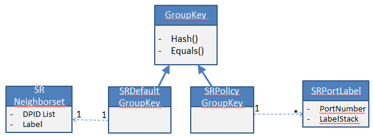
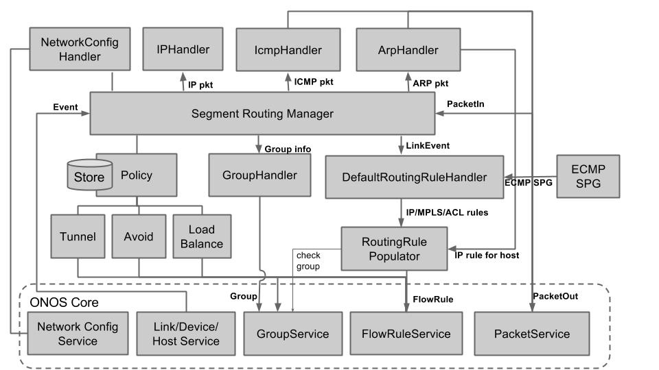

# Segment Routing Application Design

## Segment Routing Group Handling:

### SR GroupKey data model

Segment Routing application interacts with the Group subsystem using the below SR specific GroupKey. SR application associate a SRDefaultGroupKey or SRPolicyGroupKey for every group it creates. The SRDefaultGroupKey is just a collection of Neighbors + the single label to be pushed in all the buckets of the group. The SRPolicyGroupKey consists of collection of <PortNumber + Label Stack to be pushed on that port> where leftmost label representing the outermost label and rightmost label representing innermost label to be pushed.

 

For e.g. a default ECMP group with two buckets pushing label L1 and output to two ports P1 and P2 where neighbor N2 is connected through P1 and N3 is connected through P2. The GroupKey for such a group will be represented with a SRDefaultGroupKey {{N2, N3}, L1}. 

### Default Group Handling and Recovery

For every new device detected where the current controller instance is a MASTER (Either first time device connected or MASTER-SHIP changes), the SR application would initiate default group handling procedures for that device.

* @Activation  
  + Get the Segment IDs of all devices in the network from Network Config service
  + Get "isEdgeRouter" attribute for this device from Network Config service
  + Create Neighbor <-> Port mapping database based on current topology
  + Create Port <-> Neighbor mapping database based on current topology
  + If AUDIT is in progress at Group subsystem for this device
    - Start a timer and perform the Sanity check
  + Sanity Check
    - Compute power set of all Neighbors
    - Pair them with all applicable Segment IDs if the current device is a edge router
    - Determine the SRDefaultGroupKeys for each pair and create groups using Group service API if there is no group existing with this Key
* @LINK\_UP involving one of device ports
  + Find the Neighbor Device ID
  + If (Neighbor is already present in the database for this device)
    - That means this new link is part of group of links to that Neighbor (e.g. LAG)
    - Determine all SRDefaultGroupKeys that are impacted due to this new link from the information of Port <-> Neighbor & Neighbor <-> Port databases and Segment IDs
    - Invoke "addBucketsToGroup()" API of the GroupService for all the impacted Groups with no change in SRDefaultGroupKey (Because there is no new neighbor discovered)
    - Update Neighbor <-> Port mapping database
    - Update Port <-> Neighbor mapping database
  + Else  
    - That means this new link discovers a new neighbor
    - Update Neighbor <-> Port mapping database
    - Update Port <-> Neighbor mapping database
    - Recompute neighbor power sets with updated neighbor database and determine the delta entries and pair them up with applicable segment IDs
    - Determine the SRDefaultGroupKeys for each pair
    - If there is an existing group with that SRDefaultGroupKey, invoke "addBucketsToGroup()" API of the GroupService for all the impacted Groups with no change in SRDefaultGroupKey
    - Else create a new groups using Group service API with this Key.
* @PORT\_UP  
  + No Action
* @PORT\_DOWN  
  + Determine all SRDefaultGroupKeys that are impacted due to this PORT\_DOWN event from the information of Port <-> Neighbor & Neighbor <-> Port databases and Segment IDs
  + Invoke "removeBucketsFromGroup()" API of the GroupService with a new SRDefaultGroupKey for all the impacted Groups
  + Update Neighbor <-> Port mapping database.
  + Remove entry from Port <-> Neighbor mapping database

 

### Policy Group Handling and Recovery

A Segment Routing Tunnel maps to one or more of {Device, Collection of {forwarding port, Label Stack to be applied on the port}}. Only in Segment Stitching scenario, there can be more than one device a Tunnel maps to, in all other scenarios, Tunnel info always pushed only to ingress router.

While pushing a flow into a Segment stitched tunnel, ensure the flows are pushed to stitched routers before pushing the tunnel flows at ingress router.

Similarly, while deleting a flow to the stitched tunnel, ensure the flows are deleted at ingress router before deleting from any stitched routers.

 

Group Event Handling

## Overall Segment Routing Application

