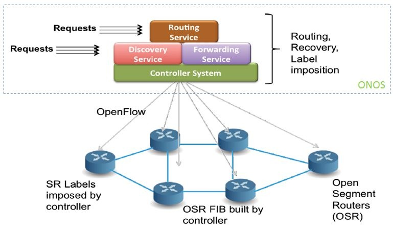
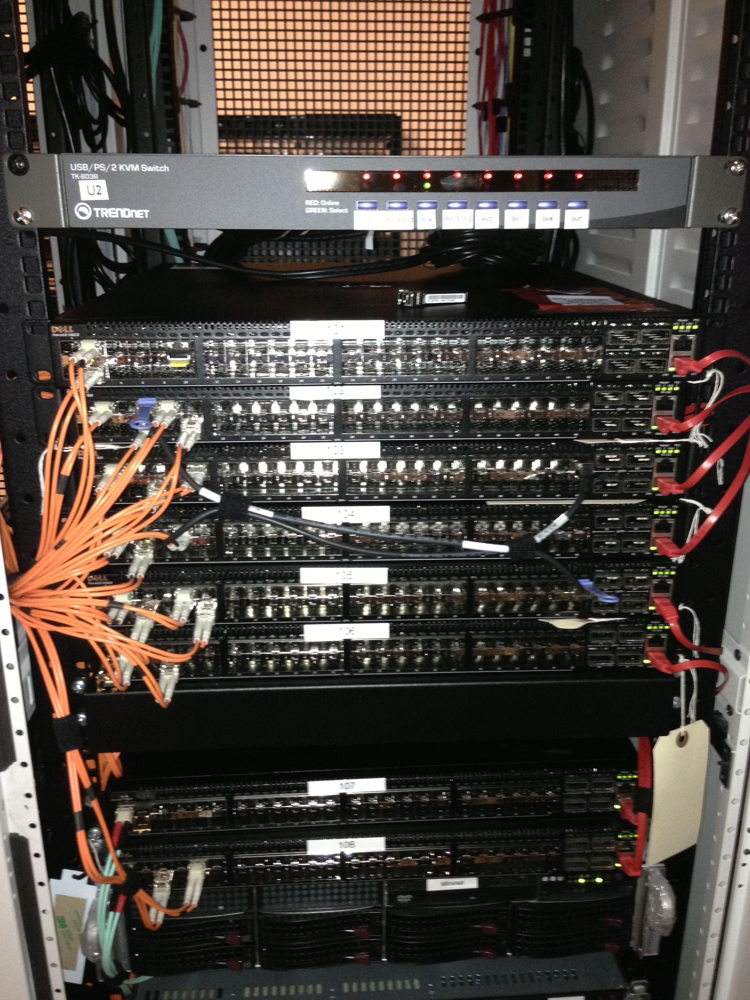

# Project Description

# 

# Introduction

This ONOS use-case has been developed as part of the collaboration in ONF's **SPRING-OPEN** project. For an overview of the project, its goals and motivation, see [here](https://www.youtube.com/watch?v=NDtFpIOKG2k&list=UUTQaOpqno48GTimdwyfytFw).

The Segment Routing application, developed on top of the ONOS controller, provides SDN based control of an island of Open Segment Routers (OSRs). The OSRs route unicast IPv4 packets with standard MPLS operations that abide by Segment Routing principles of globally-significant labels and source routing. The focus of this use-case is to demonstrate Segment Routing features on existing hardware built on merchant silicon using the most recent, stable version of the OpenFlow protocol.

The Segment Routers in this project have been built by Dell on their 4810 [Open Networking Switches](http://www.dell.com/us/business/p/open-networking-switches/pd) with support of [OpenFlow v1.3.4](https://www.opennetworking.org/sdn-resources/onf-specifications/openflow) and the [SPRING-OPEN hardware abstraction](software-architecture.md).

It is important to understand the Goals and the Non-Goals of the the project. For more details, please refer to the original project writeup: [SPRING OPEN – ONF TAG Project.pdf](../../../../assets/spring-open-onf-tag-project.pdf)

### Project Goals

1. Demonstrate maturity and scale of the ONF work product in hardware readily available today using the latest stable versions of ONF protocols – e.g., OF 1.3.4.
2. Provide feedback to ONF WGs on their work product from an implementation of the chosen networking scenario.
3. Promote adoption by creating a core-kernel that is extensible for value-add towards deployment, interoperability and differentiation.

### Non-Goals

1. It does not aim to create a Generally Available (GA) product. It will not undergo typical product Quality Assurance (QA), nor will it be ready for production or interoperate with other networks and network control planes. Instead the project supports certain elements that help in the ‘productization’ of SDN ideas, like ease-of-configuration, visibility and troubleshooting.
2. The project also does not aim to deliver any specific service like a full-blown bandwidth-managed TE service, a VPN/VPLS/VPWS service, or an NFV service. It however, supports the core capabilities required to build such services (and others) on top.
3. Finally, the project does not aim to exclude the use of other parts, in the data plane as well as the control plane. In the interest of time and limited resources, choices were made for building the system. However such choices are replaceable by other parts, both commercial and open-source, as long as they conform to the requirements.

# What is Segment Routing?

Segment Routing is a relatively new concept introduced by the IETF. It is in the process of being standardized by the SPRING (or Source Packet Routing In Networking) working group.

Segment Routing shares a lot of goals in common with SDN, including the elimination of complex distributed protocols, and the use of source-routing via controllers or head-end routers. In Segment Routing, the source/head-end router imposes an ordered list of segments onto a packet header, where the 'segment' is an identifier with local or global scope. Segment Routing can use either the existing MPLS data plane, or the native IPv6 data plane. In this project, we choose to implement the former. Segment Routing requires no change to the existing MPLS data plane, making it an attractive-candidate for rapid prototyping via available commodity merchant-silicon ASICs and white-box hardware, and enabling network operators to relate to the scenario with high interest.

For more information on Segment Routing, please visit:

<https://datatracker.ietf.org/wg/spring/documents/>

<http://www.slideshare.net/getyourbuildon/segment-routingmplswc-march202013?related=1>

In our solution prototype, the data plane behaves exactly like a Segment Router as defined in the IETF drafts. However, in the control plane our prototype does not use a distributed IGP embedded in the routers. Instead it uses a routing application on ONOS. The application programs the edge-routers and core-routers for forwarding with segment routing rules for default routing. It also programs the edge-routers for policy-based routing. With ONOS providing the control, network operators can express their policy requirements to the controller, and the app together with ONOS implements the policy in the IP/MPLS network.

# How Can I Get Started?

The [Prototype and Demo Videos](prototype-demo-videos.md)  are a really good place to get started.

You can get hands-on with the Controller, CLI and software switches by using a pre-built VM.  See the [Installation Guide for the Pre-built VM](installation-guide.md) and then follow the [Getting Started Tutorial](user-guide/getting-started-tutorial.md).

Or you could get started with [hardware switches from Dell](installation-guide.md).

# Contributors

This project is a joint collaboration between ONF, ON.Lab and Dell.

**Project Lead:**

* [Saurav Das](http://yuba.stanford.edu/~sd2/sauravdas) (ONF Consultant)

**Controller Team:**

* Saurav Das
* Sangho Shin (ON.Lab Visiting Researcher)
* Srikanth Vavilapalli (ON.Lab Partner - Ericsson)
* Fahad Naeem Khan (ON.Lab intern)

**Dell Team:**

* Balaji Rajagopalan
* Jaiwant Virk
* Naru Ganapathiraman
* Pawan Singal
* Siamak Ghasemian
* Charles Park

**Acknowledgements:**

The project team would like to thank the larger ON.Lab team for help and support at various times during the course of the project, with special thanks to Brian O'Connor, Jono Hart, Luca Prete, Yuta Higuchi, Cody Burkard, Patrick Liu, Shreya Shah, Pavlin Radoslavov, Ali Al-Shabibi, Prajakta Joshi, and Bill Snow.

We would also like to thank Arpit Joshipura and Amit Sanyal at Dell for support with Dell's involvement in the project.

We would also like to thank Dan Pitt and  Rick Bauer at the ONF for their continued encouragement and logistical support.

We thank Dave Ward and Clarence Filsfils from Cisco for their advice.

Finally we thank all the members of the ONF's Technical Advisory Group for envisioning and supporting the project, and the ONF Board for approving it, with special thanks to Albert Greenberg (TAG Chair & ONF Board Member - Microsoft).
