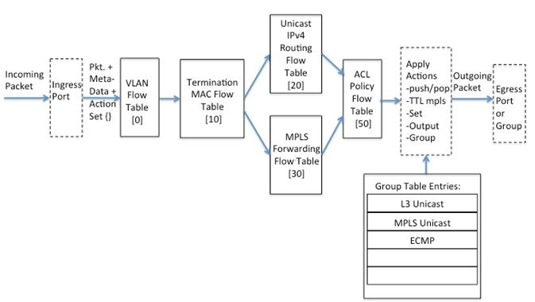
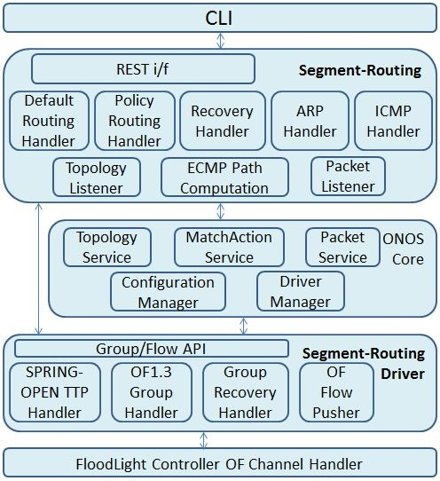
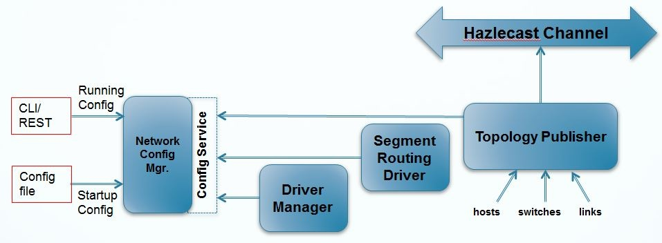
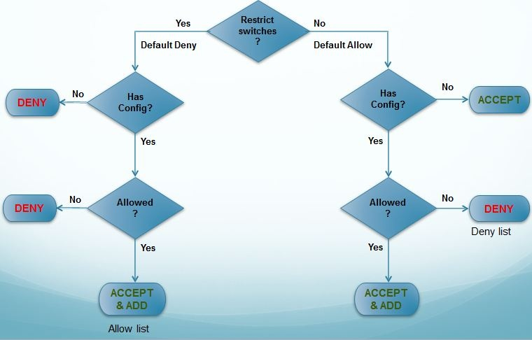
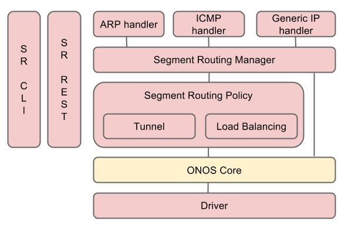
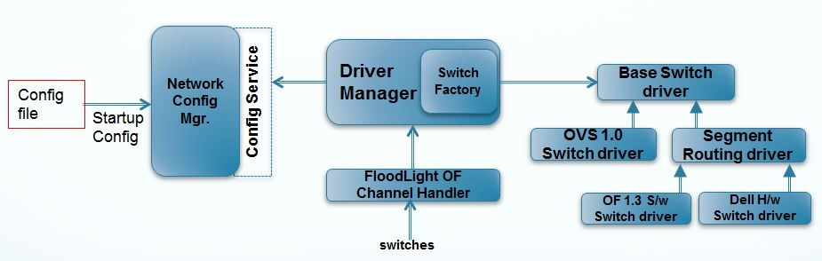

# Software Architecture

# SPRING-OPEN TTP

It is important for the switch and the controller to have the same (abstract) view of the switch-forwarding pipeline. This view is essentially a Table-Typed-Pipeline (TTP), the framework for which is being developed by the Forwarding Abstractions WG at the ONF. The abstract pipeline used for Segment Routing application is illustrated below, and ‘implicitly’ understood by the switch and controller instances.  It is intended that the SPRING-OPEN pipeline, while being table-typed, is still generic enough to be implemented by several different vendor ASICs, on different switch platforms. Under-the-hood, vendors can choose different implementation-specific ways to create and maintain the SPRING-OPEN hardware abstraction.  NOTE: Table IDs depicted in the picture may vary based on the specific switch implementations.

Highlights of the pipeline shown in above figure are as follows:

* The packet enters through a physical ingress port that is included as metadata that can be matched in some of the pipeline tables. There is an Action-set that is associated with each packet as it traverses the tables in the pipeline.  The Segment Routing application will only use Physical OF ports (and not OF Logical ports – see OF spec 1.3.4, sec 4.4)
* The first table (Table 0) is the VLAN flow table. Since the SPRING-OPEN switches need to behave as routers, they should be able to route between VLANs – this routing will be done on the basis of IPv4 addresses, with the VLAN tag (if any) stripped on ingress, and a configured VLAN tag applied (if necessary) on egress. In addition, this table should allow untagged packets.
* The second-table (Table 10) is the Termination MAC flow table which decides if the incoming packet is an IPv4 packet that needs to be routed (in the IPv4 unicast LPM lookup table) or a labeled packet that needs to be forwarded (via the MPLS label lookup table). All packets that do not match either of these cases should be sent to the controller – these include ARP, LLDP and other Ethernet Types.
* The Unicast IPv4 Routing Flow Table (Table 20) is used at ingress and egress of the segment-routed network. In principle they perform the role of LERs, while also routing between connected-subnets. This project will not handle IPv6 routing. Segment routing (or IETF SPRING) does not currently handle IP multicast. Default IPv4 routing using Segment-routing node labels will be performed in this table.
* The MPLS forwarding table (Table 30) is used for single label lookups in transit routers. We will enforce the use of Penultimate Hop Popping (PHP) of segments (labels) network-wide, so that a label pop is not required before an IP lookup in the same router.
* The Policy\_ACL table (Table 50) is used for overriding the decisions made in tables 20 and 30, according to policy determined in the controller. This table is typically not ‘typed’ – it can match on multiple fields in the packet header irrespective of networking layer boundaries.
* Segment routing requires the use of ECMP wherever there are multiple equal-cost paths to the segment-destination. These will be implemented with OF group type ‘select’ for both MPLS and IP packets (i.e at ingress and in transit routers)
* MPLS related actions include pushing/popping labels, setting label-ids and BoS, and related ttl manipulations. Such actions are written into the Action Set (by tables 20 and 30) using WRITE-ACTIONS or into the bucket-actions of ECMP groups. Segment routing requires in some use-cases to push multiple labels at ingress which can be done by chaining of 'Select' and 'Indirect' groups.

For more details see the latest version of the SPRING-OPEN Hardware Abstraction.

# Software Modules

The following figure illustrates the Segment Routing application components, and the relationship among those components

The boxes with bold text represents Segment Routing application modules while rest of the components represent ONOS modules that segment routing application depends on. Segment Routing application exposes two external interfaces: REST and CLI.

# Configuration Manager

A Network Config Manager provides network configuration service and filtering service

* **Configuration Service:** Configuration service handles all network element configuration. For Segment Routing use case, the following network information will be configured through Network Config Manager: Router IP and MAC, Node Segments, Subnets, Filtering policy, etc. The Topology publisher, Driver Manager and Segment Routing Driver modules will use the services provided by Network Config manager while constructing global network view and performing any operations on the network elements as illustrated in below figure. Initially the startup configuration will be file based which can be enhanced to run-time CLI based in later phases.   
  
* **Filtering Service**: Filtering service provides logic to filter the discovered network entities based on the filtering policy as illustrated in below figure.  
    
  

# Segment Routing Application

The following figure describes the architecture of the segment routing application.

* **Segment Routing Manager** - It computes the shortest ECMP path among all routers and populates all routing rules to IP and MPLS table of the switches. Also, it handles all packets to the application and forwards them to appropriate handlers according to the packet type.
* **ARP handler** - It handles ARP request and response packets. If the APR request is to the any managed routers, then it generates and sends out the ARP response to the corresponding hosts.
* **ICMP handler** - It handlers ICMP request to the routers. It generates the ICMP response packet and sends out to the corresponding hosts.
* **Generic IP handler** - It handles any IP packet. If the destination of the IP packet is hosts within subnets of routers, then it set the forwarding rule to the router and sends out the packet to the corresponding hosts. If MAC address of the host is not known, then it sends out APR request to the subnet using ARP handler.
* **Segment Routing Policy** - It creates the policy and set the policy rule to ACL table of routers. If it is the tunnel policy, then it creates the tunnel for the policy. NOTE: Load balancing policy is not implemented yet.

# Segment Routing Driver

As part of Segment Routing application, a driver manager framework is introduced to ONOS core layer to accommodate OF 1.3 switches with different pipelines (TTPs), while still working with OF 1.0 switches as illustrated in below figure. This framework can be extended to customize for a specific switch pipeline, or other attributes unique to a switch platform.

Segment Routing driver provides the following functionality:

## OF 1.3 Group Handler

In order to reduce the latencies during the Segment Routing flow creation, the Segment Routing driver at startup pre-populates the OF 1.3 groups in all the Segment Routers for which this ONOS instance is performing MASTER role. There are two types of groups that Segment Routing driver creates in the switches:

* OF Indirect group (Single bucket group) – It’s main advantage is that when many, many routes (IP dst prefixes) have a Next-Hop that requires the router to send the packet out of the same port with or without same label, it is easier to envelop that port and/or label in an indirect group. Note that these Groups are only created on ports that are connected to other routers (and not an L2 domain). Thus the Dst-MAC is always known to the controller, since it is the router-MAC of another router in the Segment Routing domain. Also Note that this group does NOT push or set VLAN tags, as these groups are meant to be used between routers within the Segment Routing cloud. Since the Segment Routing cloud does not use VLANs, such actions are not needed. This group will contain a single bucket, with the following possible actions:
  + Set Dst MAC address (next hop router-mac address)
  + Set Src MAC address (this router’s router-mac address)
  + At ingress router
    - Push MPLS header with ethtype as IP and mpls label
    - Copy TTL out
    - Decrement MPLS TTL
  + Output to port (connected to another Router)

* OF Select group (ECMP Group) – This is an OF 'Select' Group. It will have one or more buckets, that each point to actions of an Indirect group or point to another group (incase of group chaining). Note that this group definition does NOT distinguish between hashes made on IPv4 packets, and hashes made on packets with an MPLS label stack. It is understood that the switch makes the best hash decision possible with the given information.
  + By default all ports connected to the same neighbor router will be part of the same ECMP group.
  + In addition, ECMP groups will be created for all possible combinations of neighbor routers.

For example, consider a segment routing topology (R0 <===> R1, R2, R3 <===> R4) where router (R0) connected to 3 neighbors (R1, R2,and R3) which inturn connected to neighbor R4. R0 and R4 are configured as edge segment router whereas R1, R2 and R3 are only transit/backbone routers. The segment Ids for those routers are 100, 101, 102, 103 and 104 in that order.

* The following groups will be pre-populated in R0 at startup:

* + OF select group with all ports to R1 with no MPLS label in the buckets
  + OF select group with all ports to R1 with 102 MPLS label in the buckets
  + OF select group with all ports to R1 with 103 MPLS label in the buckets
  + OF select group with all ports to R1 with 104 MPLS label in the buckets
  + OF select group with all ports to R2 with no MPLS label in the buckets
  + OF select group with all ports to R2 with 101 MPLS label in the buckets
  + OF select group with all ports to R2 with 103 MPLS label in the buckets
  + OF select group with all ports to R2 with 104 MPLS label in the buckets
  + OF select group with all ports to R3 with no MPLS label in the buckets
  + OF select group with all ports to R3 with 101 MPLS label in the buckets
  + OF select group with all ports to R3 with 102 MPLS label in the buckets
  + OF select group with all ports to R3 with 104 MPLS label in the buckets
  + OF select group with all ports to R1 and R2 with 103 label in the buckets
  + OF select group with all ports to R1 and R2 with 104 label in the buckets
  + OF select group with all ports to R1 and R3 with 102 label in the buckets
  + OF select group with all ports to R1 and R3 with 104 label in the buckets
  + OF select group with all ports to R2 and R3 with 101 label in the buckets
  + OF select group with all ports to R2 and R3 with 104 label in the buckets
  + OF select group with all ports to R1, R2 and R3 with 104 label in the buckets
* The following groups will be pre-populated in R1 at startup:
  + OF select group with all ports to R0 with no MPLS label in the buckets
  + OF select group with all ports to R4 with no MPLS label in the buckets

* The following groups will be pre-populated in R2 at startup:
  + OF select group with all ports to R0 with no MPLS label in the buckets
  + OF select group with all ports to R4 with no MPLS label in the buckets
* The following groups will be pre-populated in R3 at startup:
  + OF select group with all ports to R0 with no MPLS label in the buckets
  + OF select group with all ports to R4 with no MPLS label in the buckets
* The following groups will be pre-populated in R4 at startup:
  + OF select group with all ports to R1 with no MPLS label in the buckets
  + OF select group with all ports to R1 with 100 MPLS label in the buckets
  + OF select group with all ports to R1 with 102 MPLS label in the buckets
  + OF select group with all ports to R1 with 103 MPLS label in the buckets
  + OF select group with all ports to R2 with no MPLS label in the buckets
  + OF select group with all ports to R2 with 100 MPLS label in the buckets
  + OF select group with all ports to R2 with 101 MPLS label in the buckets
  + OF select group with all ports to R2 with 103 MPLS label in the buckets
  + OF select group with all ports to R3 with no MPLS label in the buckets
  + OF select group with all ports to R3 with 100 MPLS label in the buckets
  + OF select group with all ports to R3 with 101 MPLS label in the buckets
  + OF select group with all ports to R3 with 102 MPLS label in the buckets
  + OF select group with all ports to R1 and R2 with 100 label in the buckets
  + OF select group with all ports to R1 and R2 with 103 label in the buckets
  + OF select group with all ports to R1 and R3 with 100 label in the buckets
  + OF select group with all ports to R1 and R3 with 102 label in the buckets
  + OF select group with all ports to R2 and R3 with 100 label in the buckets
  + OF select group with all ports to R2 and R3 with 101 label in the buckets
  + OF select group with all ports to R1, R2 and R3 with 100 label in the buckets

## Group Recovery Handler

This component of Segement Routing driver handles network element failures and ONOS controller failure.

* Controller failures: When a ONOS instance restarts and switches connects back to that controller, the Segment Routing driver performs a audit of existing Groups in the switch so that it pushes only the missing groups in to the switch
* Network element failures: When a port of a switch fails, this component determine all the group buckets where the failed port is part of and perform a OF "GroupMod.MODIFY" operation on all such groups to remove those buckets. As a result, there may be some empty groups (groups with no buckets) lying in the switch. Similarly when the port is UP again, this component determines all the impacted groups and perform a OF "GroupMod.MODIFY" operation on all such groups to add those buckets with the recovered ports.

## OF Message Pusher

This component of Segment Routing driver builds Open Flow protocol messages from the provided MatchActionOperationEntry objects from higher layers and sends down to network elements using Floodlight controller's OF Channel Handler.

## Driver API

The Segment Routing driver provides following APIs to higher layers:

* createGroup: Given a stack of mpls labels and list of outports, this API builds a single or chain of group(s) and return the topmost group ID to the higher layers.
* removeGroup: Given a group ID, this API removes group associated with that ID and any chained groups if existing
* pushFlow: This API implements the functionality of OF Message Pusher component
