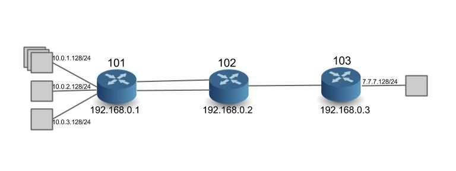

# Configuring ONOS (spring-open)

The segment routing use case is built on an older internal release of ONOS (Sept 2014). The following instructions do not apply to ONOS 1.0.0 (Avocet), and are meant only for the SPRING-OPEN project.

There is no IP network in the world that can run without configuration. In SPRING-OPEN, instead of configuring each switch individually (with IP addresses, subnets, labels etc.) we configure the controller. Such configuration should be possible via the controller CLI. However we have limited configuration capabilities currently in the controller CLI (just tunnels and policies). Thus all startup-configuration happens via a configuration file loaded at controller startup. Please note that without this config file (or with the wrong config file) the network will not work correctly.

First you need to edit ~/spring-open/conf/onos.properties

If you create a new network configuration file, you need to specify the file in **net.onrc.onos.core.configmanager.NetworkConfigManager.networkConfigFile** field. In the example below, conf/sr-3node.conf file was specified.

**onos.properties** Expand source

```
floodlight.modules = net.floodlightcontroller.core.FloodlightProvider,\
net.floodlightcontroller.threadpool.ThreadPool,\
net.onrc.onos.core.topology.TopologyPublisher, \
net.onrc.onos.core.datagrid.HazelcastDatagrid,\
net.onrc.onos.core.flowprogrammer.FlowProgrammer,\
net.onrc.onos.core.intent.runtime.PathCalcRuntimeModule,\
net.onrc.onos.core.intent.runtime.PlanInstallModule,\
net.onrc.onos.core.registry.ZookeeperRegistry, \
net.onrc.onos.core.metrics.OnosMetricsModule, \
net.onrc.onos.apps.websocket.WebSocketModule, \
net.onrc.onos.core.main.config.DefaultConfiguration, \
net.onrc.onos.apps.segmentrouting.SegmentRoutingManager
net.floodlightcontroller.restserver.RestApiServer.port = 8080
net.floodlightcontroller.core.FloodlightProvider.openflowport = 6633
net.floodlightcontroller.core.FloodlightProvider.workerthreads = 16
net.floodlightcontroller.core.FloodlightProvider.cpqdUsePipeline13 = true
net.floodlightcontroller.forwarding.Forwarding.idletimeout = 5
net.floodlightcontroller.forwarding.Forwarding.hardtimeout = 0
net.onrc.onos.apps.websocket.WebSocketModule.port = 8081
net.floodlightcontroller.core.FloodlightProvider.cpqdUsePipeline13 = true
# NOTE: Do NOT modify or remove the line below. This value will be overwritten by onos.sh script.
net.onrc.onos.core.datagrid.HazelcastDatagrid.datagridConfig = 
# Uncomment and list all the ZooKeeper instances after localhost on multi-instance deployment.
#net.onrc.onos.core.registry.ZookeeperRegistry.connectionString = localhost:2181,otherhost:2181
# Specify a network configuration file to be used by the NetworkConfigManager
net.onrc.onos.core.configmanager.NetworkConfigManager.networkConfigFile = conf/sr-3node.conf
```

Then, edit network configuration file

The following example (sr-3node.conf) shows the network configuration for the topology with three switches and three links (refer to figure below).



**sr-3node.conf** Expand source

```
{
  "comment": " Segment routing topology description and configuration",
  "restrictSwitches": true,
  "restrictLinks": true,
  "switchConfig":
             [
               { "nodeDpid": "00:01", "name": "Dallas-R1", "type": "Router_SR", "allowed": true,
                 "latitude": 80.80, "longitude": 90.10,
                 "params": { "routerIp": "192.168.0.1/32",
                             "routerMac": "00:00:01:01:01:80",
                             "nodeSid": 101,
                             "isEdgeRouter" : true,
                             "subnets": [
                                         { "portNo": 1, "subnetIp": "10.0.1.128/24" },
                                         { "portNo": 4, "subnetIp": "10.0.2.128/24" },
                                         { "portNo": 5, "subnetIp": "10.0.3.128/24" }
                                         ],
							"adjacencySids": [
                                               { "adjSid": 77777, "ports": [ 6 ,7 ] }
                                               ]
                             }
                 },
               { "nodeDpid": "00:02", "name": "Dallas-R2", "type": "Router_SR", "allowed": true,
                 "latitude": 80.80, "longitude": 90.10,
                 "params": { "routerIp": "192.168.0.2/32",
                             "routerMac": "00:00:02:02:02:80",
                             "nodeSid": 102,
                             "isEdgeRouter" : false
                             }
                 },
               { "nodeDpid": "00:03", "name": "Dallas-R3", "type": "Router_SR", "allowed": true,
                 "latitude": 80.80, "longitude": 90.10,
                 "params": { "routerIp": "192.168.0.3/32",
                             "routerMac": "00:00:07:07:07:80",
                             "nodeSid": 103,
                             "isEdgeRouter" : true,
                             "subnets": [
                                         { "portNo": 1, "subnetIp": "7.7.7.128/24" }
                                         ]
                             }
                 }
               ],
  "linkConfig":[
                { "type": "pktLink", "allowed": true,
                  "nodeDpid1": "01", "nodeDpid2": "02",
                  "params": { "port1": 6, "port2": 1 }
                  },
               { "type": "pktLink", "allowed": true,
                  "nodeDpid1": "01", "nodeDpid2": "02",
                  "params": { "port1": 7, "port2": 3 }
                  },
                { "type": "pktLink", "allowed": true,
                  "nodeDpid1": "02", "nodeDpid2": "03",
                  "params": { "port1": 2, "port2": 2 }
                  }
                ]
}
```

Here is what you need to know for network configuration:

The first two lines are global params

* **restrictSwitches** : If true, any switch not configured in the config file is rejected by the controller (disconnected). If false, then all switches that connect to the controller are allowed by default.
* **restrictLinks**: If true, any link not configured in the config file is rejected by the controller, i.e. not used in path computation and no traffic will use those links. If false, then all links will be allowed by default.

While the controller configuration allows a lot of flexibility, we have currently not tested configs where restrictSwitches and restrictLinks are not 'true'. In other words, only switches and links that are configured are 'allowed' in the network. We will always need to configure the switches, but we do hope to remove the need for configuring links soon.

To **configure the switches as Segment Routers** we need to do the following

* **nodeDpid**: Node DPID (Datapath ID) - this of-course has to be unique in the network. For switches in mininet, the dpid is automatically assigned as 00:00:00:00:00:00:00:01, 02, 03 etc. For Dell hardware, the DPID reflects the chassis MAC ID using Dell/Force10's OUI (**00:01:e8**:8b:93:68)
* **name**: name of the router - give an alias to represent this router so that it is easier to identify than using DPIDs.
* **type**: router type. It needs to be **Router-SR**
* **allowed**: if true, the controller accepts the router. This is a local boolean that takes precedence over the global boolean 'restrictSwitches'.
* **latitude**, **longitude**: geographical location of the router - ignored in this project
* **params**: Segment Routing application specific parameters
  + **routerIp**: lP address of the loopback interface of the router - can be anything you want.
  + **routerMac**: MAC address of the loopback interface. In this project, we use this MAC address as src/dst MAC address in Ethernet headers for communication to other routers, instead of using the interface-MAC addresses. In software switches, the MAC address can be anything you want. In hardware switches from Dell, it necessarily has to be the lower 48 bits of the DPID + 3. So if the DPID is 00:01:00:01:e8:8b:93:68, then the Router MAC is 00:01:e8:8b:93:6b
  + **nodeSid**: Node Segment ID – a prefix-id for the routers loopback interface. This is the 'global' label representing the router. Must be unique in the network. Currently please use a number between 100 and 999.
  + **isEdgeRouter**: the flag to determine the edge router. If true, subnet information must be specified. If false, subnet information must NOT specified. Edge routers switch on IP and MPLS. Core routers only use the MPLS tables.
  + **subnets** (optional): subnet information (can be specified only if **isEdgeRouter** is true). Specify the interface ("portNo": 1) for the attached subnet ("subnetIp": "10.0.1.128/24"). In the example, port 1 is assigned the subnet 10.0.1.0/24, and the IP address assigned to the interface is 10.0.1.128/32. Only interfaces on which attached-subnets are configured need IP addresses. All other interfaces (i.e. those connected to other segment-routers) are consider unnumbered interfaces and do not need IP addresses.
  + **adjSid**: configure an Adjacency Segment ID. This is a locally significant label, assigned to more than one router interface. Note that the controller automatically assigns adjacency labels for single interfaces. Only when the operator needs an adjacency-label to represent more than one outgoing interface, should this be used. Please use a number between 10000 and 99999. In the example above, '77777' is used on ports 6 and 7.

To c**onfigure bidirectional links between Segment Routers** we need to do the following (the need to do this configuration will be removed in the future)

+ **type**: link type 'pktLink'
+ **allowed**: if true, the controller accepts the link. This is a local boolean that takes precedence over the global boolean 'restrictLinks'.
+ **nodeDpid1**, **nodeDpid2**: DPID of the two end point routers of the link
+ **params**: link parameter
+ - * **port1**, **port2**: port numbers of the two end point routers in the corresponding order (port1 for nodeDpid1, and port2 for nodeDpid2)  
      (NOTE: if the port numbers do not match the actual port number of the link, then the link is disregarded by the controller)

## Configuration for the Demo Prototype

To replicate the prototype shown in the [videos](../prototype-demo-videos.md) with software switches, use this config file at the controller: [sr-cpqd-full.conf](../../../../../assets/sr-cpqd-full.conf). Note that you would also need to follow the [directions to launch the related network topology in Mininet](configuring-cpqd-software-switches.md) described in the config file.

To replicate the prototype shown in the videos with hardware switches, you would need to use a config file that reflects the DPIDs of the hardware switches in your setup. To see an example of the config file we used in our setup see: [sr-dell-full.conf](../../../../../assets/sr-dell-full.conf). Note that you would also need to follow the [directions to launch an OpenFlow instance in the Dell Hardware](configuring-dell-hardware-switches.md).
