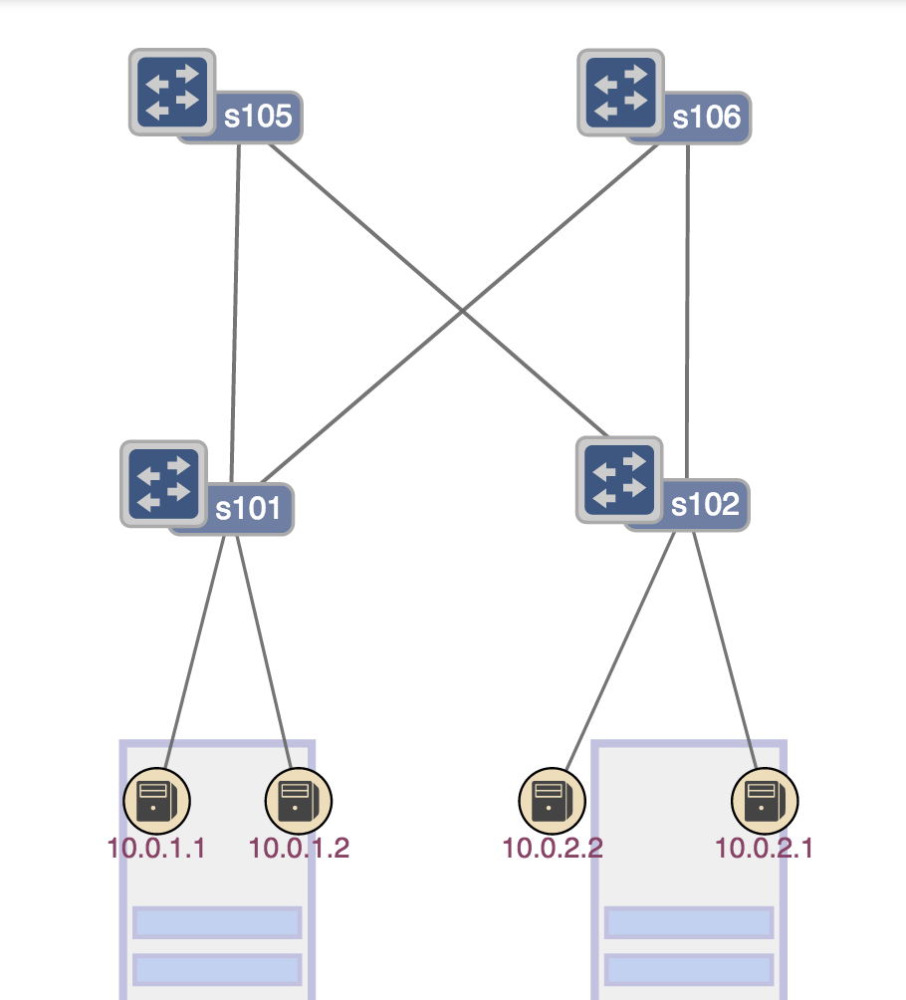
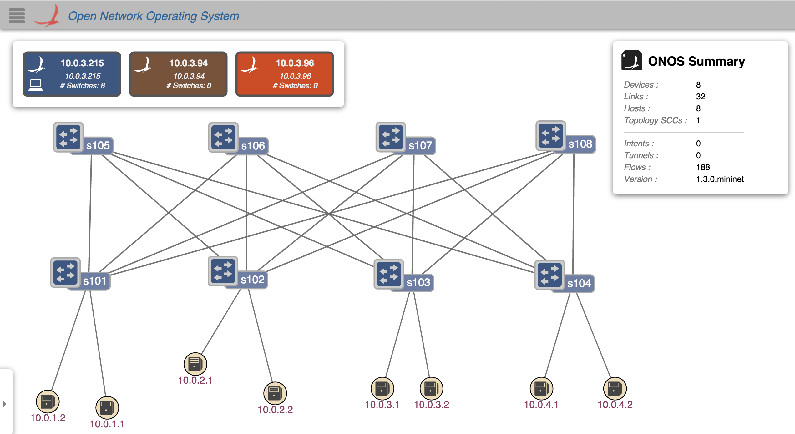

# [Archived] VM Tutorial

Note

The contents of this tutorial are slightly outdated, but it is still a good way to play with the fabric. Note that we no longer configure ONOS with the example file shown below, and we have upgraded the software switch-driver from the one used in this tutorial (so that it now supports L2 bridging within a rack).

Welcome to the Cord Fabric - Tutorial!

In this tutorial, we will go through a set of exercises to illustrate the behavior of the Cord Fabric use case on ONOS. With this tutorial, we hope you'll become familiar with the capabilities of the segment routing app and how it enables you to achieve better control of IP traffic. You will also play with the leaf-spine topology that represents the CORD Fabric.

If you haven't done it already, it's highly recommended that you go through the [ONOS Tutorial](../../tutorials/basic-onos-tutorial.md) first. This will give you some familiarity with the basic functionality of ONOS. 

Email us ([onos-discuss@onosproject.org](mailto:onosdiscuss@onosproject.org)) if you’re stuck, think you’ve found a bug, or just want to send some feedback.

# 1 - Download the tutorial VM

[This VM already](https://s3-us-west-1.amazonaws.com/onos/vm/SR-VM.ova) has all the dependencies necessary to run the Segment Routing application. Login in the VM with the following credentials:

user: **mininet**  
password: **mininet**

# 2 - Start an ONOS Cluster

We configured the VM to automatically bring up 3 ONOS instances using LXC containers. They are already configured to form an ONOS cluster. To access its CLI type:

```
$ onos -w $OC1
Logging in as karaf
Welcome to Open Network Operating System (ONOS)!
     ____  _  ______  ____
    / __ \/ |/ / __ \/ __/
   / /_/ /    / /_/ /\ \
   \____/_/|_/\____/___/

Hit '<tab>' for a list of available commands
and '[cmd] --help' for help on a specific command.
Hit '<ctrl-d>' or type 'system:shutdown' or 'logout' to shutdown ONOS.
onos>
```

This command may take a while to return. After you see the ONOS CLI, make sure the correct apps are running and the ONOS cluster is formed correctly:

```
onos> nodes
id=10.0.3.215, address=10.0.3.215:9876, state=ACTIVE, updated=29m ago *
id=10.0.3.94, address=10.0.3.94:9876, state=ACTIVE, updated=29m ago
id=10.0.3.96, address=10.0.3.96:9876, state=ACTIVE, updated=29m ago
onos>
onos> apps -a -s
*   5 org.onosproject.segmentrouting   1.3.0.SNAPSHOT Segment routing application
*  19 org.onosproject.drivers          1.3.0.SNAPSHOT Builtin device drivers
*  21 org.onosproject.openflow         1.3.0.SNAPSHOT OpenFlow protocol southbound provider
```

# 3 - Start the Fabric

The 2x2 Leaf-Spine topology is described in this figure.

Each Leaf switch is connected to each Spine, all hosts under a Leaf share the same subnet.

Take a look at the configuration file inside ONOS

Let's take a look at the configuration file inside ONOS.

```
{
  "comment": " Multilayer topology description and configuration",
  "restrictSwitches": true,
  "restrictLinks": true,
  "switchConfig":
             [
               { "nodeDpid" : "of:0000000000000001", "name": "Leaf-R1", "type": "Router_SR", "allowed": true,
                 "latitude": 80.80, "longitude": 90.10,
                 "params": { "routerIp": "10.0.1.101/32",
                             "routerMac": "00:00:00:00:01:80",
                             "nodeSid": 101,
                             "isEdgeRouter" : true,
                             "subnets": [
                                         { "portNo": 1, "subnetIp": "10.0.1.254/24" }
                                         ]
                             }
                 },
               { "nodeDpid": "of:0000000000000002", "name": "Leaf-R2", "type": "Router_SR", "allowed": true,
                 "latitude": 80.80, "longitude": 90.10,
                 "params": { "routerIp": "10.0.2.101/32",
                             "routerMac": "00:00:00:00:02:80",
                             "nodeSid": 102,
                             "isEdgeRouter" : true,
                             "subnets": [
                                         { "portNo": 1, "subnetIp": "10.0.2.254/24" }
                                         ]
                             }
                 },
		{ "nodeDpid": "of:0000000000000191", "name": "Spine-R1", "type": "Router_SR", "allowed": true,
                 "latitude": 80.80, "longitude": 90.10,
                 "params": { "routerIp": "192.168.0.11/32",
                             "routerMac": "00:00:01:00:11:80",
                             "nodeSid": 105,
                             "isEdgeRouter" : false
                             }
                 },
        { "nodeDpid": "of:0000000000000192", "name": "Spine-R2", "type": "Router_SR", "allowed": true,
                 "latitude": 80.80, "longitude": 90.10,
                 "params": { "routerIp": "192.168.0.22/32",
                             "routerMac": "00:00:01:00:22:80",
                             "nodeSid": 106,
                             "isEdgeRouter" : false
                             }
                 }
			]
```

Let's start the mininet topology:

```
$ sudo -s
# ./cord_fabric.py
```

Notice h1 has IP 10.0.1.1 and its gateway to the outside world is 10.0.1.254, a interface of the Leaf Router 1.

```
mininet> h1 ifconfig
h1-eth0   Link encap:Ethernet  HWaddr 3a:b6:fe:90:0d:4f
          inet addr:10.0.1.1  Bcast:10.0.1.255  Mask:255.255.255.0
          UP BROADCAST RUNNING MULTICAST  MTU:1500  Metric:1
          RX packets:0 errors:0 dropped:0 overruns:0 frame:0
          TX packets:0 errors:0 dropped:0 overruns:0 carrier:0
          collisions:0 txqueuelen:1000
          RX bytes:0 (0.0 B)  TX bytes:0 (0.0 B)
mininet> h1 ip route
default via 10.0.1.254 dev h1-eth0
10.0.1.0/24 dev h1-eth0  proto kernel  scope link  src 10.0.1.1
```

Let's try to ping that interface.

```
mininet> h1 ping 10.0.1.254
PING 10.0.1.254 (10.0.1.254) 56(84) bytes of data.
64 bytes from 10.0.1.254: icmp_seq=1 ttl=64 time=26.7 ms
64 bytes from 10.0.1.254: icmp_seq=2 ttl=64 time=5.18 ms
64 bytes from 10.0.1.254: icmp_seq=3 ttl=64 time=6.69 ms
64 bytes from 10.0.1.254: icmp_seq=4 ttl=64 time=6.94 ms
```

Verify, h4 has IP 10.0.2.2 and its network gateway is 10.0.2.254, on the Leaf Router 2.

Now let's verify connectivity between the two hosts:

```
mininet> h1 ping h4
PING 10.0.2.2 (10.0.2.2) 56(84) bytes of data.
64 bytes from 10.0.2.2: icmp_seq=1 ttl=63 time=115 ms
64 bytes from 10.0.2.2: icmp_seq=2 ttl=63 time=3.14 ms
64 bytes from 10.0.2.2: icmp_seq=3 ttl=63 time=3.07 ms
64 bytes from 10.0.2.2: icmp_seq=4 ttl=63 time=2.13 ms
```

Communication between hosts in the same rack (ie. in the same subnet) is L2 bridged (not segment-routed). Unfortunately, we have not implemented this functionality yet. As a result pinging between h1 and h2, and also between h3 and h4 will not work 



4 - Understand Segment Routing

The following figure describes the Segment Routing topology.



Notice that each Router is identified by a Label. The edge routers will encapsulate IP traffic with the MPLS label associated to the destination of the packet.

The spines will simply forward traffic based on MPLS labels.

The Segment Routing application allows the expression of POLICIES via TUNNELS.

A tunnel is defined as a set of LABELS, defining the path taken by a flow. The following command instantiate a tunnel called FASTPATH through the routers 101, 105, and 102 in that order.

```
onos> srtunnel-add FASTPATH 101,105,102
```

Then, a policy can be applied to a subset of traffic, for example,  policy1 = tcp\_port=80 >> fwd( TUNNEL\_1)

```
onos> srpolicy-add p1 1000 10.0.1.1/24 80 10.0.2.2/24 80 TCP TUNNEL_FLOW FASTPATH
```

# 5 - GUI

To configure the location of the nodes in the ONOS GUI we have to push the following json files using these commands:

```
$ onos-upload-sprites $OC1 onos/web/gui/src/main/webapp/data/sprites/segmentRouting.json
$ onos-topo-cfg $OC1 onos/tools/test/topos/2by2.json
```

Next, go ahead and access the following url: http://<VM\_IP>/onos/ui?sprites=segmentrouting

# 6 - Topology

Now, restart the VM and let's try a bigger topology:

```
$ sudo -s
#./cord_fabric.py --spine=4 --leaf=4
mininet> pingall
```

```
$ onos-upload-sprites $OC1 onos/web/gui/src/main/webapp/data/sprites/segmentRouting.json
$ onos-topo-cfg $OC1 onos/tools/test/topos/cord.json
```
