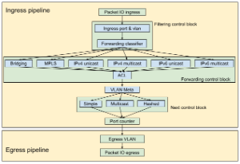
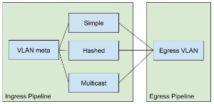

# Pipeline design

Primarily pipeline designed based on flow objective system and applications, the pipeline includes three significant blocks: filtering, forwarding and next. These three blocks based on the flow objective system in ONOS and tables based on use case from segment routing application and other applications used by Trellis.

Figure below is the block definition of fabric.p4

(p.s. Blocks and table definition might be changed in the near future)

## Packet IO ingress & egress control block

These blocks handle packet in and packet out actions.

Ingress packet io control block handles packet-out message sent by ONOS controller since a unique port number used as input port metadata, the parser and pipeline can easily understand this is a packet from the controller.

When switch/pipeline gets a packet-out message, it should set output port and bypass all tables and send to correct port directly.

For the egress packet io control block, it should handle packets-in messages. In P4, we can set a unique output port(e.g., 255 for bmv2) for packet-in action. The pipeline should send an original packet to the controller without modifying it. Currently, only ingress port information is in the metadata of packet-in message.

## Filtering control block

The goal of the filtering control block is:

* Permit/block packet go into the pipeline (default is permit)
* Push internal vlan if it is an untagged packet
* Classify packet to different forwarding type

Fig2. Tables in Filtering control block

For Trellis, we need to configure an interface with VLAN for all edge ports, which will be one of:

* Access port/interface

+ The ingress port VLAN table matches a packet with invalid VLAN header (VLAN header not exists) and pushes a VLAN for this packet.

* Trunk port/interface with native VLAN

+ If no VLAN header present, will push native VLAN to the packet.
+ Controller can drop specific VLAN by in-port and VLAN table

* Trunk port/interface without native VLAN

+ Hits packets with VLAN header
+ Do nothing if there is no VLAN header in the packet, may be processed by ACL table or be dropped by egress

Forwarding classifier table is a table to classify the packet by using combinations of match keys and use a metadata to store traffic class, list below includes classes supported by fabric.p4:

* IPv4 unicast:

+ Ethernet type: IPv4
+ Ethernet destination: router mac address

* IPv4 multicast:

+ Ethernet type: IPv4
+ Ethernet destination: multicast mac address

* IPv6 unicast:

+ Ethernet type: IPv6
+ Ethernet destination: router mac address

* IPv6 multicast:

+ Ethernet type: IPv6
+ Ethernet destination: multicast mac address

* MPLS:

+ Ethernet type: MPLS
+ Ethernet destination: router mac address

* Bridging:

+ Default forwarding type when table miss

## Forwarding control block:

Forwarding control block includes multiple tables for different forwarding types, the goal of this control block is:

* Set next id according to different kinds of match
* Do final decision (drop, send to controller) by ACL table

Different match fields and actions for different table:

* IPv4 unicast:

+ Match: IPv4 destination(long prefix match)
+ Action: set next id

* IPv4 multicast:

+ Match: IPv4 destination(long prefix match) and VLAN
+ Action: set next id

* IPv6 unicast:

+ Match: IPv6 destination(long prefix match)
+ Action: set next id

* IPv6 multicast:

+ Match: IPv6 destination(long prefix match) and VLAN
+ Action: set next id

* MPLS:

+ Match: MPLS label
+ Action: pop MPLS label and set next id

* Bridging:

+ Match: VLAN (exact) and destination Mac address (Ternary)
+ Action: set next Id

After setting up next id by tables, the packet will be processed by ACL table table to make final decision, ACL table may drop, punt to controller(set output port to CPU port) or do nothing to the packet.

## Next control block:

Based on NextObjective, 3 tables included in the Next control block:

* VLAN Meta
* Simple
* Hashed
* Multicast (Broadcast)

### VLAN meta table:

* Modify VLAN ID according to NextID

+ VLAN ID can be found inside metadata from NextObjective

* Do nothing if table miss

### Simple, Hashed, and Multicast table:

Each table matches a unique next id assigned by previous table and execute different kinds of action.

Actions in Next control block

* output

+ Sets output port, output port can be any valid port for target device.

* set\_vlan\_output

+ Sets VLAN ID and do output

* l3\_routing

+ Sets source/destination mac address and do output

* mpls\_routing

+ Push MPLS label and do L3 routing

* set\_mcast\_group

+ Sets multicast group id

* Action profile group id

+ Make the packet processed by specific action profile group

### Egress VLAN table:

* This table exists in egress pipeline
* Pop VLAN according to VLAN and egress port

## Port Counter control block

Port counter control block includes a list of byte+packet counters, counts for different ingress and egress port

