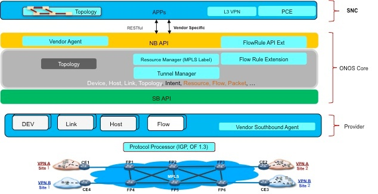

# IP RAN Architecture

### Overview

#### SNC

SNC is Huawei's in house built controller. In this demo, it provides following functionalities

* Path Calculation Engine (PCE), to provide a path between start and end node with specified constrains.
* L3VPN service, to complete L3VPN service required process.
* Topology, which is a snapshot of the global view in ONOS and is used by PCE for path calculation.

SNC provides two ways to communicate with ONOS. The one is through RESTful interface, the other is through Huawei specific interface. When communicating though Huawei specific interface,  Huawei Agent is required by ONOS.

#### ONOS

L3VPN demo requires ONOS to provide several basic services in core and associated northbound APIs for application to use.

* Northbound (FlowRule API extension, Label Management API, and Tunnel Management API)
* Core (MPLS label service, Tunnel service, FlowRule service)
* Southbound (The changes are mainly required by Huawei devices and none-openflow network)

#### Protocol Processor

This software is a Huawei in-house developed(not open-sourced) software, which is running on any machine with Linux OS. Protocol Processor basically handles IGP and OF (but not limited to) protocol and provides the communication service between network element and SDN controller. For the upstream traffic, Protocol Processor uses IGP protocol to communicate with Huawei's southbound agent in ONOS to notify network state change. For the downstream, use OF protocol (1.0 and 1.3) to install flow rules from ONOS.
