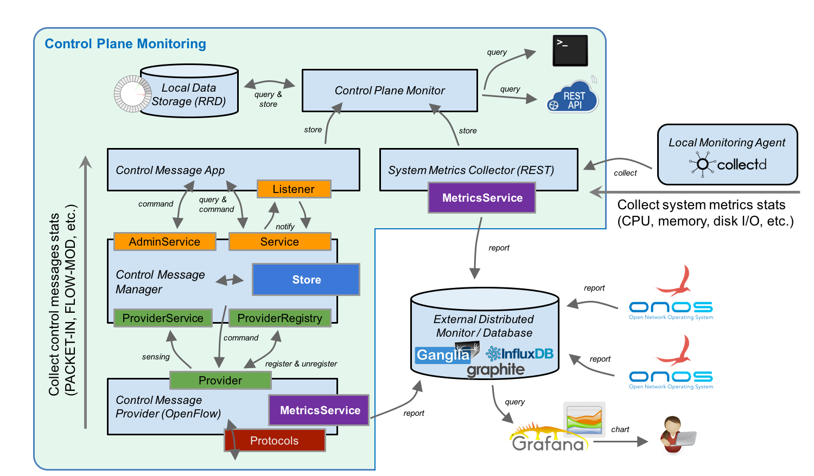
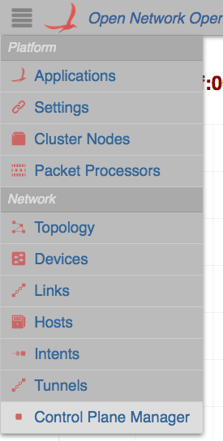
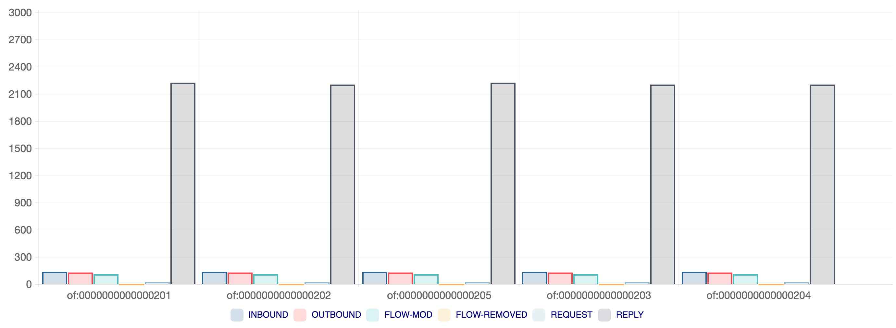
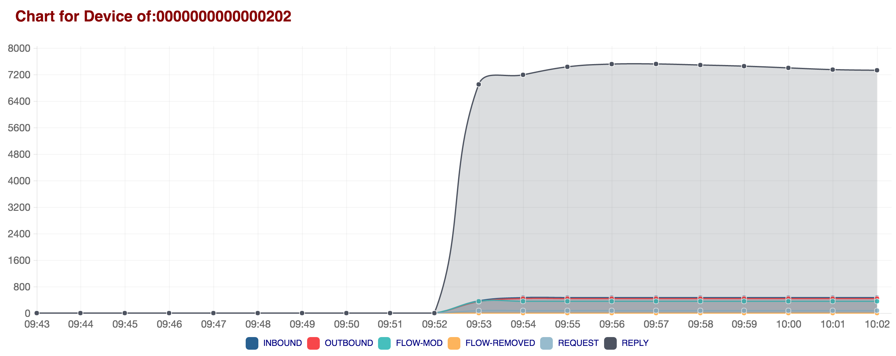

# Control Plane Management Application

# Contributors

| ­Name | Organization | Email |
| --- | --- | --- |
| Jian Li | POSTECH  ON.Lab | [gunine@postech.ac.kr](mailto:gunine@postech.ac.kr)  [jian@onlab.us](mailto:jian@onlab.us) |

# Overview

Control Plane Manager (CPMan) adds management capability to control plane in a way to provide higher availability and reliability for ONOS.

The features of CPMan are comprised of  two parts: 1) control plane monitoring, 2) enhanced mastership management.

1. Control plane monitoring: CPMan monitors various types of control plane metrics that include control message, system metrics.   
   We collect stats information for six types of control message and those are PACKET\_IN, PACKET\_OUT, FLOW\_MOD, FLOW\_REMOVED, STATS\_REQUEST, STATS\_REPLY.   
   We also collect stats information for four types of system metrics that include CPU, memory, disk I/O, network I/O.   
   Note that the monitoring granularity is 1 minute.
2. Enhanced mastership management: Work-In-Progress.

# Architecture



## Control message subsystem

This subsystem is used to aggregate and collect various types of control message from network devices. Followings are the components of the subsystem.

* ControlMessageProvider
  + Collect and aggregate OpenFlow messages. Note that message aggregation relies on MetricsService.
  + Abstract OpenFlow message into protocol agnostic control message type.
* ControlMessageManager
  + Transfer the aggregated control message statistics to application layer.
* ControlMessageApplication
  + Query and store control message statistics into Round-Robin-Database (RRD) through ControlPlaneMonitor service.
  + Note that, RRD stores the statistic information for 24-hours, and the upcoming data will gradually overwrites the data that is stored previously.

Following table shows the mapping between abstracted message type and OpenFlow message type.

| Abstracted Message Type | OpenFlow Message Type |
| --- | --- |
| INBOUND\_PACKET | PACKET\_IN |
| OUTBOUND\_PACKET | PACKET\_OUT |
| FLOW\_MOD\_PACKET | FLOW\_MOD |
| FLOW\_REMOVED\_PACKET | FLOW\_REMOVED |
| REQUEST\_PACKET | STATS\_REQUEST |
| REPLY\_PACKET | STATS\_REPLY |

# Installation

Before you start, you will need followings:

* Ubuntu 14.04 64-bit
* 2GB or more RAM
* 2 or more processors

## ONOS, mininet Installation and CPMan Activation

Install and run ONOS instance. The detailed procedures can be refer from [here](https://wiki.onosproject.org/display/ONOS/Installing+and+Running+ONOS).

To collect control message, we also need to deploy a set of devices and connect to ONOS.

This can be realizable by setting up an OpenFlow network using mininet.   
Mininet installation and configuration can be referred from <http://mininet.org/download/>.

After ONOS and mininet get initialized, we can activate CPMan application.

```
onos > app activate org.onosproject.cpman
```

As long as CPMan is activated, it automatically senses control messages and stores stats. into local RRD.

If you want to collect system metrics (e.g., CPU, memory usages, disk I/O, etc.), please refer to [this link](control-plane-management-application/collecting-system-metrics-from-collectd-agent.md).

# Usage

## Command Line Interface (CLI)

The statistics information of control metrics can be queried through CLI.  
In ONOS console, you can type following command to view control message stats.

```
onos > cpman-stats-list <node_ip> control_message <device_id>
```

You also can query other control metrics by specifying the control metric type such as cpu, memory, disk, network, etc.

## REST API

We also provide a way to query and collect control metrics through REST API.   
Followings are the REST API for collecting and querying control metrics.

### Collector

|  |  |
| --- | --- |
| **POST /collector/cpu\_metrics** | **Collects CPU metrics.** |
| **POST /collector/network\_metrics** | **Collects network I/O metrics include in/out-bound packets/bytes statistics.** |
| **POST /collector/disk\_metrics** | **Collects disk I/O metrics include read and write bytes.** |
| **POST /collector/system\_info** | **Collects system information.** |
| **POST /collector/memory\_metrics** | **Collects memory metrics.** |

### Control Metrics

|  |  |
| --- | --- |
| **GET /controlmetrics/memory\_metrics** | **List memory metrics of all network resources.** |
| **GET /controlmetrics/messages** | **List control message metrics of all devices.** |
| **GET /controlmetrics/**messages/{deviceId}**** | **List control message metrics of a given device.** |
| **GET /controlmetrics/cpu\_metrics** | **List CPU metrics.** |
| **GET /controlmetrics/disk\_metrics** | **List disk metrics of all disk resources.** |

## Web Graphic User Interface (GUI)

CPMan also provides a way to visualize the control metrics using bar/line chart.  
You can find the CPMan GUI under network category in ONOS GUI.



By default, CPMan shows a bar chart of control message stats. per device.



A detailed time-series line chart can be visualizable by clicking each bar chart.



## Export Metrics to Third-party System

If you already have your own monitoring system, you may want to export ONOS control metrics to third-party system.   
ONOS provides two ways to support metrics export.

The first way is pull based approach with which you need to periodically pull the control metrics from your system through ONOS REST API.  
The detailed REST API can be referred from [this link](control-plane-management-application/collecting-system-metrics-from-collectd-agent.md).

The second way is push based approach with which ONOS periodically reports a set of control metrics to predefined third-party system.  
By far, ONOS supports three systems and those are InfluxDB, ganglia and graphite monitoring system.  
The detailed explanation on exporting the metrics to those system can be referred from following links.

* [InfluxDB](influxdb-report-and-query-application.md)
* [Ganglia monitoring system](ganglia-report-and-query-application.md)
* [Graphite monitoring system](graphite-report-and-query-application.md)

# Appendix
