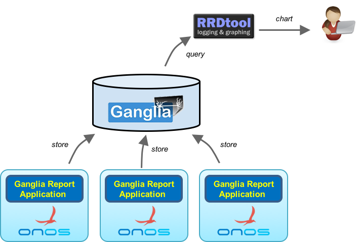
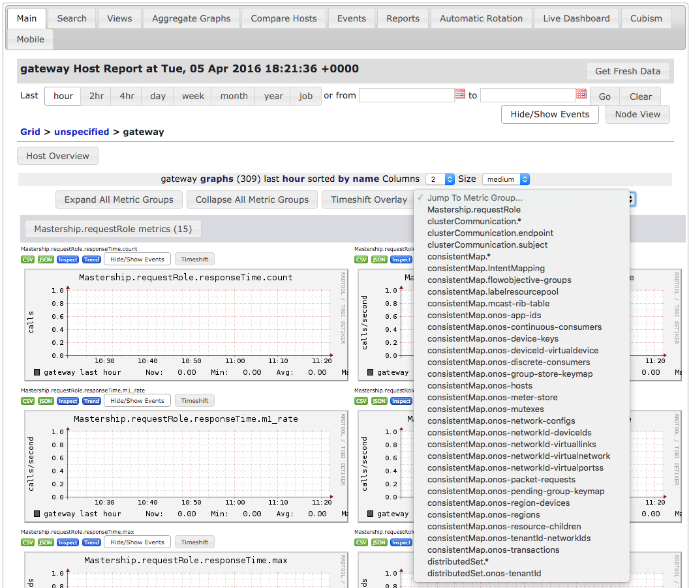

# Ganglia Report and Query Application

# 

# Contributors

| ­Name | Organization | Email |
| --- | --- | --- |
| Jian Li | POSTECH  ON.Lab | [gunine@postech.ac.kr](mailto:gunine@postech.ac.kr)  [jian@onlab.us](mailto:jian@onlab.us) |

# Overview

This application adds capability to report metrics stored in MetricsService to [ganglia](http://ganglia.info/) monitoring server.

Ganglia is a scalable distributed monitoring system for high-performance computing system.   
With this application, each of ONOS instance can periodically report various metrics data to ganglia, and developers/users can easily query global perform metrics from ganglia monitoring server.  
Ganglia supports various number of data format as output such as XML, XDR, RRDtool for data storage and visualization.

# Architecture



Ganglia report and query application provides a way to reports all ONOS metrics data to Ganglia monitoring server periodically.  
Moreover, the application provides the capability to query the metrics data from Ganglia monitoring server.   
With this feature, the users can easily preserve all of the historical metrics data of all ONOS instances from ganglia front-end.

# Usage

We recommend the users to install ganglia in Ubuntu or CentOS.  
In this installation guide, we will use CentOS 7 to install ganglia.

## Prerequisites

Before you start, you will need followings:

* CentOS 7 64-bit
* 2GB or more RAM
* 2 or more processors

You can install CentOS 7 with minimum requirements.

### Ganglia Installation

In this step, we will install ganglia monitoring server.

First update your CentOS to make sure that you have the latest software stacks installed. Also install some utility tools for easing the following installation.

```
$ sudo yum -y update
$ sudo yum -y install wget 
```

Add EPEL repository into yum.

```
$ wget https://dl.fedoraproject.org/pub/epel/epel-release-latest-7.noarch.rpm
$ sudo rpm -Uvh epel-release-7*.rpm
```

Once repository is added to the yum configuration, try to install ganglia with corresponding dependencies using yum install.

```
$ sudo yum -y install ganglia ganglia-gmond ganglia-gmond-python ganglia-web
```

### Ganglia Configuration

Edit /etc/ganglia/gmond.conf, comment out mcast\_join and bind to only allow using unicast to report metrics data.

Edit /etc/httpd/conf.d/ganglia.conf, replace the configuration with following settings.

```
<Location /ganglia>
  Allow from all
  Require all granted
</Location>
```

Fix the permission and ownership of rrds directory using following commands.

```
$ sudo chown -R ganglia:nobody /var/lib/ganglia/rrds
$ sudo chmod -R 775 /var/lib/ganglia/rrds
```

Disable SELinux by changing the keyword "enforcing" to "disabled" in /etc/sysconfig/selinux, you need to restart the system to apply changes.

Start gmond, gmetad and apache web server.

```
$ sudo service gmond start
$ sudo service gmetad start
$ sudo service httpd start
```

You can try following commands to automatically start ganglia and web server at OS boot time.

```
$ sudo chkconfig --level 2345 gmond on
$ sudo chkconfig --level 2345 gmetad on
$ sudo chkconfig --level 2345 httpd on
```

After done this, we can access ganglia web front-end to see the monitored result.  
The address of ganglia web front-end is http://<server address>/ganglia

## Try out Ganglia Report and Query Application

In this step, we will show how to use ONOS built-in application to report various metrics to ganglia.

First install and run ONOS instance. The detailed procedures can be refer from [here](../../guides/administrator-guide/installing-and-running-onos.md).

After ONOS has been initialized, we can activate ganglia report and query application using following command.

```
onos > app activate org.onosproject.gangliametrics
```

By default, ONOS reports the metrics to localhost, and if your ganglia monitoring server runs externally, you have to specify the address of ganglia monitoring server.  
Please replace <Ganglia Address> with your own one.

```
onos > cfg set org.onosproject.gangliametrics.DefaultGangliaMetricsReporter address <Ganglia Address>
```

Since metrics reporting occurs in each minute, you need to wait 1 minute to see the reported metric value from ganglia.  
The metric value can be accessible through ganglia web GUI.   
If the metric values are reported correctly, you will see gateway host with ONOS own reported metrics.


