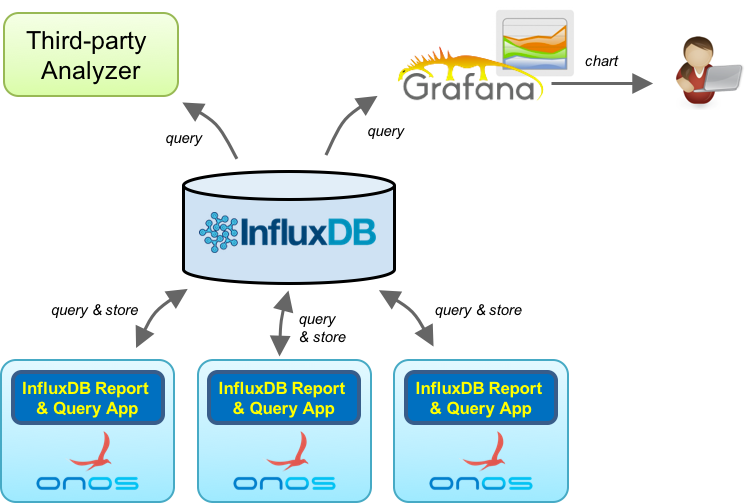
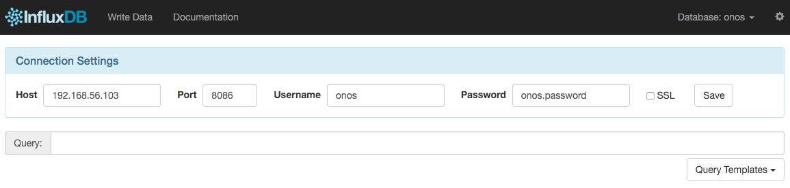
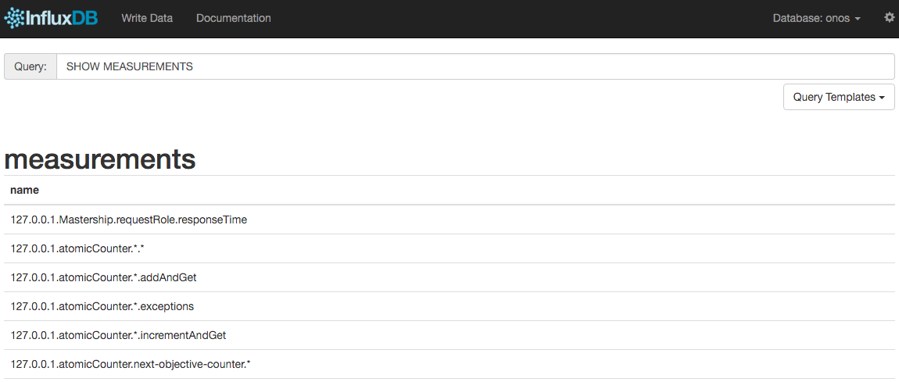

# InfluxDB Report and Query Application

# 

#### Contributors

| ­Name | Organization | Email |
| --- | --- | --- |
| Jian Li | POSTECH  ON.Lab | [gunine@postech.ac.kr](mailto:gunine@postech.ac.kr)  [jian@onlab.us](mailto:jian@onlab.us) |

# Overview

This application adds capability to report and retrieve metrics stored in MetricsService to/from [InfluxDB](https://influxdata.com/).

InfluxDB is a distributed time-series database which is written in Go language. InfluxDB is optimized for storing time-series data, and it supports clustering.   
With this application, each of ONOS instance can periodically report various metrics data to influxDB, and developers/users can easily query global perform metrics from influxDB.  
Since influxDB provides an interface to expose its data, network administrator can easily integrate influxDB with third-party visualization tools to realize dashboard.   
By far, influxDB supports [Grafana](http://grafana.org/) and [Graphite](http://graphite.wikidot.com/) visualization tool.

Architecture



InfluxDB Report and Query Application provides a way to reports all ONOS metrics data to InfluxDB periodically.  
Moreover, the application provides the capability to query the metrics data from InfluxDB.   
With this feature, a single ONOS instance can easily preserve all of the historical metrics data from all of ONOS instances.

# Usage

We recommend the users to install influxDB in Ubuntu or CentOS.  
In this installation guide, we will use CentOS 7 to install influxDB.

## Prerequisites

Before you start, you will need followings:

* CentOS 7 64-bit
* 2GB or more RAM
* 2 or more processors

You can install CentOS 7 with minimum requirements.

### InfluxDB Installation

In this step, we will install InfluxDB.

First update your CentOS to make sure that you have the latest software stacks installed.

```
$ sudo yum -y update
```

Add InfluxDB repository into yum.

```
$ cat <<EOF | sudo tee /etc/yum.repos.d/influxdb.repo
[influxdb]
name = InfluxDB Repository - RHEL \$releasever
baseurl = https://repos.influxdata.com/rhel/\$releasever/\$basearch/stable
enabled = 1
gpgcheck = 1
gpgkey = https://repos.influxdata.com/influxdb.key
EOF
```

Once repository is added to the yum configuration, try to install InfluxDB using yum install.

Note that ONOS supports InfluxDB up to **0.10.3**. The InfluxDB which has higher version number will not work properly with ONOS.

The installation of InfluxDB with a specific version number can be done using following command.

```
$ sudo yum install -y influxdb-0.10.3-1.x86_64
```

You can try following commands to automatically start influxdb at OS boot time.

```
$ sudo chkconfig --level 2345 influxdb on
```

Finally, run InfluxDB.

```
$ sudo service influxdb start
```

### InfluxDB Configuration

Connect to InfluxDB shell.

```
$ influx
```

In InfluxDB shell, create a new database with the name of "onos".

```
> CREATE DATABASE onos
```

Create a new account which have all permission

```
> use onos
> CREATE USER onos WITH PASSWORD 'onos.password' WITH ALL PRIVILEGES
```

Access InfluxDB web GUI to setup a new user. The URL of InfluxDB web GUI is http://ipaddress:8083/.

In connection settings, input the following information.

* Host: ip address where InfluxDB is installed
* Port: 8086
* Username: onos
* Password: onos.password



if you cannot access the influxdb GUI through port 8083, and influxdb through port 8086, you need to manually open those ports using follow commands.

```
$ sudo firewall-cmd --zone=public --add-port=8083/tcp --permanent
$ sudo firewall-cmd --zone=public --add-port=8086/tcp --permanent
$ sudo firewall-cmd --zone=public --add-port=8088/tcp --permanent
$ sudo firewall-cmd --reload
```

Now, we are ready to push the metrics from ONOS to InfluxDB!

## Try out InfluxDB Report and Query Application

In this step, we will show how to use ONOS built-in application to report various metrics to InfluxDB.

First install and run ONOS instance. The detailed procedures can be refer from [here](../../guides/administrator-guide/installing-and-running-onos.md).

After ONOS has been initialized, we can activate InfluxDB report and query application using following command.

```
onos > app activate org.onosproject.influxdbmetrics
```

By default, ONOS reports the metrics to localhost, and if your InfluxDB server runs externally, you have to specify the address of InfluxDB server.  
Please replace <InfluxDB Address> with your own one.

```
onos > cfg set org.onosproject.influxdbmetrics.InfluxDbMetricsConfig address <InfluxDB Address>
```

Since metrics reporting occurs in each minute, you need to wait 1 minute to see the reported metric value from InfluxDB.  
The metric value can be accessible through InfluxDB web GUI.   
If the metric values are reported correctly, we will see followings in your InfluxDB web GUI.


