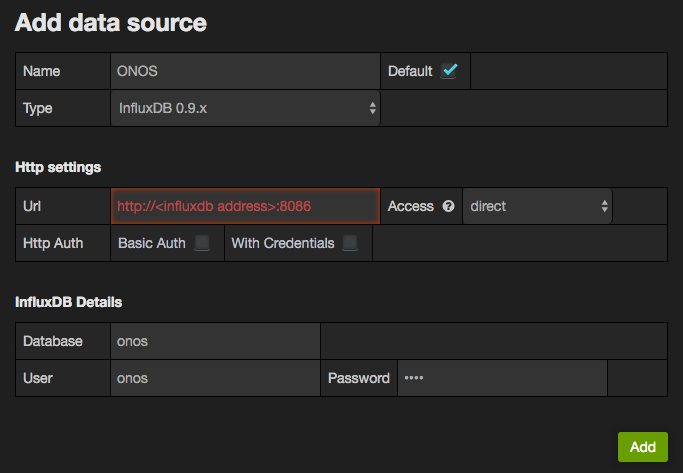
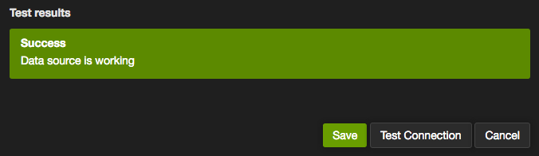
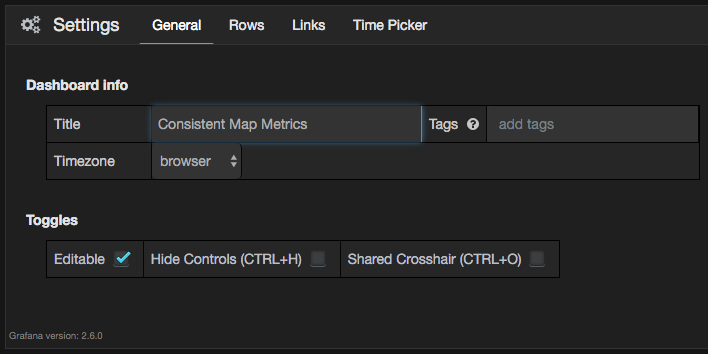
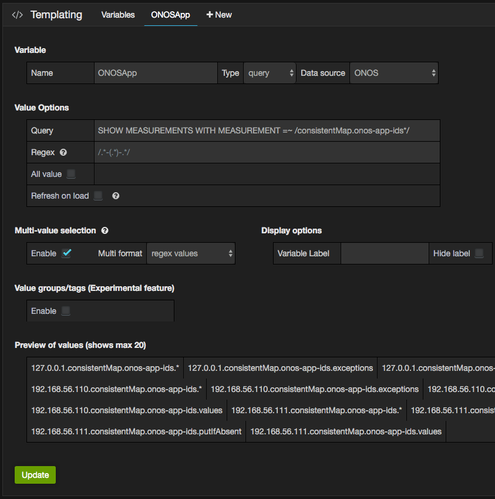
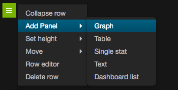
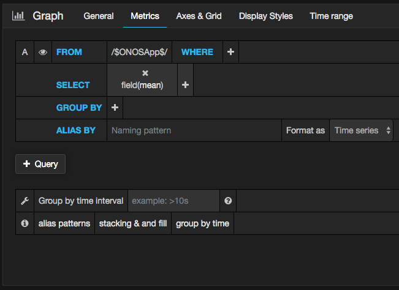
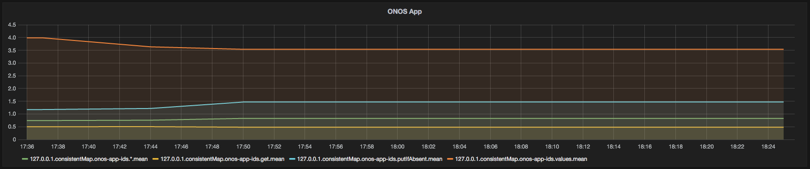

# Integration with Grafana Dashboard

# 

# Contributors

| ­Name | Organization | Email |
| --- | --- | --- |
| Jian Li | POSTECH  ON.Lab | [gunine@postech.ac.kr](mailto:gunine@postech.ac.kr)  [jian@onlab.us](mailto:jian@onlab.us) |

# Overview

With influxdbmetrics application, we can export all control metrics to InfluxDB, however, it is non-trivial to visualize all the metrics in a dedicated dashboard.   
[Grafana](http://grafana.org/) is most commonly used for visualizing time series data for Internet infrastructure and application analytics.   
This tutorial provides the detailed guidelines on how to integrate InfluxDB with grafana to easily visualize all ONOS metrics.

# Usage

We recommend the users to install grafana in Ubuntu or CentOS.  
In this installation guide, we will use CentOS 7 to install grafana.

## Prerequisites

Before you start, you will need followings:

* CentOS 7 64-bit
* 2GB or more RAM
* 2 or more processors

You can install CentOS 7 with minimum requirements.

### Grafana Installation

In this step, we will install grafana.

First update your CentOS to make sure that you have the latest software stacks installed.

```
$ sudo yum -y update
```

Install prerequisite binaries.

```
$ sudo yum -y install httpd initscripts fontconfig
```

Install grafana using yum.

```
$ sudo yum install https://grafanarel.s3.amazonaws.com/builds/grafana-2.6.0-1.x86_64.rpm
```

You can try following commands to automatically start grafana at OS boot time.

```
$ sudo chkconfig --level 2345 grafana-server on
```

Finally, run grafana.

```
$ sudo service grafana-server start
```

### Integration with InfluxDB

The grafana dashboard URL is http://<ip address>:3000, and the default login id and password is as follow.

```
ID: admin
PW: admin
```

if you cannot access the grafana GUI through port 3000, you need to manually open those ports using follow commands.

```
$ sudo firewall-cmd --zone=public --add-port=3000/tcp --permanent
$ sudo firewall-cmd --reload
```

Now, to integrate grafana with InfluxDB, we need to configure the data source for grafana.  
You can access following address to configure new data source.  
http://<ip address>:3000/datasources/new

Replace the <influxdb address> with your own influxDB IP address and press "add" button to configure data source.



Run "Test Connection", if it returns success message, you've done integrating grafana with influxDB.



## Visualize ONOS Metrics using Grafana

Create a new dashboard and configure the name of dashboard as "Consistent Map Metrics".  
This can be done in setting page of the new dashboard.



### Define a metric variable

There are many metrics stored in InfluxDB, and in this tutorial, we will visualize consistent map related metrics.  
To realize consistent map, each ONOS instance internally maintains a local consistent map data structure,   
the data consistency is preserved by periodic synchronization among ONOS cluster through invoking east-west ONOS API.  
To quantify the load of east-west API calls, ONOS already calculated statistics of each east-west API call,   
and the statistic information is stored in metrics variable named as "consistentMap.\*".  
Note that "\*" denotes the name of a consistent map.

Following example shows the detailed procedures on how to visualize "consistentMap.onos-app-ids" metrics in grafana dashboard.  
Since we need to visualize the metrics from multiple ONOS instances, we can define the IP addresses of ONOS instance as a variable.  
To define a new variable, we need to go to templating page of a dashboard, and create a new variable named as "ONOSApp".  
In query field, we need to input following query in a way to query the consistentMap.onos-app-ids metrics from all ONOS instances. 

```
SHOW MEASUREMENTS WITH MEASUREMENT =~ /consistentMap.onos-app-ids*/
```

To enable multiple metrics selection from grafana dashboard, we also need to enable Multi-Value Selection, and multi format should be configured as regex values.  
After this has been done, we can press update button to define a new variable.



### Visualize metrics

Insert a new graph into the panel, this can be done by selecting "Add Panel -> Graph".



In general tab, we can specify the name of graph, in this case we name it as "ONOS App".

In metrics tab, we can specify the metrics that we would like to visualize.   
Since we have already define the metric as a variable, we can simply select /$ONOSApp$/ for from field.

In select field, we can input "mean" to only query the mean value of all of the metrics that included under onos app.

  
After that you can project the range of time axis to visualize the selected metrics.


