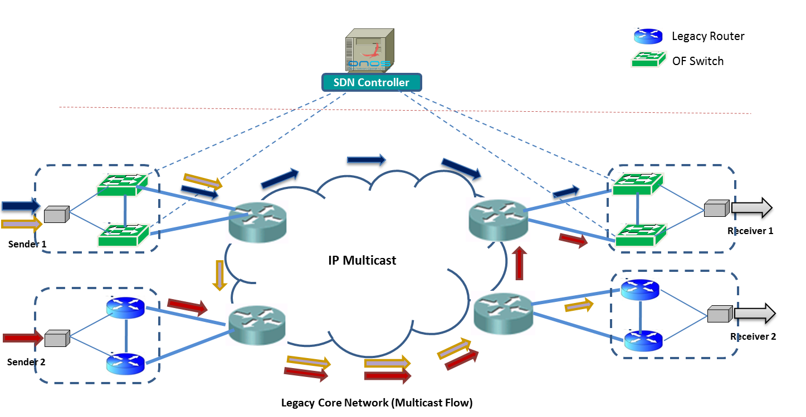

# Multicast Use Case

This use case is concentrated on deploying SDN on the send side of a production network.  In later phases (Use Cases), we will concern ourselves with SDN on the receiving edge and later SDN in the core (i.e. a complete SDN network).

I suspect incremental deployment will be the case for many large production networks, since a forklift change is simply too risky and unrealistic.

Check the following resource that describes the [Multicast Forwarding Architecture](multicast-use-case/onos-multicast-forwarding-architecture.md)

## The Network

The network topology can be viewed as a core network with two types of edges, the sending edge where IP multicast streams are injected into the network, the receiving edge is where the multicast streams are consumed. The core connects the sending and receiving edges. (This is an oversimplified view of a production network but should suffice for this use case).



This use case, we are assuming PIM-SSM for multicast as well as a legacy unicast routing protocol.

## Project Members

| Name | Organization | Role | Email |
| --- | --- | --- | --- |
| Michael Makhijani | DIRECTV | Project Sponsor |  |
| Sunil Jethwani | DIRECTV | Project Lead | [sjethwani@directv.com](mailto:sjethwani@directv.com) |
| Rusty Eddy | DIRECTV | Technical Lead | geddy@directv.com |
| Veerendra Muppana | DIRECTV | Technical Team | vkmuppana@[directv.com](http://directv.com) |
| Jono Hart | On.Lab | Technical Team |  |

## Incremental Deployment

This use case assumes a high volume production network so it is only prudent that sections controlled by SDN are rolled out gradually in the early phases until we have sufficient confidence with the solution in our production environment.

The plan at the moment of this writing is roughly:

* Phase 1: SDN Multicast at sender edge (this use case)
* Phase 2: SDN Multicast at receiving edge
* Phase 3+: Consider SDN in the core

Rolling out SDN in phases means that we'll be creating sections of SDN adjacent to legacy L3 sections. routing protocols.  This will create sections of the network that can not communicate directly with one another, therefore we'll need to determine a way to consistently pass traffic through the SDN / L3 borders while supporting redundancy with primary and backup paths, while avoiding loops and duplicate traffic.

### Phase 1 - Send Side Deployment

The first phase covered in this USE case will be looking at solutions to replacing the sending side of the network with SDN. The initial deployment may include a hybrid deployment meaning that the OpenFlow and Legacy L3 border will exist in a single switch.

There are least the following options that may solve the *Ships In The Night*problem:

1. Eliminate redundancy by providing only one path between SDN & L3
2. Static routes: this may eliminate the effectiveness of redundancy
3. L3 Emulation / Proxy: enabling ONOS to speak [[a subset]] of L3 routing protocols
4. L3 Forwarding Interpretation: this is basically having the controller read L3 forwarding state from L3 router

In our use case we will work toward solution 3 for multicast, that is create a PIM-SSM emulation mode.  Unicast routing will need to be solved in some other manner that we will need to determine.

#### PIM Emulator

Perhaps the most robust way to solve the Ships in the Night problem will require the ONOS controller to understand and speak PIM. This does **not** mean that we are going to implement all of PIM-SSM as a controller app, rather we provide the controller with just enough smarts to interpret PIM messages such that it may create sufficient forwarding state on our OF switch.

#### PIM-SSM Hello, Join / Prune

This specific use case requires us to emulate PIM-SSM. This will require ONOS to understand PIM Join / Prune messages to determine which ports PIM-SSM expects to receive data from.

In order for PIM-SSM to send a PIM Join/Prune to an OF switch, we will also need to periodically transmit and read PIM Hello messages that will allow the *PIM Router*to form a neighboring adjacency.

#### ISIS Unicast Routing

For unicast routing we don't have quite as clear of an option.  Perhaps solutions 1, 2 or 4 above.  We also have an option of Introducing iBGP or running a switch in *hybrid mode* reducing redundancy to a single path, or perhaps to create a series of redundant static routes to still afford redundancy.

## Discovering Interest In Multicast Group Data

Early development of the Multicast Use Case we will need to be able to static configure multicast forwarding state.  In addition to early multicast development we may find these static configured multicast state useful for this specific use case,  but generally useful for many different multicast use cases. Hence this feature should provide to be generally useful.

Conceptually speaking: multicast is inherently different than unicast forwarding in that every unicast address is unique and has exactly one location within the network (with the rare exception of IP anycast).  Multicast addresses, used by hosts to consume data from a specific group can come and go in various areas of a given topology over time.  That being the case, there must be a away for host group interest to be communicated to the network.

For a host to receive multicast data for consumption an SDN controller must be able to discover interest.  That interest may be discovered in one or more of the following ways:

1. Static configuration (egress ports are assigned to specific SDN switch ports)
2. Listen to L3 Multicast Protocols, this was spoke about in the previous section
3. IGMPv3 messages may be interpreted by an adjacent host or IGMPv3 proxy-switch
4. Direct interpretation of multicast forwarding state from an L3 MFIB

Many of these are analogous to the unicast methods mentioned above.

### Static Any Source Multicast (ASM) Forwarding Configuration

During early development of this phase we will require, at minimum the static configuration of group addresses and egress ports to indicate end receivers of the given multicast address.  Conceptually speaking the configuration items will be something like:

```
 onos> Send multicast group G1 out port 2 of switch 2
```

```
 onos> send multicast group G2 out port 3, 4 of switch 3
```

This should result in outgoing state stored in ONOS that can later be combined with an active group source and associated incoming port to produce one or more multicast paths through the SDN core.

Due to the fact that ASM by nature does not include a source address, it is impossible to know what source and / port, therefore ASM forwarding is *data-driven* and hence the flows *must* be added *reactively*.

We'll talk about reactive forwarding in a bit.

### Static Source Specific Multicast (SSM) Forwarding Configuration

Similar to Static ASM configuration above, Static SSM forwarding configuration will also assign egress ports to multicast forwarding state.  Additionally Static SSM configuration will also include a source address S1 and possibly an *ingress* port.

Unlike Static ASM, Static SSM flows can be added *proactively*, as well as *reactively.* Since SSM tells us the source of the traffic, and possibly the group, it is possible to proactively add multicast flows to a switch before any data starts to flow.

## Reactive Forwarding

SDN has enabled the concept of *Reactive Forwarding* in unicast networks, where the controller establishes the path between two hosts (or any device for that matter) after data has been sent from one device to another.  Traditional unicast networks (built with legacy routing protocols such as OSPF or BGP) don't work that way, forwarding state to all reachable destinations is established proactively.

Multicast, on the other hand, has traditionally been "data driven", meaning that for the most part, not established in the router until after data arrives (it also will typically time out).   This is largely because ASM was the main problem initially solved by the original protocols (mrouted, pim-sm & pim-dm).

#### Reactive Forwarding is Required for ASM

For Any Source Multicast (ASM) theoretically any source could start and stop sending at any given time.  That being the case, it is not possible to proactively install the respective intents until after the sender starts sending.  ASM, however is not part of this use case to this will is not a requirement we need to worry about at the moment.   Another use case, this may be important.

#### Reactive Forwarding Means Less State

By reactively populating multicast state, you have the positive side effect that the forwarding tables in a switch only contain state for active (or recently actively) flows.  In other words, the switch does not have to store 100% of all possible state if only 10% of that state is active at a given time.

#### Zero Configuration

I think it is worth considering a "zero configuration" setup.  In a case that a network has a large number of multicast groups being generated from various "sending" edges.  Reactive forwarding could potentially simplify configuration management.
