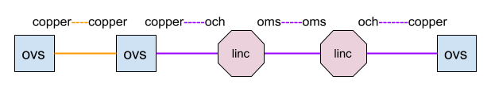

# Optical Intents

## Overview

One of the key requirements for the converged packet/optical use case is the ability to set up connectivity across a network composed of two layers. The applications that are part of this (and the E-CORD) use case rely on callbacks from the Intent subsystem, and optical Intents and Intent compilers for setting up cross-layer paths.

## Path Setup

The diagram below summarizes the actions associated with path setup, and the ONOS components that it involves.

The color convention follows those of the layering in ONOS (blue: applications, grey: core, red: southbound). Elaborating on the diagram above:

* The path provisioner (OpticalPathProvisioner) is the primary application responsible for initiating optical path setup, and listens for IntentEvents.
* Path calculation occurs twice (each time the Topology subsystem is touched).
* The compilers logically reside in the Intent Framework, and are responsible for transforming Intents from high-level Intents such as OpticalCircuitIntent, into installable Intents, like FlowRuleIntents.

To summarize, Setting up connectivity in a multi-layer network involves the following steps:

1. A user or application submits a Host-to-Host or Point-to-Point intent.
2. The Intent subsystem fails to find a packet path and broadcasts a FAILED IntentEvent to its subscribers.
3. The optical path provisioner submits the appropriate optical Intents for the missing portions of the path.
4. The optical Intents are processed into installable Intents by the optical Intent compilers.
5. The installation of the optical Intents allows the Host/Point Intents to be installed, resulting in the INSTALLED IntentEvent.

## Optical Intents and Compilers

As described in [Optical Information Model](optical-information-model.md), there are several port types specific to the packet/optical and E-CORD use cases, and the different optical Intents handle these different port types. The port types in a multilayer path change at different points in the path. The following example illustrates the different port types identified by ONOS for a path across a simple Linc-OE -emulated network.

The blue nodes and orange links represent entities in the packet layer, and the pink nodes and purple links, cross-connects and optical layer entities. A caveat with the port types shown above is that Linc-OE does not support OduClt ports, as hardware optical devices do; However, the fact that port types change with each link in the path remains the same.

As such, the path provisioner must choose the correct optical intent for each section of the path, based on the type of the ports that it finds. The logic can be found in `getIntents(List<ConnectPoint>)` in OpticalPathProvisioner.

The following are the current list of optical Intents available to use case -related applications, their description, and their type-specific parameters.

|  |  |  |
| --- | --- | --- |
| **OpticalCircuitIntent** | For links between two OduClt ports. Compiled into OpticalConnectivityIntents and FlowRuleIntents by the OpticalCircuitIntentCompiler. | ConnectPoint src, dst; OduSignalType signalType; boolean isBidirectional; |
| **OpticalConnectivityIntent** | For links between two OCh ports. Compiled into OpticalPathIntents by the OpticalConnectivityIntentCompiler. | ConnectPoint src, dst; CltSignalType signalType; boolean isBidirectional; |
| **OpticalPathIntent** | For explicitly selected path through the optical layer (Oms ports). Currently only generated by compilers. Compiled into FlowRuleIntents by the OpticalPathIntentCompiler. | ConnectPoint src, dst; Path path; OchSignalType signalType; OchSignal lambda; boolean isBidirectional; |
