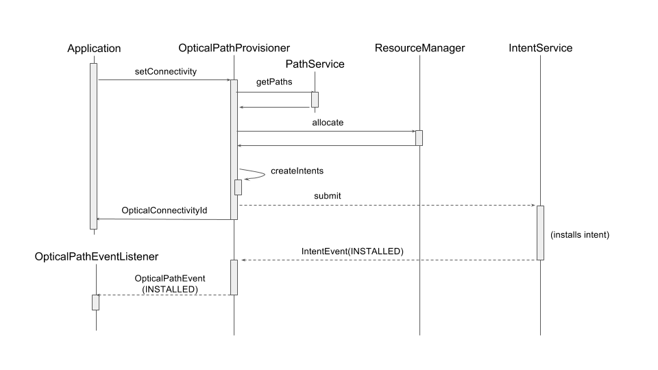
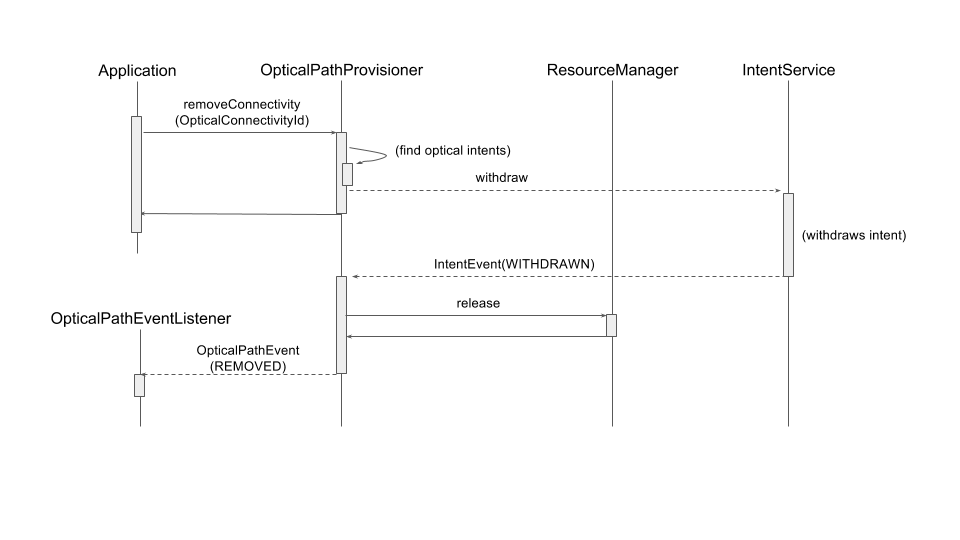

# Optical Path Provisioner

WIP

Work in progress

# Overview

This page describes the details of optical path provisioner: functions of the module, internal structure, and how to use the module.  If you only need to try the module, read “How to use” section first.

# Functions

Main functions of optical path provisioner are listed below.

* Installation of optical connectivity

+ Based on the received request, optical path provisioner calculates optical path between given two ports, and sets up the connectivity along the calculated path.
+ Connectivity request consists from src port, dst port, required bandwidth and latency.
+ For each optical path, provisioner assigns a unique ID (optical connectivity ID).

* Removal of optical path

+ Optical path provisioner removes an installed optical path.

* Notification of installation status

+ Optical path provisioner notifies the registered listeners the installation status of optical path.  For now, “installed” and “removed” events are notified.

# How it works

## Architecture

Package of optical path provisioner is `org.onosproject.newoptical`.  Following shows the file composition of optical path provisioner.

```
    apps
    └── newoptical
        ├── OpticalPathProvisioner.java
        ├── OpticalConnectivity.java
        ├── PacketLinkRealizedByOptical.java
        ├── api
        │   ├── OpticalPathService.java
        │   ├── OpticalConnectivityId.java
        │   ├── OpticalPathListener.java
        │   └── OpticalPathEvent.java
        └── cli
            ├── AddOpticalConnectivityCommand.java
            └── RemoveOpticalConnectivityCommand.java
```

* OpticalPathProvisioner

  + Main module that handles install/remove request of optical path
* OpticalConnectivity

  + A representation of optical path established by OpticalPathProvisioner
* PacketLinkRealizedByOptical
  + A representation of relationship between packet link and its underlying optical intents
* OpticalPathService
  + Service interface for OpticalPathProvisioner
* OpticalConnectivityId

  + Unique ID for OpticalConnectivity
* OpticalPathListener

  + Listener interface for OpticalPathEvent
* OpticalPathEvent
  + A representation of event related to optical path, such as path is established or withdrawn
* AddOpticalConnectivityCommand / RemoveOpticalConnectivityCommand

  + Implementation of CLI commands to add/remove optical path

## Path setup flow



1. Receive optical connectivity request
2. Calculate path

1. Considering available bandwidth

3. Reserve bandwidth along the path
4. Find optical cross connect points in the path
5. Create and install OpticalConnectivityIntent/OpticalCircuitIntent
6. Get notified all of intents installed
7. Notify listeners that path is established

## Path removal flow



1. Receive optical connectivity removal request
2. Find existing optical connectivity
3. Remove related optical intents
4. Get notified all of intents removed
5. Remove bandwidth allocations
6. Notify listeners that path is withdrawn

# How to use

 Before proceeding to the following steps, see “wiki: Installing and Running ONOS” and “” for make it ready to run ONOS.

1. Build package

1. * ```
     $ cd ~/onos/apps/newoptical
     $ mci
     ```
2. Run ONOS

* ```
  $ op
  $ ok clean
  ```

3. Install bundle

* ```
  onos> app activate org.onosproject.newoptical
  ```

4. Connect devices

* Download <https://raw.githubusercontent.com/akoshibe/ecord-topos/master/ectest.py> and copy it to ~/onos/tools/test/topos/
* ```
  $ sudo -E python ~/onos/tools/test/topos/ectest.py 127.0.0.1 127.0.0.1 127.0.0.1
  ```

+ If you’re running ONOS on other host, replace 127.0.0.1 with the host’s IP address.

5. GUI

* Open <http://127.0.0.1:8181/onos/ui/> in web browser.
* Enter karaf/karaf for username/password.
* See the topology like sample image below is displayed.

+ (image)

* See “wiki: The ONOS Web GUI” for details.

6. CUI

* To add connectivity between port of:000000000000000b/ and of:0000000000000015/1, use CLI command as following.

  ```
  onos> add-optical-connectivity of:000000000000000b/2 of:0000000000000015/1 1000000 1000
  ```

+ This requests connectivity from of:000000000000000b/2 to of:0000000000000015/1 with required bandwidth of 1 Mbps (= 1000000 bps), and required latency of 1000ns.

* To remove installed connectivity with ID 1, use CLI command as following.

  ```
  onos> remove-optical-connectivity 1
  ```
