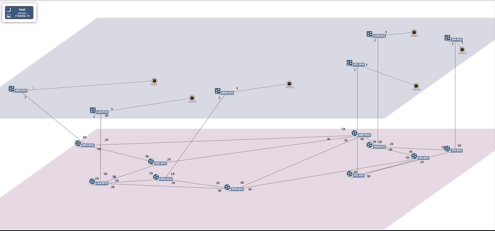
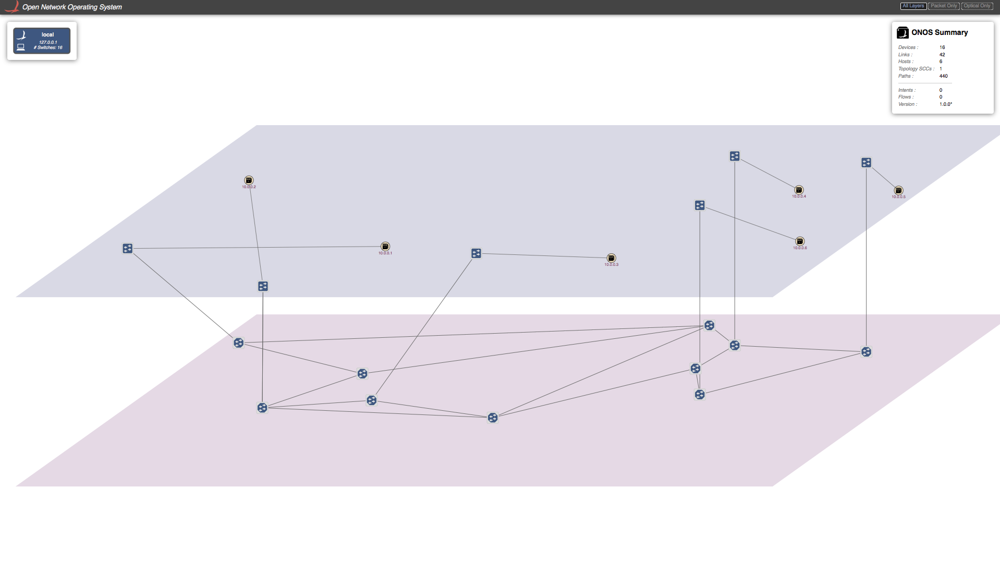
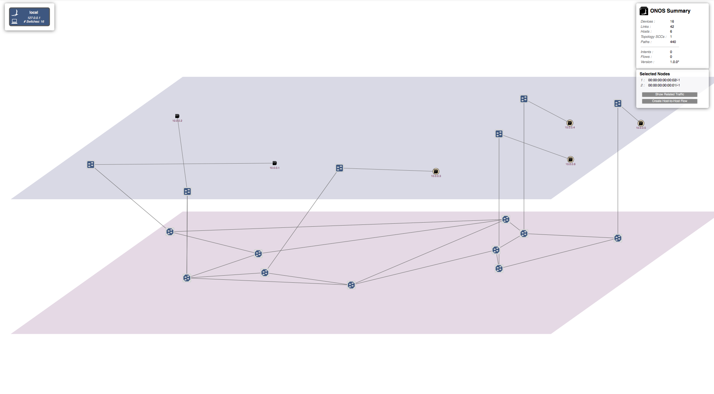
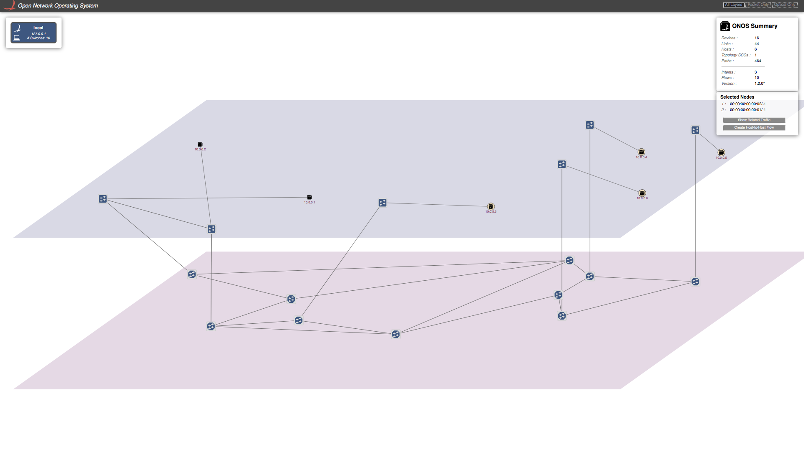
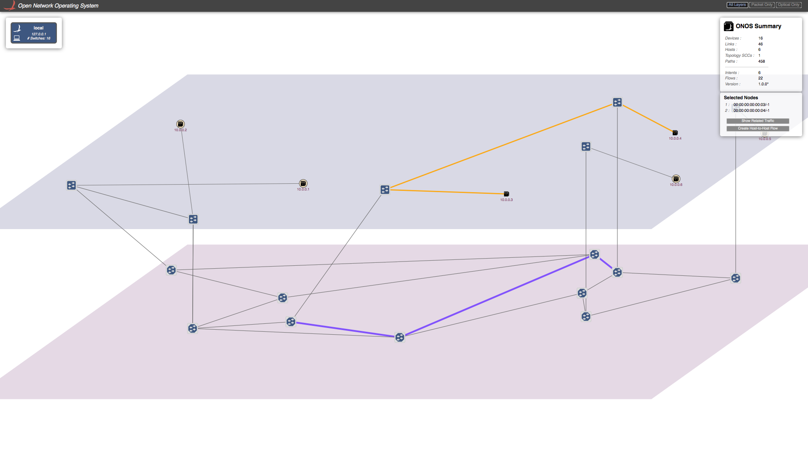
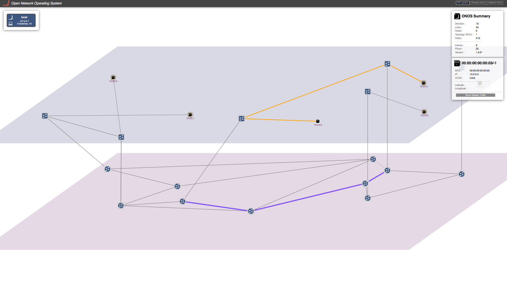

# Packet Optical Tutorial

Welcome to the Packet-Optical ONOS tutorial!

In this tutorial, you’ll complete a set of exercises designed to explain the main concepts of the Packet-Optical use case of ONOS. We hope that with this tutorial, you’ll be able to create, configure, and start multi-layer networks on your environment, which can potentially represent a wide area network environment for your application performance studies.

If you've already gone through the ONOS tutorial, you'll already have the ONOS tutorial VM available. If not, check out the [Introduction](../../../tutorials/basic-onos-tutorial.md) section of the ONOS tutorial to get the VM set up. However, don't log in as tutorial1 - we have a different username for this tutorial.

Email us ([onos-discuss@onosproject.org](mailto:onosdiscuss@onosproject.org)) if you’re stuck, think you’ve found a bug, or just want to send some feedback.

# 

# Starting the tutorial

When you start the VM, you'll be presented with a login screen. If you're already logged in to another tutorial, please log out by clicking the bottom-left icon, clicking "Logout", then click "Logout" again.

Each tutorial in the VM is presented as a different user. Log in to the optical tutorial user with the following credentials:

Username: **optical**  
Password: **optical**

You'll be deposited on a desktop with a bunch of icons that will be used for the tutorial. Before we get started, double-click on the "Reset" icon. This will pop up a terminal and reset ONOS to make sure there is no state left over from any other tutorials.

# Important Command Prompts

Terminal

$

Symbol "$" means linux terminal.

Mininet

mininet>

"mininet>" means mininet CLI command prompt

Linc-OE

(linc@mininet-vm)1>

"(linc@mininet-vm)1>" means LINC-OE CLI command prompt.

## Resetting

We have provided a simple mechanism which allows you to restart the tutorial from scratch. Simply, click on the 'Reset' icon on your desktop and this will reset ONOS to its initial state. It'll take a few seconds for ONOS to restart and during that time you may not be able to launch your ONOS cli.

## Packet-Optical Topology  (via Python-Script)

Go to *mininet/examples:*

$ cd ~/onos/tools/test/topos

You should have a file that contain the packet-optical topology sample ***opticalTest.py***. This file is a python script which creates the following topology:

As shown the topology contains 6 packet nodes in upper *packet plane*, and 10 optical nodes in the lower *optical plane*.

Each packet node is attached to a host representing a data center. The traffic is typically initiated from Hosts attached to the packet networks.

Note that there is no physical links between the packet nodes. All traffic sourced at the data centers are routed through the optical plane.

The optical plane represents the physical network infrastructure interconnected via ROADMs, and packet network are interconnected via logical links only when a circuit is established through

physical layer.

The tap interfaces are used to interconnect the optical switches and packet nodes. We are utilizing Linux tap interfaces for interconnecting the optical switches and packet switches.

## Start ONOS

Double-click the 'Reset' icon on the desktop to start ONOS up with the correct configuration to run packet-optical.

Wait for some time to let ONOS load all the features and modules (about a minute or so).

## Start Mininet and Linc-oe

To start Linc-oe and Mininet go to:

Just double click on 'Mininet Small' (terminal icon) at desktop

or run following in the terminal:

$ cd ~/onos/tools/test/topos

$ sudo -E python opticalTest.py 10.0.3.11

This will push link and device information to ONOS, creating the topology shown above in the figure.

To verify, once the Mininet prompt appears, double-click the 'ONOS' icon to open the ONOS CLI. Now run the 'summary' command and check that ONOS had 16 devices attached.

onos> summary

node=10.0.3.11, version=1.1.1.optical~2015/04/02@15:06

nodes=1, devices=16, links=0, hosts=6, SCC(s)=16, flows=18, intents=0

# Demo 1: Establishing connection between hosts/DataCenters using ONOS-GUI.

To get the ONOS-GUI just double click on 'ONOS GUI' (chrome icon) on Desktop.

or write following in your browser,

10.0.3.11:8181/onos/ui

Note: Do not use **$ onos-gui** to get ONOS GUI.

This will open the ONOS-GUI in a tab in you default browser. You can press **z** to get the split view of packet and optical plane and press **h** to see hosts (for more options press **/**).

As you can see that there are no host discovered by ONOS. This is due to the fact that ONOS only discovers a host when there is traffic from the host. So let's generate traffic from all hosts.

In the Mininet command prompt:

mininet> pingall

or you can manually do ping between all the hosts.

Now you should see all the host in ONOS-GUI. It should look something similar to figure below.

Note, no ping will succeed as there is not physical link between packet switches. Let's establish a connection between two packet switches that consist of optical layer. To do so, we need to send a *Host-to-Host Intent* to ONOS. There are two ways to do this. One is through ONOS-GUI, and other is directly from ONOS-CLI, which we will show in next section.

Let's send a Host-to-Host Intent to ONOS using the GUI. To do so, click on the first host and then press **left-shift** and click on the second host while keep holding the left-shift key. Small window will appear on the right top corner under "ONOS-Summary" window stating "Selected Nodes" as show in figure. For example purpose I have selected hosts with IP=10.0.0.1 (h1) and IP=10.0.0.2 (h2).

Click on "Host-to-Host flow" in "Selected Nodes" window. This sends the Host-to-Host intent to ONOS. ONOS will discover that there is no direct link between two corresponding packet switches but they are reachable through the optical-layer, and hence setup a path through the optical layer. A virtual direct link will created between these packet switches in the GUI as shown in the figure below.

Now if you send traffic between these host you will see traffic is going through successfully. Note in this tutorial script we have only create one tap interface per packet-optical switch. Which means we cannot setup more then one connection per switch. If you want more then one connection per switch you need to add tap interface accordingly in "opticalTest.py".

# Demo 2: Establishing connection between hosts/DataCenters using ONOS-CLI.

You can send Host-to-Host intent using ONOS-CLI too. To do so you have to enter the following command in ONOS-CLI command prompt. For example purpose I have chosen h3 and h4 below:

onos> add-host-intent 00:00:00:00:00:03/-1 00:00:00:00:00:04/-1

You will again see the direct virtual link been setup between the switches corresponding to h3 and h4.

There is an other way to send Host-to-Host Intent to ONOS with specified bandwidth using BandwidthCalendaring app which is explained in next section.

# Demo 3: Link recovery from optical layer failures

In this section we will demonstrate how failure in the optical layer can be recovered by ONOS in a pinch without disturbing the traffic flow.

To see what path is taken by traffic sent by a certain host in the GUI, you can click on that Host and click on "show related traffic". You will see something similar to the figure shown below.

The yellow path shows the packet layer path, and the purple path shows the optical layer path.

Now we will introduce failure in the optical path of the traffic flow. We need to get into linc-oe console to introduce failure in an optical switch:

Just double click on 'LINC-OE' (terminal icon) on Desktop

or write following in the separate terminal:

$ cd ~/linc-oe

$ sudo ./rel/linc/bin/linc attach

This will get you into the command prompt of linc-oe. Now you need to figure out which optical switch's switch port will cause failure in the optical path. You do this by clicking on any switch in the purple path, and noting the DPID of this switch and the switch connected to this switch (which also must be part of optical path). Now you have to figure out what port on each of these switches is responsible for connecting them together. There are several ways, but the most reliable method is to look into *sys.config*. In the separate terminal, open this file:

$ vi ~/linc-oe/rel/linc/releases/1.0/sys.config

In the logical\_switches section, look for the DPIDs that you just have noted and note the switch Id corresponding to both DIPDS. you will see something like,

{logical\_switches,

          [{switch,1,

               [{backend,linc\_us4\_oe},

                {datapath\_id,"00:00:ff:ff:ff:ff:ff:0a"},

                {controllers,[{"Switch0-Controller","192.168.56.1",6633,tcp}]},

                {controllers\_listener,disabled},

                {queues\_status,disabled},

                {ports,

                    [{port,8,[{queues,[]},{port\_no,50}]},

                     {port,10,[{queues,[]},{port\_no,20}]},

                     {port,29,[{queues,[]},{port\_no,10}]}]}]},

           {switch,2,

               [{backend,linc\_us4\_oe},

                {datapath\_id,"00:00:ff:ff:ff:ff:ff:07"},

                {controllers,[{"Switch0-Controller","192.168.56.1",6633,tcp}]},

                {controllers\_listener,disabled},

                {queues\_status,disabled},

                {ports,

                    [{port,1,[{queues,[]},{port\_no,20}]},

                     {port,3,[{queues,[]},{port\_no,30}]},

                     {port,16,[{queues,[]},{port\_no,50}]},

                     {port,30,[{queues,[]},{port\_no,10}]}]}]},

           {switch,3,

               [{backend,linc\_us4\_oe},

                {datapath\_id,"00:00:ff:ff:ff:ff:ff:06"},

                {controllers,[{"Switch0-Controller","192.168.56.1",6633,tcp}]},

                {controllers\_listener,disabled},

                {queues\_status,disabled},

                {ports,

                    [{port,5,[{queues,[]},{port\_no,30}]},

                     {port,12,[{queues,[]},{port\_no,50}]},

                     {port,18,[{queues,[]},{port\_no,40}]},

                     {port,20,[{queues,[]},{port\_no,20}]}]}]},

           {switch,4,

               [{backend,linc\_us4\_oe},

                {datapath\_id,"00:00:ff:ff:ff:ff:ff:08"},

                {controllers,[{"Switch0-Controller","192.168.56.1",6633,tcp}]},

                {controllers\_listener,disabled},

                {queues\_status,disabled},

                {ports,

                    [{port,2,[{queues,[]},{port\_no,30}]},

                     {port,6,[{queues,[]},{port\_no,50}]},

                     {port,7,[{queues,[]},{port\_no,20}]}]}]},

           {switch,5,

               [{backend,linc\_us4\_oe},

                {datapath\_id,"00:00:ff:ff:ff:ff:ff:09"},

                {controllers,[{"Switch0-Controller","192.168.56.1",6633,tcp}]},

                {controllers\_listener,disabled},

                {queues\_status,disabled},

                {ports,

                    [{port,4,[{queues,[]},{port\_no,50}]},

                     {port,9,[{queues,[]},{port\_no,20}]},

                     {port,31,[{queues,[]},{port\_no,10}]}]}]},

           {switch,6,

               [{backend,linc\_us4\_oe},

                {datapath\_id,"00:00:ff:ff:ff:ff:ff:03"},

                {controllers,[{"Switch0-Controller","192.168.56.1",6633,tcp}]},

                {controllers\_listener,disabled},

                {queues\_status,disabled},

                {ports,

                    [{port,11,[{queues,[]},{port\_no,20}]},

                     {port,13,[{queues,[]},{port\_no,50}]},

                     {port,26,[{queues,[]},{port\_no,30}]},

                     {port,32,[{queues,[]},{port\_no,10}]},

                     {port,33,[{queues,[]},{port\_no,11}]}]}]},

           {switch,7,

               [{backend,linc\_us4\_oe},

                {datapath\_id,"00:00:ff:ff:ff:ff:ff:05"},

                {controllers,[{"Switch0-Controller","192.168.56.1",6633,tcp}]},

                {controllers\_listener,disabled},

                {queues\_status,disabled},

                {ports,

                    [{port,15,[{queues,[]},{port\_no,40}]},

                     {port,17,[{queues,[]},{port\_no,30}]},

                     {port,22,[{queues,[]},{port\_no,50}]},

                     {port,28,[{queues,[]},{port\_no,20}]}]}]},

           {switch,8,

               [{backend,linc\_us4\_oe},

                {datapath\_id,"00:00:ff:ff:ff:ff:ff:04"},

                {controllers,[{"Switch0-Controller","192.168.56.1",6633,tcp}]},

                {controllers\_listener,disabled},

                {queues\_status,disabled},

                {ports,

                    [{port,14,[{queues,[]},{port\_no,50}]},

                     {port,19,[{queues,[]},{port\_no,20}]},

                     {port,34,[{queues,[]},{port\_no,10}]}]}]},

           {switch,9,

               [{backend,linc\_us4\_oe},

                {datapath\_id,"00:00:ff:ff:ff:ff:ff:01"},

                {controllers,[{"Switch0-Controller","192.168.56.1",6633,tcp}]},

                {controllers\_listener,disabled},

                {queues\_status,disabled},

                {ports,

                    [{port,21,[{queues,[]},{port\_no,20}]},

                     {port,23,[{queues,[]},{port\_no,50}]},

                     {port,35,[{queues,[]},{port\_no,10}]}]}]},

           {switch,10,

               [{backend,linc\_us4\_oe},

                {datapath\_id,"00:00:ff:ff:ff:ff:ff:02"},

                {controllers,[{"Switch0-Controller","192.168.56.1",6633,tcp}]},

                {controllers\_listener,disabled},

                {queues\_status,disabled},

                {ports,

                    [{port,24,[{queues,[]},{port\_no,30}]},

                     {port,25,[{queues,[]},{port\_no,50}]},

                     {port,27,[{queues,[]},{port\_no,20}]}]}]}]}]}

In my case, the switch ID that correspond to DPID "00:00:ff:ff:ff:ff:ff:05" is "7" and DPID "00:00:ff:ff:ff:ff:ff:07" correspond to switch Id "2". Note the switch ID of both the switches.

In the same file there is a section for optical\_links:

{optical\_links,

          [{{2,20},{4,30}},

           {{2,30},{5,50}},

           {{3,30},{4,50}},

           {{4,20},{1,50}},

           {{5,20},{1,20}},

           {{6,20},{3,50}},

           {{6,50},{8,50}},

           {{7,40},{2,50}},

           {{7,30},{3,40}},

           {{8,20},{3,20}},

           {{9,20},{7,50}},

           {{9,50},{10,30}},

           {{10,50},{6,30}},

           {{10,20},{7,20}}]},

Here, {{7,40},{2,50}} means switch\_Id 7 port 40 is connected to switch\_Id 2 port 50. You need to find the link port then you want to bring down. In my case its switch 7 port 40.

We know that it's a hectic a task, and we are in the progress of making it easier.

Once you know the switch and port, run the following command in the Linc-oe console to bring that port down.

(linc@mininet-vm)4> linc:port\_down(7,40).

It will return "ok".

You will see that ONOS will reroute the the traffic as shown in the figure.

# Playing with a bigger topology.

We have also provided a Python script with bigger topology, "opticalTestBig.py"

We highly encourage you to run that topology and play with it and give us your feedback.

# Resetting and getting out of trouble.

If you want to reset Mininet or ONOS, or just want to get out of trouble, do the following.

For resetting Mininet and linc-oe just double click on 'Reset' (terminal icon) on Desktop or type following in mininet console,

mininet> exit

It will close the Mininet and LINC-OE. Now you can follow the same procedure describe above to start mininet and linc-oe again.

To reset ONOS, use the Reset icon on the desktop. Note this will clean up Mininet as well, so it's best to exit Mininet before you do this to prevent it hanging.
