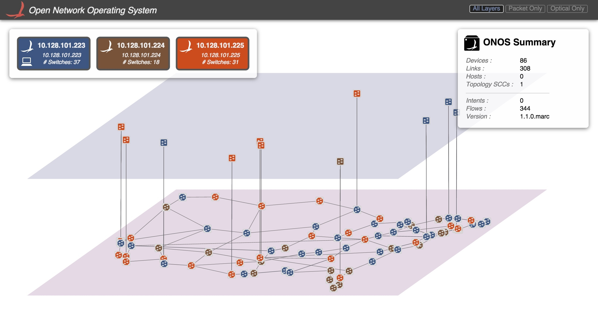

# The Packet Optical Dev Environment

This section describes the environment used for the testing and development of the packet optical use case, using the environment for the [Packet Optical Tutorial](packet-optical-tutorial.md) as the example. In specific, it will outline the steps and components needed to install and run the software required to emulate a packet/optical network, and the ONOS instance(s) used to control them.



---

## Overview

One of the key drivers for this use case is that network designers can spin up a relatively large emulated packet-optical network on their personal computer, and develop applications without relying on a hardware optical network, which may be expensive and/or difficult to come by.

Mininet is the emulation tool that will create all network switches, links, and hosts. The forwarding behavior of the switches is controlled by ONOS using the OpenFlow protocol. The packet switches are based on [Open vSwitch](http://openvswitch.org/) and use OpenFlow 1.0, while the optical switches rely on [LINC-OE](https://github.com/FlowForwarding/LINC-Switch) and use OpenFlow 1.3 (with vendor extensions as defined by the Optical Transport Working Group in [ONF](https://www.opennetworking.org/)).

---

## Installation

The following are the necessary steps to install the required software to emulate a multi-domain network as described above. The setup assumed here is:

* A host for emulating a multilayer network with Mininet and Linc-OE
* One or more hosts running an ONOS instance each
* A deployment host where the ONOS images are built, and deployed from, onto the ONOS hosts

A common way to realize the above is to host the Mininet and ONOS hosts as VM (or container) guests on the deployment host. The minimum requirement is that all hosts above be able to communicate with one another, and have Internet connectivity.

### Mininet

The steps here are based on the instructions for installing Mininet natively found [here.](http://mininet.org/download/) These instructions assume that the Mininet host runs Ubuntu 14.04, x86\_64, and a user:password of mininet:mininet has been set up.

1. Install required packages.

   ```
   sudo apt-get update
   sudo apt-get install erlang git-core bridge-utils libpcap0.8 libpcap-dev libcap2-bin uml-utilities curl vlan
   ```
2. Patch and install Mininet. This is required to connect  the CPqD switches to multiple controllers from Mininet.

   ```
   cd
   git clone git://github.com/mininet/mininet
   cd mininet
   wget 'https://wiki.onosproject.org/download/attachments/4164175/multi_controller.patch?version=1&modificationDate=1443649770762&api=v2' -O multi_controller.patch
   git apply multi_controller.patch
   sudo ./util/install.sh -3fnv
   # role back CPqD to a version known to work
   cd
   cd ~/ofsoftswitch13/
   make clean
   git reset --hard 8d3df820f7487f541b3f5862081a939aad76d8b5
   sudo make install
   cd
   sudo mn --test pingall # this should work
   ```
3. Install Linc-OE

   ```
   cd
   git clone https://github.com/FlowForwarding/LINC-Switch.git linc-oe
   cd linc-oe
   sed -i s/3000/300000/ rel/files/vm.args
   cp rel/files/sys.config.orig rel/files/sys.config
   make
   cd
   git clone https://github.com/FlowForwarding/LINC-config-generator.git
   cd LINC-config-generator
   cp priv/* .
   make
   ```
4. Configure an ONOS development environment. This is required for the Linc-OE portion of the network emulation.

   ```
   cd
   git clone https://github.com/opennetworkinglab/onos
   printf '%s\n' '. onos/tools/dev/bash_profile' >> .profile
   . .profile
   ```
5. For convenience, set up a cell setting the OC variables to the IPs of the clusters.

   ```
   vicell -c optical
   ```

   This opens a new file in the default editor for your environment (set by the `EDITOR` environment variable, which, if unset, will cause `vicell` to use `vi.` `vicell -e <editor>` will set the preference to <editor>). Saving this file will create a cell configuration named 'optical', and load the settings defined in it. A sample cell file might look like the following:

   ```
   export ONOS_NIC=192.168.64.*
   export OC1="192.168.64.45"       # ONOS instance 1
   export OC2="192.168.64.46"       # ONOS instance 2
   export OC3="192.168.64.47"       # ONOS instance 3
   export OCI=$OC1                  # default instance set to instance 1
   ```

   This allows us to reference OC variables, rather than IP addresses, when we run the emulation scripts. The addresses and the number of OC lines above should be changed according to the number of ONOS instances, and address allocation for each.

### ONOS

Step 1 applies to both deployment and ONOS hosts. The rest only apply to the deployment host.

1. Install dependencies as per the Prerequisites section in [Installing and running ONOS](../../../guides/administrator-guide/installing-and-running-onos.md). The link also contains more thorough instructions on the process.
2. Get ONOS and sample application sources and build them.

   ```
   git clone https://github.com/opennetworkinglab/onos
   cd onos
   mvn install -DskipTests -Dcheckstyle.skip
   cd ..
   git clone https://github.com/opennetworkinglab/onos-app-samples
   cd onos-app-samples
   mvn install
   ```
3. Create and apply a cell environment for the ONOS cluster as in Step 5 of the previous section. It should specify `onos-app-optical` and `onos-app-proxyarp` (or `onos-app-fwd`) as a required applications by exporting the value `ONOS_APPS`.

   ```
   # Another cell called 'optical' created with vicell
   export ONOS_NIC=192.168.64.*
   export OC1="192.168.64.45"       # ONOS instance 1
   export OC2="192.168.64.46"       # ONOS instance 2
   export OC3="192.168.64.47"       # ONOS instance 3
   export OCI=$OC1                  # default instance set to instance 1
   export ONOS_APPS="drivers,drivers.optical,openflow,proxyarp,optical"
   ```

   The addresses in this cell file should mirror those in the Mininet environment's cell file. However, for multi-domain scenarios like the one described in [E-CORD Developer Environment](../../cord-central-office-re-architected-as-a-datacenter/e-cord-enterprise-cord/e-cord-developer-environment.md), a cell file should be created for each domain.

---

## Deployment

1. Deploy the ONOS instance(s). From the **deployment host**:

   After building the ONOS package with `onos-package`, or its shorthand, `op`, deploy the image onto the ONOS hosts. If multiple cells exist, the following must be repeated for each cell.

   ```
   $ cell optical
   $ onos-install -f
   ```
2. Start the network emulation. The ONOS source tree comes with two example scripts that create a multi-layer topology. These can be found in `onos/tools/test/topos/` and are called `opticalTest.py` and `opticalTestBig.py`. Try running either; For example, to create spawn a large packet-optical topology, run the following command (note the `-E` parameter passed to `sudo` which preserves the environment variables) from the **Mininet host**:

   ```
   $ cell optical
   $ sudo -E python onos/tools/test/topos/opticalTestBig.py $OC1 $OC2 $OC3
   ```

   The above command uses the three ONOS instances defined in the cell file that has been set up and applied in the Mininet environment. Specifically this ensures that all switches (both packet and optical) will be configured to use the listed instances as their OpenFlow controller(s).

If, for some reason, the script fails to inject the optical topology in ONOS, `onos-topo-cfg` can be used to manually push the topology file generated by the script:

```
$ ~/onos/tools/test/bin/onos-topo-cfg $OC1 Topology.json
$ # Or alternatively, manually against the network config system API e.g. using `curl`
$ curl --user onos:rocks -X POST -H "Content-Type: application/json" http://192.168.56.111:8181/onos/v1/network/configuration/ -d @Topology.json
```

If you get 404 responses back, you should check that you have `onos-rest`(not to be confused with `onlab-rest`) loaded as well.

---

## Verification

At this point, the topology should be viewable by pointing a browser to the ONOS GUI at

```
$OC1/onos/ui
```

It should also be possible to run through the demos described in the [Packet Optical Tutorial](packet-optical-tutorial.md).

---

## Miscellanea

Here are some notes on the various components that may be used in this environment, that didn't fit anywhere.

### opticalUtils.py

The Mininet scripts used for emulating multiplayer networks rely on a library called `opticalUtils.py` under `${ONOS_ROOT}/tools/test/topos/` . This library contains functions that allow Mininet to interact with Linc-OE, and to create and manipulate Linc-OE switches and links like any of its other emulated network device types. As part of building up the Linc-OE-based topology, this script also generates a topology file called `Topology.json` that describes the optical topology. This file is pushed to the ONOS instance(s) to supply it with connectivity information that isn't discoverable through the optical portions of the network.

### LINC console

You can attach to the console of a running LINC instance as follows:

```
$ sudo linc-oe/rel/linc/bin/linc attach
```

In the LINC console, the following commands are available. Please note that Erlang is very picky regarding syntax, so make sure you are not missing any spaces or the dot ('.') at the end of each command!

| Command | Description |
| --- | --- |
| `rp(application:get_all_key(linc)).` | Get running config |
| `linc_logic:get_datapath_id(SwitchId).` | Get DPID of logical switch |
| `linc:stop_switch(SwitchId).` | Stop logical switch |
| `linc:port_down(SwitchId, PortId).` | Disable port |
| `linc:port_up(SwitchId, PortId).` | Enable port |
| `linc:ports(SwitchId).` | List ports on logical switch |
| `linc_us4_oe_flow:get_flow_table(switchId, tableId).` | Get flow table of logical switch (use tableId 0) |

### Monitoring CpQD nodes

The CO fabric is emulated with CpQD software switches, since OpenvSwitch doesn't support some features needed by the fabric.

Under certain conditions, CpQD nodes may fail silently, removing its UNIX socket file(s) from `/tmp/` and becoming unresponsive. For a node named leaf101, the files are named *leaf101* and *leaf101.listen*, the former being the control channel socket, the latter, the datapath listen socket.

Attaching to a CpQD port with `tcpdump` seems to increase the chance of silent failure. Therefore it seems best to monitor CpQD nodes from its logging system, by piping debug output for its packet processing modules to i.e. syslog:

```
#within the script that is build()ing the topology
self.addSwitch('leaf101', cls=UserSwitch, dpopts=current_opts+' --verbose=<VLOG_MODULE>:SYSLOG:DEBUG')
```

(TODO: re-identify which module we want. The list is [here](https://github.com/CPqD/ofsoftswitch13/search?utf8=%E2%9C%93&q=VLOG_MODULE&type=Code).)

### [Static BGP Routes](https://wiki.onosproject.org/display/ONOS/Static+BGP+Routes)

Running the BGP router application requires you to configure and run a local BGP speaker (e.g., Quagga). To eliminate this, we created the option to inject static routes directly into the app.

First, deactivate the running BGP router application, and its router component. The order is important here, unless you like exceptions in your logs.

```
onos> scr:deactivate org.onosproject.bgprouter.BgpRouter
onos> scr:deactivate org.onosproject.routing.impl.Router
```

Then activate the static router component, after which you can reactivate the BGP router app. Again, note the order.

```
onos> scr:activate org.onosproject.routing.impl.StaticRouter
onos> scr:activate org.onosproject.bgprouter.BgpRouter
```

From now on, you can inject static routes into ONOS as follows. The arguments to the `add-route` call are (1) the routing prefix, (2) the next hop's IP, and (3) the next hop's MAC address. For instance:

```
onos> add-route 12.1.1.0/24 192.168.101.1 00:00:C0:A8:65:01
```

Be careful though, as the static router component currently does not implement the full RoutingService interface. This means that, for instance, the `routes` command will not work.
