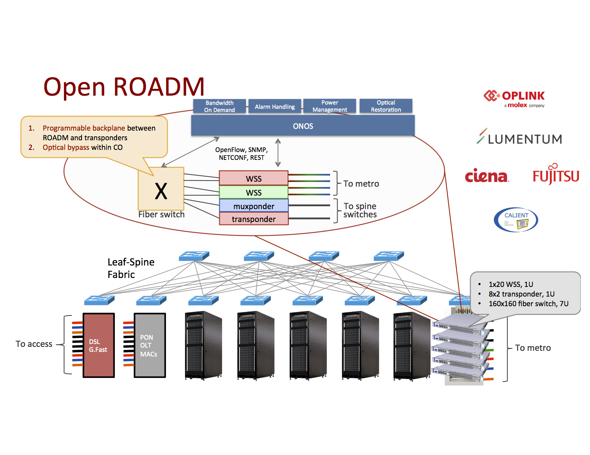

# Open and Disaggregated ROADM

At ON.Lab we envision future networks to consist of white boxes everywhere. This revolution was started in the data center, where people realized commodity hardware is the best way to achieve hyper scale while still guaranteeing performance and reliability. In this context, we should mention the work done by the [Open Compute Project](http://www.opencompute.org/), the de facto standard for all kinds of data center equipment, including servers and packet switches. The [R-CORD project](../cord-central-office-re-architected-as-a-datacenter/cord-central-offices-re-architected-as-datacenters-vcpe-volt-nfaas.md) has taken this one step further by driving commoditization of access network technologies, in particular fiber-based PON hardware. This page deals with our activities around building white box ROADM equipment, the corner stone of optical metro and transport networks.

# Introduction

It turns out that optical transport equipment is one of the last networking industries where vertical integration is the only available choice. The key component is the ROADM (Reconfigurable Optical Add/Drop Multiplexer), a type of optical switch that is usually based on WSS (Wavelength Selective Switch) technology. Today, a handful of vendors / system integrators sell chassis-based, fully integrated solutions that are typically controlled using vendor-proprietary interfaces. The [TL1 protocol](https://en.wikipedia.org/wiki/Transaction_Language_1) is most commonly used and is also around 30 years old; most vendors use TL1 and add their own proprietary messages. On top of this control plane interoperability issue, the data planes from different vendors are also incompatible, meaning

Our work can be considered. To achieve the vision of having both control and data plane interoperability, requires a lot of cooperation and standardization among vendors. The [Open ROADM MSA](http://openroadm.org/), launched by AT&T, Ciena, Fujitsu, and Nokia, is a critical step in this process, that aims to achieve data plane interoperability among vendors.

# Design



At ON.Lab we have built a partnership between some of the leading component and system vendors in the optical networking industry, and built the first disaggregated ROADM using open source software and commodity hardware. We disaggregated based on three ROADM functions:

1. Transponder: the piece that takes in client side signals and generates a line side, narrow band signal. We worked with Fujitsu T100 and Ciena Waveserver.
2. Degree node: the component that performs the actual add/drop function, and controls the power level of individual wavelengths. We have Lumentum and Oplink SDN ROADMs.
3. Backplane: to connect the transponders and degree nodes, we can either do static/manual connections, or use a programmable backplane. We used a 3D MEMS-based fiber switch from Calient.

Additional components that will be integrated in the near future are muxponders (consider this a more capable transponder), as well as inline fiber amplifiers and optical protection switches, ultimately leading to a fully open line system.

# Interfaces

The table below summarizes the different APIs that each component must support. These ensure ONOS core can detect the device and its capabilities, drive cross connect provisioning, and configure various parameters on the devices such as power, alarms, and transmission values.

| API | Transponder | Degree | Backplane | Amplifier | Protection Switch | Description | Notes |
| --- | --- | --- | --- | --- | --- | --- | --- |
| ``` DeviceProvider ``` | (tick) | (tick) | (tick) | (tick) | (tick) | Discover device and its ports, and register available resources | Relies on PortDiscovery and LambdaQuery behaviors |
| ``` FlowRuleProgrammable ``` | (tick) | (tick) | (tick) |  |  | Provisioning of cross connections |  |
| ``` PortAdmin ``` | (tick) | (tick) | (tick) | (tick) | (tick) | Enable and disable ports |  |
| ``` TransponderConfig ``` | (tick) |  |  |  |  | Get/set transponder parameters (power, modulation, FEC, ...) | Under development |
| ``` PowerConfig<Direction> ``` |  | (tick) | (tick) | (tick) | (tick) | Get/set power levels on a port basis | Depending on technology used, backplane and protection switch are read-only |
| ``` PowerConfig<OchSignal> ``` | (tick) | (tick) |  |  |  | Get/set power levels on a wavelength basis |  |
| ``` AlarmConfig ``` | (tick) | (tick) | (tick) | (tick) | (tick) | Configure alarms, priorities, policies, ... | Under development |
| `ProtectionConfig` |  |  | (tick) |  | (tick) | Configure automatic protection switching |  |

In terms of control protocols, many of the devices we use are prototypes and thus there is a lot of diversity. It is clear however that the optical networking industry is rapidly moving towards a NETCONF/YANG solution.

# Applications

Disaggregation implies some of the functions that are traditionally integrated on the devices, need to be virtualized and as such (partially) moved to the network OS. Two such functions are of great importance in optical networks.

1. Power management: balancing the power levels of wavelengths across the network is
2. Fault management and correlation: a single fault will lead to multiple alarms going off in the disaggregated ROADM. We need intelligent applications that can perform correlation between these alarms, identify the root cause of the alarm, and take the necessary steps to solve the problem or bypass the affected area.

The API work

# Resources

TODO

* Start by reading the page on ONOS' [resource service](../../guides/architecture-and-internals-guide/resource-service.md)
* Implement `LambdaQuery` to register wavelength resources as part of your driver, automatically called by `ResourceDeviceListener` when a device/port is registered  
  FlexGrid support, show code sample to convert to/from fixed to flex
* How are OTN resources registered?
* Resources are typically consumed in intent compilers, but can be allocated by applications as well  
  Be sure to release when you are done!
* Discuss performance levels of resource subsystem

# Future work

Here's a list of additional topics that need work, and we kindly invite the community to work with us and tackle some of these challenges.

* Some of the APIs are still under development and require low level expertise to ensure we are creating the right abstractions.
* Align with the [Open ROADM](http://openroadm.org) MSA.
* Integration with the [OpenConfig project](http://www.openconfig.net/).
* Inventory control and automatic discovery of devices, links, ports, and capabilities.
* Automatic protection switching: to achieve low latency (sub 50ms) switching to backup paths, support from the data plane is required.
* Applications as described above, integrate planning and provision tools, autonomic networks
