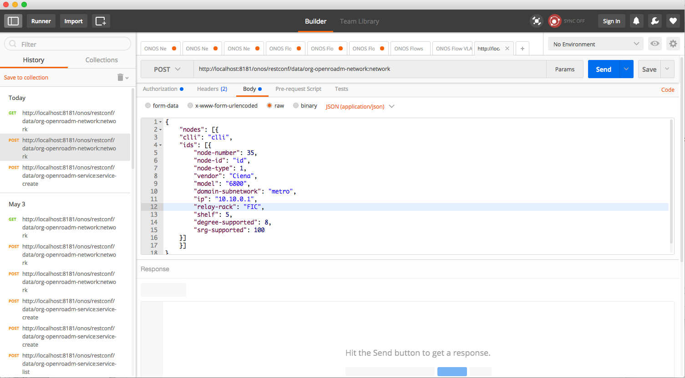
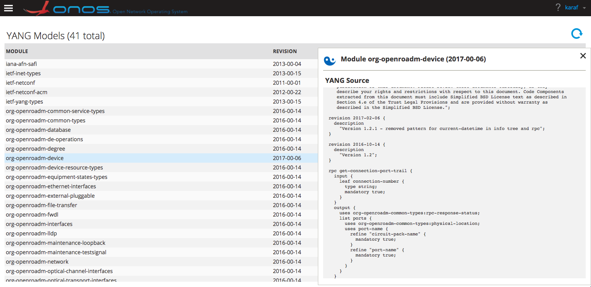

# Open ROADM MSA

Welcome to the ONOS Open ROADM application.  
  
This ONOS app consists of the [Open ROADM](http://www.openroadm.org) YANG data models compiled to Java, and registers the schema into the YANG runtime where it becomes available to the dynamic config subsystem and the NETCONF/RESTCONF serializers.  
  
Service implementers have access to the complete data model in Java. Alternatively, one can interact with the different data models using RESTCONF / NETCONF northbound APIs. A distributed store for dynamic configuration data is automatically maintained by ONOS. All of this functionality is available for the device, network and service models defined by Open ROADM.  
  
This application supports the latest available version of Open ROADM MSA Version 1.2.1 (released Feb 6th, 2017).

---

# What is the Open ROADM MSA?

The Open ROADM Multi-Source Agreement (MSA) defines interoperability specifications for Reconfigurable Optical Add/Drop Multiplexers (ROADM). Included are the ROADM switch as well as transponders and pluggable optics. The specification covers both optical interoperability as well as YANG data models. Please refer to [http://www.openroadm.org](http://www.openroadm.org/) for more information.

# Installation

Start by building the `openroadm` app as follows. In the next release we will add it to the list of core ONOS apps so it is built as part of an ONOS build.

```
$ cd onos/apps/openroadm
$ buck build //apps/openroadm:onos-apps-openroadm-oar --show-output
```

Now you are ready to simply load and activate the application in ONOS, and be sure to use the correct host (`localhost` in this case) and path to the oar file (use `--show-output` to build).

```
$ onos-app localhost install! onos/buck-out/gen/apps/openroadm/onos-apps-openroadm-oar/app.oar
```

The application automatically loads the following dependencies:

* `org.onosproject.yang` (the new ONOS YANG subsystem)
* `org.onosproject.yms` (this is an older release of the ONOS YANG subsystem and will be removed in an upcoming release)
* `org.onosproject.config` (the dynamic config subsystem)
* `org.onosproject.restconf` (the RESTCONF client)
* `org.onosproject.protocols.restconfserver` (the RESTCONF server)
* `org.onosproject.netconf` (the NETCONF library)
* `org.onosproject.netconfsb` (the NETCONF southbound client)
* `org.onosproject.yang-gui` (to visualize the model in the ONOS UI)

# How to Run

The following [deck](https://drive.google.com/open?id=1wYupFCf617aY9_zSf9U83q8IntjgSUWtr5_EuAsgSP8) shows the steps needed to perform dynamic configuration of device and services in ONOS.

At this point, the `openroadm` app is loaded and activated. You can use the RESTCONF northbound to interact with the service, network and device models. REST resources are exposed through [http://localhost:8181/onos/restconf/data/](http://localhost:8181/onos/restconf/data/org-openroadm-network:network).

For example, we can use [POSTMAN](https://www.getpostman.com/) to create the following network configuration. A simple GET on the same URL will verify the state of the dynamic configuration store.



Finally, you can also inspect the YANG models using the ONOS UI (access it via <http://localhost:8181/onos/ui>).



# Development Notes

## YANG Models

In order to successfully compile the YANG models, standard models were added to the tree, as well as a few changes were introduced.  
  
The standard models that were included are:

* [ietf-yang-types (revision 2013-07-15)](http://dld.netconfcentral.org/src/ietf-yang-types@2013-07-15.yang)

* [ietf-inet-types (revision 2013-07-15)](http://dld.netconfcentral.org/src/ietf-inet-types@2013-07-15.yang)

* [ietf-netconf (revision 2011-06-01)](http://dld.netconfcentral.org/src/ietf-netconf@2011-06-01.yang)

* [ietf-netconf-acm (revision 2012-02-22)](http://dld.netconfcentral.org/src/ietf-netconf-acm@2012-02-22.yang)

* [iana-afn-safi (revision 2013-07-04)](http://dld.netconfcentral.org/src/iana-afn-safi@2013-07-04.yang)

We deleted the following YANG model because the YANG parser was not able to deal with the augment block. This will be fixed in an upcoming release.

* `org-openroadm-optical-multiplex-interfaces.yang`

We commented out the following extension definitions, as well as any reference to these extensions. This will also be fixed in an upcoming release.

* `nc:get-filter-element-attributes`

* `nacm:default-deny-all`

* `nacm:default-deny-write`

Finally, we used ONOS YANG tools version 1.12.0-b7.

## Service and Device Modeling

As it stands, the application registers the service, network and device models in the dynamic config runtime. These models are completely independent of each other, which basically means that making an operation on the service model *will not* lead to any device configuration. Linking these models can be done either externally through some orchestration component ([ONAP](https://www.onap.org/) comes to mind), or by extending the current `openroadm` application.

The general structure of this application is based on adding listeners to the dynamic config subsystem, and reacting in the desired way when service or device configurations are made. For an example implementation please refer to the [L3VPN](../../new-projects/l3vpn.md) app, in particular the `NetL3VpnManager`.

# Known Issues

* RESTCONF RPC support is currently under development, and will be completed by mid May.
* Asynchronous device notifications are currently not escalated to the northbound interface.

# Useful Links

To learn more about the Open ROADM MSA, check out <http://www.openroadm.org> and the [GitHub page](https://github.com/OpenROADM/OpenROADM_MSA_Public).

To better understand the ONOS YANG runtime, refer to the following [page](../../guides/developer-guide/onos-software-development/yang/yang-runtime.md).

Design considerations for the dynamic configuration subsystem in ONOS are detailed [here](https://drive.google.com/open?id=1nh_peaC9PkfuwqpaTDUsmR1U8Q7cKd8jcut4wLdki3U).

Please report bugs or post your questions on one of the [ONOS mailing lists](../../community-information/mailing-lists.md) or the [dynamic configuration brigade](../../community-information/brigades/dynamic-configuration-brigade.md).
