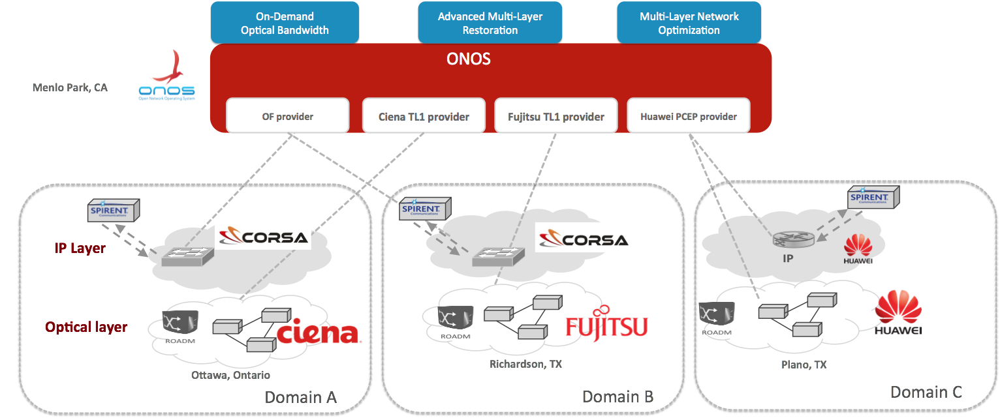

# Packet Optical Resources

### Publications and Presentations

* Tom Tofigh (AT&T), Marc De Leenheer (ON.Lab)  
  **[Converged Packet-Optical Software Defined Networking](http://eda.mediasite.com/mediasite/Play/f308d20ff94d4dce81ef95d8da1a1cf31d)**  
  IEEE Computer Society Chapter of Santa Clara Valley, Sep 15, 2015.
* Marc De Leenheer (ON.Lab), Guru Parulkar (Stanford University & ON.Lab), Tom Tofigh (AT&T)  
  **[Control of Packet-over-Optical Networks](../../../assets/2015-03-24_sdn-control-of-packet-over-optical-networks.pdf)**  
  Optical Fiber Communication Conference and Exhibition (OFC), March 24, 2015.
* **[SDN Control of Packet-Optical Networks](http://onos.wpengine.com/wp-content/uploads/2014/11/SDN-Control-of-Packet-Optical-Use-Case.pdf)**
* **[ONS2015 demo slide deck](https://wiki.onosproject.org/download/attachments/3444270/Final-ONOS-multi-layer-network-control-demo-showfloor.pptx?version=1&modificationDate=1435185117327&api=v2)**

### Multi-Vendor Packet/Optical Networks

### Demo - ONS2015 (June 2015)

### 

This proof of concept was demonstrated at [ONS 2015](http://opennetsummit.org/conference/). It shows ONOS controlling a multi-layer **hardware** network that is composed of **different vendors** and uses different protocols. The key to realizing this is to maintain the ONOS core vendor-neutral, while all the protocol and vendor proprietary details are hidden in the southbound providers.

To control the optical layer, we worked with our partners [Ciena](http://www.ciena.com/) and [Fujitsu](http://www.fujitsu.com/) to develop TL1 providers, as well as a PCEP provider in collaboration with [Huawei](http://www.huawei.com/). The demo also featured packet switches from [Corsa](http://www.corsa.com/) controlled via OpenFlow 1.3, and [Spirent](http://www.spirent.com/) traffic generators.

You can download the slide deck presented along with the demo [here](https://wiki.onosproject.org/download/attachments/3444270/Final-ONOS-multi-layer-network-control-demo-showfloor.pptx?version=1&modificationDate=1435185117327&api=v2).

### Open Source Multi-Layer Reference Platform

### Demo - ONOS Release Party (Dec 2014)
