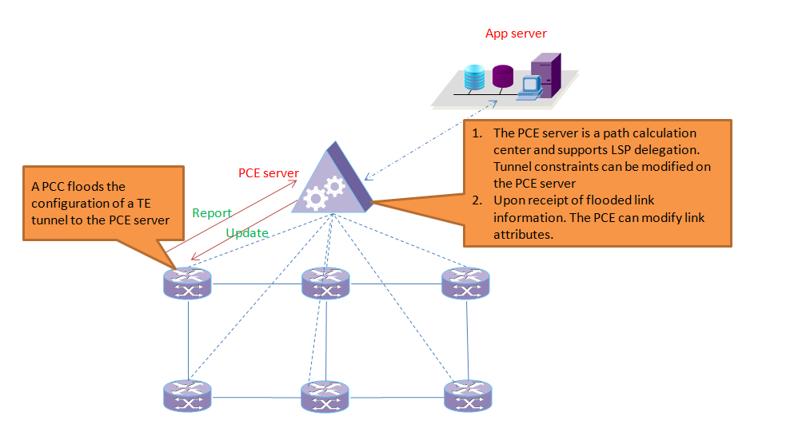

# PCE+

## Team

| Name | Organization | Email |
| --- | --- | --- |
| Li Zhenbin | Huawei | [lizhenbin@huawei.com](mailto:lizhenbin@huawei.com) |
| Jiang Rui | Huawei | [henry.jiangrui@huawei.com](mailto:henry.jiangrui@huawei.com) |
| Lu Kai | Huawei | [lukai1@huawei.com](mailto:xushiping7@huawei.com) |

## PCE+ Introduction

The Path Computation Elememt Communication Protocol(PCEP) enables a PCE server to calculate paths for all path calculations clients(PCCs) based on MPLS TE.PCE was developed to calculate inter-domain MPLS paths on a large network with multiple domains. Traditional PCE runs an IGP to learn network-wide topology informations.

Developed based on the conventional PCE, PCE+ delegates routes to a PCE server so that they send Report messages to allow the PCE server to manage delegated label switched paths(LSPs), The PCE server uses delegated LSP information to generate a network-wide Resouce Reservation Protocol-TE(RSVP-TE) LSP database(LSPDB). The PCE server uses information stored in the LSPDB to optimize paths and sends Update messages to deliver updated path information to routers. Upon receipt od the path information, the routers implement make-before-break(MBB) to reestablish LSPs over optimized paths. The routers then report LSP information to update LSPDB on the PCE server.

In PCE+, the PCE server runs an Interior Gateway Protocol(IGP) to collect network-wide TE link information and runs PCEP to collect network-wide RSVP-TE LSP information. The PCE then uses the TE and LSP information to calculate paths for all routers on the network MPLS TE tunnels, however, are established and maintained using RSVP-TE running on PCCs.

## Typeical PCE+ Service Scenario

