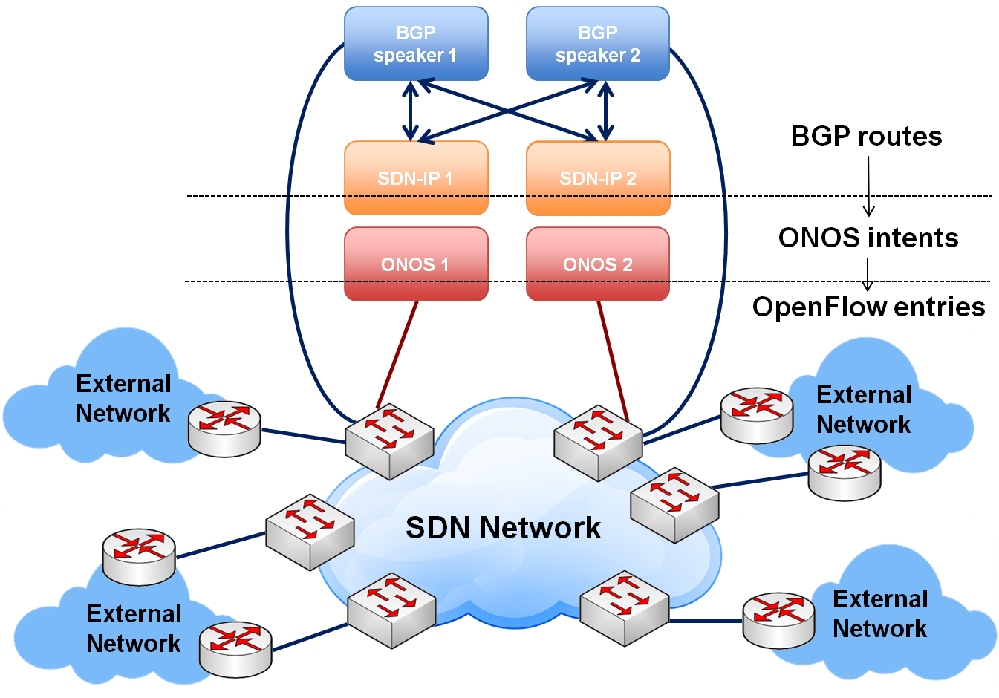
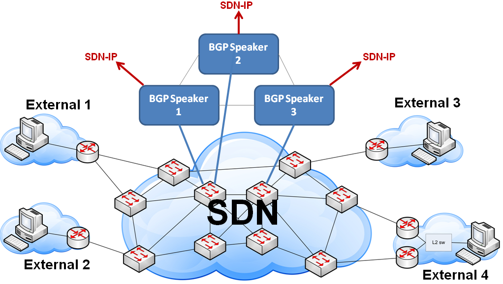
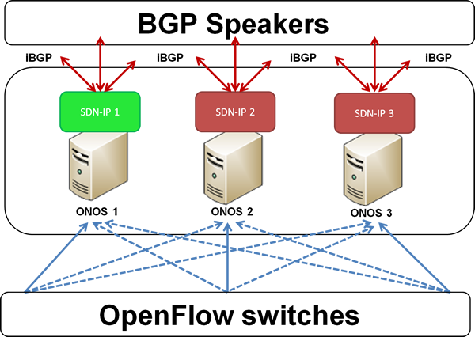

# SDN-IP Architecture

This section provides information about the design, implementation, and operation of SDN-IP and its subsystems.

## Introduction

SDN-IP is an ONOS application that allows a Software Defined Network to connect to external networks on the Internet using the standard Border Gateway Protocol (BGP). Externally, from a BGP perspective, the SDN network appears as a single Autonomous System (AS) that behaves as any traditional AS. Within the AS, the SDN-IP application provides the integration mechanism between BGP and ONOS. At the protocol level, SDN-IP behaves as a regular *BGP speaker*. From ONOS perspective, it’s just an application that uses its services to install and update the appropriate forwarding state in the SDN data plane.

## Architectural goals

SDN-IP has been designed with the following goals in mind:

* **Compatibility -** SDN-IP can be integrated with networks that already use BGP - externally, internally, or both.
* **Operational flexibility -** SDN-IP can run on one or multiple ONOS instances. Moreover, SDN-IP can be used in a variety of BGP deployment scenarios: full-mesh BGP, BGP Route Reflectors, BGP confederations, and with BGP Route Servers.
* **High availability -** SDN-IP provides HA within the application itself. The SDN-IP service keeps working seamlessly, as long as there is at least one instance of the SDN-IP application running. In addition, SDN-IP leverages the HA mechanisms provided by ONOS for maintaining a consistent forwarding state in the data plane.
* **Scalability -**Large-scale Software Defined Networks can be controlled by using BGP-based Confederations and multiple ONOS clusters, each running SDN-IP.
* **Protocol compatibility and vendor independence -** SDN-IP relies on the standard BGP protocol for exchanging network information, and does not require any proprietary or vendor-specific extensions.

## Overview

The following figure summarizes the architecture described below:

In a typical deployment scenario, an SDN-IP controlled network acts as a transit *Autonomous System* (AS) interconnecting different IP networks. Each external network is a different AS domain, which interfaces with our SDN network through its BGP-speaking *border routers*.

The SDN-IP network is composed of OpenFlow switches controlled by ONOS. While SDN-IP can be used even with a single ONOS instance, for high availability and scalability, there should be a cluster of ONOS instances, where some of those instances run the SDN-IP application.

Within the SDN-IP network, there are one or more internal BGP speakers. The BGP speakers can be existing BGP routers or any software that implements BGP.  The speakers use eBGP to exchange BGP routing information with the border routers of the adjacent external networks, and iBGP to propagate that information amongst themselves and to the SDN-IP application instances.

The routes advertised by the external border routers belonging to external networks are received by the BGP speakers within the SDN-IP network, processed, and eventually re-advertised to the other external networks. The routes are processed according to the normal BGP processing and routing policies. Similarly, those routes are also advertised to the SDN-IP application instances which act as iBGP peers. The best route for each destination is selected by the SDN-IP application according to the iBGP rules, and translated into an ONOS *Application Intent Request*. ONOS translates the Application Intent Request into forwarding rules in the data plane. Those rules are used to forward the transit traffic between the interconnected IP networks.

In addition, SDN-IP creates the appropriate ONOS Intents that would allow the external BGP routers to peer with the BGP speakers by using the data plane. Thus, BGP itself can also detect failures in the data plane that affect the transiting traffic and act accordingly.

Among the SDN-IP application instances, each instance receives and contains exactly the same set of BGP routes (and the corresponding Application Intent Requests), but only one instance, the *SDN-IP Leader,* is responsible for making the appropriate ONOS API calls to install the necessary intents at any given time.

## The *Application Intents* used by SDN-IP

Below is a brief description of the two types of Application Intents used by SDN-IP. More information the ONOS Intent Framework is available [here](../../guides/architecture-and-internals-guide/intent-framework.md).  

### Single-point to single-point intents

These are uni-directional intents used to establish the BGP peering session between the external routers and the SDN BGP speakers. Each Intent connects two single attachment points in the SDN network. Each attachment point contains the following information: SDN switch DPID and switch port, and the MAC address of the attached BGP speaker/router.

### Multi-point to single-point intents

These are uni-directional intents used to connect the hosts of the external networks together. Each intent is associated with an IP prefix (the IP destination), and connects the ingress attachment points of the SDN network with a single egress attachment point - the best next-hop router toward the destination IP prefix. At the ingress edge of the SDN network, an IP packet is matched on the IP destination address. The forwarding entry for the best (longest network prefix) match is selected to forward the packet toward the corresponding egress attachment point. In addition, right before the packet is forwarded, the “change destination MAC address” action is applied such that the data packet will contain the MAC address of the egress IP router toward the destination.

## SDN data plane connectivity

The data plane of the SDN-IP network is used for the following:

* To carry the BGP control traffic between the internal BGP speakers and the external BGP routers (the eBGP peerings).
* To carry the transit data traffic among the external IP networks that traverses the SDN-IP network.

 The eBGP control traffic is associated with each eBGP peering. Such traffic is point-to-point, bidirectional, and the end-points are relatively statically predefined, based on the eBGP peering configuration. The path between the end-points might change as a result of a data plane failure. Such failures are automatically detected and the associated intents rerouted by ONOS itself. Currently, the specific attachment point related to each BGP speaker and the external BGP router need to be configured manually in the SDN-IP configuration file. In the future, this requirement will be eliminated.

The paths for the transit data traffic are defined by the BGP routes advertised by the external BGP peers. Similarly to a regular BGP deployment, those routes can be relatively dynamic and their number can be very large. If a BGP peer advertises a route for a specific IP prefix, and is chosen as the best next-hop for this route, SDN-IP is responsible for creating the corresponding data paths. All traffic destined to that IP prefix entering from the remaining external IP networks needs to be forwarded toward the best external next-hop BGP router. Within the context of the ONOS Application Intents, this is achieved by creating a Multi-point-to-single-point Application Intent for the IP prefix: the egress router (i.e., the best next-hop router) is the single (egress) point for the Intent and the remaining external BGP routers are the (ingress) multi-points for the Intent.

The SDN-IP application is responsible for generating Multi-point-to-single-point Application Intent requests and for updating those Intents in response to the BGP routing dynamics. ONOS itself is responsible for compiling those requests, installing the corresponding forwarding flows in the data planes of the switches and for rerouting the intents in case of failures within the SDN network itself.

## SDN control plane connectivity

The BGP speakers within the SDN network and the SDN-IP application instances communicate using iBGP. The peering sessions are created in the control plane, hence each BGP speaker needs to be connected to it.

 The BGP speakers and the SDN-IP application instances are interconnected like in any BGP deployment: a full iBGP mesh, route reflectors, etc. The only difference is that the SDN-IP instances do not need iBGP peerings among themselves; i.e., they only need to interconnect with the BGP speakers.

 SDN-IP implements a subset of the iBGP protocol: it only receives and processes BGP routing information from the BGP speakers, but it never originates or retransmits BGP routes.

Once SDN-IP receives the advertisements from the external routers (received via the BGP speakers), it transforms the routing informations into intent requests to ONOS. ONOS itself then translates them into OpenFlow entries on the switches.

Since the BGP speakers use iBGP to propagate the routing information to the SDN-IP application instances, it is important to inter-connect them as in a regular BGP deployment: through a full mesh or using a route reflector server. Thus, we can utilize the failure resistance provided by BGP itself. Note that no iBGP peering is needed between the SDN-IP application instances: the peering is between the BGP speakers and the SDN-IP application instances.

## High Availability Support

SDN-IP provides support for high availability using a hot-standby model. The SDN-IP application can be loaded on multiple ONOS instances. All SDN-IP applications listen to route updates coming from BGP, but only one SDN-IP instance is designated to be the primary instance who is responsible for pushing intents to ONOS. If the primary instance fails, one of the remaining instances becomes the new primary who continues pushing intents to ONOS based on BGP updates.

 SDN-IP uses the ONOS leader election service to select the primary SDN-IP instance. We need to ensure only one instance is pushing intents at any one time to prevent incorrect intents being pushed to ONOS. When each SDN-IP instance starts up, it contests the leader election and tries to become leader. The leader election ensures that only one instance can be leader at any one time. When the current leader fails, the election mechanism detects the failure and allows another instance to take over the leadership. A new leader first performs intent synchronization which ensures the intents are up-to-date with the BGP routes that leader has learnt. Once synchronization is complete, the leader continues with its normal job of installing and removing intents in response to BGP updates.

Even though the SDN-IP application supports HA, the system is still vulnerable to component failures unless there is redundancy in both the internal BGP speakers and the BGP peering sessions. Each SDN-IP instance is capable of receiving BGP updates from multiple BGP speakers, which enables multiple internal BGP speakers to be deployed within the SDN network. For a full HA solution, the SDN AS should have multiple peering sessions with each external AS, and each peering session to the same AS should be terminated at a different BGP speaker. In this way, the system can survive failures of the internal BGP speakers as well as any data plane elements that the BGP traffic traverses.

## Limitations

The current implementation of the SDN-IP application has the following limitations:

* The SDN-IP application listens by default for incoming BGP connections on the non-standard port 2000. This not the standard port normally used for BGP connections, which is 179. The port number is configurable and it may be possible to configure port 179, but a processes must be run as root to bind to a protected port. Running ONOS as root is currently not supported.
* SDN-IP doesn’t load balance its work amongst ONOS instances. All the work is performed by a single “Leader” instance at any one time. The leader can fail over to backup instances if an instance fails however.
* There are no explicit iBGP sessions configured on the SDN-IP application side: by default the SDN-IP application will accept all BGP Open messages and will self-configure to use the AS number of the originating BGP speaker.
* Currently only IPv4 is supported.
* Peering sessions between external BGP routers and internal BGP speakers must used TCP port 179 for one side of the peering connection. Only TCP connections to/from port 179 are allowed in and out of the SDN network for the peering IP addresses.
* In version 1.0.0 the system can handle approximately 15,000 routes due to limitations in the intent framework.
