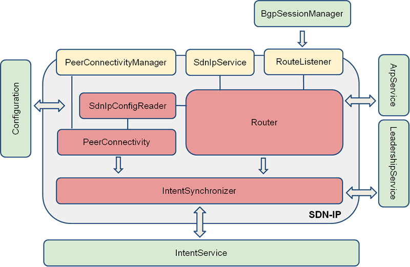
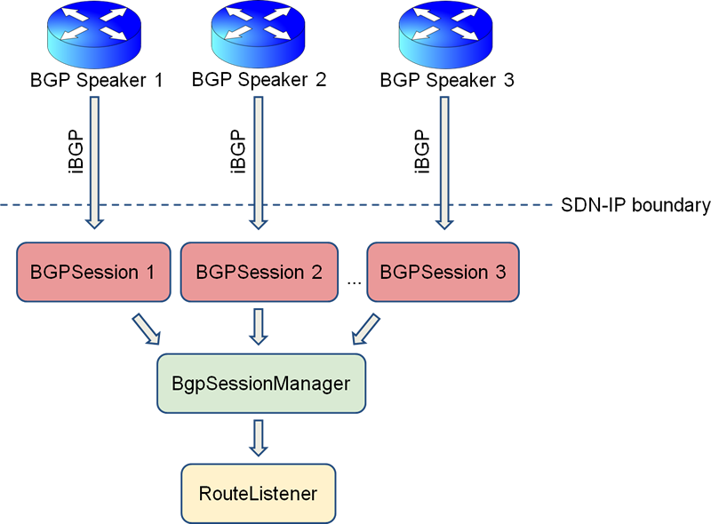

# SDN-IP Developer Guide

NOTE: This information concerns the Avocet release of ONOS/SDN-IP, and is outdated for more recent releases. Please refer to the Javadocs for the most up-to-date information.

This page describes the building-blocks components of SDN-IP and how they interact together. This is a deeper view of the SDN-IP component, created specifically for developers interested in contributing to the code base.

 

## Software Modules

The following figure illustrates the SDN-IP application components, and the relationship among those components.

The gray box represents the SDN-IP module, consisting of different well-defined components, while the green boxes represent the external ONOS services that SDN-IP depends on. The yellow boxes represent the SDN-IP interfaces exposed to the external modules, while the red boxes are the Java classes that implement a specific interface. The main SDN-IP application components are:

* **SdnIpConfigReader -** it is responsible for reading the SDN-IP configuration (e.g., the BGP speakers attachment points).
* **PeerConnectivity -** it is responsible for creating the corresponding ONOS Application Point-to-point Intents for the eBGP peerings, and for submitting those intents to the IntentSynchronizer component.
* **BgpSessionManager -**it is responsible for maintaining the iBGP sessions, decoding the BGP routing updates, and selecting the best route toward a specific destination (IP prefix).
* **Router -**The central SDN-IP internal component. It is responsible for receiving the best BGP routes from the BgpSessionManager through the RouteListener interface. It uses the ONOS ARP Service to resolve the MAC address for the best next-hop router toward a destination, generates the corresponding Multi-point-to-single-point Application Intent, and submits this Intent to the IntentSynchronizer component.
* **IntentSynchronizer -**it is responsible for collecting all the SDN-IP Application Intents and for submitting them to ONOS by using the ONOS IntentService. Note that submitting the Intents to ONOS happens only on the elected SDN-IP Application Leader. Also, if a new SDN-IP Leader is elected, this component is responsible for the synchronization of the SDN-IP intents as received from the Router component with the SDN-IP Intents that have been already submitted to ONOS.

The SDN-IP application uses the following ONOS services:

* **Configuration -**this service is used for accessing ONOS configuration.
* **ArpService -**this service is used to resolve the MAC addresses of the best next-hop IP addresses for the routes (i.e., the IP addresses of the directly attached eBGP routers).
* **IntentService -** this service is used to submit Intent requests. The translation between Intent requests and OpenFlow entries, and the installation of the OpenFlow entries into the switches is handled by ONOS itself. This process is totally transparent to the SDN-IP application.
* **LeadershipService -** this service is used to elect the SDN-IP Application Leader. The Leader is responsible for submitting the Intent requests. The remaining SDN-IP instances are in stand-by mode in case of a Leader failure.

## The BgpSessionManager

The BgpSessionManager is responsible for interfacing with the BGP speakers. It listens for incoming iBGP connections, and creates a BgpSession instance per-session. The BgpSession instance is responsible for the following:

* Receiving and decoding the BGP protocol messages.
* Generating and transmitting the necessary BGP control messages (BGP Open and the periodic BGP Keepalive messages) that are needed to establish and maintain the BGP session.
* Generating BGP notifications if a BGP error is detected (as defined by the BGP protocol specification).
* Translating the BGP Update control messages into BGP routing updates that are submitted to the BgpSessionManager.

The BgpSessionManager collects all the BGP routing updates from the iBGP peers, and uses the BGP rules to select the best next-hop router for each IP routing prefix. Then it generates the corresponding routing entries and submits them to the RouteListener. The following figure summarizes this function:

## Interaction with the ARP Service

 

The ARP Service is used to resolve the MAC address of each IP address that is used as the best next-hop router. The number of such IP addresses is limited by the number of the external eBGP routers. SDN-IP subscribes for receiving the ARP updates for each potential next-hop IP address. If a BGP routing update is received before the MAC address is resolved, the routing update is placed into a queue until the address is resolved.
