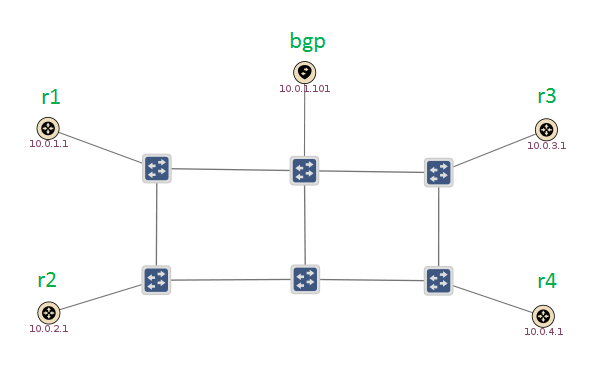
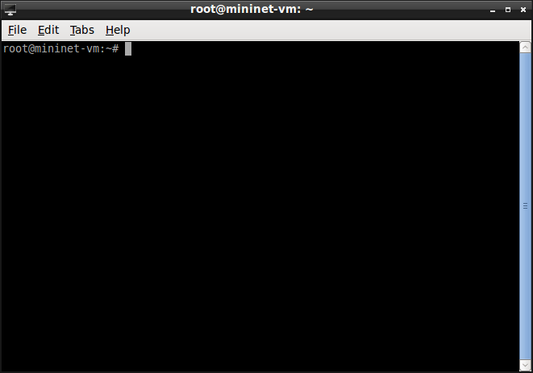

# SDN-IP Tutorial

# Getting Started

This tutorial is an introduction to how SDN-IP runs in practice. We'll go through starting up a simple emulated network, and we'll see how SDN-IP controls this network to move data from place to place.

If you haven't done so already, it's highly recommended that you go through the [ONOS Tutorial](../../tutorials/basic-onos-tutorial.md) first. This will give you some familiarity with the basic functionality of ONOS. In addition, you should read through the [SDN-IP Architecture](sdn-ip-architecture.md) document to get an overview of how SDN-IP works.

If you've already gone through the ONOS tutorial, you'll already have the ONOS tutorial VM available. If not, check out the [Introduction](../../tutorials/basic-onos-tutorial.md) section of the ONOS tutorial to get the VM set up. However, don't log in as tutorial1 - we have a different username for this tutorial.

## Resetting

We have provided a simple mechanism which allows you to restart the tutorial from scratch. Simply, click on the "Reset" icon on your desktop and this will reset ONOS to its initial state. It'll take a few seconds for ONOS to restart and during that time you may not be able to launch your ONOS cli.

## Starting the tutorial

When you start the VM, you'll be presented with a login screen. (If you're already logged in to another tutorial, please log out by clicking the bottom-left icon, clicking "Logout", then click "Logout" again).

Each tutorial in the VM is presented as a different user. Log in to the SDN-IP tutorial user with the following credentials:

Username: **sdnip**  
Password: **sdnip**

You'll be deposited on a desktop with a bunch of icons that will be used for the tutorial. Before we get started, double-click on the "Reset" icon. This will pop up a terminal to start ONOS and make sure there is no state left over from any other tutorials.

# The network topology

We've prepared a simple emulated [Mininet](http://mininet.org/) topology, which contains some OpenFlow switches to make up the SDN network. Connected around the edges of the SDN network are emulated routers. The routers run a piece of software called [Quagga](http://www.nongnu.org/quagga/), which is an open-source routing suite. Note that it is not mandatory to use Quagga; any software/hardware capable of speaking BGP will do. In our case we run the BGP part of Quagga on them, to simulate external BGP routers belonging to other administrative domains. The goal of SDN-IP is to be able to talk BGP with these routers in order to exchange traffic between the different external ASes.



This figure shows the topology as observed by ONOS. We can see 6 blue OpenFlow switches, and 5 peripheral nodes with yellow icons.

* The node labelled "bgp" is our *Internal BGP Speaker*. It sits inside our SDN network and its job is to peer with all the *External BGP Routers*, learn BGP routes from them, and relay those routes to the SDN-IP application running on ONOS.
* The other four nodes, labelled r1 through r4, are the *External BGP Routers*. They are the border routers that reside in other networks that want to exchange traffic with us.
* Behind each router is a host. These are labelled h1 through h4 in Mininet. ONOS can't see these hosts, because they reside in other networks that are not controlled by ONOS.

## Start up ONOS

First double-click the "Reset" icon on the network to clean the environment and start up ONOS with the correct configuration.

## Start up the network

Double-click the "SDN-IP Mininet" icon on the desktop to start up the network.

We can look at the configuration of the hosts in the Mininet terminal.

```
mininet> h1 ip addr show
...
    inet 192.168.1.1/24 brd 192.168.1.255 scope global h1-eth0
...
 
mininet> h2 ip addr show
...
    inet 192.168.2.1/24 brd 192.168.2.255 scope global h2-eth0
...
```

Each host is in a different IP subnet. When SDN-IP is up and running, these hosts will be able to communicate with one another despite being in different networks. This is because the SDN network is able to route traffic based on BGP routes.

Also, double-click the "ONOS" icon on the desktop to start up the ONOS console. If you run the "devices" command, you should see the network has started up and connected to ONOS.

```
onos> devices
id=of:00000000000000a1, available=true, role=MASTER, type=SWITCH, mfr=Nicira, Inc., hw=Open vSwitch, sw=2.3.0, serial=None, protocol=OF_10
id=of:00000000000000a2, available=true, role=MASTER, type=SWITCH, mfr=Nicira, Inc., hw=Open vSwitch, sw=2.3.0, serial=None, protocol=OF_10
id=of:00000000000000a3, available=true, role=MASTER, type=SWITCH, mfr=Nicira, Inc., hw=Open vSwitch, sw=2.3.0, serial=None, protocol=OF_10
id=of:00000000000000a4, available=true, role=MASTER, type=SWITCH, mfr=Nicira, Inc., hw=Open vSwitch, sw=2.3.0, serial=None, protocol=OF_10
id=of:00000000000000a5, available=true, role=MASTER, type=SWITCH, mfr=Nicira, Inc., hw=Open vSwitch, sw=2.3.0, serial=None, protocol=OF_10
id=of:00000000000000a6, available=true, role=MASTER, type=SWITCH, mfr=Nicira, Inc., hw=Open vSwitch, sw=2.3.0, serial=None, protocol=OF_10
```

# Running SDN-IP for the first time

If you try and ping between any two hosts right now, you'll notice nothing is working.

```
mininet> h1 ping h2
PING 192.168.2.1 (192.168.2.1) 56(84) bytes of data.
From 192.168.1.254 icmp_seq=1 Destination Net Unreachable
From 192.168.1.254 icmp_seq=2 Destination Net Unreachable
From 192.168.1.254 icmp_seq=3 Destination Net Unreachable
```

Even though ONOS is running and connected to switches, there are no applications loaded so there is nothing to tell ONOS how to control the network. We can also use the summary command to verify there are no flows or intents in the network.

```
onos> summary
node=10.0.3.11, version=1.2.1.sdnip~2015/07/14@16:50
nodes=1, devices=6, links=14, hosts=5, SCC(s)=1, flows=18, intents=0
```

## Install the application

First we need to install some helper applications that SDN-IP relies on. These apps let ONOS read in various configuration files and respond to ARP requests between the external routers and internal BGP speakers.

```
onos> app activate org.onosproject.config
onos> app activate org.onosproject.proxyarp
```

Now, let's install the SDN-IP application so we can get some traffic flowing between our networks.

```
onos> app activate org.onosproject.sdnip
```

A lot happens as soon as we install the SDN-IP application. The first thing it does is install point-to-point intents to allow the external BGP peers to communicate with our internal BGP speaker. This allows the external BGP routers to relay the routes that are capable of forwarding through to SDN-IP.

We can see the routes that SDN-IP has learnt with the "routes" command.

```
onos> routes
   Network            Next Hop
   192.168.1.0/24     10.0.1.1       
   192.168.2.0/24     10.0.2.1       
   192.168.3.0/24     10.0.3.1       
Total SDN-IP IPv4 routes = 3
   Network            Next Hop
Total SDN-IP IPv6 routes = 0
```

Don't worry if you don't see all of the routes straight away - sometimes it takes a minute or so for the BGP sessions to establish and advertise the routes to ONOS.

Now that ONOS has learned some routes, it has programmed those routes into the switches using the intent API. If we look at the intent summary, we can see the different intents that SDN-IP is using.

```
onos> intents -s
Connectivity               total=             27   installed=        27
Connectivity               withdrawn=          0   failed=            0
Connectivity               submitted=          0   compiling=         0
Connectivity               installing=         0   recompiling=       0
Connectivity               withdrawing=        0
PointToPoint               total=             24   installed=        24
PointToPoint               withdrawn=          0   failed=            0
PointToPoint               submitted=          0   compiling=         0
PointToPoint               installing=         0   recompiling=       0
PointToPoint               withdrawing=        0
MultiPointToSinglePoint    total=              3   installed=         3
MultiPointToSinglePoint    withdrawn=          0   failed=            0
MultiPointToSinglePoint    submitted=          0   compiling=         0
MultiPointToSinglePoint    installing=         0   recompiling=       0
MultiPointToSinglePoint    withdrawing=        0
SinglePointToMultiPoint    total=              0   installed=         0
SinglePointToMultiPoint    withdrawn=          0   failed=            0
SinglePointToMultiPoint    submitted=          0   compiling=         0
SinglePointToMultiPoint    installing=         0   recompiling=       0
SinglePointToMultiPoint    withdrawing=        0
Path                       total=              0   installed=         0
Path                       withdrawn=          0   failed=            0
Path                       submitted=          0   compiling=         0
Path                       installing=         0   recompiling=       0
Path                       withdrawing=        0
LinkCollection             total=              0   installed=         0
LinkCollection             withdrawn=          0   failed=            0
LinkCollection             submitted=          0   compiling=         0
LinkCollection             installing=         0   recompiling=       0
LinkCollection             withdrawing=        0
UnknownType                total=              0   installed=         0
UnknownType                withdrawn=          0   failed=            0
UnknownType                submitted=          0   compiling=         0
UnknownType                installing=         0   recompiling=       0
UnknownType                withdrawing=        0
All                        total=             27   installed=        27
All                        withdrawn=          0   failed=            0
All                        submitted=          0   compiling=         0
All                        installing=         0   recompiling=       0
All                        withdrawing=        0
```

We see a total of 27 intents. The 24 PointToPointIntents are simple end-to-end flows which allow the external BGP routers to communicate with our internal BGP speaker. The three MultiPointToSinglePoint intents are the forwarding rules for the routes that we've learned through BGP. Each route is translated into one MultiPointToSinglePoint intent which matches the traffic for that route at the ingress ports of the network and forwards it along to the router who advertised the route to us. This is how we use routing information learned from BGP to enable traffic to transit our network on these routes.

Now that the intents are installed, we can ping through the network. Go back to the Mininet console and try ping between a pair of hosts.

```
mininet> h1 ping h2
PING 192.168.2.1 (192.168.2.1) 56(84) bytes of data.
64 bytes from 192.168.2.1: icmp_seq=1 ttl=62 time=0.693 ms
64 bytes from 192.168.2.1: icmp_seq=2 ttl=62 time=0.139 ms
64 bytes from 192.168.2.1: icmp_seq=3 ttl=62 time=0.149 ms
```

**TROUBLESHOOTING NOTE:**If the ping doesn't work straight away, try to quit the Mininet network and restart it by double-clicking the "SDN-IP Mininet" icon. There is sometimes a bug with the script where the routes do not get put into the routing table of the linux routers correctly. Restarting Mininet often fixes this.

The ping should succeed. Notice the TTL has been decremented from the default value 64 to 62 as the ping passes through the network. This is because the packet has passed through two Quagga routers - the originating host's router, and the destination host's router. SDN-IP doesn't currently decrement the TTL within the SDN network, because our OpenFlow 1.0 switches don't support TTL decrements.

You can try pinging between some of the other hosts such as h1, h2 and h3. We can't ping h4 yet, but we'll address that in the next section.

# Advertising a new route

Now that we've got the system up and running, let's see what happens when there's a change in the BGP routes. We're going to make one of the external routers advertise a new route, which will allow us to talk to a new host. Right now r4 is not advertising any routes, so we can't talk to h4. Let's verify this by trying to ping h4.

```
mininet> h1 ping h4
PING 192.168.4.1 (192.168.4.1) 56(84) bytes of data.
From 192.168.1.254 icmp_seq=1 Destination Net Unreachable
From 192.168.1.254 icmp_seq=2 Destination Net Unreachable
From 192.168.1.254 icmp_seq=3 Destination Net Unreachable
From 192.168.1.254 icmp_seq=4 Destination Net Unreachable
```

Yep, looks like we can't reach h4 yet.

To make r4 advertise a new route, we have to change the configuration of the BGP router. In our case, the BGP router is a Quagga process, so we'll connect to the Quagga CLI and configure r4 to advertise a new route. (The Quagga CLI is complex and includes lots of options, but considering this is not a Quagga tutorial we won't go into much detail here. If you're interested, there's Quagga CLI documentation [here](http://www.nongnu.org/quagga/docs/docs-info.html)).

First, from the Mininet CLI we can start up new terminal on the `r4` router so we can connect to the Quagga CLI.

```
mininet> r4 lxterminal &
```

A new terminal window will pop up which gives us a terminal on the `r4` router node. The next few commands will by typed into this window - pay attention to the command prompt to ensure you're typing commands into the correct place.



We can use telnet to connect to the Quagga BGP CLI.

```
root@mininet-vm:~# telnet localhost 2605
Trying 127.0.0.1...
Connected to localhost.
Escape character is '^]'.
Hello, this is Quagga (version 0.99.23).
Copyright 1996-2005 Kunihiro Ishiguro, et al.

User Access Verification
Password:
```

It will prompt for a password, which is **sdnip**. Once the password is entered, we'll drop into a prompt `r4>`

Now we can begin to configure the router to advertise a new network.

```
r4> enable
r4# configure terminal
r4(config)# router bgp 65004
r4(config-router)# network 192.168.4.0/24
r4(config-router)# exit
r4(config)# exit
r4# exit
Connection closed by foreign host.
```

Now our external router r4 has advertised a new route to the SDN network. We're done with our r4 terminal window, so you can close it (it's the one titled "root@mininet-vm: ~").

Let's go back to our ONOS terminal and see if ONOS has received the new route.

```
onos> routes
   Network            Next Hop
   192.168.1.0/24     10.0.1.1       
   192.168.2.0/24     10.0.2.1       
   192.168.3.0/24     10.0.3.1       
   192.168.4.0/24     10.0.4.1       
Total SDN-IP IPv4 routes = 4
   Network            Next Hop
Total SDN-IP IPv6 routes = 0
```

We see the new route to 192.168.4.0/24 has appeared in the list. Also, when SDN-IP received the route it installed a new MultiPointToSinglePoint intent into the network.

```
onos> intents -s
...
MultiPointToSinglePoint    total=              4   installed=         4
MultiPointToSinglePoint    withdrawn=          0   failed=            0
MultiPointToSinglePoint    submitted=          0   compiling=         0
MultiPointToSinglePoint    installing=         0   recompiling=       0
MultiPointToSinglePoint    withdrawing=        0
...
```

Our number of MultiPointToSinglePoint intents has increased to 4. Now let's see if we can ping to our new network.

```
mininet> h1 ping h4
PING 192.168.4.1 (192.168.4.1) 56(84) bytes of data.
64 bytes from 192.168.4.1: icmp_seq=1 ttl=62 time=0.595 ms
64 bytes from 192.168.4.1: icmp_seq=2 ttl=62 time=0.182 ms
64 bytes from 192.168.4.1: icmp_seq=3 ttl=62 time=0.164 ms
...
```

Great! Now we can ping to h4 which is in the network we just received through BGP. This shows that whenever the routes learned through BGP are updated, SDN-IP reacts to the update and programs the data plane accordingly.

# Exploring further

Thanks for completing the SDN-IP tutorial! Now that you've had a glimpse of how SDN-IP works, feel free to poke around and explore the system further. If you're looking to run SDN-IP in your own network, head over to the [user guide](sdn-ip-user-guide.md) to learn more about configuring and deploying the application.

In addition, the scripts used to create the network are in the ONOS repository. The Mininet topology is in `tools/test/topos/sdnip/tutorial.py`. The router configurations are in `tools/test/topos/sdnip/configs/`. Feel free to take a look and see how the network is put together if you're interested.
