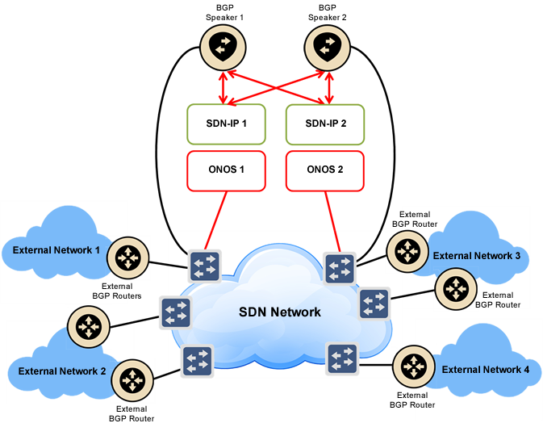
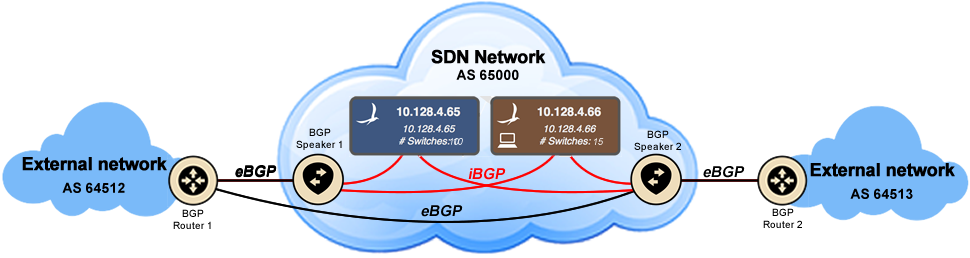
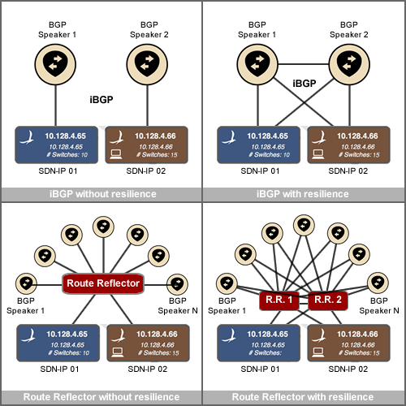

# SDN-IP User Guide

# Introduction

This document provides information on how to install, configure and run SDN-IP in an SDN network.

It's recommended that you go through the [tutorial](sdn-ip-tutorial.md) and you read the [architecture guide](sdn-ip-architecture.md) to become familiar with the concepts before attempting to set up the application.

# Network model

SDN-IP allows an SDN network to peer and exchange traffic with adjacent external networks using the BGP routing protocol.

The following figure shows the various elements in the SDN-IP network model.



* The most fundamental building block is, of course, the **SDN network**. This is the network that is controlled by ONOS and will use SDN-IP to communicate with the outside world.
* The network is controlled by a cluster of **ONOS** instances (one or more).
* **SDN-IP** runs as an application on a subset of ONOS instances.
* **External BGP routers** are connected at the edge of the SDN network. These are routers belonging to other administrative domains that will peer with the SDN network through BGP. The SDN network needs to have direct (not routed) IP connectivity to each external router it needs to peer with.
* Inside the SDN network there are one or more **BGP speakers**. There are no specific requirements on the implementation of the BGP speakers - as long as they support both external BGP (eBGP) and internal BGP (iBGP) peering sessions. For our testing and deployments we use open-source software routers such as BIRD or Quagga. The internal BGP speakers peer in two different ways:
  + Each BGP speaker must have at least one connection to the SDN data plane network. The BGP speaker will peer with external BGP routers over this connection using eBGP.
  + Each BGP speaker also needs to peer with each SDN-IP instance using iBGP so it can relay routes to the SDN-IP instances. The connectivity for this peering must be out-of-band of the data plane.

## BGP Peering Topology

There are no strict requirements on how the BGP topology should be set up, as long as each SDN-IP instance is able to receive all routes advertised to the SDN network through iBGP. In saying that, there are recommended deployment scenarios that we use and have tested thoroughly.

The following figure shows a BGP configuration example.



The icons show various nodes in the network and the lines show BGP peering sessions. Black lines are eBGP sessions between an internal BGP speaker and an external BGP router, and red lines are iBGP sessions amongst BGP speakers and SDN-IP instances.

Each external BGP router peers with one or more internal BGP speakers. SDN-IP does not currently support multihop BGP for external peering sessions, so each peering sessions must take place in the same subnet. Different peering sessions can be in different subnets however. In order to peer with external routers, the SDN network needs an IP address for each peering session. The IP addresses on the SDN network side are assigned to the BGP speakers so they can peer. It is not required that each internal BGP speaker peer with each external router, because the BGP speakers can redistribute routes between themselves using iBGP. However, for fully redundant peering with external networks, an external peer should have peering sessions with multiple internal BGP speakers. This can be seen in the figure where BGP Router 1 has a peering session to each internal BGP speaker.

Inside the network the BGP speakers peer with SDN-IP instances (running on ONOS) using iBGP. SDN-IP is a passive iBGP peer: it listens to BGP updates but it never advertises updates of its own. iBGP peering sessions within the network can be set up in multiple ways. The easiest way is to have a full mesh of iBGP peering sessions between the BGP speakers and the SDN-IP instances. This can be seen with the red iBGP peering sessions in the figure. In this way, all BGP nodes within the network can learn all the routes. Note it is not necessary (or possible) to have iBGP sessions between two SDN-IP instances, because the SDN-IP instances never advertise routes of their own.

A variety of examples of different iBGP topologies are shown in the following figure.



**ONOS-1.1 note:** A subset of BGP Multiprotocol Extensions Capabilities (RFC 4760) is implemented: IPv4 and IPv6 unicast routes (AFI/SAFI). However, the receiving and processing of IPv6 routes has been tested only over IPv4 BGP peering.

# Configuration

Please note the configuration file format has changed in ONOS 1.3 (Drake). For information on the older configuration format, please see an archived version of this page for the version of ONOS you are using.

SDN-IP requires some configuration so that it knows where the internal BGP speakers and external BGP peers are located, such that it can respond to ARPs correctly and program connectivity for the BGP traffic.

For each peering session that is set up, there will be a pair of IP addresses. One address is the address of the external peer, and the other address is the address the our internal BGP speaker uses. We require that these addresses are in the same subnet for now.

## Network configuration file

SDN-IP's configuration uses the network config subsystem in ONOS. This system allows modifying configuration at runtime, however SDN-IP currently only supports reading static configuration defined at startup (we will add runtime config modification support soon).

Practically this means that SDN-IP config should be placed in the network-cfg.json file in your config directly, and it will be read in automatically at startup by the NetworkConfigLoader.

If you plan to deploy ONOS and SDN-IP manually you need to copy the configuration file in the config directory on each instance. This is located at `KARAF_ROOT/../config`, and the path is not currently configurable.

Otherwise, when using the ONOS cell mechansim to deploy an ONOS cluster, the config file can be placed in the`ONOS_ROOT/tools/package/config`directory, on the management node you use to deploy. Then, they will be automatically be copied to the correct location on the cell instances when the cluster is deployed.

## JSON configuration format

The following code block shows an example of the JSON configuration format.

```
{
    "ports" : {
        "of:0000000000000005/4" : {
            "interfaces" : [
                {
                    "name" : "sw5-4",
                    "ips"  : [ "10.0.1.2/24" ],
                    "mac"  : "00:00:00:00:00:01"
                }
            ]
        },
        "of:0000000000000006/4" : {
            "interfaces" : [
                {
                    "name" : "sw6-4",
                    "ips"  : [ "10.0.2.2/24" ],
                    "mac"  : "00:00:00:00:00:03"
                }
            ]
        },
        "of:0000000000000007/4" : {
            "interfaces" : [
                {
                    "name" : "sw7-4-1",
                    "ips"  : [ "10.0.3.2/24" ],
                    "mac"  : "00:00:00:00:00:01"
                },
                {
                    "name" : "sw7-4-2",
                    "ips"  : [ "10.0.4.2/24" ],
                    "mac"  : "00:00:00:00:00:02"
                }
            ]
        },
        "of:0000000000000008/4" : {
            "interfaces" : [
                {
                    "name" : "sw8-4-1",
                    "ips"  : [ "10.0.5.2/24" ],
                    "mac"  : "00:00:00:00:00:02"
                },
                {
                    "name" : "sw8-4-2",
                    "ips"  : [ "10.0.6.2/24" ],
                    "mac"  : "00:00:00:00:00:03"
                }
            ]
        },
        "of:0000000000000009/4" : {
            "interfaces" : [
                {
                    "name" : "sw9-4",
                    "ips"  : [ "10.0.7.2/24" ],
                    "mac"  : "00:00:00:00:00:01"
                }
            ]
        },
        "of:0000000000000010/4" : {
            "interfaces" : [
                {
                    "name" : "sw10-4",
                    "ips"  : [ "10.0.8.2/24" ],
                    "mac"  : "00:00:00:00:00:03"
                }
            ]
        }
    },
    "apps" : {
        "org.onosproject.router" : {
            "bgp" : {
                "bgpSpeakers" : [
                    {
                        "name" : "speaker1",
                        "connectPoint" : "of:0000000000000001/7",
                        "peers" : [
                            "10.0.1.1",
                            "10.0.3.1",
                            "10.0.7.1"
                        ]
                    },
	                {
                        "name" : "speaker2",
                        "connectPoint" : "of:0000000000000001/8",
                        "peers" : [
                            "10.0.4.1",
                            "10.0.5.1"
                        ]
                    },
	                {
                        "name" : "speaker3",
                        "connectPoint" : "of:0000000000000001/9",
                        "peers" : [
                            "10.0.2.1",
                            "10.0.6.1",
                            "10.0.8.1"
                        ]
                    }
                ]
            }
        }
    }
}
```

There are two main sections to this file:

1. The *ports* section that configures an *interface* on each switch port that connects to an external BGP router
2. The *bgp* section that configures the internal BGP speakers that exist within the SDN network.

### "ports" section

Here we configure an *interface* on each port that connects to an external BGP router. An *interface* is a set of addresses and other configuration that are logically mapped to the switch port, e.g. IP addresses, a MAC address, or a VLAN tag. These are the addresses that our network (i.e. our internal BGP speaker) is using to talk to entities outside the network. The concept is similar to how you would configure addresses or VLANs on an interface within Linux.

Each interface minimally needs one IP address and one MAC address. This information is used by the ProxyARP application so that it can respond to ARP requests from the outside world with the correct information. For SDN-IP, you need to configure the IP address that your network (and your internal BGP speaker) is using to peer with BGP peers outside the network. The MAC address you use for an interface should match the MAC address on the interface of the host that is running the internal BGP speaker that has that address. This is because BGP traffic from external peers is going to be forwarded to the BGP speaker, and if it has the wrong destination MAC address then the hosts's OS will drop the traffic.

If there is more than one internal BGP speaker having peering sessions on the same switch port, then it is possible to configure multiple *interface* sections on a single switch port (see port of:0000000000000008/4 in the example). This also works if you want to have different VLANs on the same port for different peering sessions.

### "bgp" section

In this section we add configuration for each internal BGP speaker that exists in our network.

Each BGP speaker can have an optional name. This is not used by the system, but can be used by the operator to have a human-readable name for each speaker.

Each BGP speaker has a connnectPoint. This is the switch port in the network where the BGP speaker is physically plugged in.

In addition, each BGP speaker has a list of peer IP addresses which are the addresses of the peers which that BGP speaker is peering with. For each peer address that we configure here, there should be a corresponding address for our side of the connection that was configured in the "ports" section (see above). SDN-IP will determine which port the peer is connected at by finding an interface with an IP address in the same subnet. (This means that right now it's best not to use overlapping subnets for different interfaces. However it is fine to have to external peers in the same subnet if they are connected to our network at the same port). Once SDN-IP determines the peer-to-BGP-speaker association, it will install intents to allow BGP traffic to flow through the network between these two points.

## SDN-IP component configuration

In addition to the network configuration described above, there is a separate configuration file for the SDN-IP software component. Currently there is one configurable parameter, the port that SDN-IP listens for incoming BGP connections on. If you wish to configure this parameter, place this file at `KARAF_ROOT/etc/org.onosproject.routing.bgp.BgpSessionManager.cfg`. Note that by default ONOS listens on TCP port number 2000 for incoming BGP connections, which is not the default BGP port number 179.

```
bgpPort=2000
```

## BGP speakers

Each BGP speaker potentially has multiple peering sessions to different external networks. It is possible for these peering sessions to be on different IP subnets, which means each BGP speaker can potentially have multiple IP addresses it is peering on. These addresses must be configured in the network-cfg.json file, but they also need to be configured on the interfaces of the BGP speaker, so that it can receive packets sent to it on those addresses.

# Running SDN-IP on ONOS

The first step is to get an ONOS system up and running, and you can read more about how to do this here: [Installing and running ONOS](../../guides/administrator-guide/installing-and-running-onos.md)

Once ONOS is running, SDN-IP has an additional application dependency that it relies on to ensure ARP requests are resolved properly. This is the `org.onosproject.proxyarp` application that responds to ARP requests on behalf of hosts and external routers.

It's usually best to ensure this is loaded before starting SDN-IP, either by adding it to the `ONOS_APPS` variable in your cell file, or by loading it manually:

```
onos> app activate org.onosproject.proxyarp
```

Once this dependency has been satisfied, the SDN-IP application can be activated:

```
onos> app activate org.onosproject.sdnip
```

At this point, SDN-IP will start up, read its configuration and install intents in the network to establish connectivity for the BGP peering sessions. Then it will begin to receive routes, which are installed into the network using MultiPointToSinglePoint intents.

## SDN-IP CLI commands

SDN-IP includes CLI commands that allow a user to monitor the state of the system. Each command is detailed below.

#### ***bgp-neighbors****[-j|--json] [-n|--neighbor <neighbor>]*

Shows the iBGP neighbors that have connected to SDN-IP. Each neighbor is an internal BGP speaker. Can be limited to show a specific neighbor.

#### bgp-routes *[-j|--json] [s|--summary]*

Shows best routes received from BGP peers, including BGP specific information.

#### bgp-routes *[-j|--json] [n|–neighbor <neighbor>]*

Shows all routes received from a particular BGP neighbor (even if those are not the best routes).

#### routes *[-j|--json] [s|--summary]*

Shows the routing table of SDN-IP. This should be mostly the same as the BGP routes, but may include routes from other sources.

# Troubleshooting

A full running SDN-IP system has a lot of pieces that need to be correct before anything will work. When setting up a system for the first time or when things go wrong, it's best to go step by step to check each piece is in place.

**Check SDN-IP is installed**

```
onos> apps -s | grep sdnip
*   4 org.onosproject.sdnip            1.10.0.SNAPSHOT SDN-IP peering application
```

The little \* in the 1st column means SDN-IP is activated. If it's not there, try activate it again.

**Check the logs.** Is there any error?

**Example: increase sdnip log level to debug, using the ONOS CLI**

```
onos> log:set org.onosproject.apps.sdnip debug
```

**Was you configuration loaded by ONOS?**

**Check the ONOS network configuartion**

```
onos> netcfg
```

**Have interface contained in your ONOS network config loaded correctly in the system?**

**Check interfaces configured**

```
onos> interfaces
```

**Was the SDN-IP configuration contained in your ONOS network config loaded correctly in the system?**

**Check SDN-IP configuration**

```
onos> bgp-neighbors
```

Once you're sure nothing wrong is in the logs and that SDN-IP has been configured correctly, it's time to go one level deeper. let's check the intent subsystem. First let's check that the external routers You should have six point to point intents for each couple external router - BGP speaker, and one multi-point-to-single-point intent for each route advertised from an external router.

**Can your external routers communicate with the BGP speakers?**

External routers need to form a BGP session with the BGP speakers. To do that six point to point intents for each couple external router - BGP speaker get installed by ONOS. You should make sure of the following

**Can you external routers ping the BGP speakers they should peer with?** Do some ping tests. If ping does not work, **check if ARP is resolved or not on the hosts**, meaning for example, does your external router have the association between the IP address and the MAC address of the BGP speaker in its ARP table? If any of the two points above fails, likely your interfaces configuration is wrong. This usually reflects in wrong point-to-point intents installed by ONOS.

**Are the point-to-point intents installed by ONOS correct?**

**Example of the basic intent commands - intents summary and detailed intents view**

```
onos> intents -s
onos> intents
```

If ping works, it's time to check if BGP sessions are up and routes propagated. Routes should be advertised from the external routers to the BGP speaker, and from the BGP speaker advertised to SDN-IP. Checking if BGP sessions are up and routes propagated -and eventually checking the configuration of the routers changes from router to router. In general, you should make sure of the following:

**Are all the BGP sessions between the external routers and the BGP speakers up?** To be either checked from the external routers or from the BGP speakers

**Are the BGP sessions between the BGP speakers and SDN-IP up?** To be checked from on the BGP speakers or from SDN-IP (below)

```
onos> bgp-neighbors
```

**Has SDN-IP received the routes?**

**Check if SDN-IP received the routes from the BGP speaker**

```
onos> routes
```

Once you see routes in SDN-IP it's time to check if these get transformed into intents. Each route should correspond to a multi-point-to-single-point intent

**Example of the basic intent commands - intents summary and detailed intents view**

```
onos> intents -s
onos> intents
```

Likely if intents are wrong, your SDN-IP configuration is wrong.

If intents have been installed all correctly but still things don't work, last thing is to check if corresponding flows got installed correctly. The following commands can help you to see what's going on.

**Is there any flow in pending add (meaning that ONOS / the switch are not able to add)?**

**Check flows status**

```
onos> flows
onos> flows pending_add
```

# Questions? Comments? Problems?

Please let us know via the onos-deploy mailing list. Details about ONOS mailing lists can be found here: [Mailing Lists](../../community-information/mailing-lists.md)

We really welcome your help to ensure the code and documentation are clear and informative, so let us know if you have and issues.

have
