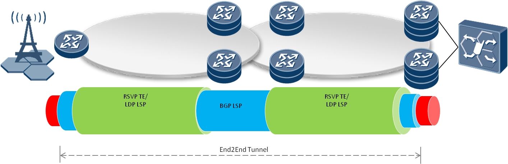

# Seamless_MPLS@SDNi

## Team

| Name | Organization | Email |
| --- | --- | --- |
| Li Zhenbin | Huawei | [lizhenbin@huawei.com](mailto:lizhenbin@huawei.com) |
| Jiang Rui | Huawei | [henry.jiangrui@huawei.com](mailto:henry.jiangrui@huawei.com) |
| Xu Shiping | Huawei | [xushiping7@huawei.com](mailto:xushiping7@huawei.com) |

## SDNi Introduction

Due to the great potentials brought by the unique attractive features, SDN is gradually adopted by Data Center Networks (DCNs) and carrier networks. The operator of a large-scale enterprise / carrier network should divide the whole networks into multiple connected SDN domains, where each of such domains corresponds to a relatively small portion of the whole network. Such a divide-and-conquer methodology not only allows gradual deployment and continuous evolution, but also enables flexible provisioning of the network. With the deployment of multiple SDN domains comes the issue of exchanging information between these domains.   
   
 SDNi is a protocol for interfacing SDN domains. It is responsible for coordinating behaviors between SDN controllers and exchange control and application information across multiple SDN domains. SDNi is an "east-west" protocol between SDN controllers, as an analogy to OpenFlow being a "north-south" protocol between controller and Network devices. (IETF Internet-Draft, "Software Defined Networking Debuted at IETF", the IETF Journal, October, 2012)  
   
 SDNi protocol should be able to:

* Coordinate flow setup originated by applications, containing information such as path requirement, QoS, SLA etc. across multiple SDN domains.
* Exchange reachability information to facilitate inter-SDN routing. This will allow a single flow to traverse multiple SDNs and have each controller select the most appropriate path when multiple such paths are available.

The types of messages exchanged via SDNi can be:

* Reachability update
* Flow setup/tear-down/update request (including application capability requirement such as QoS, BW, latency etc.)
* Capability update (including network related capabilities such as BW, QoS etc. and system and software capabilities available inside the domain).

SDNi is used to exchange information between SDN domains that are under the control of a single network operator or collaborating operators. One way to implement SDNi is to use extension of BGP and SIP over SCTP protocols to exchange information.

## Seamless MPLS

Seamless MPLS is an architecture which can be used to extend MPLS networks to integrate access and core/aggregation networks into a single MPLS domain. Now the mobile backhaul service has been deployed widely, the requirement of the integration of mobile backhaul networks and core networks has been proposed. At the same time, SDN is being developed to facilitate network operation and management. In the seamless MPLS for mobile backhaul, since there are multiple domains including the core network and multiple mobile backhaul networks, when SDN is introduced, for each domain there maybe one controller. In order to implement the end-to-end network service provision, there should be orchestration among multiple controllers. Thus the inter-SDN requirements are proposed in the Seamless MPLS architecture for mobile backhaul networks.

