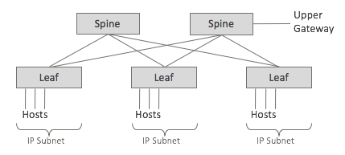
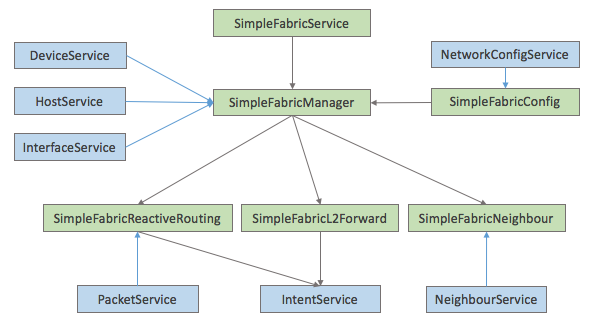

# SimpleFabric Application

## Overview

SimpleFabric application is built to replace legacy leaf networks where lP subnets are collocated with each leaf L2 switches and do simple IP routing to upper gateway to Internet

## Features

L2 Forwarding

* L2 Unicast Forwarding: Intra-Subnet is handled by Destination MAC matching Intents; based on HostService information
* L2 Broadcast Forwarding: Intra-Subnet broadcast is handles by Destination MAC matching Intents; base on L2Network configuration

L3 Forwarding

* L3 Unicast Inter-Subnet Forwarding: Inter-Subnet IP Traffic forwarding by Destination IP matching Intents; Reactive Routing
* L3 Unicast Upper Route Forwarding: Subnet to Outer Gateway IP Traffic forwarding by Destination IP matching Intents; Reactive Routing

Neighbour Handling

* ARP Forwarding: ARP messages are forwarded by IP-Subnet and L2Network configuration
* ARP and ICMP Echo Handling on Virtual Gateway IP: ARP and Ping requests on Virtual Gateway IP are handled

Fault Tolerance

* All forwarding are activated by Intents Framework which auto reconfigures on link failures

## Configurations

L2Networks

* name: name of L2Network to be used by IpSubnets
* interfaces: interfaces names of ports of this L2Network
* l2Forward: yes to enable L2 Destination MAC based forwarding (default: yes)
* l2Broadcast: yes to enable L2 Destination FF:FF:FF:FF:FF:FF MAC to be broadcast to all l2Network ports except the incoming port (default: yes)

IpSubnets

* ipPrefix: IP subnet range
* gatewayIp: Virtual Gateway IP address
* gatewayMac: Virtual Gateway MAC address
* l2NetworkName: L2Network this IpSubnet is collocated

Border Routes

* ipPrefix: route prefix to be matched on destination IP address (NOTE: IpSubnet ipPrefix matching has priority over borderRoute ipPrefix)
* nextHop: outer gateway IP to which forward the matched packet; should be a valid IP address of IpSubnets

Devices, Ports / Interfaces

      To be used for L2Networks's interface fields

Example network-cfg.json file:

> {
>
>   "devices":{
>
>     ... list of devices ...
>
>     "of:0000000000000011":{ "basic":{ "name":"LS1", "latitude":35, "longitude":-100 } },
>
>     "of:0000000000000012":{ "basic":{ "name":"LS2", "latitude":35, "longitude":-90  } },
>
>     "of:0000000000000021":{ "basic":{ "name":"SS1", "latitude":40, "longitude":-100 } },
>
>     "of:0000000000000022":{ "basic":{ "name":"SS2", "latitude":40, "longitude":-90  } }
>
>   },
>
>   "ports" : {
>
>     ... list of port/interfaces ...
>
>     "of:0000000000000011/1" : { "interfaces" : [ { "name" : "h11" } ] },
>
>     "of:0000000000000011/2" : { "interfaces" : [ { "name" : "h12" } ] },
>
>    ...
>
>     "of:0000000000000012/1" : { "interfaces" : [ { "name" : "h21" } ] } ,
>
>     "of:0000000000000012/2" : { "interfaces" : [ { "name" : "h22" } ] },
>
>     ...
>
>   },
>
>   "apps" : {
>
>     "org.onosproject.simplefabric" : {
>
>       "simpleFabric" : {
>
>         "l2Networks" : [
>
>           { "name" : "LEAF1", "interfaces" : ["h11", "h12", "h13", "h14", "d11", "d12" ], "l2Forward" : true },
>
>           { "name" : "LEAF2", "interfaces" : ["h21", "h22", "h23", "h24", "d21", "d22" ], "l2Forward" : true }
>
>         ],
>
>         "ipSubnets" : [
>
>            { "ipPrefix" : "10.0.1.0/24", "gatewayIp" : "10.0.1.1", "gatewayMac" : "00:00:10:00:01:01", "l2NetworkName" : "LEAF1" },
>
>            { "ipPrefix" : "10.0.2.0/24", "gatewayIp" : "10.0.2.1", "gatewayMac" : "00:00:10:00:02:01", "l2NetworkName" : "LEAF2" }
>
>         ],
>
>         "borderRoutes" : [
>
>            { "ipPrefix" : "0.0.0.0/0", "nextHop" : "10.0.1.2" }
>
>         ]
>
>       }
>
>     }
>
>   }
>
> }

## Modules

Topology configurations and events are all maintained by SimpleFabricService/Manager and notified to sub modules to apply updates.

Reactive Routing is handled by SimpleFabricReactiveRouting module. ARPs are forwarded by SimpleFabricNeighbour module.

