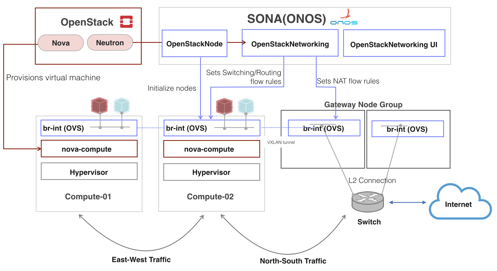

# SONA: DC Network Virtualization

# Introduction

SONA(Simplified Overlay Network Architecture) is an optimized tenant network virtualization service for Cloud-based data center. Basically, it is a set of ONOS applications which provides OpenStack Neutron ML2 mechanism driver and L3 service plugin. The implementation for provisioning an isolated virtual tenant network uses VXLAN based L2 tunneling or GRE/GENEVE based L3 tunneling with Open vSwitch as a network hypervisor. It also provides horizontal scalability of a gateway node, which plays a role of connecting SONA controlled virtual networks to the outside of the world via BGP.

# Features

* **Optimized and distributed logical switching**: SONA implements multicast free VXLAN/GRE/GENEVE implementation where each OpenvSwitch in the compute node act as a part of big switch.
* **Optimized and distributed logical routing**: Each OpenvSwitch in the compute node act as a router and takes care of all East-West routed traffic for the VMs connected to itself.
* **Broadcast free**: SONA proxies ARP, DHCP, metadata request from a virtual instance.
* **Agent-less**: No need to run any Neutron agents on compute node, network node and gateway node. Note that the agents include OpenvSwitch agent, L3 agent, metadata agent, DHCP agent.
* **Scalable**: SONA provides horizontal scalability of gateway nodes which plays a role of connecting point virtual networks to the outside of the world.
* **Data Plane Acceleration**: SONA supports the integration with various types of data plane acceleration technologies including OVS-DPDK, SR-IOV, PCI-PT and OVS hardware offloading (e.g., SmartNIC).
* **SDN native features**: SONA supports SDN oriented features including virtual topology (through ONOS GUI), virtual flow telemetry and virtual tapping.

# Limitations

* Only IPv4 is supported. Work in Progress on IPv6 support.

# More Information

* [SONA Architecture](sona-dc-network-virtualization/sona-for-openstack/sona-architecture.md)
* [SONA User Guide](sona-dc-network-virtualization/sona-for-openstack/sona-user-guide.md)
* [SONA CLI Commands](sona-dc-network-virtualization/sona-for-openstack/sona-user-guide/sona-cli-commands.md)
