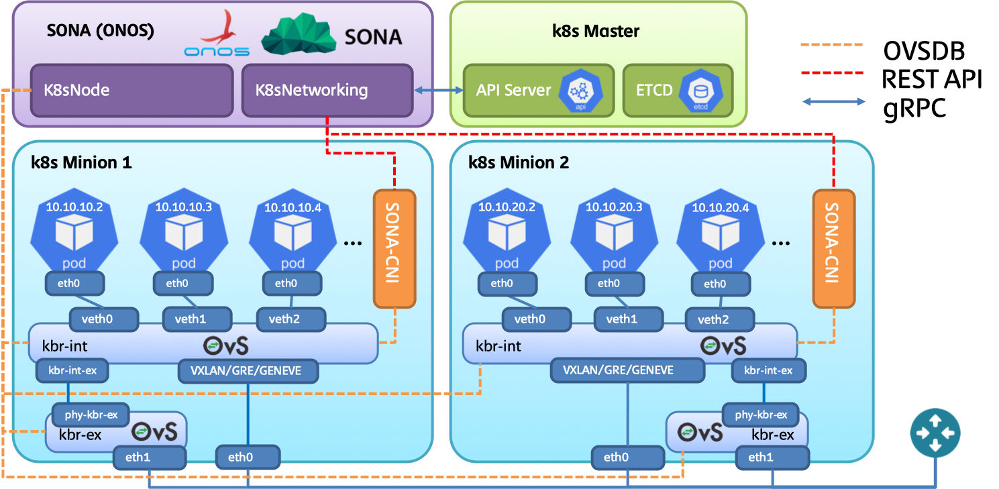

# SONA-CNI Installation

# Introduction

This tutorial shows the details instructions on installing kubernetes with SONA-CNI. The target OS used in this tutorial is CentOS. We will use three nodes to construct environment, one node behaves as a kubernetes master node where ONOS will be installed, while the others two nodes behave as kubernetes worker (minion) nodes. Note that OpenvSwitch (OVS) will be installed in all three nodes to ensure the inter-node connectivity.

The network topology used in this tutorial is depicted in the following figure. Two networks will be used for this deployment.

* **Management and overlay tunneling network**: this network will be used to access host machine from outside of the world, also this network will be used to provide tunnels among host machines.
* **NodeIP + South to North traffic network**: this network will be used to access kubernetes POD via NodeIP, also traffic initiated from POD and destined to internet will go through this network. Note that this network will be directly attached to OpenvSwitch (OVS)'s bridge; therefore, it should not be used for inter-host communication.

In case the host machines lack of network interfaces, it would be fine to merge management and overlay tunneling network. So we need to have two network interfaces at least in order to run kubernetes with SONA-CNI.



# Pre-requisite

Prepare CentOS 7.X with all packages get updated to the latest version. We will use following hostname for each node.

* **k8s-master**: kubernetes master node will be used to schedule the resources to master and worker nodes.
* **k8s-worker1**: kubernetes worker node, a set of PODs will be scheduled here.
* **k8s-worker2**: kubernetes worker node, a set of PODs will be scheduled here.

Following commands are required to configure the host name.

```
# hostnamectl set-hostname $hostname
```

Note that $hostname should be replaced with the correct value.

Incase the DNS configuration is not enforced, please use following commands to configure DNS to ensure external connectivity.

```
# echo "DNS1=8.8.8.8" >> /etc/sysconfig/network-scripts/ifcfg-eth0 && service network restart
```

# Docker Installation

Install docker engine to all master and worker nodes.

```
# yum update -y && yum install -y yum-utils device-mapper-persistent-data lvm2 
# yum-config-manager --add-repo https://download.docker.com/linux/centos/docker-ce.repo
# yum install -y docker-ce
# systemctl start docker && sudo systemctl enable docker
```

To check the docker installation, you need to run following commands.

```
# docker ps
CONTAINER ID        IMAGE               COMMAND             CREATED             STATUS              PORTS               NAMES
```

# OpenvSwitch Installation

OpenvSwitch replaces the role of iptables in this deployment; therefore, we need to install OpenvSwitch to all master and worker nodes.

Change SELinux to permissive mode.

```
# setenforce 0 
# sed -i 's/^SELINUX=enforcing$/SELINUX=permissive/' /etc/selinux/config
```

Install dependencies.

```
# yum update -y && sudo yum install -y net-tools wget setuptool perl python-sphinx gcc make python-devel openssl-devel kernel-devel graphviz kernel-debug-devel autoconf automake rpm-build redhat-rpm-config libtool python-six checkpolicy selinux-policy-devel unbound-devel
```

Before go into the following procedures, it would be recommended to restart the server, because we need to use the latest kernel and its header to build OpenvSwitch RPM packages. To ease the work of RPM compilation, you can only compile packages in one node, and copy the RPM binaries to other nodes.

```
# reboot
```

Build OpenvSwitch RPMs from source. In this tutorial, we use OpenvSwitch v2.10.2, and the minimum requirements on OpenvSwitch version is v2.7.0.

```
# mkdir -p ~/rpmbuild/SOURCES/ && cd ~/rpmbuild/SOURCES/
# wget http://openvswitch.org/releases/openvswitch-2.10.2.tar.gz
# tar zxvf openvswitch-2.10.2.tar.gz
# cd openvswitch-2.10.2
# rpmbuild -bb --without check -D "kversion `uname -r`" rhel/openvswitch.spec
# rpmbuild -bb --without check -D "kversion `uname -r`" rhel/openvswitch-kmod-fedora.spec
# yum localinstall -y ~/rpmbuild/RPMS/x86_64/openvswitch-2.10.2-1.x86_64.rpm
# yum localinstall -y ~/rpmbuild/RPMS/x86_64/openvswitch-kmod-2.10.2-1.el7.x86_64.rpm
```

Start openvswitch.

```
# systemctl start openvswitch && sudo systemctl enable openvswitch
```

Let openvswitch\_db daemon listen on port 6640. In case, you plan to run ONOS on master node, please listen on port 6650. Add the following line to /usr/share/openvswitch/scripts/ovs-ctl, right after "set ovsdb-server "$DB\_FILE" line. You'll need to restart the openvswitch-switch service after that.

```
# sed -i '/set ovsdb-server \"$DB_FILE\"/a \        set \"$@\" --remote=ptcp:6650' /usr/share/openvswitch/scripts/ovs-ctl
# systemctl restart openvswitch
```

# Kubernetes Installation

kubeadm is kubernetes cluster deployment tool. Following configurations should be enforced in all master and worker nodes to correctly run kubeadm.

Configure iptables settings.

```
# bash -c 'cat <<EOF > /etc/sysctl.d/k8s.conf
net.ipv4.ip_forward = 1
net.bridge.bridge-nf-call-ip6tables = 1
net.bridge.bridge-nf-call-iptables = 1
EOF'

# sysctl --system
```

(Optional) Disable firewalld service.

```
# systemctl stop firewalld
# systemctl disable firewalld
```

Turn off memory swapping.

```
# swapoff -a
```

Reboot server.

```
# reboot
```

Setup Kubernets yum repository in both master and worker nodes.

```
# bash -c 'cat <<EOF > /etc/yum.repos.d/kubernetes.repo
[kubernetes]
name=Kubernetes
baseurl=https://packages.cloud.google.com/yum/repos/kubernetes-el7-x86_64
enabled=1
gpgcheck=1
repo_gpgcheck=1
gpgkey=https://packages.cloud.google.com/yum/doc/yum-key.gpg https://packages.cloud.google.com/yum/doc/rpm-package-key.gpg
exclude=kube*
EOF'
```

Install and start kubeadm, kubectl and kubelet in both master and worker nodes.

```
# yum install -y kubelet kubeadm kubectl --disableexcludes=kubernetes
# systemctl enable kubelet && sudo systemctl start kubelet
```

# Kubernetes Master Node Configuration

To initialize the entire Kubernetes cluster, you need to run following commands at master node. Note that the POD network CIDR can be configured through passing the value through --pod-network-cidr option. It is recommended to assign /16 CIDR into the entire Kubernetes cluster. With this configuration each node will get assigned /24 CIDR. So the first node will get assigned 20.20.0.0/24 range, and the second node will get assigned 20.20.1.0/24 and so on. By far we cannot install Kubernetes without installing kube-proxy, so we need to manually remove kube-proxy daemon set.

```
# kubeadm init --pod-network-cidr=20.20.0.0/16
```

Once you done all the initialization, you may see following output. In the output, you need to copy the last part which will be required for setting up the worker node. With the command you can let any worker nodes to join the existing Kubernetes cluster. Also make sure to copy the token string which will be used later.

```
...
To start using your cluster, you need to run the following as a regular user:

  mkdir -p $HOME/.kube
  sudo cp -i /etc/kubernetes/admin.conf $HOME/.kube/config
  sudo chown $(id -u):$(id -g) $HOME/.kube/config

You should now deploy a pod network to the cluster.
Run "kubectl apply -f [podnetwork].yaml" with one of the options listed at:
  https://kubernetes.io/docs/concepts/cluster-administration/addons/

Then you can join any number of worker nodes by running the following on each as root:

kubeadm join 10.1.1.29:6443 --token 7wjotj.50lcr77dds50gh8q \
    --discovery-token-ca-cert-hash sha256:d11c1256b16d8130596ca121a14b5900d11bc5bcc64a817db9190be00f70b161
```

Copy the authentication related CA file into the home directory to ensure kubectl get authorized against Kubernetes API server.

```
# mkdir -p $HOME/.kube
# cp -i /etc/kubernetes/admin.conf $HOME/.kube/config
# chown $(id -u):$(id -g) $HOME/.kube/config
```

Once you done CA file locating, you can check the Kubernetes cluster by running following commands.

```
# kubectl get nodes
NAME          STATUS     ROLES    AGE     VERSION
k8s-master    NotReady   master   4m45s   v1.14.2
```

# Kubernetes Worker Node Configuration

Let each worker node to join Kubernetes cluster by running following commands.

```
# kubeadm join 10.1.1.29:6443 --token 7wjotj.50lcr77dds50gh8q \
    --discovery-token-ca-cert-hash sha256:d11c1256b16d8130596ca121a14b5900d11bc5bcc64a817db9190be00f70b161
```

Once you done worker node join, please check the cluster status by running following commands.

```
# kubectl get nodes
NAME          STATUS     ROLES    AGE     VERSION
k8s-master    NotReady   master   4m45s   v1.14.2
k8s-worker1   NotReady   <none>   49s     v1.14.2
k8s-worker2   NotReady   <none>   46s     v1.14.2
```

The status of the nodes will be shown as NotReady, because none of CNIs were installed yet.

Copy CA file from master node to worker node.

```
# mkdir -p $HOME/.kube
# scp root@master:/etc/kubernetes/admin.conf $HOME/.kube/config
# chown $(id -u):$(id -g) $HOME/.kube/config
```

After all nodes are joint to Kubernetes cluster, users need to manually remove kube-proxy daemonset. The current version of kubeadm does not allow to skip kube-proxy installation.

```
# kubectl delete ds kube-proxy -n kube-system
```

Remove all rules installed by iptables. Note that the following commands should be executed at all nodes.

```
# iptables -t nat -F
# iptables -F
# iptables -X
```

# SONA CNI Installation

Install python-pip and jinja2 dependency.

```
# yum install epel-release -y
# yum install python-pip -y
# pip install jinja2-cli
```

Specify external\_gateway\_ip and external\_interface and compose a valid onos.yml.

```
# wget http://bit.ly/2RidmZc && jinja2 2RidmZc -D ext_intf=eth2 -D ext_gw_ip=172.16.230.1 > onos.yml && rm 2RidmZc
```

Please review the onos.yml, make sure external\_interface and external\_gateway\_ip have valid value.

```
data:
  ...
  sona_network_config: |-
    # Configuration options for ONOS CNI plugin endpoint
    [network]
    # Overlay network type (VXLAN, GRE, GENEVE).
    type = VXLAN
    # Segment identifier of the network.
    segment_id = 100
    # External uplink interface name.
    external_interface = eth2
    # External gateway IP address.
    external_gateway_ip = 172.16.230.1
    # Service network CIDR.
    service_cidr = 10.96.0.0/12
    # Network Maximum Transmission Unit (MTU).
    mtu = 1400
```

Install SONA CNI through yml file.

```
# kubectl apply -f onos.yml
```

Need to wait a while to make sure all PODs are in READY (1/1, 2/2) state.

```
# kubectl get po -n kube-system
NAME                                         READY   STATUS    RESTARTS   AGE
coredns-5c98db65d4-98wkp                     1/1     Running   2          59m
coredns-5c98db65d4-b5h6b                     1/1     Running   2          59m
etcd-ubuntu-test-master                      1/1     Running   0          59m
kube-apiserver-ubuntu-test-master            1/1     Running   0          59m
kube-controller-manager-ubuntu-test-master   1/1     Running   0          59m
kube-scheduler-ubuntu-test-master            1/1     Running   0          59m
sona-atomix-0                                1/1     Running   0          59m
sona-dummy-cr6ch                             1/1     Running   0          59m
sona-dummy-z72p8                             1/1     Running   0          59m
sona-node-b4mp8                              2/2     Running   0          59m
sona-node-n52lx                              2/2     Running   0          59m
sona-onos-0                                  1/1     Running   0          59m
sona-onos-config-0                           1/1     Running   0          59m
tiller-deploy-54f7455d59-gtp4m               1/1     Running   0          59m
```

Access ONOS shell, and issue following commands to make sure all Kubernetes nodes are discovered and running under COMPLETE status.

```
onos> k8s-nodes
Hostname                    Type           Management IP           Data IP             State
k8s-master                  MASTER         10.1.1.29               10.1.1.29           COMPLETE
k8s-worker1                 MINION         10.1.1.11               10.1.1.11           COMPLETE
k8s-worker2                 MINION         10.1.1.21               10.1.1.21           COMPLETE
Total 3 nodes
```

If you want to check the external gateway information please add -j option.

```
onos> k8s-nodes -j
[ {
  "hostname" : "k8s-master",
  "type" : "MASTER",
  "state" : "COMPLETE",
  "managementIp" : "10.1.1.29",
  "integrationBridge" : "of:0000000000000001",
  "externalBridge" : "of:0000000000000002",
  "dataIp" : "10.1.1.29",
  "externalInterface" : "eth2",
  "externalBridgeIp" : "172.16.230.2",
  "externalGatewayIp" : "172.16.230.1"
}, {
  "hostname" : "k8s-worker1",
  "type" : "MINION",
  "state" : "COMPLETE",
  "managementIp" : "10.1.1.11",
  "integrationBridge" : "of:0000000000000003",
  "externalBridge" : "of:0000000000000004",
  "dataIp" : "10.1.1.11",
  "externalInterface" : "eth2",
  "externalBridgeIp" : "172.16.230.11",
  "externalGatewayIp" : "172.16.230.1"
}, {
  "hostname" : "k8s-worker2",
  "type" : "MINION",
  "state" : "COMPLETE",
  "managementIp" : "10.1.1.21",
  "integrationBridge" : "of:0000000000000005",
  "externalBridge" : "of:0000000000000006",
  "dataIp" : "10.1.1.21",
  "externalInterface" : "eth2",
  "externalBridgeIp" : "172.16.230.4",
  "externalGatewayIp" : "172.16.230.1"
} ]
```

# Helm Installation

Helm is deployment and package management tool for Kubernetes. You can issue following commands at master node to install Helm.

```
# curl https://raw.githubusercontent.com/kubernetes/helm/master/scripts/get | bash
# cat > /tmp/helm.yaml <<EOF
apiVersion: v1
kind: ServiceAccount
metadata:
  name: helm
  namespace: kube-system
---
apiVersion: rbac.authorization.k8s.io/v1beta1
kind: ClusterRoleBinding
metadata:
  name: helm
roleRef:
  apiGroup: rbac.authorization.k8s.io
  kind: ClusterRole
  name: cluster-admin
subjects:
  - kind: ServiceAccount
    name: helm
    namespace: kube-system
EOF
# kubectl create -f /tmp/helm.yaml
# helm init --service-account helm
# helm repo add incubator https://kubernetes-charts-incubator.storage.googleapis.com/
```

# Deployment using Ansible

For the one who would like to deploy Kubernetes with SONA-CNI, please try out the ansible scripts in following URL.

<https://github.com/sonaproject/k8s-sona-ansible>

# Reference

1. SONA-CNI: <https://github.com/sonaproject/sona-cni>
2. K8S-Apps: <https://github.com/opennetworkinglab/onos/tree/onos-1.15/apps/k8s-node>, <https://github.com/opennetworkinglab/onos/tree/onos-1.15/apps/k8s-networking>
