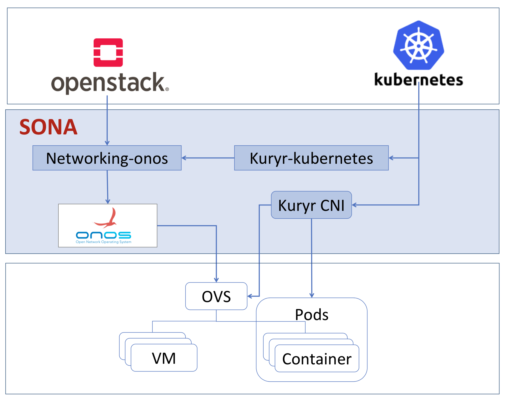
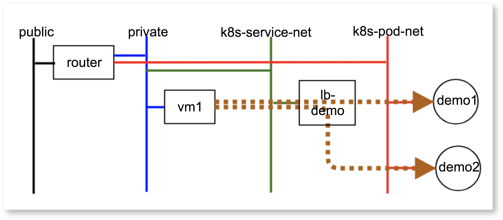
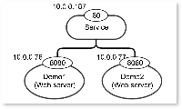

# SONA for Kuryr-Kubernetes

# **Architecture**



# **How to install**

1. Download OpenStack devstack 

```
git clone https://git.openstack.org/openstack-dev/devstack
```

For now, please use the master version of devstack. Basically, pike and higher version of devstack will support kuryr-kubernetes, but those are not tested completely yet.

2. Create a local.conf using the following example.

**local.conf** Expand source

```
[[local|localrc]]
HOST_IP=10.1.1.22
SERVICE_HOST=10.1.1.22
RABBIT_HOST=10.1.1.22
DATABASE_HOST=10.1.1.22
Q_HOST=10.1.1.22

enable_plugin kuryr-kubernetes \
    https://git.openstack.org/openstack/kuryr-kubernetes

# If you do not want stacking to clone new versions of the enabled services,
# like for example when you did local modifications and need to ./unstack.sh
# and ./stack.sh again, uncomment the following
# RECLONE="no"

# Log
USE_SCREEN=True
SCREEN_LOGDIR=/opt/stack/logs/screen
LOGFILE=/opt/stack/logs/xstack.sh.log
LOGDAYS=1
# Images
FORCE_CONFIG_DRIVE=True


# Credentials
ADMIN_PASSWORD=pass
DATABASE_PASSWORD=pass
RABBIT_PASSWORD=pass
SERVICE_PASSWORD=pass
SERVICE_TOKEN=pass
# Enable Keystone v3
IDENTITY_API_VERSION=3

# In pro of speed and being lightweight, we will be explicit in regards to
# which services we enable
ENABLED_SERVICES=n-cpu,placement-client,neutron,q-svc,n-cpu,key,nova,n-api,n-cond,n-sch,n-novnc,n-cauth,placement-api,g-api,g-reg,q-svc,horizon,rabbit,mysql

# Networks
Q_ML2_TENANT_NETWORK_TYPE=vxlan
Q_ML2_PLUGIN_MECHANISM_DRIVERS=onos_ml2
ML2_L3_PLUGIN=onos_router
NEUTRON_CREATE_INITIAL_NETWORKS=False
enable_plugin networking-onos https://github.com/openstack/networking-onos.git
ONOS_MODE=allinone

NEUTRON_CREATE_INITIAL_NETWORKS=True

NOVA_VNC_ENABLED=True
VNCSERVER_PROXYCLIENT_ADDRESS=$HOST_IP
VNCSERVER_LISTEN=$HOST_IP

LIBVIRT_TYPE=qemu

enable_plugin neutron-lbaas \
        git://git.openstack.org/openstack/neutron-lbaas
enable_service q-lbaasv2

NEUTRON_LBAAS_SERVICE_PROVIDERV2="LOADBALANCERV2:Haproxy:neutron_lbaas.drivers.haproxy.plugin_driver.HaproxyOnHostPluginDriver:default"


# By default use all the services from the kuryr-kubernetes plugin

# Etcd
# ====
# The default is for devstack to run etcd for you.
enable_service etcd3

# You can also run the deprecated etcd containerized and select the image and
# version of it by commenting the etcd3 service enablement and uncommenting
#
# enable legacy_etcd
#
# You can also modify the following defaults.
# KURYR_ETCD_IMAGE="quay.io/coreos/etcd"
# KURYR_ETCD_VERSION="v3.0.8"
#
# You can select the listening and advertising client and peering Etcd
# addresses by uncommenting and changing from the following defaults:
# KURYR_ETCD_ADVERTISE_CLIENT_URL=http://my_host_ip:2379}
# KURYR_ETCD_ADVERTISE_PEER_URL=http://my_host_ip:2380}
# KURYR_ETCD_LISTEN_CLIENT_URL=http://0.0.0.0:2379}
# KURYR_ETCD_LISTEN_PEER_URL=http://0.0.0.0:2380}
#
# If you already have an etcd cluster configured and running, you can just
# comment out the lines enabling legacy_etcd and etcd3
# then uncomment and set the following line:
# KURYR_ETCD_CLIENT_URL="http://etcd_ip:etcd_client_port"

# Kubernetes
# ==========
#
# Kubernetes is run from the hyperkube docker image
# If you already have a Kubernetes deployment, you can use it instead and omit
# enabling the Kubernetes service (except Kubelet, which must be run by
# devstack so that it uses our development CNI driver.
#
# The default is, again, for devstack to run the Kubernetes services:
enable_service kubernetes-api
enable_service kubernetes-controller-manager
enable_service kubernetes-scheduler

# We use hyperkube to run the services. You can select the hyperkube image and/
# or version by uncommenting and setting the following ENV vars different
# to the following defaults:
# KURYR_HYPERKUBE_IMAGE="gcr.io/google_containers/hyperkube-amd64"
# KURYR_HYPERKUBE_VERSION="v1.6.2"
#
# If you have the 8080 port already bound to another service, you will need to
# have kubernetes API server bind to another port. In order to do that,
# uncomment and set a different port number in:
# KURYR_K8S_API_PORT="8080"
#
# If you want to test with a different range for the Cluster IPs uncomment and
# set the following ENV var to a different CIDR
# KURYR_K8S_CLUSTER_IP_RANGE="10.10.0.0/24"
#
# If, however, you are reusing an existing deployment, you should uncomment and
# set an ENV var so that the Kubelet devstack runs can find the API server:
# KURYR_K8S_API_URL="http (or https, if K8S is SSL/TLS enabled)://k8s_api_ip:k8s_api_port"
#
# If kubernetes API server is 'https' enabled, set path of the ssl cert files
# KURYR_K8S_API_CERT="/etc/kubernetes/certs/kubecfg.crt"
# KURYR_K8S_API_KEY="/etc/kubernetes/certs/kubecfg.key"
# KURYR_K8S_API_CACERT="/etc/kubernetes/certs/ca.crt"

# Kubelet
# =======
#
# Kubelet should almost invariably be run by devstack
enable_service kubelet

# You can specify a different location for the hyperkube binary that will be
# extracted from the hyperkube container into the Host filesystem:
# KURYR_HYPERKUBE_BINARY=/usr/local/bin/hyperkube
#
# NOTE: KURYR_HYPERKUBE_IMAGE, KURYR_HYPERKUBE_VERSION also affect which
# the selected binary for the Kubelet.

# Kuryr watcher
# =============
#
# Just like the Kubelet, you'll want to have the watcher enabled. It is the
# part of the codebase that connects to the Kubernetes API server to read the
# resource events and convert them to Neutron actions
enable_service kuryr-kubernetes

# Kuryr Daemon
# ============
#
# Kuryr can run CNI plugin in daemonized way - i.e. kubelet will run kuryr CNI
# driver and the driver will pass requests to Kuryr daemon running on the node,
# instead of processing them on its own. This limits the number of Kubernetes
# API requests (as only Kuryr Daemon will watch for new pod events) and should
# increase scalability in environments that often delete and create pods.
# To enable kuryr-daemon uncomment next line.
enable_service kuryr-daemon


# Containerized Kuryr
# ===================
#
# Kuryr can be installed on Kubernetes as a pair of Deployment
# (kuryr-controller) and DaemonSet (kuryr-cni). If you want DevStack to deploy
# Kuryr services as pods on Kubernetes uncomment next line.
# networking-onos all-in-one mode installs docker by defult, and please uncomment
# next line when you use onos all-in-one mode.
# KURYR_K8S_CONTAINERIZED_DEPLOYMENT=True

# Kuryr POD VIF Driver
# ====================
#
# Set up the VIF Driver to be used. The default one is the neutron-vif, but if
# a nested deployment is desired, the corresponding driver need to be set,
# e.g.: nested-vlan or nested-macvlan
#KURYR_POD_VIF_DRIVER=neutron-vif

# Kuryr Ports Pools
# =================
#
# To speed up containers boot time the kuryr ports pool driver can be enabled
# by uncommenting the next line, so that neutron port resources are precreated
# and ready to be used by the pods when needed
# KURYR_USE_PORTS_POOLS=True
#
# By default the pool driver is noop, i.e., there is no pool. If pool
# optimizations want to be used you need to set it to 'neutron' for the
# baremetal case, or to 'nested' for the nested case
# KURYR_VIF_POOL_DRIVER=noop
#
# There are extra configuration options for the pools that can be set to decide
# on the minimum number of ports that should be ready to use at each pool, the
# maximum (0 to unset), and the batch size for the repopulation actions, i.e.,
# the number of neutron ports to create in bulk operations. Finally, the update
# frequency between actions over the pool can be set too
# KURYR_VIF_POOL_MIN=5
# KURYR_VIF_POOL_MAX=0
# KURYR_VIF_POOL_BATCH=10
# KURYR_VIF_POOL_UPDATE_FREQ=20

# Kuryr VIF Pool Manager
# ======================
#
# Uncomment the next line to enable the pool manager. Note it requires the
# nested-vlan pod vif driver, as well as the ports pool being enabled and
# configured with the nested driver
# KURYR_VIF_POOL_MANAGER=True

# ADDONS
KURYR_NEUTRON_DEFAULT_SUBNETPOOL_ID="shared-default-subnetpool-v4"
```

For now, we supports only all-in-one mode. So, just IP addresses need to be changed.

3. run ./stack.sh

4. Done!

# **How to test**

The tutorial follows the video <http://superuser.openstack.org/articles/networking-kubernetes-kuryr>.

0. Prerequisite

After installing kuryr-kubernetes, OpenStack, and SONA using the devstack script, many sample networks (public and private) have been installed already. However, some of the networks contain IPv6 subnets, but SONA does not support IPv6 and you need to remove the IPv6 subnets before you start the tutorials.

(Login as admin → Remove (unset) gateway from the router → Remove the IPv6 subnet of the public and private network → Set the gateway of the router as the public network)

1. Create a container

```
$ kubectl run demo --image=celebdor/kuryr-demo
deployment "demo" created
 
 
$ kubectl get pods -o wide
NAME                    READY     STATUS    RESTARTS   AGE       IP          NODE
demo-8489cb6965-5chhg   1/1       Running   0          15s       10.0.0.71   sangho-allinone-kuryr
```

2. Create VMs using the "k8s-pod-network", which is created already.

If you want to use Horizon GUI, then you need to switch users to k8s.

```
~/devstack$ openstack server list
+--------------------------------------+------+--------+-----------------------+--------------------------+---------+
| ID                                   | Name | Status | Networks              | Image                    | Flavor  |
+--------------------------------------+------+--------+-----------------------+--------------------------+---------+
| 8c7a4624-474f-465e-9173-c850c8821e7a | vm-1 | ACTIVE | k8s-pod-net=10.0.0.75 | cirros-0.3.5-x86_64-disk | m1.tiny |
| e283ffba-e350-46d6-b9e8-7c7f30e98611 | vm-2 | ACTIVE | k8s-pod-net=10.0.0.72 | cirros-0.3.5-x86_64-disk | m1.tiny |
+--------------------------------------+------+--------+-----------------------+--------------------------+---------+
```

3. Login to a VM and try to ping to the container IP address.

# **Future work**

Kubernetes pods communicate with external nodes using the service IP address, and Kuryr-Kubernetes uses the load balancer for that purpose (see below). As the load balancer, we can choose the Octavia or HA proxy in the default kuryr-kubernetes implementation.

However, using those components reduces the network performance, and SONA is going to supports the communication between VMs and Kubernetes services by itself.



        < OpenStack View of Communication b/w VMs and Kubernetes containers >



< Kubernetes View of Communication b/w VMs and Kubernetes containers >
