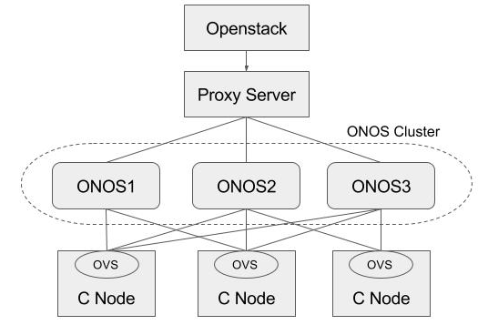
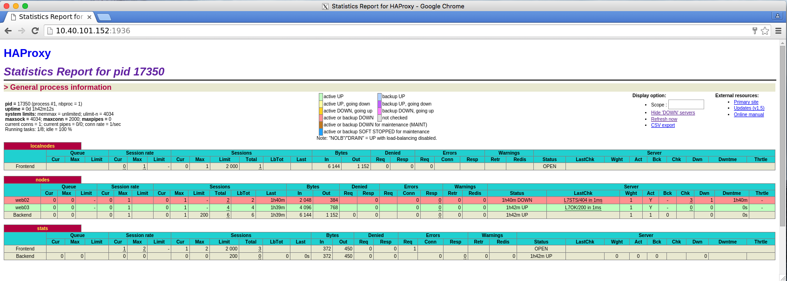

# HA Test

The tutorial describes how to achieve HA in OpenstackSwitching application. Basically, ONOS supports HA by building ONOS cluster. You can check how to build the ONOS cluster from the ONOS Tutorial. If you have no knowledge of ONOS clustering, we strongly recommend to go through the wiki page before you start this tutorial.

In addition to the ONOS clustering, we need to set up a proxy server for the REST API HA as below. Because the Neutron ONOS plugin does not accept multiple IP address for ONOS, we need to install a HA proxy server and set the proxy server IP address as the ONOS in ONOS ml2 plugin configuration.



As a simple proxy server, we used the HA proxy server (<http://www.haproxy.org>). Please refer to the document page for detail. Here we show the minimum information for the configuration.

## How to install

```
$ sudo add-apt-repository -y ppa:vbernat/haproxy-1.5
$ sudo add-apt-repository -y ppa:vbernat/haproxy-1.5
$ sudo apt-get update
$ sudo apt-get install -y haproxy
```

## How to configure

The configuration file is in /etc/haproxy/haproxy.cfg.

```
global
	log /dev/log	local0
	log /dev/log	local1 notice
	chroot /var/lib/haproxy
	stats socket /run/haproxy/admin.sock mode 660 level admin
	stats timeout 30s
	user haproxy
	group haproxy
	daemon

	# Default SSL material locations
	ca-base /etc/ssl/certs
	crt-base /etc/ssl/private

	# Default ciphers to use on SSL-enabled listening sockets.
	# For more information, see ciphers(1SSL). This list is from:
	#  https://hynek.me/articles/hardening-your-web-servers-ssl-ciphers/
	ssl-default-bind-ciphers ECDH+AESGCM:DH+AESGCM:ECDH+AES256:DH+AES256:ECDH+AES128:DH+AES:ECDH+3DES:DH+3DES:RSA+AESGCM:RSA+AES:RSA+3DES:!aNULL:!MD5:!DSS
	ssl-default-bind-options no-sslv3

defaults
	log	global
	mode	http
	option	httplog
	option	dontlognull
        timeout connect 5000
        timeout client  50000
        timeout server  50000

	errorfile 400 /etc/haproxy/errors/400.http
	errorfile 403 /etc/haproxy/errors/403.http
	errorfile 408 /etc/haproxy/errors/408.http
	errorfile 500 /etc/haproxy/errors/500.http
	errorfile 502 /etc/haproxy/errors/502.http
	errorfile 503 /etc/haproxy/errors/503.http
	errorfile 504 /etc/haproxy/errors/504.http

frontend localnodes
        bind *:8181
        mode http
        default_backend nodes

backend nodes
        mode http
        balance roundrobin
        option forwardfor
        http-request set-header X-Forwarded-Port %[dst_port]
        http-request add-header X-Forwarded-Proto https if { ssl_fc }
        option httpchk GET /onos/ui/login.html 
        server web01 10.40.101.152:8181 check
        server web02 10.40.101.153:8181 check
        server web03 10.40.101.155:8181 check

listen stats *:1936
    stats enable
    stats uri /
    stats hide-version
    stats auth someuser:password
```

You just need to modify the "server web01" ~ "server web02" IP address. The HA Proxy Server supports statistics page using 1936 port.



## How to test

You can shutdown any ONOS server as below, and you can check if any VM creation still works or not.

```
$ ones-service 1 stop
```
