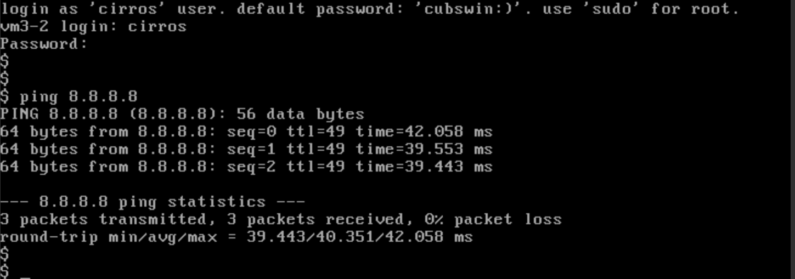

# How to set up gateway node using vRouter

This page describes how to set up the gateway node using vRouter based on the original descriptions (links below) from Hyunsun Moon.

<https://github.com/hyunsun/documentations/wiki/Quagga-with-Docker-and-Open-vSwitch>

<https://github.com/hyunsun/documentations/wiki/ONOS-vRouter-with-OVS>

<https://github.com/hyunsun/documentations/wiki/ONOS-vRouter-with-SONA-Test>

<https://github.com/hyunsun/documentations/wiki/ONOS-vRouter-with-SONA-명령어-요약>

# 1. Pre-requisite

1. Prepare two nodes, one for router (which corresponds to the physical router when deployed in physical environment) and the gateway.
2. OVS 2.3 must be installed already. If not, please install OVS following the previous WIKI page ([SONA Installation Guide](../sona-user-guide/sona-installation-guide.md)).
3. Docker needs to be installed on the two machines. Please install docker referring to the following link.  
   <https://docs.docker.com/engine/installation/linux/ubuntulinux/>
4. Install Quagga image and script in each node as following.

   ```
   $ git clone https://github.com/hyunsun/docker-quagga
   $ sudo docker pull hyunsun/quagga-fpm
   ```
5. Remove bridges in gateway node if any. OVSDB port must be already set.

   ```
   sangho@gatewaynode:~$ sudo ovs-vsctl show
   b5f1ab8b-f223-4281-8bdf-23d3f283fbf2
       Manager "ptcp:6640"
   ```

## 2. Router Configuration

1. Create a OVS bridge in all hosts and make a tunnel between them. If the hosts are in the same broadcast domain, you can simply add the physical interface to the OVS bridge.

   ```
   $ sudo ovs-vsctl add-br br-ex
   $ sudo ovs-vsctl add-port br-ex vxlan -- set interface vxlan type=vxlan options:remote_ip=x.x.x.x [Gateway IP address]
   $ sudo ip link set br-ex up
   ```
2. Pick any subnet range to use for the connection between containers and add one of the IP to the br-ex. The IP should be unique across the compute hosts. 

   ```
   $ sudo ip addr add 172.18.0.254/24 dev br-ex
   ```

# 3. Gateway node Configuration

1. Configure br-int using OpenstackNetwork node

   The network node needs to be set up as COMPUTENODE as the only br-int is set in the network config file.

   ```
   "org.onosproject.openstacknode" : {
   	"openstacknode" : {
   		"nodes" : [
   			{
   			"hostname" : "compute-01",
   			"ovsdbIp" : "10.40.101.208",
   			"ovsdbPort" : "6640",
   			"bridgeId" : "of:0000000000000001",
   			"openstackNodeType" : "COMPUTENODE"
   			},
   			{
   			"hostname" : "network",
   			"ovsdbIp" : "10.40.101.240",
   			"ovsdbPort" : "6640",
   			"bridgeId" : "of:0000000000000003",
   			"openstackNodeType" : "COMPUTENODE"
   			}
   		]
   	}
   }
   ```

   The br-int needs to be as below by activating OpenstackNode app in ONOS.

   ```
   sangho@gatewaynode:~$ sudo ovs-vsctl show
   b5f1ab8b-f223-4281-8bdf-23d3f283fbf2
       Manager "ptcp:6640"
       Bridge br-int
           Controller "tcp:10.40.101.152:6653"
               is_connected: true
           fail_mode: secure
           Port vxlan
               Interface vxlan
                   type: vxlan
                   options: {key=flow, remote_ip=flow}
           Port br-int
               Interface br-int
   ```
2. Configure br-ex bridge

   ```
   sangho@gatewaynode:~$ sudo ovs-vsctl add-br br-ex
   sangho@gatewaynode:~$ sudo ovs-vsctl add-port br-ex vxlan-ex -- set interface vxlan-ex type=vxlan options:remote_ip=x.x.x.x[Router IP address]
   sangho@gatewaynode:~$ sudo ip link set br-ex up
   ```

   The "vxlan" port name has been already taken by the bridge br-int, and we need to pick a different one such as vxlan-ex.
3. Pick any subnet range for br-ex

   ```
   sangho@gatewaynode:~$ sudo ip addr add 172.18.0.253/24 dev br-ex
   ```
4. Check if they can ping each other 

   ```
   sangho@gatewaynode:~$ ping 172.18.0.254
   PING 172.18.0.254 (172.18.0.254) 56(84) bytes of data.
   64 bytes from 172.18.0.254: icmp_seq=1 ttl=64 time=1.81 ms
   64 bytes from 172.18.0.254: icmp_seq=2 ttl=64 time=0.488 ms
   ^C
   --- 172.18.0.254 ping statistics ---
   2 packets transmitted, 2 received, 0% packet loss, time 1002ms
   rtt min/avg/max/mdev = 0.488/1.150/1.813/0.663 ms
   ```

# 4. Quagga setup in router node

1. Create BGP and zebra config files as following under docker-quagga/volumes/quagga with the name of bgpd.conf and zebra.conf. No modification for zebra.conf is required but hostname.

   **Router node**

   ```
   ! -*- bgp -*-
   !
   ! BGPd sample configuration file
   !
   !
   hostname router
   password zebra
   !
   router bgp 65100
     bgp router-id 172.18.0.100
     timers bgp 3 9
     neighbor 172.18.0.101 remote-as 65101
     neighbor 172.18.0.101 ebgp-multihop
     neighbor 172.18.0.101 timers connect 5
     neighbor 172.18.0.101 advertisement-interval 5
   ! neighbor 172.18.0.101 default-originate
     network 0.0.0.0/0
   !
   log file /var/log/quagga/bgpd.log
   ```
2. Run run.sh to create a quagga container. The script helps to create a container with two interfaces, one is attached to the docker0 and the other is to br-ex. The IP address of the container must be the range you picked.

   ```
   sangho@router:~/docker-quagga$ ./run.sh router 172.18.0.100/24 00:00:00:00:01:00
   Error response from daemon: No such container: router
   Error response from daemon: No such container: router
   f834da31a942da27f51ce4693ae8db63d720aec22d576607afc171e86f77d322
   Warning: arping not found; interface may not be immediately reachable

   sangho@router:~/docker-quagga$ sudo docker ps
   CONTAINER ID        IMAGE                COMMAND                  CREATED             STATUS              PORTS                         NAMES
   f834da31a942        hyunsun/quagga-fpm   "/usr/bin/supervisord"   32 seconds ago      Up 31 seconds       179/tcp, 2601/tcp, 2605/tcp   router
   ```
3. Turn on the NAT feature using iptables as follows:

   ```
   sangho@router:~/docker-quagga$sudo docker exec -d router iptables -t nat -A POSTROUTING -o eth0 -j MASQUERADE
   ```

# 5. Quagga set up in gateway node

1. Create two ip links and add the two ports to the two bridges.

   ```
   sangho@gatewaynode:~$ sudo ip link add veth0 type veth peer name veth1
   sangho@gatewaynode:~$ sudo ip link set veth0 up
   sangho@gatewaynode:~$ sudo ip link set veth1 up
   sangho@gatewaynode:~$ sudo ip link add veth2 type veth peer name veth3
   sangho@gatewaynode:~$ sudo ip link set veth2 up
   sangho@gatewaynode:~$ sudo ip link set veth3 up
   sangho@gatewaynode:~$ sudo ovs-vsctl add-port br-int veth2
   sangho@gatewaynode:~$ sudo ovs-vsctl add-port br-ex veth1
   sangho@gatewaynode:~$ sudo ovs-vsctl show
   b5f1ab8b-f223-4281-8bdf-23d3f283fbf2
       Manager "ptcp:6640"
       Bridge br-int
           Controller "tcp:10.40.101.152:6653"
               is_connected: true
           fail_mode: secure
           Port vxlan
               Interface vxlan
                   type: vxlan
                   options: {key=flow, remote_ip=flow}
           Port "veth2"
               Interface "veth2"
           Port br-int
               Interface br-int
       Bridge br-ex
           Port vxlan-ex
               Interface vxlan-ex
                   type: vxlan
                   options: {remote_ip="10.40.101.164"}
           Port br-ex
               Interface br-ex
                   type: internal
           Port "veth1"
               Interface "veth1"
   ```
2. Create a bridge br-router and connect it to br-int and br-ex using the two ip links just created in previous step.

   ```
   sangho@gatewaynode:~$ sudo ovs-vsctl add-br br-router
   sangho@gatewaynode:~$ sudo ovs-vsctl set bridge br-router other-config:datapath-id=00000000000000b1
   sangho@gatewaynode:~$ sudo ovs-vsctl set-fail-mode br-router secure
   sangho@gatewaynode:~$ sudo ovs-vsctl set bridge br-router protocols=OpenFlow13
   sangho@gatewaynode:~$ sudo ovs-vsctl add-port br-router veth0
   sangho@gatewaynode:~$ sudo ovs-vsctl add-port br-router veth3
   ```
3. Set the controller of the br-router bridge

   ```
   sangho@gatewaynode:~/docker-quagga$ sudo ovs-vsctl set-controller br-router tcp:10.40.101.152:6653
   ```

   The final bridge structure should be like below.

   ```
   sangho@gatewaynode:~$ sudo ovs-vsctl show
   b5f1ab8b-f223-4281-8bdf-23d3f283fbf2
       Manager "ptcp:6640"
       Bridge br-int
           Controller "tcp:10.40.101.152:6653"
               is_connected: true
           fail_mode: secure
           Port vxlan
               Interface vxlan
                   type: vxlan
                   options: {key=flow, remote_ip=flow}
           Port "veth2"
               Interface "veth2"
           Port br-int
               Interface br-int
       Bridge br-ex
           Port vxlan-ex
               Interface vxlan-ex
                   type: vxlan
                   options: {remote_ip="10.40.101.164"}
           Port br-ex
               Interface br-ex
                   type: internal
           Port "veth1"
               Interface "veth1"
       Bridge br-router
           Controller "tcp:10.40.101.152:6653"
               is_connected: true
           fail_mode: secure
           Port br-router
               Interface br-router
                   type: internal
           Port "veth0"
               Interface "veth0"
           Port "veth3"
               Interface "veth3"
   ```
4. Prepare configuration file for Quagga

   **bgpd.conf**

   ```
   ! -*- bgp -*-
   !
   ! BGPd sample configuration file
   !
   !
   hostname gateway
   password zebra
   !
   router bgp 65101
     bgp router-id 172.18.0.101
     timers bgp 3 9
     neighbor 172.18.0.100 remote-as 65100
     neighbor 172.18.0.100 ebgp-multihop
     neighbor 172.18.0.100 timers connect 5
     neighbor 172.18.0.100 advertisement-interval 5
   ! neighbor 172.18.0.100 default-originate
     network 192.168.0.0/24
   !
   log file /var/log/quagga/bgpd.log
   ```

   The network 192.168.0.0./24 is the floating IP range of the VMs

   **zebra.conf**

   ```
   !
   hostname gateway
   password zebra
   !
   fpm connection ip 10.40.101.152 port 2620
   !
   ```

   The IP 10.40.101.152 is the ONOS host IP address.
5. Create a Quagga container for gateway node.

   ```
   sangho@gatewaynode:~/docker-quagga$ ./run.sh gateway 172.18.0.101/24 00:00:00:00:01:01 br-router
   Error response from daemon: No such container: gateway
   Error response from daemon: No such container: gateway
   090269db3e6c44367950dc94440e30441e16347486dd5f67a18723ec12e39222
   Error response from daemon: No such container: router-ex
   ```
6. Configure the quagga container

   ```
   sangho@gatewaynode:~/docker-quagga$ sudo docker exec -i -t gateway /bin/bash
   root@gateway:/# ip route                                                                                                     
   default via 172.17.0.1 dev eth0 
   172.17.0.0/16 dev eth0  proto kernel  scope link  src 172.17.0.2 
   172.18.0.0/24 dev eth1  proto kernel  scope link  src 172.18.0.101 
   root@gateway:/# route del default gw 172.17.0.1
   root@gateway:/# route add -host 10.40.101.152 gw 172.17.0.1
   root@gateway:/# ip addr add 192.168.0.101/24 dev eth1
   root@gateway:/# ip route                                   
   10.40.101.152 via 172.17.0.1 dev eth0 
   172.17.0.0/16 dev eth0  proto kernel  scope link  src 172.17.0.2 
   172.18.0.0/24 dev eth1  proto kernel  scope link  src 172.18.0.101 
   192.168.0.0/24 dev eth1  proto kernel  scope link  src 192.168.0.101
   ```

   Please note that the IP address 10.40.101.152 is the IP address of the ONOS instance, and the 192.168.0.101 is the gateway IP address of the external network subnet.
7. Check if Quagga is running properly. The route advertised from router is NOT shown in "ip route" command results because there is no connection between two containers yet. We will connect the two containers using the vRouter application in the next step.

   ```
   root@gateway:/# telnet 172.18.0.101 2601
   Trying 172.18.0.101...
   Connected to 172.18.0.101.
   Escape character is '^]'.
    
   Hello, this is Quagga (version 0.99.23).
   Copyright 1996-2005 Kunihiro Ishiguro, et al.
    
    
   User Access Verification
    
   Password: 
   gateway> show ip route
   Codes: K - kernel route, C - connected, S - static, R - RIP,
          O - OSPF, I - IS-IS, B - BGP, A - Babel,
          > - selected route, * - FIB route
    
   K>* 10.40.101.152/32 via 172.17.0.1, eth0
   C>* 127.0.0.0/8 is directly connected, lo
   C>* 172.17.0.0/16 is directly connected, eth0
   C>* 172.18.0.0/24 is directly connected, eth1
   C>* 192.168.0.0/24 is directly connected, eth1
   ```

# 6. How to check the setup

1. Configure the network config file for ONOS

   **network-cfg.json**

   ```
   {
     "userDefined" : {
       "openstacknetworking" : {
         "config" : {
           "physicalRouterMac" : "00:00:00:00:01:01",
           "gatewayBridgeId" : "of:0000000000000003",
           "routerPortInfo" : "of:00000000000000b1/2",
           "gatewayExternalInterfaceName" : "veth2",
           "gatewayExternalInterfaceMac" : "d2:b3:eb:36:bd:ae",
           "nodes" : [
             {
               "dataPlaneIp" : "10.40.101.208",
               "bridgeId" : "of:0000000000000001"
             },
             {
               "dataPlaneIp" : "10.40.101.240",
               "bridgeId" : "of:0000000000000003"
             }
           ]
         }
       }
     },
       "apps" : {
           "org.onosproject.openstackinterface" : {
               "openstackinterface" : {
                    "neutronServer" : "http://10.40.101.209:9696/v2.0/",
                    "keystoneServer" : "http://10.40.101.209:5000/v2.0/",
                    "userName" : "admin",
                    "password" : "nova"
                }
           },
           "org.onosproject.openstacknode" : {
               "openstacknode" : {
               "physicalRouterMac" : "86:1e:e1:b1:85:bd",
                    "nodes" : [
                           {
                                   "hostname" : "compute-01",
                                   "ovsdbIp" : "10.40.101.208",
                                   "ovsdbPort" : "6640",
                                   "bridgeId" : "of:0000000000000001",
                                   "openstackNodeType" : "COMPUTENODE"
                           },
                           {
                                   "hostname" : "network",
                                   "ovsdbIp" : "10.40.101.240",
                                   "ovsdbPort" : "6640",
                                   "bridgeId" : "of:0000000000000003",
                                   "openstackNodeType" : "COMPUTENODE"
                           }
                     ]
                }
           },
           "org.onosproject.router" : {
               "router" : {
                   "controlPlaneConnectPoint" : "of:00000000000000b1/3",
                   "ospfEnabled" : "false",
                   "interfaces" : [ "b1-1","b1-2" ]
               }
           }
       },
       "devices" : {
           "of:0000000000000001" : {
               "basic" : {
                   "driver" : "sona"
               }
           },
           "of:0000000000000002" : {
               "basic" : {
                   "driver" : "sona"
               }
           },
           "of:00000000000000b1" : {
                   "basic" : {
                       "driver" : "softrouter"
                   }
           }
      },
           "ports" : {
               "of:00000000000000b1/1" : {
                   "interfaces" : [
                       {
                           "name" : "b1-1",
                           "ips"  : [ "172.18.0.101/24" ],
                           "mac"  : "00:00:00:00:01:01"
                       }
                   ]
               },
               "of:00000000000000b1/2" : {
                   "interfaces" : [
                       {
                           "name" : "b1-2",
                           "ips"  : [ "192.168.0.101/24" ],
                           "mac"  : "00:00:00:00:01:01"
                       }
                   ]
               }
           }
   }
   ```

   Configure the port number in network-cfg.json file following the actual port number of veth0, veth3, and quagga ports in br-router bridge, as below

   ```
   onos> ports
   id=of:000056ef75ae084d, available=true, role=MASTER, type=SWITCH, mfr=Nicira, Inc., hw=Open vSwitch, sw=2.3.2, serial=None, driver=ovs, channelId=10.40.101.240:43242, managementAddress=10.40.101.240, protocol=OF_13
   port=local, state=disabled, type=copper, speed=0 , portName=br-router, portMac=56:ef:75:ae:08:4d
   port=1, state=enabled, type=copper, speed=10000 , portName=veth0, portMac=f2:d2:c5:ab:d9:0a
   port=2, state=enabled, type=copper, speed=10000 , portName=veth3, portMac=ae:b1:e7:31:f9:9c
   port=3, state=enabled, type=copper, speed=10000 , portName=quagga, portMac=0a:0b:0d:43:7b:23
   ```

   "controlPlaneConnectPoint" : "of:00000000000000b1/**3**", <- port=**3**, state=enabled, type=copper, speed=10000 , portName=quagga, portMac=0a:0b:0d:43:7b:23

   "of:00000000000000b1/**1**" : { <- port=**1**, state=enabled, type=copper, speed=10000 , portName=veth0, portMac=f2:d2:c5:ab:d9:0a

   "of:00000000000000b1/**2**" : { <- port=**2**, state=enabled, type=copper, speed=10000 , portName=veth3, portMac=ae:b1:e7:31:f9:9c

   Also, please note that the physicalRouterMac and gatewayExternalInterfaceName should be set as below in this tutorial, and "routerPortInfo" field has been added and interface "b1-2" port information needs to be set.

   "physicalRouterMac" : **"00:00:00:00:01:01"**,

   "gatewayExternalInterfaceName" : **"veth2"**,

   **"routerPortInfo" : "of:00000000000000b1/2",**
2. Run ONOS
3. Log in to ONOS and active vrouter app

   ```
   onos> app activate org.onosproject.vrouter
   ```
4. Check if flow rules for br-router is set properly

   ```
   sangho@gatewaynode:~$ sudo ovs-ofctl dump-flows br-router -O openflow13
   OFPST_FLOW reply (OF1.3) (xid=0x2):
    cookie=0x520000d61801ea, duration=2.869s, table=0, n_packets=1, n_bytes=42, send_flow_rem priority=40001,arp,in_port=1,vlan_tci=0x0000/0x1fff actions=CONTROLLER:65535,output:3
    cookie=0x52000059b03701, duration=2.869s, table=0, n_packets=0, n_bytes=0, send_flow_rem priority=40001,arp,in_port=2,vlan_tci=0x0000/0x1fff actions=CONTROLLER:65535,output:3
    cookie=0x520000ecd135c5, duration=2.879s, table=0, n_packets=9, n_bytes=749, send_flow_rem priority=40001,ip,in_port=1,vlan_tci=0x0000/0x1fff,dl_dst=00:00:00:00:01:01,nw_dst=172.18.0.101 actions=output:3
    cookie=0x520000ec22b9e5, duration=2.871s, table=0, n_packets=0, n_bytes=0, send_flow_rem priority=40001,ip,in_port=2,vlan_tci=0x0000/0x1fff,dl_dst=00:00:00:00:01:01,nw_dst=192.168.0.101 actions=output:3
    cookie=0x620000bbff45dd, duration=2.878s, table=0, n_packets=0, n_bytes=0, send_flow_rem ip,in_port=2,vlan_tci=0x0000/0x1fff,dl_dst=00:00:00:00:01:01 actions=goto_table:1
    cookie=0x6200002a04561e, duration=2.870s, table=0, n_packets=0, n_bytes=0, send_flow_rem ip,in_port=1,vlan_tci=0x0000/0x1fff,dl_dst=00:00:00:00:01:01 actions=goto_table:1
    cookie=0x620000a8d73bf3, duration=2.870s, table=0, n_packets=0, n_bytes=0, send_flow_rem ip,in_port=3,vlan_tci=0x0000/0x1fff,dl_dst=00:00:00:00:01:01 actions=goto_table:1
    cookie=0x6000000b56a581, duration=78.446s, table=0, n_packets=106, n_bytes=7804, send_flow_rem priority=0 actions=drop
    cookie=0x52000008b75a58, duration=2.845s, table=0, n_packets=1, n_bytes=42, send_flow_rem priority=40001,arp,in_port=3,vlan_tci=0x0000/0x1fff,dl_src=00:00:00:00:01:01,arp_spa=172.18.0.101 actions=CONTROLLER:65535,output:1
    cookie=0x5200003aaddbf7, duration=2.868s, table=0, n_packets=0, n_bytes=0, send_flow_rem priority=40001,arp,in_port=3,vlan_tci=0x0000/0x1fff,dl_src=00:00:00:00:01:01,arp_spa=192.168.0.101 actions=CONTROLLER:65535,output:2
    cookie=0x520000e7f28d92, duration=2.845s, table=0, n_packets=11, n_bytes=896, send_flow_rem priority=40001,ip,in_port=3,vlan_tci=0x0000/0x1fff,dl_src=00:00:00:00:01:01,nw_src=172.18.0.101 actions=output:1
    cookie=0x5200004ccf0400, duration=2.878s, table=0, n_packets=0, n_bytes=0, send_flow_rem priority=40001,ip,in_port=3,vlan_tci=0x0000/0x1fff,dl_src=00:00:00:00:01:01,nw_src=192.168.0.101 actions=output:2
    cookie=0x620000ba6df9ea, duration=2.873s, table=0, n_packets=0, n_bytes=0, send_flow_rem ip,in_port=2,vlan_tci=0x0000/0x1fff,dl_dst=01:00:5e:00:00:00/ff:ff:ff:80:00:00 actions=goto_table:1
    cookie=0x620000c0f2e241, duration=2.872s, table=0, n_packets=0, n_bytes=0, send_flow_rem ip,in_port=1,vlan_tci=0x0000/0x1fff,dl_dst=01:00:5e:00:00:00/ff:ff:ff:80:00:00 actions=goto_table:1
    cookie=0x1000058447161, duration=78.353s, table=0, n_packets=206, n_bytes=16686, send_flow_rem priority=40000,dl_type=0x88cc actions=CONTROLLER:65535
    cookie=0x10000151ba242, duration=78.353s, table=0, n_packets=206, n_bytes=16686, send_flow_rem priority=40000,dl_type=0x8942 actions=CONTROLLER:65535
    cookie=0x1000031c98487, duration=78.353s, table=0, n_packets=113, n_bytes=4746, send_flow_rem priority=40000,arp actions=CONTROLLER:65535
    cookie=0x6000000f1f0a8f, duration=78.446s, table=1, n_packets=0, n_bytes=0, send_flow_rem priority=0 actions=drop
   ```
5. Please check if you can log on to the quagga at the gateway node, and now you can see that the route (0.0.0.0/0) advertised from router is shown in "show ip route" command.

   ```
   sangho@gatewaynode:~/docker-quagga$ telnet 172.18.0.101 2601
   Trying 172.18.0.101...
   Connected to 172.18.0.101.
   Escape character is '^]'.
    
   Hello, this is Quagga (version 0.99.23).
   Copyright 1996-2005 Kunihiro Ishiguro, et al.
    
    
   User Access Verification
    
   Password: 
   gateway> 
   gateway> show ip route
   Codes: K - kernel route, C - connected, S - static, R - RIP,
          O - OSPF, I - IS-IS, B - BGP, A - Babel,
          > - selected route, * - FIB route
    
   B>* 0.0.0.0/0 [20/0] via 172.18.0.100, eth1, 00:02:50
   C>* 127.0.0.0/8 is directly connected, lo
   C>* 172.17.0.0/16 is directly connected, eth0
   C>* 172.18.0.0/24 is directly connected, eth1
   C>* 192.168.0.0/24 is directly connected, eth1
   K>* 192.168.56.109/32 via 172.17.0.1, eth0
   gateway>
   ```
6. You can notice that the following three rules have been added in table 1, after the connection b/w two Quagga has been established by the vrouter app.

   ```
    cookie=0x520000e8946120, duration=560.541s, table=1, n_packets=0, n_bytes=0, send_flow_rem priority=64010,ip,nw_dst=172.18.0.253 actions=set_field:00:00:00:00:01:01->eth_src,set_field:fe:03:53:80:ef:46->eth_dst,output:1
    cookie=0x5200000483cbfc, duration=560.541s, table=1, n_packets=0, n_bytes=0, send_flow_rem priority=64010,ip,nw_dst=172.18.0.101 actions=set_field:fe:03:53:80:ef:46->eth_src,set_field:00:00:00:00:01:01->eth_dst,output:3
    cookie=0x62000024bd70f3, duration=11.483s, table=1, n_packets=0, n_bytes=0, send_flow_rem priority=100,ip actions=set_field:00:00:00:00:01:01->eth_src,set_field:00:00:00:00:01:00->eth_dst,output:1
   ```
7. Check the route information in ONOS

   ```
   onos> routes
   Table: ipv4
      Network            Next Hop
      0.0.0.0/0          172.18.0.100   
      Total: 1
    
   Table: ipv6
      Network            Next Hop
      Total: 0
   ```

# 7. How to test L3 connection using VMs

1. Apply the simple patch 9971 (<https://gerrit.onosproject.org/#/c/9971/>)
2. Activate SONA application. Here is the suggested order to launch each app.

   ```
   onos> sangho@onos:~$ /opt/onos/bin/onos
   Logging in as karaf
   415 [sshd-SshClient[6ce139a4]-nio2-thread-3] WARN org.apache.sshd.client.keyverifier.AcceptAllServerKeyVerifier - Server at [localhost/127.0.0.1:8101, RSA, a3:c2:9b:43:fb:11:55:a0:44:fe:40:8a:75:ec:f1:20] presented unverified {} key: {}
   Welcome to Open Network Operating System (ONOS)!
        ____  _  ______  ____     
       / __ \/ |/ / __ \/ __/   
      / /_/ /    / /_/ /\ \     
      \____/_/|_/\____/___/     
                                  
   Documentation: wiki.onosproject.org      
   Tutorials:     tutorials.onosproject.org 
   Mailing lists: lists.onosproject.org     
    
   Come help out! Find out how at: contribute.onosproject.org 
    
   Hit '<tab>' for a list of available commands
   and '[cmd] --help' for help on a specific command.
   Hit '<ctrl-d>' or type 'system:shutdown' or 'logout' to shutdown ONOS.
    
   onos> app activate org.onosproject.dhcp 
   onos> app activate org.onosproject.vrouter 
   onos> app activate org.onosproject.openstackinterface 
   onos> app activate org.onosproject.openstacknetworking
   ```
3. Create a external network and a subnet with the floating IP range 192.168.0.0/24 used in this tutorial.
4. Create a virtual network
5. Create a router using the external network and add an interface using the virutal network.
6. Create a VM using the virtual network.
7. Create a security group to allow "ALL" incoming traffic to VMs and assign it to the VM.
8. Create an floating IP "newly" and assign the IP to the VM
9. You can see that a new flow rule to handle the floating IP was added in table 1 of br-router bridge, as below for example.

   ```
    cookie=0x5300009edf8e73, duration=20.629s, table=1, n_packets=0, n_bytes=0, send_flow_rem priority=64010,ip,nw_dst=192.168.0.23 actions=set_field:00:00:00:00:01:01->eth_src,set_field:fa:16:3e:8e:1f:c5->eth_dst,output:2
   ```

   Also, you can check that the floating IP you just added was registered as a new host in the location "of:00000000000000b1/2".

   ```
   onos> hosts
   id=00:00:00:00:01:00/None, mac=00:00:00:00:01:00, location=of:00000000000000b1/1, vlan=None, ip(s)=[172.18.0.100]
   id=FA:16:3E:BB:2D:F4/None, mac=FA:16:3E:BB:2D:F4, location=of:0000000000000003/1, vlan=None, ip(s)=[10.10.0.74]
   id=FA:16:3E:EB:2A:F0/None, mac=FA:16:3E:EB:2A:F0, location=of:00000000000000b1/2, vlan=None, ip(s)=[192.168.0.23]
   ```
10. Log on to the VM
11. ping to 8.8.8.8   
    
