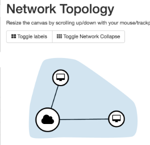
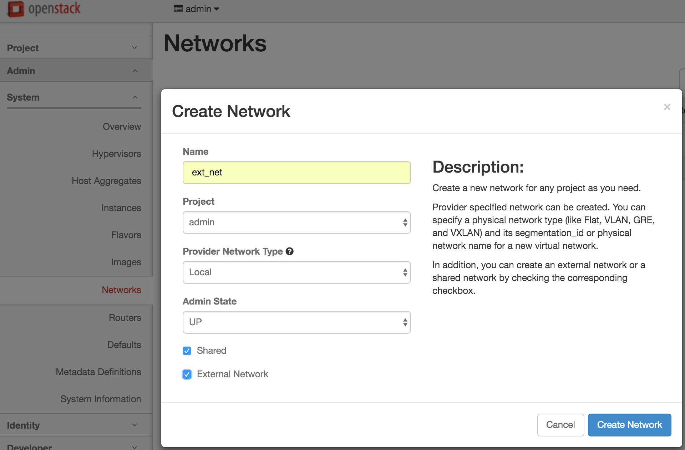
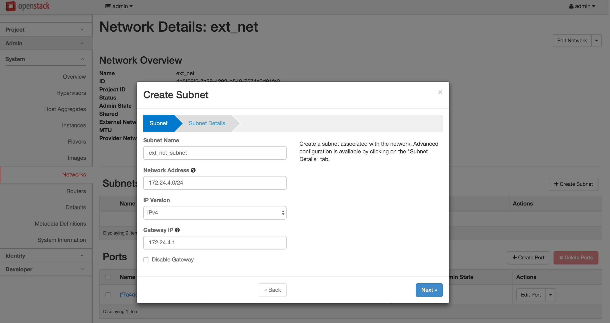
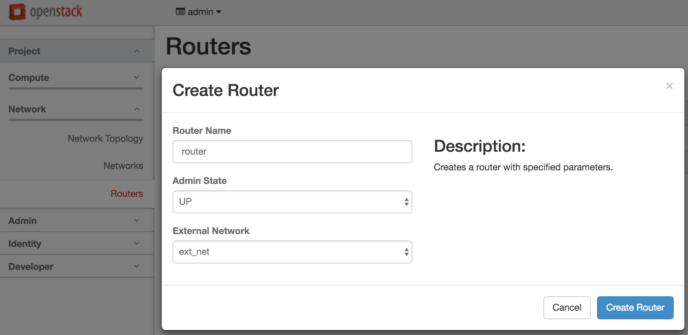
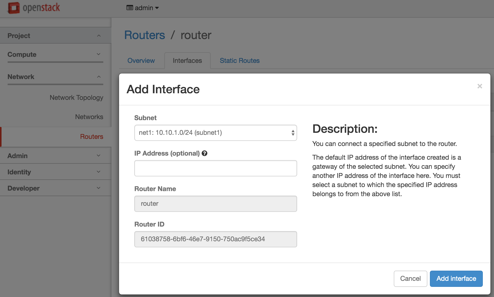
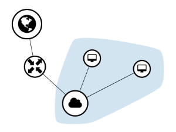
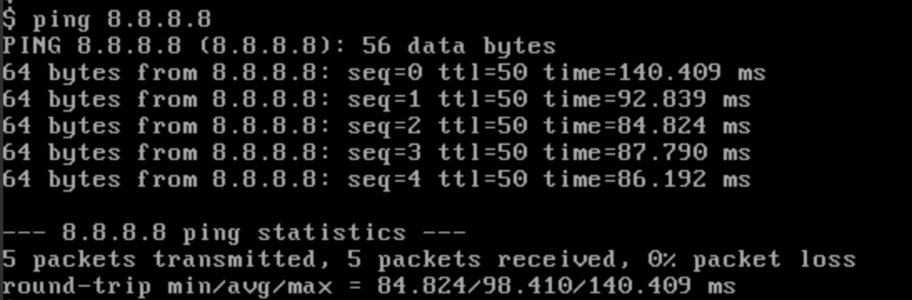

# L3 Tutorial 1 : Connect to external network by adding a router

The tutorial describes how to access to external network from VMs.

1. Create a network and VMs using the network following the previous L2 tutorials.  
   
2. Check if you can ping to each other, only for sanity check.
3. Create a external network using a admin network menu.   
     
   Please check "Share" and "External Network". You can choose any provider network type, but "Local" or "Flat" is preferred for simplicity.
4. Add a subnet to the external subnet. You need to specify the correct subnet information used in configuring the gateway node: Admin->Networks->Select the external network->"Create Subnet"  
   Please refer to the   
   
5. Create a router using the external network you just created.  
     
   You can set the external network when you create the router or you can add the external interface after the router is created.
6. Add a network interface to the router by specifying the subnet of the VMs: Network -> Routers -> Select a router -> Interface tab -> Add Interface button.  
     
   IP address for the interface is optional. But, we strongly recommend not to specify it. if you leave it blank, then the gateway IP address of the subnet is assigned.
7. Now the network topology shows as below.  
   
8. Log on to any VM connected to the router and check if you can ping to external network, such as Google DNS server (8.8.8.8).  
   
