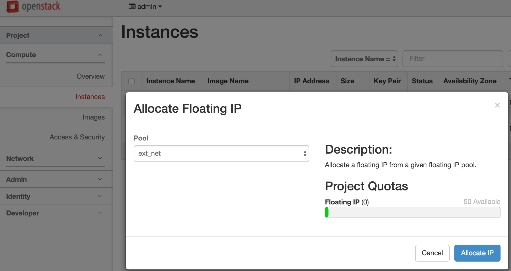
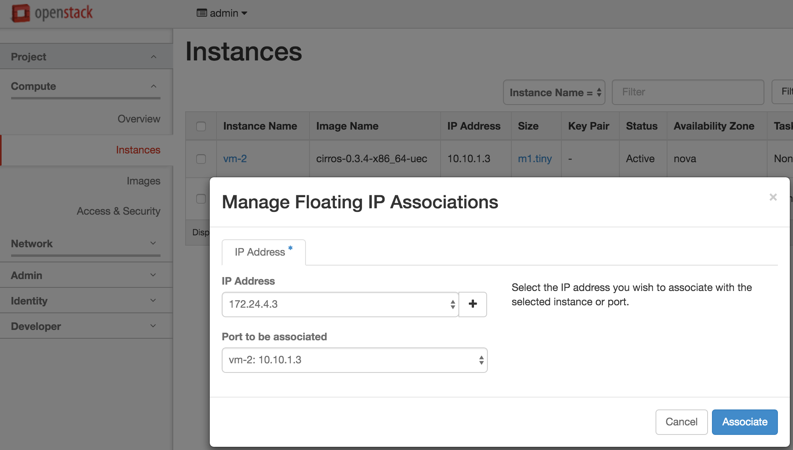
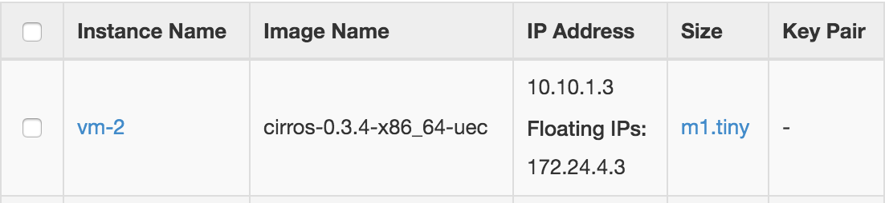

# L3 Tutorial 2: Access to VMs from external network using floating IPs

The tutorial describes how to allow users to access to VMs from external network using floating IPs.

If you did not walk through the L3 Tutorial 1, we strongly recommend to do it first. The tutorial assumes that you created VMs, external network, and router.

1. Associate a floating IP to a VM. If you did not allocate any floating IPs, then you need to do it first: Instances -> Actions -> Associate floating IPs -> IP Address "+".  
     
     
   Now we assigned a floating IP address 172.24.4.3 to the VM 10.10.1.3 as below.  
   
2. Log on to the gateway node and try to ping to the VM using the floating IP address.

   ```
   sangho@gatewaynode:~$ ping 172.24.4.3
   PING 172.24.4.3 (172.24.4.3) 56(84) bytes of data.
   64 bytes from 172.24.4.3: icmp_seq=1 ttl=64 time=156 ms
   64 bytes from 172.24.4.3: icmp_seq=2 ttl=64 time=0.901 ms
   64 bytes from 172.24.4.3: icmp_seq=3 ttl=64 time=0.857 ms
   64 bytes from 172.24.4.3: icmp_seq=4 ttl=64 time=0.760 ms
   64 bytes from 172.24.4.3: icmp_seq=5 ttl=64 time=1.13 ms
   --- 172.24.4.3 ping statistics ---
   5 packets transmitted, 5 received, 0% packet loss, time 3999ms
   rtt min/avg/max/mdev = 0.760/32.061/156.659/62.299 ms
   ```

   In this example, we tested from the gateway node because of the limitation of network environment. If your host machine can access from outside and you assigned the public IP address as the floating IP address, then you should be able to access to the VM from outside.
