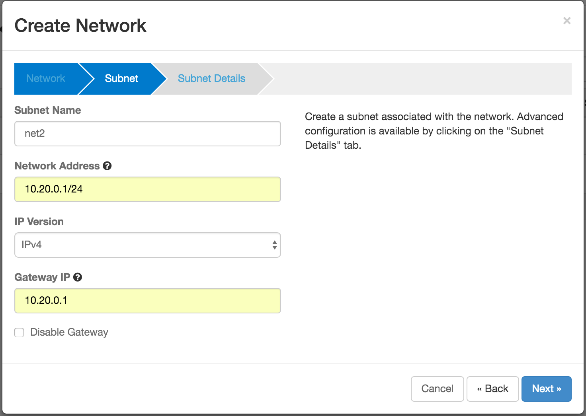
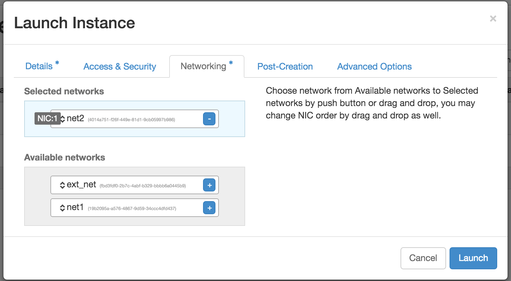
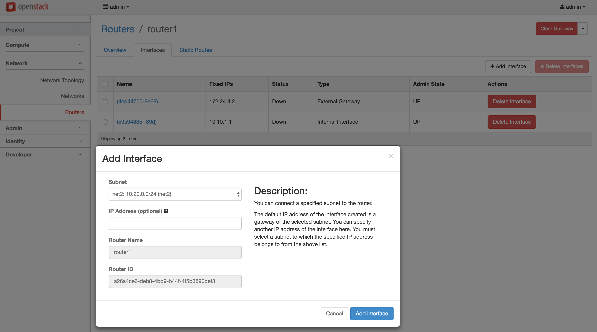
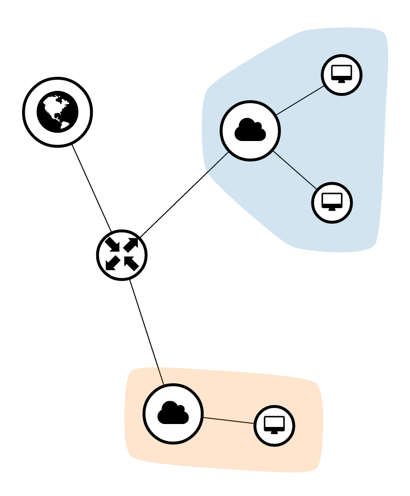

# L3 Tutorial 3: Routing between VMs in different virtual networks

The tutorial describes how to connect VMs in different virtual networks. As we explained in the architecture, when VMs connected to different virtual networks communicate each other, the packets do NOT go through the gateway node and they are direct routed between the two hosts or within the host.

If you did not go through the L3 Tutorial 1, please go through the tutorial. The tutorial assume that a router and VMs connected a virtual network are created.

1. Create a new virtual network   
   
2. Create new VMs using the new virtual network  
   
3. Add the interface of the new virtual network to the router.  
   
4. Then, the final network topology is as below.  
   
5. Log on to any VM and try to ping other VMs in other virtual network. Now you should be able to ping.
